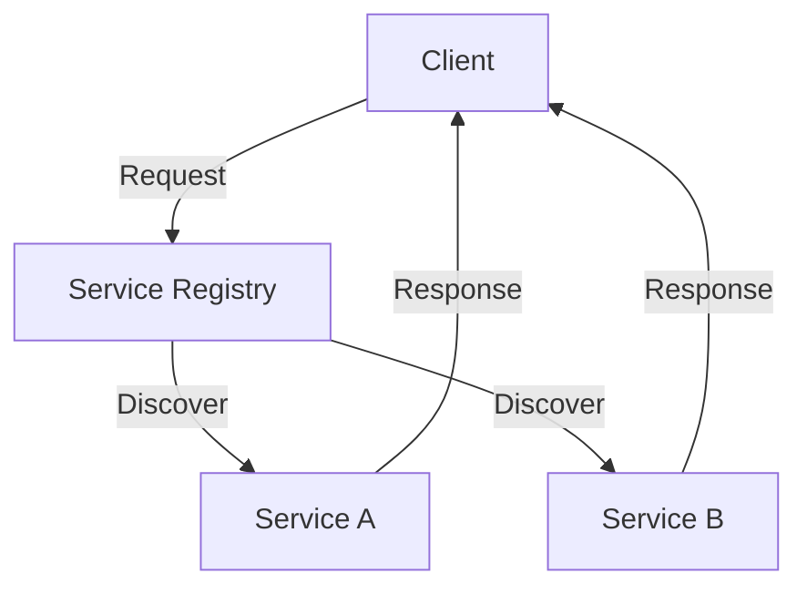

## 11.6 Service-Oriented Architecture

Service-Oriented Architecture (SOA) is a design paradigm that enables the creation of distributed systems composed of loosely coupled services. These services communicate over a network to provide functionality to applications. SOA has been a cornerstone of enterprise architecture, offering a way to build scalable, maintainable, and reusable software systems.

### Understanding SOA Principles

#### 1. Loose Coupling

**Explain:** SOA emphasizes loose coupling between services, meaning each service is independent and interacts with others through well-defined interfaces. This reduces dependencies and allows services to evolve independently.

**Code Example:**

```kotlin
interface PaymentService {
    fun processPayment(amount: Double): Boolean
}

class CreditCardPayment : PaymentService {
    override fun processPayment(amount: Double): Boolean {
        // Process credit card payment
        return true
    }
}

class PayPalPayment : PaymentService {
    override fun processPayment(amount: Double): Boolean {
        // Process PayPal payment
        return true
    }
}
```

**Highlight:** The `PaymentService` interface allows different payment methods to be implemented independently, demonstrating loose coupling.

#### 2. Service Abstraction

**Explain:** Services in SOA should hide their implementation details, exposing only what is necessary through interfaces. This abstraction promotes encapsulation and reduces complexity.

**Code Example:**

```kotlin
class OrderService(private val paymentService: PaymentService) {
    fun placeOrder(amount: Double): String {
        return if (paymentService.processPayment(amount)) {
            "Order placed successfully."
        } else {
            "Payment failed."
        }
    }
}
```

**Highlight:** `OrderService` uses `PaymentService` without knowing its implementation, showcasing service abstraction.

#### 3. Reusability

**Explain:** Services should be designed for reuse across different applications and contexts. This reduces redundancy and enhances maintainability.

**Code Example:**

```kotlin
class NotificationService {
    fun sendEmailNotification(email: String, message: String) {
        // Send email
    }

    fun sendSMSNotification(phone: String, message: String) {
        // Send SMS
    }
}
```

**Highlight:** `NotificationService` can be reused in various applications for sending notifications.

#### 4. Statelessness

**Explain:** Services should be stateless, meaning they do not retain information between requests. This simplifies scaling and improves reliability.

**Code Example:**

```kotlin
class AuthenticationService {
    fun authenticate(user: String, password: String): Boolean {
        // Authenticate user
        return true
    }
}
```

**Highlight:** `AuthenticationService` processes each request independently, adhering to the stateless principle.

#### 5. Discoverability

**Explain:** Services should be easily discoverable and accessible, often through a service registry or directory. This facilitates integration and reuse.

**Code Example:**

```kotlin
class ServiceRegistry {
    private val services = mutableMapOf<String, Any>()

    fun registerService(name: String, service: Any) {
        services[name] = service
    }

    fun getService(name: String): Any? {
        return services[name]
    }
}
```

**Highlight:** `ServiceRegistry` allows services to be registered and discovered, promoting discoverability.

### SOA Best Practices

#### 1. Define Clear Interfaces

**Explain:** Ensure each service has a well-defined interface that specifies the operations it provides. This promotes clarity and consistency.

#### 2. Use Standard Protocols

**Explain:** Utilize standard communication protocols like HTTP, SOAP, or REST to ensure interoperability between services.

#### 3. Implement Robust Security

**Explain:** Secure services with authentication and authorization mechanisms to protect sensitive data and operations.

#### 4. Monitor and Log Services

**Explain:** Implement monitoring and logging to track service performance and diagnose issues. This enhances reliability and maintainability.

#### 5. Design for Scalability

**Explain:** Architect services to scale horizontally, allowing them to handle increased load by adding more instances.

### Comparing SOA with Microservices

While SOA and microservices share similarities, such as promoting modularity and reusability, they differ in several key aspects:

#### 1. Granularity

**Explain:** Microservices are typically more granular than SOA services, focusing on specific business capabilities. This allows for greater flexibility and faster deployment cycles.

#### 2. Communication

**Explain:** SOA often relies on complex protocols like SOAP, while microservices favor lightweight protocols like REST or gRPC.

#### 3. Deployment

**Explain:** Microservices are designed for independent deployment, whereas SOA services may be more tightly integrated.

#### 4. Technology Stack

**Explain:** Microservices encourage using diverse technology stacks for different services, whereas SOA often standardizes on a single stack.

#### 5. Organizational Alignment

**Explain:** Microservices align closely with agile development practices, promoting cross-functional teams and continuous delivery.

### Visualizing SOA and Microservices



**Caption:** This diagram illustrates a basic SOA architecture with a service registry facilitating service discovery.

### Key Participants in SOA

- **Service Provider:** Develops and maintains services.
- **Service Consumer:** Uses services to perform tasks.
- **Service Registry:** Stores service metadata for discovery.

### Applicability of SOA

**Explain:** SOA is suitable for large, complex systems where services need to be reused across different applications. It is ideal for enterprises seeking to integrate disparate systems.

### Sample Code Snippet

**Code Example:**

```kotlin
fun main() {
    val serviceRegistry = ServiceRegistry()
    val paymentService = CreditCardPayment()
    serviceRegistry.registerService("PaymentService", paymentService)

    val orderService = OrderService(paymentService)
    println(orderService.placeOrder(100.0))
}
```

**Highlight:** This code demonstrates registering and using a service in a simple SOA setup.

### Design Considerations

- **Explain:** Ensure services are loosely coupled and stateless to enhance scalability and maintainability.
- **Highlight:** Use Kotlin's features like interfaces and data classes to implement SOA principles effectively.

### Differences and Similarities

- **Explain:** While both SOA and microservices promote modularity, microservices offer more granularity and flexibility. SOA is better suited for enterprise integration, whereas microservices excel in agile environments.

### Try It Yourself

**Encourage:** Modify the `PaymentService` to add new payment methods or enhance the `ServiceRegistry` to support service versioning. Experiment with different communication protocols to see their impact on performance.

### Knowledge Check

**Pose Questions:** What are the key principles of SOA? How does SOA differ from microservices? What are the benefits of using a service registry?

### Embrace the Journey

**Encourage:** Remember, mastering SOA is a journey. As you explore its principles and best practices, you'll gain insights into building robust, scalable systems. Keep experimenting, stay curious, and enjoy the journey!

## Quiz Time!



### What is a key principle of Service-Oriented Architecture?

- [x] Loose coupling
- [ ] Tight coupling
- [ ] Monolithic design
- [ ] Centralized control

> **Explanation:** Loose coupling is a fundamental principle of SOA, allowing services to interact with minimal dependencies.

### How does SOA differ from microservices in terms of granularity?

- [x] SOA services are generally less granular than microservices.
- [ ] SOA services are more granular than microservices.
- [ ] Both have the same level of granularity.
- [ ] Granularity is not a consideration in SOA.

> **Explanation:** Microservices are typically more granular, focusing on specific business capabilities, whereas SOA services are often broader.

### What protocol is commonly used in SOA for communication?

- [x] SOAP
- [ ] HTTP/2
- [ ] WebSockets
- [ ] MQTT

> **Explanation:** SOAP is a common protocol used in traditional SOA implementations for communication between services.

### Which of the following is a benefit of using a service registry in SOA?

- [x] Facilitates service discovery
- [ ] Increases service coupling
- [ ] Reduces service availability
- [ ] Complicates service integration

> **Explanation:** A service registry facilitates the discovery of services, making it easier to integrate and reuse them.

### What is a common characteristic of microservices compared to SOA?

- [x] Independent deployment
- [ ] Centralized deployment
- [ ] Single technology stack
- [ ] Monolithic architecture

> **Explanation:** Microservices are designed for independent deployment, allowing each service to be updated and scaled separately.

### In SOA, what is the role of the service provider?

- [x] Develops and maintains services
- [ ] Consumes services
- [ ] Registers services
- [ ] Monitors services

> **Explanation:** The service provider is responsible for developing and maintaining the services offered in an SOA environment.

### What is a key difference in communication protocols between SOA and microservices?

- [x] SOA often uses SOAP, while microservices favor REST.
- [ ] Both SOA and microservices use the same protocols.
- [ ] Microservices use SOAP, while SOA favors REST.
- [ ] Protocols are not relevant to SOA and microservices.

> **Explanation:** SOA often relies on SOAP, a more complex protocol, while microservices favor REST, which is lighter and more flexible.

### Which of the following is a best practice for implementing SOA?

- [x] Define clear interfaces
- [ ] Use proprietary protocols
- [ ] Avoid monitoring services
- [ ] Centralize all service logic

> **Explanation:** Defining clear interfaces ensures that services are easy to understand and integrate, promoting reusability and maintainability.

### What is a key advantage of stateless services in SOA?

- [x] Simplifies scaling
- [ ] Increases complexity
- [ ] Requires more resources
- [ ] Reduces reliability

> **Explanation:** Stateless services simplify scaling because they do not retain information between requests, allowing them to handle more load by adding instances.

### True or False: SOA is only suitable for small-scale applications.

- [ ] True
- [x] False

> **Explanation:** SOA is particularly well-suited for large, complex systems where services need to be reused across different applications.




