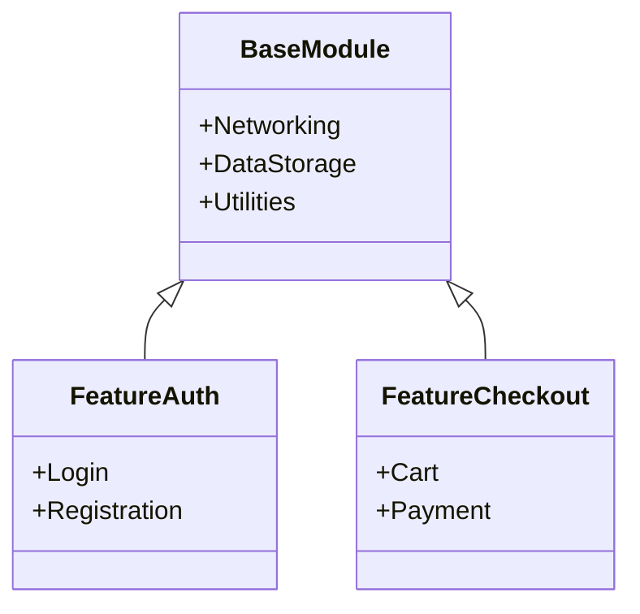

## 11.7 Modularization in Android

As Android applications grow in complexity and size, maintaining a monolithic architecture becomes increasingly challenging. Modularization offers a solution by dividing an application into smaller, manageable, and independent modules. This approach enhances scalability, maintainability, and performance. In this section, we'll explore the concepts of modularization in Android, focusing on dynamic feature modules, and provide practical guidance for structuring large applications effectively.

### Understanding Modularization

**Modularization** is the process of dividing a software application into separate modules, each responsible for a specific functionality. This separation allows developers to work on different parts of the application independently, facilitating parallel development and reducing the risk of conflicts.

#### Key Benefits of Modularization

1. **Scalability**: As the application grows, new features can be added as separate modules without affecting existing code.
2. **Maintainability**: Modules can be updated, tested, and maintained independently, making it easier to manage changes and bug fixes.
3. **Reusability**: Modules can be reused across different projects, reducing development time and effort.
4. **Improved Build Times**: By isolating changes to specific modules, build times can be reduced, enhancing developer productivity.
5. **Enhanced Team Collaboration**: Teams can work on different modules simultaneously, improving collaboration and reducing bottlenecks.

### Structuring Large Applications

When structuring large applications, it's essential to define clear boundaries between modules. This involves identifying core functionalities and separating them into distinct modules. Let's explore some strategies for effective modularization in Android.

#### Core Modules

Core modules contain the fundamental components of the application, such as networking, data storage, and common utilities. These modules are typically shared across multiple feature modules.

#### Feature Modules

Feature modules encapsulate specific functionalities or features of the application. For example, a shopping app might have separate modules for user authentication, product browsing, and checkout.

#### Dynamic Feature Modules

Dynamic feature modules are a powerful tool in Android development, allowing features to be delivered on-demand. This approach reduces the initial download size of the application and enables users to access features only when needed.

### Dynamic Feature Modules in Android

Dynamic feature modules are part of the Android App Bundle, a publishing format that includes all your app's compiled code and resources. With dynamic delivery, you can optimize the size of your app by delivering only the features that users need.

#### Benefits of Dynamic Feature Modules

1. **Reduced App Size**: By delivering features on-demand, the initial download size of the app is reduced, improving user experience and retention.
2. **Faster Updates**: Users can receive updates to specific features without downloading the entire app again.
3. **Improved Performance**: Loading features dynamically can improve app performance by reducing memory usage and startup time.

#### Implementing Dynamic Feature Modules

To implement dynamic feature modules, you need to configure your project to use the Android App Bundle and define feature modules in your `build.gradle` files.

**Step 1: Configure the Base Module**

The base module contains the core functionality of your app and acts as the entry point. It should include the necessary dependencies and configurations for dynamic delivery.

```kotlin
// build.gradle (base module)
plugins {
    id 'com.android.application'
}

android {
    ...
    dynamicFeatures = [':feature_auth', ':feature_checkout']
}

dependencies {
    implementation 'com.android.support:appcompat-v7:28.0.0'
    ...
}
```

**Step 2: Define Feature Modules**

Feature modules are defined as separate modules in your project. Each feature module should have its own `build.gradle` file and dependencies.

```kotlin
// build.gradle (feature module)
plugins {
    id 'com.android.dynamic-feature'
}

android {
    ...
}

dependencies {
    implementation project(':app')
    ...
}
```

**Step 3: Load Feature Modules Dynamically**

Use the Play Core Library to request and manage dynamic feature modules at runtime. This library provides APIs to install, update, and manage feature modules.

```kotlin
// Load a dynamic feature module
val splitInstallManager = SplitInstallManagerFactory.create(context)
val request = SplitInstallRequest.newBuilder()
    .addModule("feature_auth")
    .build()

splitInstallManager.startInstall(request)
    .addOnSuccessListener { /* Feature module installed */ }
    .addOnFailureListener { /* Handle failure */ }
```

### Visualizing Modularization in Android

To better understand the modularization process, let's visualize the architecture of a modular Android application using a class diagram.



**Diagram Description**: This class diagram illustrates the relationship between the base module and feature modules in a modular Android application. The base module provides core functionalities like networking and data storage, while feature modules like `FeatureAuth` and `FeatureCheckout` extend these functionalities with specific features.

### Best Practices for Modularization

1. **Define Clear Boundaries**: Clearly define the responsibilities of each module to avoid overlap and ensure independence.
2. **Use Interfaces for Communication**: Use interfaces to define communication between modules, promoting loose coupling and flexibility.
3. **Keep Modules Small and Focused**: Aim for small, focused modules that encapsulate a single responsibility, making them easier to test and maintain.
4. **Leverage Dependency Injection**: Use dependency injection frameworks like Dagger or Hilt to manage dependencies between modules efficiently.
5. **Test Modules Independently**: Write unit tests for each module to ensure they function correctly in isolation.

### Challenges and Considerations

While modularization offers numerous benefits, it also presents some challenges. Here are a few considerations to keep in mind:

1. **Increased Complexity**: Managing multiple modules can increase the complexity of the project structure and build process.
2. **Dependency Management**: Careful management of dependencies is crucial to avoid conflicts and ensure compatibility between modules.
3. **Versioning and Compatibility**: Ensure that modules are versioned correctly and compatible with each other to prevent runtime issues.

### Try It Yourself

To get hands-on experience with modularization, try creating a simple Android application with dynamic feature modules. Start by defining a base module with core functionalities, then add feature modules for specific features. Experiment with loading and unloading feature modules dynamically to see the benefits in action.

### Knowledge Check

- What are the key benefits of modularization in Android development?
- How do dynamic feature modules improve app performance and user experience?
- What are some best practices for structuring large Android applications?

### Further Reading

- [Android Developers: Modularization](https://developer.android.com/studio/projects/dynamic-delivery)
- [Google Play Core Library](https://developer.android.com/guide/playcore)
- [Kotlin Documentation](https://kotlinlang.org/docs/home.html)

### Conclusion

Modularization is a powerful technique for managing large Android applications, offering benefits in scalability, maintainability, and performance. By leveraging dynamic feature modules, developers can optimize app size and deliver features on-demand, enhancing user experience. As you continue your journey in Android development, consider incorporating modularization into your projects to unlock its full potential.

## Quiz Time!



### What is the primary benefit of modularization in Android development?

- [x] Improved scalability and maintainability
- [ ] Faster internet connectivity
- [ ] Enhanced graphics rendering
- [ ] Increased battery life

> **Explanation:** Modularization improves scalability and maintainability by dividing the application into smaller, manageable modules.

### Which of the following is a key feature of dynamic feature modules?

- [x] On-demand feature delivery
- [ ] Enhanced graphics performance
- [ ] Improved battery efficiency
- [ ] Faster network speeds

> **Explanation:** Dynamic feature modules allow features to be delivered on-demand, reducing the initial app size.

### What is the role of the base module in a modular Android application?

- [x] It contains core functionalities and acts as the entry point.
- [ ] It handles user authentication.
- [ ] It manages payment processing.
- [ ] It provides enhanced graphics capabilities.

> **Explanation:** The base module contains core functionalities and serves as the entry point for the application.

### How can developers manage dependencies between modules effectively?

- [x] Use dependency injection frameworks like Dagger or Hilt.
- [ ] Hardcode dependencies in each module.
- [ ] Avoid using dependencies altogether.
- [ ] Use global variables for shared dependencies.

> **Explanation:** Dependency injection frameworks like Dagger or Hilt help manage dependencies efficiently between modules.

### What is a potential challenge of modularization?

- [x] Increased project complexity
- [ ] Reduced app performance
- [ ] Limited user interface options
- [ ] Decreased code readability

> **Explanation:** Modularization can increase project complexity due to the management of multiple modules.

### What is the purpose of using interfaces for communication between modules?

- [x] To promote loose coupling and flexibility
- [ ] To increase app size
- [ ] To enhance graphics rendering
- [ ] To improve battery life

> **Explanation:** Interfaces promote loose coupling and flexibility by defining clear communication channels between modules.

### Which of the following is a best practice for modularization?

- [x] Keep modules small and focused
- [ ] Combine all features into a single module
- [ ] Avoid using interfaces
- [ ] Use global variables for communication

> **Explanation:** Keeping modules small and focused ensures they encapsulate a single responsibility, making them easier to test and maintain.

### What library is used to manage dynamic feature modules at runtime?

- [x] Play Core Library
- [ ] Android Support Library
- [ ] Jetpack Compose
- [ ] Retrofit

> **Explanation:** The Play Core Library provides APIs to manage dynamic feature modules at runtime.

### True or False: Dynamic feature modules can be updated without downloading the entire app again.

- [x] True
- [ ] False

> **Explanation:** Dynamic feature modules can be updated independently, allowing users to receive updates without downloading the entire app.

### What should developers consider when implementing modularization?

- [x] Dependency management and version compatibility
- [ ] Increasing app size
- [ ] Reducing code readability
- [ ] Limiting user interface options

> **Explanation:** Developers should carefully manage dependencies and ensure version compatibility between modules to prevent runtime issues.


