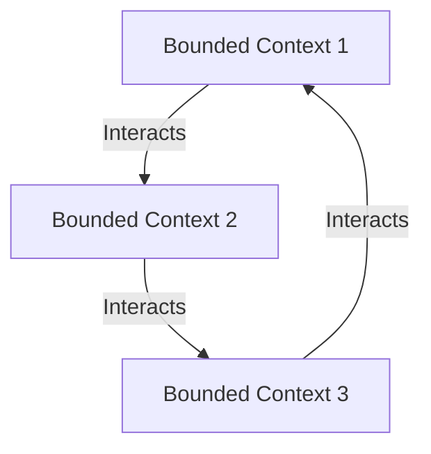

## 11.8 Domain-Driven Design (DDD) in Kotlin

Domain-Driven Design (DDD) is a sophisticated approach to software development that emphasizes collaboration between technical experts and domain experts to create a model that accurately reflects the business domain. In this section, we will delve into how DDD principles can be effectively applied in Kotlin, leveraging its unique language features and the Arrow library for functional programming.

### Introduction to Domain-Driven Design

Domain-Driven Design is a methodology introduced by Eric Evans in his seminal book "Domain-Driven Design: Tackling Complexity in the Heart of Software." The core idea is to focus on the domain and its logic, ensuring that the software model aligns closely with the business processes and terminology.

#### Key Concepts of DDD

1. **Ubiquitous Language**: A common language shared by developers and domain experts, ensuring clear communication.
2. **Bounded Contexts**: Defining clear boundaries within which a particular model is applicable.
3. **Entities and Value Objects**: Differentiating between objects with distinct identities and those defined solely by their attributes.
4. **Aggregates**: Grouping related entities and value objects to ensure consistency.
5. **Repositories**: Providing a mechanism for accessing and storing aggregates.
6. **Domain Services**: Encapsulating domain logic that doesn't naturally fit within an entity or value object.

### Bounded Contexts and Aggregates

#### Bounded Contexts

A bounded context is a logical boundary within which a particular domain model is defined and applicable. It helps in managing complexity by dividing the domain into smaller, manageable parts. Each bounded context has its own ubiquitous language and model.



*Diagram: Visualizing interactions between bounded contexts.*

#### Aggregates

An aggregate is a cluster of domain objects that can be treated as a single unit. Each aggregate has a root entity, known as the aggregate root, which is responsible for maintaining the consistency of the aggregate.

```kotlin
// Define an Aggregate Root
class Order(val id: String, val items: List<OrderItem>) {
    fun addItem(item: OrderItem) {
        // Business logic to add item
    }
}

// Define a Value Object
data class OrderItem(val productId: String, val quantity: Int)
```

### Value Objects and Entities

#### Value Objects

Value objects are immutable and defined by their attributes rather than an identity. In Kotlin, data classes are ideal for representing value objects due to their immutability and concise syntax.

```kotlin
data class Money(val amount: BigDecimal, val currency: String)
```

#### Entities

Entities are objects that have a distinct identity that runs through time and different states. They are mutable and often have a lifecycle.

```kotlin
class Customer(val id: String, var name: String) {
    fun changeName(newName: String) {
        name = newName
    }
}
```

### Repositories and Domain Services

#### Repositories

Repositories are responsible for encapsulating the logic required to access data sources. They provide an abstraction over data storage, allowing the domain model to remain independent of data access details.

```kotlin
interface OrderRepository {
    fun findById(id: String): Order?
    fun save(order: Order)
}
```

#### Domain Services

Domain services contain domain logic that doesn't naturally fit within an entity or value object. They often operate on multiple aggregates.

```kotlin
class OrderService(private val orderRepository: OrderRepository) {
    fun placeOrder(order: Order) {
        // Business logic to place an order
        orderRepository.save(order)
    }
}
```

### Using the Arrow Library for Functional DDD

The Arrow library in Kotlin provides powerful tools for functional programming, which can enhance the implementation of DDD by promoting immutability, composability, and higher-order functions.

#### Functional Data Types

Arrow provides functional data types such as `Option`, `Either`, and `Validated` which can be used to handle optionality, errors, and validation in a functional style.

```kotlin
import arrow.core.*

fun findCustomer(id: String): Option<Customer> {
    // Return Option type
    return Option.fromNullable(database.findCustomerById(id))
}

fun validateOrder(order: Order): Validated<Error, Order> {
    // Return Validated type
    return if (order.items.isEmpty()) {
        Validated.Invalid(Error("Order must have at least one item"))
    } else {
        Validated.Valid(order)
    }
}
```

#### Monad Comprehensions

Arrow's monad comprehensions allow for cleaner and more readable code when dealing with multiple computations that may fail.

```kotlin
import arrow.core.computations.either

suspend fun processOrder(orderId: String): Either<Error, Order> = either {
    val order = orderRepository.findById(orderId).bind()
    validateOrder(order).bind()
    orderService.placeOrder(order)
    order
}
```

### Design Considerations

When applying DDD in Kotlin, consider the following:

- **Immutability**: Leverage Kotlin's data classes and the Arrow library to promote immutability, which simplifies reasoning about the code and reduces bugs.
- **Separation of Concerns**: Clearly define bounded contexts and ensure that each context has its own model and ubiquitous language.
- **Consistency**: Use aggregates to maintain consistency within the domain model, ensuring that all changes to related entities are coordinated.
- **Functional Programming**: Embrace functional programming principles to enhance the clarity and robustness of the domain model.

### Differences and Similarities

DDD shares similarities with other architectural patterns, such as Clean Architecture and Hexagonal Architecture, in its emphasis on separating domain logic from infrastructure concerns. However, DDD places a stronger focus on collaboration with domain experts and the use of a ubiquitous language.

### Try It Yourself

To deepen your understanding of DDD in Kotlin, try modifying the provided code examples:

- **Experiment with different aggregate structures**: Create a new aggregate with its own root entity and value objects.
- **Implement additional domain services**: Add new services that encapsulate complex business logic.
- **Use Arrow's functional data types**: Replace null checks and exception handling with `Option` and `Either`.

### Knowledge Check

- **What is the role of a bounded context in DDD?**
- **How do value objects differ from entities?**
- **What is the purpose of a repository in DDD?**
- **How can the Arrow library enhance DDD implementation in Kotlin?**

### Conclusion

Domain-Driven Design in Kotlin offers a powerful approach to building complex software systems that align closely with business needs. By leveraging Kotlin's language features and the Arrow library, developers can create robust, maintainable, and scalable domain models.

Remember, this is just the beginning. As you progress, you'll build more complex and interactive systems. Keep experimenting, stay curious, and enjoy the journey!

## Quiz Time!



### What is a bounded context in Domain-Driven Design?

- [x] A logical boundary within which a particular domain model is defined and applicable.
- [ ] A physical boundary separating different parts of the application.
- [ ] A security boundary for protecting sensitive data.
- [ ] A network boundary for microservices.

> **Explanation:** A bounded context is a logical boundary within which a particular domain model is defined and applicable, helping manage complexity by dividing the domain into smaller, manageable parts.

### Which of the following best describes a value object?

- [x] An object defined by its attributes rather than an identity.
- [ ] An object with a distinct identity that runs through time.
- [ ] An object responsible for maintaining consistency within an aggregate.
- [ ] An object that encapsulates domain logic.

> **Explanation:** Value objects are defined by their attributes rather than an identity and are typically immutable.

### What is the primary role of a repository in DDD?

- [x] To encapsulate the logic required to access data sources.
- [ ] To define the business rules and logic of the domain.
- [ ] To manage the lifecycle of entities.
- [ ] To provide a user interface for domain objects.

> **Explanation:** Repositories encapsulate the logic required to access data sources, providing an abstraction over data storage.

### How does the Arrow library enhance DDD implementation in Kotlin?

- [x] By providing functional data types and monad comprehensions.
- [ ] By offering a graphical user interface for domain modeling.
- [ ] By enforcing strict type checking at compile time.
- [ ] By automatically generating domain models.

> **Explanation:** The Arrow library enhances DDD implementation in Kotlin by providing functional data types and monad comprehensions, promoting immutability and composability.

### What is the difference between an entity and a value object in DDD?

- [x] Entities have a distinct identity, while value objects are defined by their attributes.
- [ ] Entities are immutable, while value objects are mutable.
- [x] Entities can change state, while value objects are typically immutable.
- [ ] Entities are always part of an aggregate, while value objects are not.

> **Explanation:** Entities have a distinct identity and can change state, while value objects are defined by their attributes and are typically immutable.

### What is the purpose of a domain service in DDD?

- [x] To encapsulate domain logic that doesn't naturally fit within an entity or value object.
- [ ] To provide data storage and retrieval capabilities.
- [ ] To manage user interactions with the domain model.
- [ ] To define the boundaries of a bounded context.

> **Explanation:** Domain services encapsulate domain logic that doesn't naturally fit within an entity or value object, often operating on multiple aggregates.

### Which Kotlin feature is ideal for representing value objects?

- [x] Data classes
- [ ] Sealed classes
- [ ] Companion objects
- [ ] Inline classes

> **Explanation:** Kotlin's data classes are ideal for representing value objects due to their immutability and concise syntax.

### How can aggregates help maintain consistency in a domain model?

- [x] By grouping related entities and value objects under a single root entity.
- [ ] By enforcing strict type checking across the domain model.
- [ ] By providing a user interface for domain objects.
- [ ] By automatically generating domain models.

> **Explanation:** Aggregates help maintain consistency in a domain model by grouping related entities and value objects under a single root entity, ensuring that all changes to related entities are coordinated.

### What is the role of the aggregate root in DDD?

- [x] To maintain the consistency of the aggregate.
- [ ] To provide data storage and retrieval capabilities.
- [ ] To manage user interactions with the domain model.
- [ ] To define the boundaries of a bounded context.

> **Explanation:** The aggregate root is responsible for maintaining the consistency of the aggregate, coordinating changes to related entities.

### True or False: In DDD, a bounded context can have multiple ubiquitous languages.

- [ ] True
- [x] False

> **Explanation:** False. In DDD, each bounded context has its own ubiquitous language, ensuring clear communication within that context.


