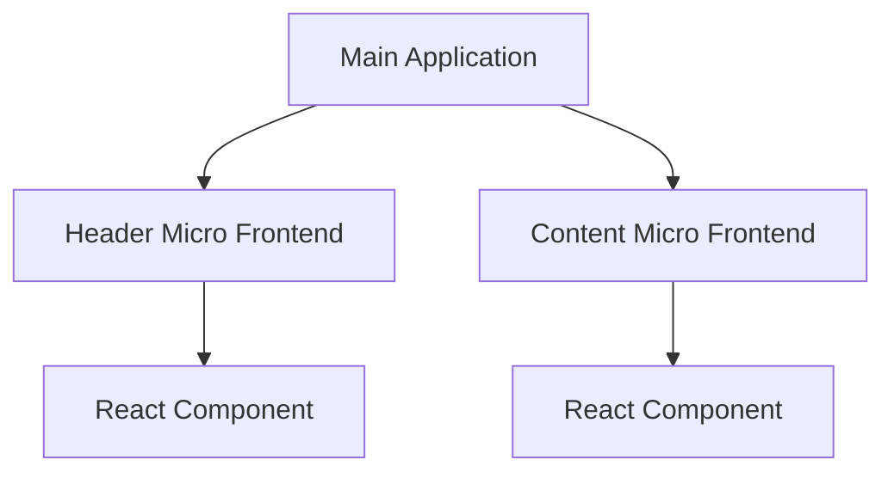

## 11.9 Micro Frontends

In the ever-evolving landscape of web development, the need for scalable, maintainable, and flexible frontend architectures has led to the emergence of Micro Frontends. This architectural pattern allows developers to split frontends into independent units, enabling teams to work on different parts of an application simultaneously and deploy them independently. In this section, we'll explore the concept of Micro Frontends, their benefits, and how to implement them using Kotlin/JS and React.

### Understanding Micro Frontends

Micro Frontends extend the principles of microservices to the frontend world. Just as microservices break down backend applications into smaller, manageable services, Micro Frontends decompose the frontend into smaller, self-contained units. Each unit can be developed, tested, and deployed independently, allowing for greater agility and scalability.

#### Key Concepts

- **Decentralization**: Each micro frontend is developed and owned by a separate team, allowing for decentralized decision-making and faster development cycles.
- **Independence**: Micro frontends can be built using different technologies, frameworks, and libraries, providing flexibility in choosing the best tools for each unit.
- **Integration**: Despite being independent, micro frontends must integrate seamlessly to provide a cohesive user experience.

### Benefits of Micro Frontends

1. **Scalability**: By splitting the frontend into smaller units, teams can scale development efforts more effectively, allowing multiple teams to work in parallel.
2. **Maintainability**: Smaller codebases are easier to maintain, test, and refactor, reducing technical debt and improving code quality.
3. **Flexibility**: Teams can choose the best technologies for their specific needs without being constrained by a monolithic architecture.
4. **Resilience**: Failures in one micro frontend do not necessarily affect the entire application, improving overall system resilience.

### Implementing Micro Frontends with Kotlin/JS and React

Kotlin/JS and React are powerful tools for building modern web applications. Kotlin/JS allows developers to write Kotlin code that compiles to JavaScript, leveraging Kotlin's strong type system and language features. React, on the other hand, is a popular library for building user interfaces with a component-based architecture. Together, they provide a robust foundation for implementing Micro Frontends.

#### Setting Up a Kotlin/JS Project

To get started with Kotlin/JS, you'll need to set up a Kotlin/JS project. Here's a step-by-step guide:

1. **Install Kotlin and Node.js**: Ensure you have Kotlin and Node.js installed on your machine. You can download Kotlin from [JetBrains](https://kotlinlang.org/) and Node.js from [Node.js](https://nodejs.org/).

2. **Create a New Kotlin/JS Project**: Use IntelliJ IDEA or your preferred IDE to create a new Kotlin/JS project. Select the "Kotlin/JS for Node.js" template.

3. **Configure the Build Script**: Open the `build.gradle.kts` file and configure the Kotlin/JS plugin:

   ```kotlin
   plugins {
       kotlin("js") version "1.5.31"
   }

   kotlin {
       js {
           browser {
               webpackTask {
                   cssSupport.enabled = true
               }
           }
           binaries.executable()
       }
   }
   ```

4. **Add Dependencies**: Add necessary dependencies for React and other libraries:

   ```kotlin
   dependencies {
       implementation("org.jetbrains.kotlin-wrappers:kotlin-react:17.0.2-pre.213-kotlin-1.5.31")
       implementation("org.jetbrains.kotlin-wrappers:kotlin-react-dom:17.0.2-pre.213-kotlin-1.5.31")
   }
   ```

5. **Run the Project**: Use the Gradle tasks to build and run your Kotlin/JS project.

#### Building a Simple React Component

With the project set up, let's build a simple React component using Kotlin/JS:

```kotlin
import react.*
import react.dom.*

external interface WelcomeProps : RProps {
    var name: String
}

val Welcome = functionalComponent<WelcomeProps> { props ->
    h1 {
        +"Hello, ${props.name}!"
    }
}

fun RBuilder.welcome(name: String) = child(Welcome) {
    attrs.name = name
}

fun main() {
    render(document.getElementById("root")) {
        welcome("Kotlin/JS")
    }
}
```

In this example, we define a `Welcome` component that takes a `name` prop and renders a greeting message. The `welcome` function is a helper to render the component with the specified name.

#### Integrating Multiple Micro Frontends

To integrate multiple micro frontends, we need a strategy for loading and rendering them within a single application. Here are some common approaches:

1. **Server-Side Composition**: Assemble micro frontends on the server and deliver a single HTML page to the client. This approach can leverage server-side rendering for improved performance.

2. **Client-Side Composition**: Load micro frontends dynamically on the client using JavaScript. This approach allows for more flexibility and faster updates.

3. **Web Components**: Use web components to encapsulate micro frontends, providing a standard interface for integration.

#### Example: Client-Side Composition with React

Let's explore client-side composition using React. We'll create a simple application that loads two micro frontends: a header and a content section.

##### Header Micro Frontend

```kotlin
import react.*
import react.dom.*

val Header = functionalComponent<RProps> {
    header {
        h1 { +"Micro Frontends with Kotlin/JS and React" }
    }
}

fun RBuilder.header() = child(Header)
```

##### Content Micro Frontend

```kotlin
import react.*
import react.dom.*

val Content = functionalComponent<RProps> {
    div {
        p { +"This is the content section of the micro frontend." }
    }
}

fun RBuilder.content() = child(Content)
```

##### Main Application

```kotlin
import react.dom.render
import kotlinx.browser.document

fun main() {
    render(document.getElementById("root")) {
        header()
        content()
    }
}
```

In this example, we define two micro frontends: `Header` and `Content`. The main application renders these components within the `root` element, demonstrating client-side composition.

### Visualizing Micro Frontends Architecture

To better understand the architecture of Micro Frontends, let's visualize the integration process using a Mermaid.js diagram.



**Diagram Description**: This diagram illustrates the main application integrating two micro frontends: the Header and Content. Each micro frontend is represented as a React component.

### Design Considerations

When implementing Micro Frontends, consider the following design considerations:

- **Communication**: Ensure seamless communication between micro frontends. Use shared services or event buses for inter-component communication.
- **Styling**: Maintain consistent styling across micro frontends. Consider using a shared design system or CSS variables.
- **Versioning**: Manage versioning carefully to avoid compatibility issues between micro frontends.
- **Security**: Implement security measures to prevent cross-site scripting (XSS) and other vulnerabilities.

### Differences and Similarities with Other Patterns

Micro Frontends share similarities with microservices in terms of decentralization and independence. However, they differ in their focus on the frontend layer. Unlike traditional monolithic frontends, Micro Frontends allow for greater flexibility and scalability.

### Try It Yourself

Experiment with the provided code examples by modifying the components or adding new micro frontends. Try implementing server-side composition or using web components for integration.

### Knowledge Check

- **Question**: What are the key benefits of using Micro Frontends?
- **Exercise**: Implement a new micro frontend for a sidebar and integrate it with the existing application.

### Conclusion

Micro Frontends offer a powerful approach to building scalable and maintainable web applications. By splitting frontends into independent units, teams can work more efficiently and deliver features faster. With Kotlin/JS and React, developers have the tools to implement Micro Frontends effectively, leveraging the strengths of both technologies.

Remember, this is just the beginning. As you progress, you'll discover more advanced techniques and patterns for building robust web applications. Keep experimenting, stay curious, and enjoy the journey!

## Quiz Time!



### What is a key benefit of using Micro Frontends?

- [x] Scalability
- [ ] Increased complexity
- [ ] Reduced flexibility
- [ ] Monolithic architecture

> **Explanation:** Micro Frontends enhance scalability by allowing independent development and deployment of frontend units.

### Which technology is used to compile Kotlin code to JavaScript?

- [x] Kotlin/JS
- [ ] Kotlin/Native
- [ ] Kotlin/Android
- [ ] Kotlin/SQL

> **Explanation:** Kotlin/JS is used to compile Kotlin code to JavaScript, enabling web development.

### What is a common approach for integrating Micro Frontends?

- [x] Client-Side Composition
- [ ] Serverless Architecture
- [ ] Monolithic Integration
- [ ] Single Page Application

> **Explanation:** Client-Side Composition involves dynamically loading micro frontends on the client side.

### Which library is commonly used for building user interfaces in Micro Frontends?

- [x] React
- [ ] Angular
- [ ] Vue.js
- [ ] Ember.js

> **Explanation:** React is a popular library for building user interfaces in Micro Frontends.

### What is a design consideration when implementing Micro Frontends?

- [x] Communication between components
- [ ] Ignoring styling consistency
- [ ] Avoiding version control
- [ ] Disregarding security

> **Explanation:** Ensuring seamless communication between components is crucial for Micro Frontends.

### How can you manage consistent styling across Micro Frontends?

- [x] Use a shared design system
- [ ] Ignore styling
- [ ] Use different styles for each frontend
- [ ] Avoid using CSS

> **Explanation:** A shared design system helps maintain consistent styling across Micro Frontends.

### What is a similarity between Micro Frontends and microservices?

- [x] Decentralization
- [ ] Focus on backend
- [ ] Monolithic structure
- [ ] Single technology stack

> **Explanation:** Both Micro Frontends and microservices emphasize decentralization and independence.

### Which tool can be used for server-side composition of Micro Frontends?

- [x] Webpack
- [ ] Docker
- [ ] Kubernetes
- [ ] Jenkins

> **Explanation:** Webpack can be used for server-side composition by bundling micro frontends.

### What is a potential challenge of using Micro Frontends?

- [x] Increased complexity in integration
- [ ] Reduced scalability
- [ ] Limited technology choices
- [ ] Monolithic deployment

> **Explanation:** Integrating multiple micro frontends can increase complexity.

### True or False: Micro Frontends allow for independent deployment of frontend units.

- [x] True
- [ ] False

> **Explanation:** Micro Frontends enable independent deployment, enhancing flexibility and scalability.


