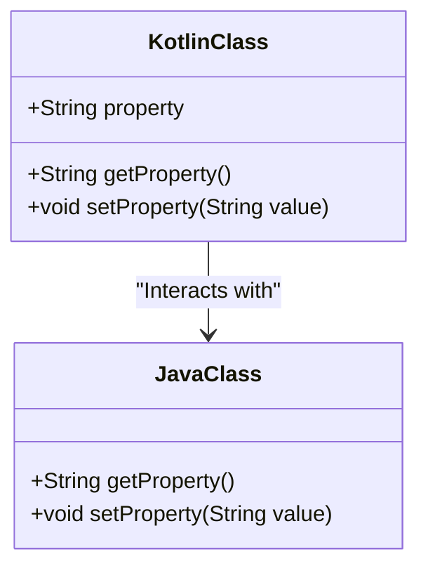

## 12.1 Java Interoperability

Kotlin's seamless interoperability with Java is one of its most compelling features, allowing developers to leverage existing Java libraries and frameworks while enjoying Kotlin's modern language features. In this section, we will delve into the intricacies of calling Java code from Kotlin and vice versa, explore JavaBeans conventions, and provide practical examples to illustrate these concepts.

### Understanding Java Interoperability

Java interoperability in Kotlin is the ability to call Java code from Kotlin and vice versa. This feature is crucial for developers who want to transition to Kotlin without discarding their existing Java codebase. Kotlin is designed to be fully compatible with Java, meaning you can use Java libraries, frameworks, and tools within your Kotlin projects.

#### Key Concepts

1. **Seamless Integration**: Kotlin compiles to Java bytecode, which means it can run on the Java Virtual Machine (JVM) and interoperate with Java code. This allows developers to call Java methods, use Java classes, and implement Java interfaces directly in Kotlin.

2. **Null Safety**: Kotlin's type system is designed to eliminate null pointer exceptions, a common issue in Java. When interacting with Java code, Kotlin provides nullable types to handle potential null values safely.

3. **Java Annotations**: Kotlin supports Java annotations, allowing you to annotate Kotlin code with Java annotations and vice versa. This is particularly useful when working with frameworks that rely on annotations, such as Spring or Hibernate.

4. **JavaBeans Conventions**: Kotlin supports JavaBeans conventions, enabling you to use Kotlin properties with JavaBeans-style getter and setter methods.

### Calling Java Code from Kotlin

Calling Java code from Kotlin is straightforward. You can use Java classes, methods, and fields just as you would in Java. Let's explore some examples to illustrate this.

#### Example: Using Java Classes in Kotlin

Suppose you have a Java class `Person`:

```java
// Java class
public class Person {
    private String name;
    private int age;

    public Person(String name, int age) {
        this.name = name;
        this.age = age;
    }

    public String getName() {
        return name;
    }

    public void setName(String name) {
        this.name = name;
    }

    public int getAge() {
        return age;
    }

    public void setAge(int age) {
        this.age = age;
    }
}
```

You can use this Java class in Kotlin as follows:

```kotlin
// Kotlin code
fun main() {
    val person = Person("John Doe", 30)
    println("Name: ${person.name}, Age: ${person.age}")

    person.name = "Jane Doe"
    println("Updated Name: ${person.name}")
}
```

In this example, we create an instance of the `Person` class and access its properties using Kotlin's property syntax. Kotlin automatically maps the Java getter and setter methods to properties.

#### Handling Nullability

When calling Java code from Kotlin, you need to handle potential null values. Kotlin provides nullable types to manage this.

```java
// Java method
public String getNullableString() {
    return null;
}
```

In Kotlin, you can handle this as follows:

```kotlin
// Kotlin code
val nullableString: String? = getNullableString()
println(nullableString?.length ?: "String is null")
```

Here, `nullableString` is a nullable type (`String?`), and we use the safe call operator (`?.`) to access its length. If `nullableString` is null, the expression evaluates to null, and we provide a default value using the Elvis operator (`?:`).

### Calling Kotlin Code from Java

Kotlin code can be called from Java with minimal effort. Kotlin generates Java-compatible bytecode, allowing Java code to interact with Kotlin classes, methods, and properties.

#### Example: Using Kotlin Classes in Java

Consider a Kotlin class `Car`:

```kotlin
// Kotlin class
class Car(val make: String, val model: String) {
    fun getCarInfo(): String {
        return "Car: $make $model"
    }
}
```

You can use this Kotlin class in Java as follows:

```java
// Java code
public class Main {
    public static void main(String[] args) {
        Car car = new Car("Toyota", "Camry");
        System.out.println(car.getCarInfo());
    }
}
```

In this example, we create an instance of the `Car` class and call its method `getCarInfo()` from Java.

#### Handling Kotlin Properties

Kotlin properties are accessed in Java using getter and setter methods. For example, a Kotlin property `val make: String` is accessed in Java using the `getMake()` method.

### JavaBeans Conventions

JavaBeans is a set of conventions for defining properties in Java classes. Kotlin supports these conventions, allowing you to use Kotlin properties with JavaBeans-style getter and setter methods.

#### Example: JavaBeans in Kotlin

Consider a Kotlin data class `Employee`:

```kotlin
// Kotlin data class
data class Employee(var name: String, var position: String)
```

In Java, you can access the properties of this data class using JavaBeans conventions:

```java
// Java code
public class Main {
    public static void main(String[] args) {
        Employee employee = new Employee("Alice", "Developer");
        System.out.println("Name: " + employee.getName());
        System.out.println("Position: " + employee.getPosition());

        employee.setName("Bob");
        System.out.println("Updated Name: " + employee.getName());
    }
}
```

Kotlin automatically generates getter and setter methods for the properties of a data class, allowing Java code to interact with them using JavaBeans conventions.

### Interoperability with Java Collections

Kotlin provides seamless interoperability with Java collections. You can use Java collections in Kotlin and vice versa.

#### Example: Using Java Collections in Kotlin

Suppose you have a Java `ArrayList`:

```java
// Java code
import java.util.ArrayList;

public class Main {
    public static void main(String[] args) {
        ArrayList<String> list = new ArrayList<>();
        list.add("Kotlin");
        list.add("Java");
    }
}
```

You can use this `ArrayList` in Kotlin as follows:

```kotlin
// Kotlin code
fun main() {
    val list = ArrayList<String>()
    list.add("Kotlin")
    list.add("Java")

    for (item in list) {
        println(item)
    }
}
```

Kotlin provides extension functions to enhance Java collections, making them more idiomatic and easier to use.

### Interoperability with Java Streams

Kotlin's standard library provides extension functions for Java Streams, allowing you to use Kotlin's functional programming features with Java Streams.

#### Example: Using Java Streams in Kotlin

Suppose you have a Java `Stream`:

```java
// Java code
import java.util.stream.Stream;

public class Main {
    public static void main(String[] args) {
        Stream<String> stream = Stream.of("Kotlin", "Java", "Scala");
        stream.forEach(System.out::println);
    }
}
```

You can use this `Stream` in Kotlin as follows:

```kotlin
// Kotlin code
fun main() {
    val stream = Stream.of("Kotlin", "Java", "Scala")
    stream.forEach { println(it) }
}
```

Kotlin's extension functions allow you to use lambda expressions with Java Streams, making the code more concise and expressive.

### Handling Java Exceptions in Kotlin

Kotlin's exception handling is similar to Java's, but with some differences. Kotlin does not have checked exceptions, so you don't need to declare or catch exceptions explicitly.

#### Example: Handling Java Exceptions in Kotlin

Suppose you have a Java method that throws an exception:

```java
// Java code
public class Main {
    public static void riskyMethod() throws Exception {
        throw new Exception("An error occurred");
    }
}
```

You can handle this exception in Kotlin as follows:

```kotlin
// Kotlin code
fun main() {
    try {
        riskyMethod()
    } catch (e: Exception) {
        println("Caught exception: ${e.message}")
    }
}
```

Kotlin allows you to catch exceptions using the `try-catch` block, similar to Java.

### Visualizing Java-Kotlin Interoperability

To better understand the interaction between Kotlin and Java, let's visualize the process using a class diagram.



**Diagram Description**: This class diagram illustrates the interaction between a Kotlin class and a Java class. The Kotlin class has a property with getter and setter methods, which are accessed by the Java class using JavaBeans conventions.

### Best Practices for Java Interoperability

1. **Use Kotlin's Null Safety**: When interacting with Java code, always use Kotlin's nullable types to handle potential null values safely.

2. **Leverage Kotlin's Extension Functions**: Use extension functions to enhance Java collections and streams, making them more idiomatic and easier to use in Kotlin.

3. **Follow JavaBeans Conventions**: When designing Kotlin classes that will be used in Java, follow JavaBeans conventions to ensure compatibility.

4. **Handle Exceptions Gracefully**: Even though Kotlin does not have checked exceptions, always handle exceptions gracefully to ensure robust and reliable code.

5. **Utilize Annotations Wisely**: Use Java annotations in Kotlin code where necessary, especially when working with frameworks that rely on annotations.

### Try It Yourself

To solidify your understanding of Java-Kotlin interoperability, try modifying the code examples provided. Experiment with different Java classes and methods, and observe how Kotlin interacts with them. Consider creating your own Kotlin classes and accessing them from Java to see how Kotlin properties are exposed as JavaBeans-style methods.

### Further Reading

For more information on Java-Kotlin interoperability, consider the following resources:

- [Kotlin Documentation: Java Interoperability](https://kotlinlang.org/docs/java-interop.html)
- [JavaBeans API Documentation](https://docs.oracle.com/javase/8/docs/api/java/beans/package-summary.html)
- [Kotlin and Java Interoperability Guide](https://kotlinlang.org/docs/reference/java-interop.html)

### Summary

In this section, we explored the seamless interoperability between Kotlin and Java, focusing on calling Java code from Kotlin and vice versa. We discussed JavaBeans conventions, handling nullability, and using Java collections and streams in Kotlin. By following best practices and leveraging Kotlin's modern language features, you can effectively integrate Kotlin into your existing Java projects and take advantage of both languages' strengths.

## Quiz Time!



### What is a key feature of Kotlin that enhances its interoperability with Java?

- [x] Kotlin compiles to Java bytecode.
- [ ] Kotlin uses a different virtual machine than Java.
- [ ] Kotlin does not support Java annotations.
- [ ] Kotlin requires a separate runtime from Java.

> **Explanation:** Kotlin compiles to Java bytecode, allowing it to run on the JVM and interoperate seamlessly with Java code.

### How does Kotlin handle nullability when interacting with Java code?

- [x] By using nullable types.
- [ ] By ignoring null values.
- [ ] By converting nulls to empty strings.
- [ ] By throwing exceptions for null values.

> **Explanation:** Kotlin uses nullable types to handle potential null values when interacting with Java code, ensuring safe access to Java methods and properties.

### How can you access a Kotlin property in Java?

- [x] Using getter and setter methods.
- [ ] Directly accessing the property.
- [ ] Using reflection.
- [ ] Through a special Kotlin library.

> **Explanation:** Kotlin properties are accessed in Java using getter and setter methods, following JavaBeans conventions.

### What is the purpose of JavaBeans conventions in Kotlin?

- [x] To ensure compatibility with Java code.
- [ ] To improve performance.
- [ ] To simplify syntax.
- [ ] To avoid using annotations.

> **Explanation:** JavaBeans conventions in Kotlin ensure compatibility with Java code by providing getter and setter methods for properties.

### Which Kotlin feature allows you to enhance Java collections?

- [x] Extension functions.
- [ ] Inline classes.
- [ ] Sealed classes.
- [ ] Data classes.

> **Explanation:** Kotlin's extension functions allow you to enhance Java collections, making them more idiomatic and easier to use in Kotlin.

### How does Kotlin handle exceptions compared to Java?

- [x] Kotlin does not have checked exceptions.
- [ ] Kotlin requires explicit exception handling.
- [ ] Kotlin uses a different exception hierarchy.
- [ ] Kotlin does not support exception handling.

> **Explanation:** Kotlin does not have checked exceptions, so you don't need to declare or catch exceptions explicitly, unlike in Java.

### What is a best practice when designing Kotlin classes for Java interoperability?

- [x] Follow JavaBeans conventions.
- [ ] Avoid using properties.
- [ ] Use only primitive types.
- [ ] Avoid using annotations.

> **Explanation:** Following JavaBeans conventions ensures that Kotlin classes are compatible with Java code, allowing Java to access properties using getter and setter methods.

### Which operator is used in Kotlin to handle null values safely?

- [x] Safe call operator (`?.`).
- [ ] Elvis operator (`?:`).
- [ ] Null coalescing operator (`??`).
- [ ] Null pointer operator (`!!`).

> **Explanation:** The safe call operator (`?.`) is used in Kotlin to handle null values safely, allowing you to access properties or methods without risking a null pointer exception.

### What is the benefit of using Kotlin's extension functions with Java Streams?

- [x] They allow the use of lambda expressions.
- [ ] They improve performance.
- [ ] They simplify syntax.
- [ ] They provide type safety.

> **Explanation:** Kotlin's extension functions allow you to use lambda expressions with Java Streams, making the code more concise and expressive.

### True or False: Kotlin requires a separate runtime from Java for interoperability.

- [ ] True
- [x] False

> **Explanation:** False. Kotlin runs on the Java Virtual Machine (JVM) and does not require a separate runtime for interoperability with Java.


