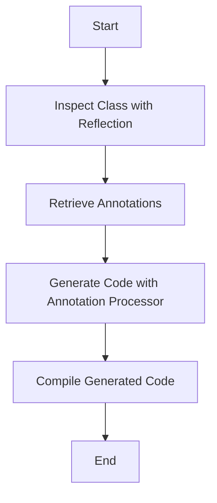

## 12.10 Reflection and Metaprogramming

Reflection and metaprogramming are powerful techniques that allow developers to inspect and modify the behavior of programs at runtime. In Kotlin, these capabilities are seamlessly integrated with the language's features, offering developers a robust toolkit for dynamic programming. This section delves into the nuances of reflection and metaprogramming in Kotlin, providing expert insights, practical examples, and best practices.

### Understanding Reflection in Kotlin

Reflection is the ability of a program to examine and modify its structure and behavior at runtime. In Kotlin, reflection is primarily facilitated through the `kotlin.reflect` package, which provides a comprehensive API for introspection.

#### Key Concepts of Reflection

1. **KClass and KCallable**: The `KClass` interface represents a Kotlin class, while `KCallable` is a common superinterface for `KFunction` and `KProperty`. These interfaces allow you to inspect classes, functions, and properties.

2. **KFunction and KProperty**: `KFunction` represents a function, and `KProperty` represents a property. These interfaces provide methods to invoke functions and access property values dynamically.

3. **Annotations**: Reflection can be used to inspect annotations applied to classes, functions, and properties, enabling dynamic behavior based on metadata.

4. **Type Information**: Kotlin's reflection API allows you to access type information at runtime, which is crucial for generic programming and type-safe operations.

#### Practical Example: Inspecting Class Properties

Let's explore a simple example of using reflection to inspect the properties of a class:

```kotlin
import kotlin.reflect.full.memberProperties

data class Person(val name: String, val age: Int)

fun main() {
    val person = Person("Alice", 30)
    val kClass = person::class

    // Inspecting properties
    println("Properties of ${kClass.simpleName}:")
    kClass.memberProperties.forEach { property ->
        println("${property.name} = ${property.get(person)}")
    }
}
```

In this example, we use the `memberProperties` extension function to retrieve all properties of the `Person` class and print their names and values.

### Metaprogramming in Kotlin

Metaprogramming involves writing programs that generate or manipulate other programs. In Kotlin, metaprogramming is often achieved through reflection, code generation, and DSLs (Domain-Specific Languages).

#### Code Generation with Annotation Processing

Annotation processing is a common technique for code generation in Kotlin. It allows you to generate additional code at compile time based on annotations present in the source code.

##### Example: Generating Builder Classes

Consider a scenario where you want to generate builder classes for data classes automatically. You can achieve this using annotation processing:

```kotlin
@Target(AnnotationTarget.CLASS)
@Retention(AnnotationRetention.SOURCE)
annotation class Builder

@Builder
data class User(val name: String, val age: Int)

// Annotation processor will generate a builder class for User
```

The annotation processor will generate a `UserBuilder` class, allowing you to create `User` instances using a fluent API.

### Best Practices for Reflection and Metaprogramming

1. **Performance Considerations**: Reflection can be slower than direct method calls due to the overhead of runtime type inspection. Use reflection judiciously and cache reflective operations when possible.

2. **Security Implications**: Reflection can bypass encapsulation, potentially exposing private members. Ensure that reflective operations are secure and do not expose sensitive data.

3. **Maintainability**: Code that relies heavily on reflection can be harder to maintain and understand. Use reflection sparingly and document its usage thoroughly.

4. **Testing**: Reflective code can be challenging to test. Ensure that you have comprehensive test coverage for reflective operations and consider using mocking frameworks to simulate reflective behavior.

### Limitations of Reflection in Kotlin

While reflection is a powerful tool, it has limitations:

- **Compile-Time Safety**: Reflection bypasses compile-time checks, which can lead to runtime errors if not used carefully.
- **Type Erasure**: Due to JVM type erasure, some type information may not be available at runtime, limiting the capabilities of reflection.
- **Performance Overhead**: Reflective operations can be slower than direct method calls, impacting performance in critical sections of code.

### Visualizing Reflection and Metaprogramming

To better understand the flow of reflection and metaprogramming, consider the following diagram illustrating the process of using reflection to inspect a class and generate code through annotation processing:



This diagram outlines the typical workflow of using reflection and metaprogramming in Kotlin, from inspecting a class to generating and compiling additional code.

### Try It Yourself: Experimenting with Reflection

To deepen your understanding of reflection in Kotlin, try modifying the example code to inspect different types of classes and properties. Experiment with accessing private properties and invoking functions dynamically. Consider creating a simple annotation processor to generate code based on custom annotations.

### References and Further Reading

- [Kotlin Reflection Documentation](https://kotlinlang.org/docs/reflection.html)
- [Kotlin Annotation Processing (KAPT)](https://kotlinlang.org/docs/kapt.html)
- [Effective Java by Joshua Bloch](https://www.oreilly.com/library/view/effective-java-3rd/9780134686097/)

### Knowledge Check

To reinforce your understanding of reflection and metaprogramming in Kotlin, consider the following questions:

1. What is the primary purpose of reflection in programming?
2. How does Kotlin's reflection API differ from Java's reflection API?
3. What are some common use cases for metaprogramming in Kotlin?
4. What are the potential security risks associated with using reflection?
5. How can annotation processing be used to generate code in Kotlin?

### Embrace the Journey

Reflection and metaprogramming open up a world of possibilities for dynamic programming in Kotlin. As you explore these advanced techniques, remember to balance their power with considerations for performance, security, and maintainability. Keep experimenting, stay curious, and enjoy the journey of mastering Kotlin's reflection and metaprogramming capabilities!

## Quiz Time!



### What is the primary purpose of reflection in programming?

- [x] To inspect and modify the structure and behavior of a program at runtime
- [ ] To compile code faster
- [ ] To improve code readability
- [ ] To enhance security

> **Explanation:** Reflection allows a program to examine and modify its structure and behavior at runtime, providing dynamic capabilities.

### Which Kotlin interface represents a class in the reflection API?

- [x] KClass
- [ ] KFunction
- [ ] KProperty
- [ ] KCallable

> **Explanation:** `KClass` is the interface representing a Kotlin class in the reflection API.

### What is a common use case for metaprogramming in Kotlin?

- [x] Code generation through annotation processing
- [ ] Improving application performance
- [ ] Simplifying user interfaces
- [ ] Enhancing security

> **Explanation:** Metaprogramming is often used for code generation, such as creating builder classes through annotation processing.

### What is a limitation of using reflection in Kotlin?

- [x] Performance overhead
- [ ] Improved compile-time safety
- [ ] Enhanced security
- [ ] Simpler code structure

> **Explanation:** Reflection can introduce performance overhead due to the runtime type inspection.

### How can annotation processing be used in Kotlin?

- [x] To generate additional code at compile time based on annotations
- [ ] To improve runtime performance
- [ ] To simplify user interfaces
- [ ] To enhance security

> **Explanation:** Annotation processing allows the generation of additional code at compile time based on annotations present in the source code.

### What is a security risk associated with reflection?

- [x] Bypassing encapsulation and exposing private members
- [ ] Improving compile-time safety
- [ ] Enhancing code readability
- [ ] Increasing application performance

> **Explanation:** Reflection can bypass encapsulation, potentially exposing private members and sensitive data.

### Which of the following is a best practice when using reflection?

- [x] Cache reflective operations to improve performance
- [ ] Use reflection extensively for all operations
- [ ] Avoid documenting reflective code
- [ ] Ignore security implications

> **Explanation:** Caching reflective operations can help mitigate performance overhead.

### What is a key difference between Kotlin's reflection API and Java's reflection API?

- [x] Kotlin's reflection API is more type-safe and integrated with the language features
- [ ] Java's reflection API is faster
- [ ] Kotlin's reflection API is less secure
- [ ] Java's reflection API is more concise

> **Explanation:** Kotlin's reflection API is designed to be more type-safe and integrated with the language's features.

### True or False: Reflection can be used to improve compile-time safety.

- [ ] True
- [x] False

> **Explanation:** Reflection operates at runtime and bypasses compile-time checks, which can lead to runtime errors if not used carefully.

### What is the role of `KCallable` in Kotlin's reflection API?

- [x] It is a common superinterface for `KFunction` and `KProperty`
- [ ] It represents a Kotlin class
- [ ] It is used for annotation processing
- [ ] It improves performance

> **Explanation:** `KCallable` is a common superinterface for `KFunction` and `KProperty`, allowing inspection of functions and properties.




