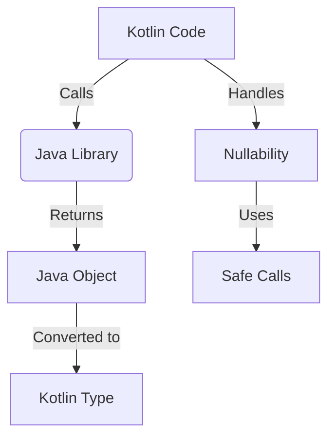

## 12.2 Leveraging Java Libraries in Kotlin Development

Kotlin, as a modern programming language, offers seamless interoperability with Java, allowing developers to leverage the vast ecosystem of Java libraries and frameworks. This section delves into the intricacies of using Java libraries in Kotlin, focusing on interoperability, handling nullability, and best practices for effective integration.

### Introduction to Kotlin-Java Interoperability

Kotlin's compatibility with Java is one of its most attractive features, enabling developers to use existing Java libraries without rewriting them. This interoperability is facilitated by Kotlin's design to run on the Java Virtual Machine (JVM), allowing it to call Java code and vice versa.

#### Key Concepts

- **Interoperability**: The ability of Kotlin to interact with Java code seamlessly.
- **Null Safety**: Kotlin's approach to handling null references, which differs from Java's.
- **Type Conversion**: Automatic conversion between Kotlin and Java types.

### Understanding Kotlin's Interoperability with Java

Kotlin's interoperability with Java is a cornerstone of its design, allowing developers to integrate Java libraries effortlessly. This section explores how Kotlin achieves this interoperability and the considerations to keep in mind.

#### Calling Java Code from Kotlin

Kotlin can call Java code directly, treating Java classes and methods as if they were Kotlin's own. This is possible because Kotlin compiles to bytecode compatible with the JVM, just like Java.

```kotlin
// Kotlin code calling a Java library method
val list = ArrayList<String>()
list.add("Kotlin")
println(list[0]) // Output: Kotlin
```

In this example, we use `ArrayList`, a Java class, in Kotlin without any additional configuration.

#### Handling Java Nullability in Kotlin

Java's type system does not distinguish between nullable and non-nullable types, which can lead to `NullPointerException`s. Kotlin addresses this with its null safety feature, which requires explicit handling of nullable types.

##### Nullability Annotations

Java libraries often use annotations like `@Nullable` and `@NotNull` to indicate nullability. Kotlin respects these annotations, allowing developers to handle nullability more effectively.

```java
// Java method with nullability annotations
public @Nullable String getNullableString() {
    return null;
}
```

```kotlin
// Kotlin code handling nullability
val result: String? = javaObject.getNullableString()
result?.let {
    println(it)
} ?: println("Result is null")
```

In this Kotlin code, we safely handle the nullable result from a Java method using the safe call operator `?.` and the Elvis operator `?:`.

#### Type Conversion Between Kotlin and Java

Kotlin automatically converts between its types and Java types when possible. For instance, Kotlin's `Int` is converted to Java's `int`, and `List` to `List`.

```kotlin
// Kotlin function using Java's List
fun printListSize(list: List<String>) {
    println("List size: ${list.size}")
}
```

When calling this function from Java, the conversion is handled automatically.

### Best Practices for Using Java Libraries in Kotlin

To maximize the benefits of using Java libraries in Kotlin, follow these best practices:

#### Leverage Kotlin's Null Safety

Always handle nullable types explicitly when working with Java libraries. Use Kotlin's null safety features, such as safe calls and the Elvis operator, to prevent runtime exceptions.

#### Use Extension Functions

Kotlin's extension functions allow you to add functionality to existing Java classes without modifying them. This is particularly useful for enhancing Java libraries with Kotlin-specific features.

```kotlin
// Extension function for Java's List
fun <T> List<T>.printAll() {
    forEach { println(it) }
}

// Usage
val javaList = ArrayList<String>()
javaList.add("Hello")
javaList.printAll() // Output: Hello
```

#### Optimize Performance with Inline Functions

When using Java libraries, consider using Kotlin's inline functions to reduce overhead and improve performance, especially in high-frequency method calls.

```kotlin
// Inline function example
inline fun <T> measureTime(block: () -> T): T {
    val start = System.currentTimeMillis()
    val result = block()
    println("Time taken: ${System.currentTimeMillis() - start}ms")
    return result
}
```

#### Handle Exceptions Gracefully

Java libraries may throw checked exceptions, which Kotlin does not support natively. Use try-catch blocks to handle these exceptions gracefully.

```kotlin
// Handling Java exceptions in Kotlin
try {
    val result = javaMethodThatThrowsException()
    println(result)
} catch (e: Exception) {
    println("Caught exception: ${e.message}")
}
```

### Common Challenges and Solutions

Despite Kotlin's seamless interoperability with Java, developers may encounter challenges. Here are some common issues and their solutions:

#### Java's Overloaded Methods

Java's method overloading can lead to ambiguity in Kotlin. Use named arguments or explicit type casting to resolve these ambiguities.

```java
// Java class with overloaded methods
public class OverloadedMethods {
    public void doSomething(int value) {}
    public void doSomething(String value) {}
}
```

```kotlin
// Resolving overloaded methods in Kotlin
val obj = OverloadedMethods()
obj.doSomething(42) // Calls the int version
obj.doSomething("Hello") // Calls the String version
```

#### Handling Java Collections

Java collections are mutable by default, whereas Kotlin encourages immutability. Convert Java collections to Kotlin's immutable collections when possible.

```kotlin
// Converting Java List to Kotlin List
val javaList = ArrayList<String>()
val kotlinList: List<String> = javaList.toList()
```

#### Dealing with Java's Static Members

Kotlin handles Java's static members using companion objects or top-level functions. Access static members directly through the class name.

```java
// Java class with static method
public class StaticExample {
    public static void printMessage() {
        System.out.println("Hello from Java");
    }
}
```

```kotlin
// Accessing Java static method in Kotlin
StaticExample.printMessage()
```

### Advanced Topics in Kotlin-Java Interoperability

For expert developers, understanding advanced interoperability topics can enhance the integration of Java libraries in Kotlin projects.

#### Using Java Reflection in Kotlin

Kotlin supports Java reflection, allowing you to inspect and manipulate Java classes at runtime. This is useful for dynamic code execution and library integration.

```kotlin
// Using Java reflection in Kotlin
val clazz = Class.forName("java.util.ArrayList")
val method = clazz.getMethod("size")
val instance = clazz.newInstance() as ArrayList<*>
println("Size: ${method.invoke(instance)}")
```

#### Java's Functional Interfaces and Kotlin Lambdas

Kotlin lambdas can be used with Java's functional interfaces, thanks to Kotlin's support for SAM (Single Abstract Method) conversions.

```java
// Java functional interface
public interface Greeting {
    void sayHello(String name);
}
```

```kotlin
// Using Kotlin lambda with Java functional interface
val greeting: Greeting = Greeting { name -> println("Hello, $name") }
greeting.sayHello("Kotlin")
```

#### Integrating Java Annotations in Kotlin

Kotlin can use Java annotations, which are often used in Java libraries for configuration and metadata. Use Kotlin's annotation syntax to apply these annotations.

```java
// Java annotation
public @interface MyAnnotation {
    String value();
}
```

```kotlin
// Using Java annotation in Kotlin
@MyAnnotation("Example")
class AnnotatedClass
```

### Try It Yourself

To solidify your understanding, try modifying the code examples provided. For instance, create your own extension functions for a Java library you frequently use, or handle a checked exception from a Java method in Kotlin.

### Visualizing Kotlin-Java Interoperability

Below is a diagram illustrating the interaction between Kotlin and Java, highlighting type conversion, nullability handling, and method calls.



### References and Further Reading

- [Kotlin Documentation on Java Interoperability](https://kotlinlang.org/docs/java-interop.html)
- [Java Annotations Tutorial](https://www.baeldung.com/java-annotations)
- [Kotlin and Java Reflection](https://kotlinlang.org/docs/reflection.html)

### Knowledge Check

- How does Kotlin handle Java's nullability?
- What are the benefits of using extension functions with Java libraries?
- How can you resolve method overloading issues when calling Java methods from Kotlin?

### Embrace the Journey

Remember, integrating Java libraries into Kotlin projects is a powerful way to leverage existing resources while enjoying Kotlin's modern features. Keep experimenting, stay curious, and enjoy the journey of building robust applications with Kotlin and Java together!

## Quiz Time!



### How does Kotlin handle Java's nullability?

- [x] By using null safety features like safe calls and the Elvis operator.
- [ ] By ignoring nullability altogether.
- [ ] By converting all Java types to non-nullable Kotlin types.
- [ ] By throwing exceptions for null values.

> **Explanation:** Kotlin uses null safety features such as safe calls (`?.`) and the Elvis operator (`?:`) to handle nullability when interacting with Java code.

### What is the primary benefit of using Kotlin's extension functions with Java libraries?

- [x] They allow adding functionality to Java classes without modifying them.
- [ ] They convert Java classes to Kotlin classes.
- [ ] They remove the need for null checks.
- [ ] They automatically optimize Java code.

> **Explanation:** Extension functions enable developers to add new functionality to existing Java classes without altering their source code, enhancing interoperability.

### How can method overloading issues be resolved when calling Java methods from Kotlin?

- [x] By using named arguments or explicit type casting.
- [ ] By rewriting the Java methods in Kotlin.
- [ ] By avoiding overloaded methods entirely.
- [ ] By using only default arguments.

> **Explanation:** Named arguments and explicit type casting can help disambiguate overloaded methods when calling them from Kotlin.

### What is a common challenge when using Java collections in Kotlin?

- [x] Java collections are mutable by default, while Kotlin encourages immutability.
- [ ] Java collections cannot be used in Kotlin.
- [ ] Java collections are always immutable in Kotlin.
- [ ] Java collections require special syntax in Kotlin.

> **Explanation:** Java collections are mutable by default, which can conflict with Kotlin's preference for immutability. Developers often convert Java collections to Kotlin's immutable collections.

### How does Kotlin handle Java's static members?

- [x] By accessing them directly through the class name.
- [ ] By converting them to instance members.
- [ ] By ignoring them.
- [ ] By requiring special syntax.

> **Explanation:** Kotlin accesses Java's static members directly through the class name, similar to how Java does it.

### What is the role of Kotlin's inline functions when using Java libraries?

- [x] To reduce overhead and improve performance.
- [ ] To convert Java code to Kotlin code.
- [ ] To handle exceptions automatically.
- [ ] To enforce null safety.

> **Explanation:** Inline functions in Kotlin reduce overhead and improve performance, especially in high-frequency method calls.

### How can you handle checked exceptions from Java methods in Kotlin?

- [x] By using try-catch blocks.
- [ ] By ignoring them.
- [ ] By converting them to unchecked exceptions.
- [ ] By using a special keyword.

> **Explanation:** Kotlin handles Java's checked exceptions using try-catch blocks, as Kotlin does not support checked exceptions natively.

### What is a SAM conversion in Kotlin?

- [x] It allows Kotlin lambdas to be used with Java's functional interfaces.
- [ ] It converts Java classes to Kotlin classes.
- [ ] It handles nullability in Java code.
- [ ] It optimizes Java code for Kotlin.

> **Explanation:** SAM (Single Abstract Method) conversion allows Kotlin lambdas to be used with Java's functional interfaces, facilitating interoperability.

### How can you use Java annotations in Kotlin?

- [x] By applying them using Kotlin's annotation syntax.
- [ ] By converting them to Kotlin annotations.
- [ ] By ignoring them.
- [ ] By using a special library.

> **Explanation:** Java annotations can be used in Kotlin by applying them with Kotlin's annotation syntax, allowing for configuration and metadata usage.

### True or False: Kotlin can call Java code directly without any additional configuration.

- [x] True
- [ ] False

> **Explanation:** Kotlin can call Java code directly because both languages compile to JVM bytecode, allowing seamless interoperability.


