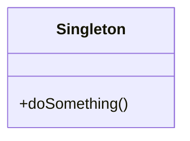
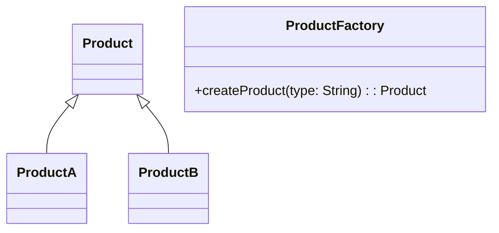

## 12.3 Java Design Patterns in Kotlin

In the world of software engineering, design patterns serve as time-tested solutions to common problems. Java, a language with a rich history, has a well-established set of design patterns that developers have relied on for decades. As Kotlin emerges as a modern alternative on the JVM, it brings new language features and idioms that can enhance or simplify these patterns. This section explores how to translate and adapt common Java design patterns to Kotlin, leveraging Kotlin's unique features to write more concise, expressive, and safe code.

### Introduction to Design Patterns

Design patterns are reusable solutions to common problems in software design. They are not finished designs that can be directly transformed into code but are templates for how to solve a problem in different situations. Patterns are categorized into three types:

1. **Creational Patterns**: Deal with object creation mechanisms.
2. **Structural Patterns**: Concerned with object composition.
3. **Behavioral Patterns**: Focus on communication between objects.

### Translating Java Patterns to Kotlin

Kotlin's syntax and features such as null safety, data classes, and higher-order functions provide opportunities to refine traditional Java design patterns. Let's explore how some of the most common patterns can be adapted to Kotlin.

#### Singleton Pattern

**Category**: Creational

**Intent**: Ensure a class has only one instance and provide a global point of access to it.

**Kotlin Implementation**:
Kotlin simplifies the Singleton pattern with the `object` declaration, which inherently ensures a single instance.

```kotlin
object Singleton {
    fun doSomething() {
        println("Singleton instance is doing something!")
    }
}
```

**Design Considerations**:
- **Thread Safety**: The `object` declaration is thread-safe by default.
- **Lazy Initialization**: If lazy initialization is required, use `lazy` delegation.

#### Factory Method Pattern

**Category**: Creational

**Intent**: Define an interface for creating an object, but let subclasses alter the type of objects that will be created.

**Kotlin Implementation**:
Kotlin's sealed classes can be used to define a hierarchy of types, and factory methods can be implemented using companion objects.

```kotlin
sealed class Product {
    object ProductA : Product()
    object ProductB : Product()
}

class ProductFactory {
    companion object {
        fun createProduct(type: String): Product {
            return when (type) {
                "A" -> Product.ProductA
                "B" -> Product.ProductB
                else -> throw IllegalArgumentException("Unknown product type")
            }
        }
    }
}
```

**Design Considerations**:
- **Type Safety**: Using sealed classes ensures that all possible types are known at compile time.
- **Readability**: Companion objects provide a clear and idiomatic way to implement factory methods.

#### Builder Pattern

**Category**: Creational

**Intent**: Separate the construction of a complex object from its representation.

**Kotlin Implementation**:
Kotlin's `apply` function and named parameters can simplify the Builder pattern.

```kotlin
data class House(
    var rooms: Int = 0,
    var doors: Int = 0,
    var windows: Int = 0
)

fun buildHouse(): House {
    return House().apply {
        rooms = 4
        doors = 2
        windows = 6
    }
}
```

**Design Considerations**:
- **Immutability**: Consider using immutable data classes for thread safety.
- **Fluent API**: `apply` and other scope functions (`let`, `run`) can create a fluent API.

#### Observer Pattern

**Category**: Behavioral

**Intent**: Define a one-to-many dependency between objects so that when one object changes state, all its dependents are notified and updated automatically.

**Kotlin Implementation**:
Kotlin's `Delegates.observable` can be used to implement the Observer pattern.

```kotlin
import kotlin.properties.Delegates

class Subject {
    var state: String by Delegates.observable("<no state>") { _, old, new ->
        println("State changed from $old to $new")
    }
}
```

**Design Considerations**:
- **Simplicity**: The `observable` delegate simplifies the implementation.
- **Reactivity**: Consider using Kotlin Flow for more complex reactive scenarios.

#### Strategy Pattern

**Category**: Behavioral

**Intent**: Define a family of algorithms, encapsulate each one, and make them interchangeable.

**Kotlin Implementation**:
Kotlin's higher-order functions allow for a concise implementation of the Strategy pattern.

```kotlin
fun interface Strategy {
    fun execute(a: Int, b: Int): Int
}

val addition: Strategy = Strategy { a, b -> a + b }
val subtraction: Strategy = Strategy { a, b -> a - b }

fun performOperation(a: Int, b: Int, strategy: Strategy): Int {
    return strategy.execute(a, b)
}
```

**Design Considerations**:
- **Flexibility**: Higher-order functions provide flexibility in defining and using strategies.
- **Readability**: Using `fun interface` makes the code more readable and concise.

### Visualizing Design Patterns

To better understand the relationships and interactions in design patterns, let's use Mermaid.js diagrams to visualize some of these patterns.

#### Singleton Pattern



**Description**: The Singleton pattern ensures that a class has only one instance and provides a global point of access to it.

#### Factory Method Pattern



**Description**: The Factory Method pattern defines an interface for creating objects, allowing subclasses to alter the type of objects that will be created.

### Differences and Similarities

While translating Java design patterns to Kotlin, it's important to note the differences and similarities:

- **Singleton**: In Java, the Singleton pattern often involves synchronized methods or static initializers for thread safety. In Kotlin, the `object` declaration handles this elegantly.
- **Factory Method**: Java uses abstract classes or interfaces for factory methods, while Kotlin can leverage sealed classes for more type-safe implementations.
- **Builder**: Java's Builder pattern often involves nested static classes, whereas Kotlin can use data classes and scope functions for a more concise approach.
- **Observer**: Java typically uses interfaces and event listeners, while Kotlin can use property delegates and reactive streams.
- **Strategy**: Java strategies are often implemented with interfaces and classes, while Kotlin can use higher-order functions and `fun interface`.

### Try It Yourself

To deepen your understanding, try modifying the provided code examples:

- **Singleton**: Add a method to the `Singleton` object that maintains a count of how many times it has been called.
- **Factory Method**: Extend the `Product` sealed class with a new type and update the factory method to handle it.
- **Builder**: Add more properties to the `House` data class and use different scope functions to initialize them.
- **Observer**: Implement a more complex observer that reacts to multiple properties changing.
- **Strategy**: Create additional strategies and experiment with passing them to the `performOperation` function.

### Knowledge Check

Before we conclude, let's reinforce what we've learned:

- **What is the primary benefit of using the `object` declaration for Singletons in Kotlin?**
- **How do sealed classes enhance the Factory Method pattern in Kotlin?**
- **What Kotlin feature simplifies the Builder pattern, and why?**
- **How does the `Delegates.observable` property delegate help implement the Observer pattern?**
- **In what way do higher-order functions facilitate the Strategy pattern in Kotlin?**

### Conclusion

Translating Java design patterns to Kotlin not only involves a change in syntax but also an opportunity to leverage Kotlin's powerful features to write more expressive and concise code. By understanding these patterns and how they can be adapted, you can create robust and maintainable applications that take full advantage of Kotlin's capabilities. Remember, this is just the beginning. As you progress, you'll build more complex and interactive applications. Keep experimenting, stay curious, and enjoy the journey!

## Quiz Time!



### What is the primary benefit of using the `object` declaration for Singletons in Kotlin?

- [x] It ensures thread safety and a single instance.
- [ ] It allows multiple instances of the class.
- [ ] It requires less memory.
- [ ] It provides better performance.

> **Explanation:** The `object` declaration in Kotlin ensures that a class has only one instance and is thread-safe by default.

### How do sealed classes enhance the Factory Method pattern in Kotlin?

- [x] They provide compile-time type safety.
- [ ] They allow dynamic type creation.
- [ ] They enable runtime polymorphism.
- [ ] They simplify memory management.

> **Explanation:** Sealed classes in Kotlin ensure that all possible subclasses are known at compile time, enhancing type safety in the Factory Method pattern.

### What Kotlin feature simplifies the Builder pattern, and why?

- [x] `apply` function, because it allows for a more concise and readable object initialization.
- [ ] `lazy` initialization, because it delays object creation.
- [ ] `object` declaration, because it ensures a single instance.
- [ ] `companion object`, because it provides static-like behavior.

> **Explanation:** The `apply` function in Kotlin allows for a more concise and readable way to initialize objects, simplifying the Builder pattern.

### How does the `Delegates.observable` property delegate help implement the Observer pattern?

- [x] It automatically notifies observers of property changes.
- [ ] It prevents property changes.
- [ ] It allows for lazy initialization.
- [ ] It provides default values for properties.

> **Explanation:** `Delegates.observable` in Kotlin allows properties to notify observers automatically when they change, facilitating the Observer pattern.

### In what way do higher-order functions facilitate the Strategy pattern in Kotlin?

- [x] They allow strategies to be passed as function parameters.
- [ ] They enable dynamic type creation.
- [ ] They simplify memory management.
- [ ] They provide better performance.

> **Explanation:** Higher-order functions in Kotlin allow strategies to be passed as function parameters, making it easy to switch between different algorithms.

### Which Kotlin feature is used to implement a concise Singleton pattern?

- [x] `object` declaration
- [ ] `companion object`
- [ ] `data class`
- [ ] `sealed class`

> **Explanation:** The `object` declaration in Kotlin is used to implement a concise Singleton pattern, ensuring a single instance and thread safety.

### What is a key advantage of using Kotlin's `apply` function in the Builder pattern?

- [x] It allows for a fluent API style.
- [ ] It enforces immutability.
- [ ] It provides lazy initialization.
- [ ] It enhances type safety.

> **Explanation:** The `apply` function allows for a fluent API style by enabling concise and readable object initialization.

### How does Kotlin's `fun interface` benefit the Strategy pattern?

- [x] It simplifies the definition of single-method interfaces.
- [ ] It allows multiple inheritance.
- [ ] It enforces immutability.
- [ ] It provides default implementations.

> **Explanation:** `fun interface` in Kotlin simplifies the definition of single-method interfaces, making it easier to implement the Strategy pattern.

### What is the role of `Delegates.observable` in Kotlin?

- [x] It allows properties to notify observers of changes.
- [ ] It provides default values for properties.
- [ ] It enforces immutability.
- [ ] It simplifies memory management.

> **Explanation:** `Delegates.observable` allows properties to notify observers of changes, which is useful in implementing the Observer pattern.

### True or False: Kotlin's `object` declaration is not thread-safe by default.

- [ ] True
- [x] False

> **Explanation:** False. Kotlin's `object` declaration is thread-safe by default, ensuring a single instance across threads.


