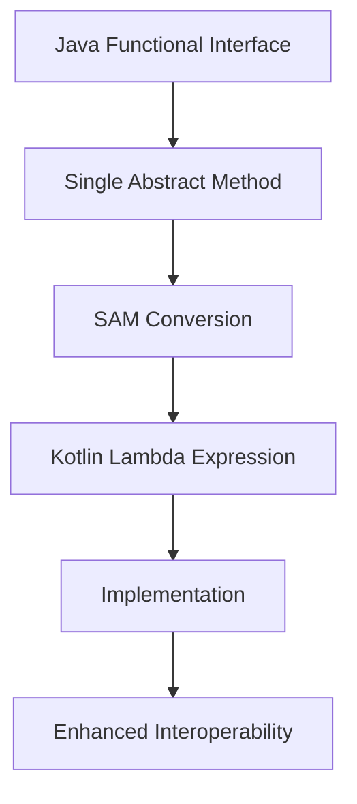

## 12.4 Java Functional Interfaces

In the realm of software development, interoperability between languages is a cornerstone of modern programming. Kotlin, a language that runs on the Java Virtual Machine (JVM), offers seamless integration with Java, allowing developers to leverage existing Java libraries and frameworks. One of the key aspects of this interoperability is the use of Java Functional Interfaces, which play a crucial role in enabling functional programming paradigms within Kotlin. In this section, we will delve into the concept of Java Functional Interfaces, explore their integration with Kotlin, and demonstrate how they enhance functional programming interoperability.

### Understanding Java Functional Interfaces

Java Functional Interfaces are a fundamental concept introduced in Java 8 to support functional programming. A functional interface is an interface that contains exactly one abstract method, making it eligible to be implemented using a lambda expression or method reference. The `@FunctionalInterface` annotation is used to indicate that an interface is intended to be a functional interface, although it is not mandatory.

#### Key Characteristics of Functional Interfaces

- **Single Abstract Method (SAM):** A functional interface must have exactly one abstract method. This is known as the Single Abstract Method (SAM) principle.
- **Default and Static Methods:** Functional interfaces can have default and static methods, but these do not count towards the single abstract method requirement.
- **Lambda Expressions:** Functional interfaces can be implemented using lambda expressions, providing a concise and expressive way to define behavior.

#### Examples of Common Java Functional Interfaces

Java provides several built-in functional interfaces in the `java.util.function` package, including:

- **`Function<T, R>`:** Represents a function that accepts one argument and produces a result.
- **`Consumer<T>`:** Represents an operation that accepts a single input argument and returns no result.
- **`Supplier<T>`:** Represents a supplier of results, providing a result without any input.
- **`Predicate<T>`:** Represents a predicate (boolean-valued function) of one argument.
- **`BiFunction<T, U, R>`:** Represents a function that accepts two arguments and produces a result.

### Integrating Java Functional Interfaces with Kotlin

Kotlin's interoperability with Java allows developers to seamlessly use Java Functional Interfaces within Kotlin code. This integration is facilitated by Kotlin's support for SAM conversions, which enable the use of lambda expressions to implement functional interfaces.

#### SAM Conversions in Kotlin

SAM conversions in Kotlin allow you to pass a lambda expression where a Java functional interface is expected. This feature simplifies the use of functional interfaces and enhances the readability of the code.

**Example: Using a Java Functional Interface in Kotlin**

```kotlin
import java.util.function.Function

fun main() {
    // Using a lambda expression to implement the Function interface
    val square: Function<Int, Int> = Function { x -> x * x }

    // Applying the function
    val result = square.apply(5)
    println("The square of 5 is $result") // Output: The square of 5 is 25
}
```

In this example, the `Function` interface from the `java.util.function` package is implemented using a lambda expression. The lambda `Function { x -> x * x }` represents the implementation of the `apply` method, which takes an integer and returns its square.

#### Benefits of SAM Conversions

- **Conciseness:** SAM conversions allow for concise and expressive code by eliminating the need for explicit anonymous class implementations.
- **Readability:** The use of lambda expressions enhances code readability, making it easier to understand the behavior being implemented.
- **Interoperability:** SAM conversions enable seamless integration with existing Java libraries and frameworks that utilize functional interfaces.

### Leveraging Kotlin's Functional Programming Features

Kotlin is a language that embraces functional programming paradigms, offering features such as higher-order functions, lambdas, and extension functions. When combined with Java Functional Interfaces, these features provide a powerful toolkit for functional programming.

#### Higher-Order Functions and Lambdas

Higher-order functions are functions that take other functions as parameters or return functions as results. Kotlin's support for higher-order functions, combined with lambda expressions, allows for the creation of flexible and reusable code.

**Example: Using Higher-Order Functions with Java Functional Interfaces**

```kotlin
import java.util.function.Predicate

fun filterNumbers(numbers: List<Int>, predicate: Predicate<Int>): List<Int> {
    return numbers.filter { predicate.test(it) }
}

fun main() {
    val numbers = listOf(1, 2, 3, 4, 5, 6)

    // Using a lambda expression to implement the Predicate interface
    val isEven: Predicate<Int> = Predicate { it % 2 == 0 }

    // Filtering even numbers
    val evenNumbers = filterNumbers(numbers, isEven)
    println("Even numbers: $evenNumbers") // Output: Even numbers: [2, 4, 6]
}
```

In this example, the `filterNumbers` function takes a list of integers and a `Predicate` functional interface as parameters. The `Predicate` is implemented using a lambda expression to filter even numbers from the list.

#### Extension Functions and Functional Interfaces

Kotlin's extension functions allow you to add new functionality to existing classes without modifying their source code. When combined with functional interfaces, extension functions enable the creation of expressive and reusable APIs.

**Example: Using Extension Functions with Java Functional Interfaces**

```kotlin
import java.util.function.Consumer

// Extension function to apply a Consumer to each element of a list
fun <T> List<T>.forEachConsumer(consumer: Consumer<T>) {
    for (element in this) {
        consumer.accept(element)
    }
}

fun main() {
    val names = listOf("Alice", "Bob", "Charlie")

    // Using a lambda expression to implement the Consumer interface
    val printName: Consumer<String> = Consumer { println(it) }

    // Applying the Consumer to each element of the list
    names.forEachConsumer(printName)
}
```

In this example, an extension function `forEachConsumer` is defined for the `List` class, allowing a `Consumer` functional interface to be applied to each element of the list. The `Consumer` is implemented using a lambda expression to print each name.

### Visualizing Java Functional Interfaces and SAM Conversions

To better understand the relationship between Java Functional Interfaces and SAM conversions in Kotlin, let's visualize the process using a diagram.



**Diagram Description:** This diagram illustrates the process of using Java Functional Interfaces in Kotlin through SAM conversions. The Java Functional Interface, with its Single Abstract Method, undergoes SAM conversion, allowing a Kotlin lambda expression to provide the implementation. This process enhances interoperability between Java and Kotlin.

### Practical Use Cases and Examples

Java Functional Interfaces and their integration with Kotlin have numerous practical applications in real-world software development. Let's explore some common use cases and examples.

#### Use Case 1: Event Handling

Functional interfaces are often used in event handling scenarios, where a specific action needs to be performed in response to an event.

**Example: Using a Functional Interface for Event Handling**

```kotlin
import java.awt.event.ActionListener
import javax.swing.JButton
import javax.swing.JFrame

fun main() {
    val frame = JFrame("Button Example")
    val button = JButton("Click Me")

    // Using a lambda expression to implement the ActionListener interface
    button.addActionListener(ActionListener { println("Button clicked!") })

    frame.add(button)
    frame.setSize(200, 200)
    frame.defaultCloseOperation = JFrame.EXIT_ON_CLOSE
    frame.isVisible = true
}
```

In this example, a `JButton` is created, and an `ActionListener` functional interface is implemented using a lambda expression to handle button click events.

#### Use Case 2: Stream Processing

Java's Stream API, introduced in Java 8, heavily relies on functional interfaces for processing collections and streams of data.

**Example: Using Functional Interfaces with Java Streams**

```kotlin
import java.util.stream.Collectors

fun main() {
    val numbers = listOf(1, 2, 3, 4, 5, 6)

    // Using a lambda expression to implement the Predicate interface
    val isEven: (Int) -> Boolean = { it % 2 == 0 }

    // Filtering even numbers using Java Streams
    val evenNumbers = numbers.stream()
        .filter(isEven)
        .collect(Collectors.toList())

    println("Even numbers: $evenNumbers") // Output: Even numbers: [2, 4, 6]
}
```

In this example, a lambda expression is used to implement the `Predicate` functional interface for filtering even numbers using Java Streams.

#### Use Case 3: Custom Functional Interfaces

In addition to using built-in functional interfaces, developers can define custom functional interfaces to suit specific needs.

**Example: Defining and Using a Custom Functional Interface**

```kotlin
// Defining a custom functional interface
fun interface StringTransformer {
    fun transform(input: String): String
}

fun main() {
    // Using a lambda expression to implement the custom functional interface
    val toUpperCase: StringTransformer = StringTransformer { it.uppercase() }

    val original = "hello"
    val transformed = toUpperCase.transform(original)
    println("Transformed string: $transformed") // Output: Transformed string: HELLO
}
```

In this example, a custom functional interface `StringTransformer` is defined, and a lambda expression is used to implement it for transforming strings to uppercase.

### Design Considerations and Best Practices

When working with Java Functional Interfaces and Kotlin, there are several design considerations and best practices to keep in mind.

#### Design Considerations

- **Compatibility:** Ensure that the functional interfaces used are compatible with both Java and Kotlin, especially when dealing with third-party libraries.
- **Performance:** Consider the performance implications of using lambda expressions and functional interfaces, particularly in performance-critical applications.
- **Readability:** Strive for code readability by using descriptive names for lambda parameters and avoiding overly complex lambda expressions.

#### Best Practices

- **Use SAM Conversions Wisely:** Leverage SAM conversions to simplify code and enhance readability, but avoid overusing them in situations where explicit implementations provide better clarity.
- **Favor Built-in Interfaces:** Whenever possible, use built-in functional interfaces from the `java.util.function` package to promote consistency and reduce the need for custom interfaces.
- **Embrace Kotlin's Functional Features:** Combine Java Functional Interfaces with Kotlin's functional programming features, such as higher-order functions and extension functions, to create expressive and reusable code.

### Differences and Similarities with Other Patterns

Java Functional Interfaces are often compared to other design patterns and concepts, such as:

- **Strategy Pattern:** Both functional interfaces and the Strategy Pattern involve defining interchangeable behavior. However, functional interfaces are more lightweight and concise, often implemented using lambda expressions.
- **Command Pattern:** Functional interfaces can be used to implement the Command Pattern by encapsulating actions as objects or lambda expressions.
- **Observer Pattern:** Functional interfaces can be used to define callbacks and event listeners, similar to the Observer Pattern.

### Try It Yourself: Experimenting with Functional Interfaces

To reinforce your understanding of Java Functional Interfaces and their integration with Kotlin, try modifying the code examples provided in this section. Experiment with different functional interfaces, lambda expressions, and use cases to explore their capabilities.

**Suggested Modifications:**

- Implement additional functional interfaces, such as `BiFunction` or `Supplier`, in the provided examples.
- Create a custom functional interface for a specific use case and implement it using a lambda expression.
- Experiment with combining multiple functional interfaces to achieve more complex behavior.

### Conclusion

Java Functional Interfaces, when combined with Kotlin's powerful language features, provide a robust foundation for functional programming interoperability. By leveraging SAM conversions, lambda expressions, and Kotlin's functional programming capabilities, developers can create expressive, concise, and interoperable code that seamlessly integrates with existing Java libraries and frameworks. As you continue your journey in mastering Kotlin and Java interoperability, remember to embrace the flexibility and power of functional interfaces, and explore their potential in your software development projects.

## Quiz Time!



### What is a Java Functional Interface?

- [x] An interface with exactly one abstract method
- [ ] An interface with multiple abstract methods
- [ ] A class with one abstract method
- [ ] A class with multiple abstract methods

> **Explanation:** A Java Functional Interface is defined as an interface with exactly one abstract method, which allows it to be implemented using lambda expressions.

### Which annotation is used to indicate a functional interface in Java?

- [x] `@FunctionalInterface`
- [ ] `@Interface`
- [ ] `@Functional`
- [ ] `@LambdaInterface`

> **Explanation:** The `@FunctionalInterface` annotation is used to indicate that an interface is intended to be a functional interface, although it is not mandatory.

### What is SAM conversion in Kotlin?

- [x] The ability to use a lambda expression to implement a Java functional interface
- [ ] The ability to convert a class into an interface
- [ ] The ability to convert a lambda into a class
- [ ] The ability to convert an interface into a class

> **Explanation:** SAM conversion in Kotlin allows you to use a lambda expression to implement a Java functional interface, simplifying the integration of Java and Kotlin.

### Which of the following is a built-in Java Functional Interface?

- [x] `Function<T, R>`
- [ ] `Runnable`
- [ ] `Cloneable`
- [ ] `Serializable`

> **Explanation:** `Function<T, R>` is a built-in Java Functional Interface found in the `java.util.function` package.

### How can you implement a Java Functional Interface in Kotlin?

- [x] Using a lambda expression
- [ ] Using an abstract class
- [ ] Using a concrete class
- [ ] Using a static method

> **Explanation:** In Kotlin, you can implement a Java Functional Interface using a lambda expression, thanks to SAM conversions.

### What is the primary benefit of using SAM conversions in Kotlin?

- [x] Conciseness and readability
- [ ] Increased performance
- [ ] Reduced memory usage
- [ ] Enhanced security

> **Explanation:** SAM conversions in Kotlin enhance code conciseness and readability by allowing lambda expressions to implement Java functional interfaces.

### Which Kotlin feature allows you to add new functionality to existing classes?

- [x] Extension functions
- [ ] Abstract classes
- [ ] Interfaces
- [ ] Static methods

> **Explanation:** Extension functions in Kotlin allow you to add new functionality to existing classes without modifying their source code.

### What is the purpose of the `Consumer<T>` functional interface?

- [x] To perform an operation on a single input argument without returning a result
- [ ] To supply a result without any input
- [ ] To evaluate a boolean condition on a single input
- [ ] To transform an input into a different output

> **Explanation:** The `Consumer<T>` functional interface is used to perform an operation on a single input argument without returning a result.

### True or False: Functional interfaces can have default and static methods.

- [x] True
- [ ] False

> **Explanation:** Functional interfaces can have default and static methods, but these do not count towards the single abstract method requirement.

### Which of the following is NOT a characteristic of a Java Functional Interface?

- [ ] Single Abstract Method
- [ ] Can be implemented using lambda expressions
- [ ] Can have default and static methods
- [x] Must have multiple abstract methods

> **Explanation:** A Java Functional Interface must have exactly one abstract method, not multiple.


