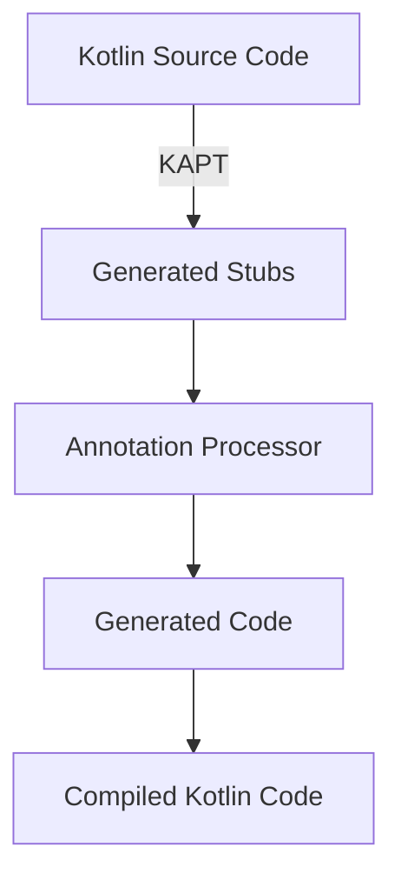

## 12.5 Annotation Processing

Annotation processing is a powerful feature in the Java ecosystem that allows developers to generate code, validate annotations, and automate repetitive tasks. In Kotlin, the Kotlin Annotation Processing Tool (KAPT) extends this capability, enabling seamless integration with Java's annotation processing tools. This section delves into the nuances of annotation processing in Kotlin, focusing on implementing custom annotations and leveraging KAPT for efficient code generation.

### Understanding Annotations

Annotations in programming are metadata that provide additional information about the code. They do not directly affect the execution but can be used by compilers and tools to perform various tasks such as code generation, validation, and more.

#### Key Concepts of Annotations

- **Metadata**: Annotations serve as metadata, providing information about the program elements they annotate.
- **Retention Policies**: Annotations can have different retention policies, determining their availability at runtime, compile-time, or source level.
- **Targets**: Annotations can target different program elements such as classes, methods, fields, etc.
- **Repeatable Annotations**: Some annotations can be applied multiple times to the same element.

### Implementing Custom Annotations in Kotlin

Creating custom annotations in Kotlin is straightforward. Annotations are defined using the `annotation` keyword, and they can have properties that are initialized when the annotation is applied.

#### Example: Defining a Custom Annotation

```kotlin
// Define a custom annotation
@Target(AnnotationTarget.CLASS, AnnotationTarget.FUNCTION)
@Retention(AnnotationRetention.RUNTIME)
annotation class LogExecution(val logLevel: String = "INFO")
```

In this example, we define a `LogExecution` annotation that can be applied to classes and functions. It has a property `logLevel` with a default value of "INFO".

#### Applying Custom Annotations

Once defined, annotations can be applied to the desired program elements.

```kotlin
@LogExecution(logLevel = "DEBUG")
class MyService {
    fun performTask() {
        println("Task performed.")
    }
}
```

### Introduction to KAPT (Kotlin Annotation Processing Tool)

KAPT is a tool that allows Kotlin to use Java annotation processors. It generates the necessary stubs and bindings, enabling Kotlin code to interact with Java-based annotation processors seamlessly.

#### Why Use KAPT?

- **Interoperability**: KAPT allows Kotlin to leverage existing Java annotation processors, making it easier to integrate with Java libraries and frameworks.
- **Code Generation**: Automate repetitive code generation tasks, reducing boilerplate and improving maintainability.
- **Validation**: Perform compile-time checks and validations on annotations, ensuring code correctness.

### Setting Up KAPT in a Kotlin Project

To use KAPT in a Kotlin project, you need to configure your build tool. The following example demonstrates how to set up KAPT with Gradle.

#### Gradle Configuration

Add the KAPT plugin to your `build.gradle.kts` file:

```kotlin
plugins {
    kotlin("jvm") version "1.8.0"
    kotlin("kapt") version "1.8.0"
}

dependencies {
    implementation("com.google.dagger:dagger:2.40")
    kapt("com.google.dagger:dagger-compiler:2.40")
}
```

In this configuration, we apply the KAPT plugin and add dependencies for Dagger, a popular dependency injection framework that uses annotation processing.

### Writing an Annotation Processor

Writing an annotation processor involves creating a class that extends `AbstractProcessor` and overriding its methods to process annotations.

#### Example: Creating an Annotation Processor

```kotlin
import javax.annotation.processing.*
import javax.lang.model.SourceVersion
import javax.lang.model.element.Element
import javax.lang.model.element.TypeElement

@SupportedAnnotationTypes("com.example.LogExecution")
@SupportedSourceVersion(SourceVersion.RELEASE_8)
class LogExecutionProcessor : AbstractProcessor() {

    override fun process(annotations: Set<TypeElement>, roundEnv: RoundEnvironment): Boolean {
        for (element in roundEnv.getElementsAnnotatedWith(LogExecution::class.java)) {
            // Process each annotated element
            processElement(element)
        }
        return true
    }

    private fun processElement(element: Element) {
        // Implement logic to process the annotated element
        println("Processing element: ${element.simpleName}")
    }
}
```

In this example, the `LogExecutionProcessor` processes elements annotated with `LogExecution`. It overrides the `process` method to handle the annotations.

### Using KAPT with Custom Annotation Processors

Once your annotation processor is written, you can use KAPT to process annotations in your Kotlin project.

#### Example: Applying the Annotation Processor

```kotlin
@LogExecution(logLevel = "DEBUG")
fun executeTask() {
    println("Executing task...")
}
```

When you build your project, KAPT will invoke the `LogExecutionProcessor` to process the `LogExecution` annotation on the `executeTask` function.

### Visualizing Annotation Processing Workflow

To better understand the annotation processing workflow, let's visualize the interaction between Kotlin code, KAPT, and the annotation processor.



**Diagram Description**: This flowchart illustrates the annotation processing workflow. KAPT generates stubs from Kotlin source code, which are then processed by the annotation processor to generate additional code. The generated code is compiled along with the original Kotlin code.

### Best Practices for Annotation Processing

- **Minimize Processing Time**: Keep annotation processing efficient by limiting the scope of processing and avoiding unnecessary computations.
- **Use Incremental Processing**: Enable incremental processing to improve build performance.
- **Validate Inputs**: Ensure that annotations are applied correctly and provide meaningful error messages for incorrect usage.
- **Document Annotations**: Clearly document the purpose and usage of custom annotations to aid developers in applying them correctly.

### Differences and Similarities with Java Annotation Processing

Kotlin's annotation processing with KAPT is similar to Java's but includes some Kotlin-specific considerations:

- **Interoperability**: KAPT allows Kotlin to use Java annotation processors, maintaining compatibility with existing Java tools.
- **Null Safety**: Kotlin's null safety features may require additional handling in annotation processors.
- **Extension Functions**: Kotlin's extension functions are not directly visible to annotation processors, requiring alternative approaches for processing.

### Try It Yourself: Experiment with KAPT

To gain hands-on experience with KAPT, try modifying the `LogExecutionProcessor` to generate a log statement in each annotated method. Experiment with different annotation properties and observe how they affect the generated code.

### Knowledge Check

- **What is the primary purpose of annotation processing?**
- **How does KAPT facilitate interoperability between Kotlin and Java?**
- **What are some best practices for writing annotation processors?**

### Conclusion

Annotation processing in Kotlin, powered by KAPT, provides a robust mechanism for code generation and validation. By understanding and leveraging these tools, developers can automate repetitive tasks, ensure code correctness, and integrate seamlessly with the Java ecosystem. As you continue to explore Kotlin's capabilities, remember that annotation processing is a powerful tool in your development toolkit, enabling you to create more efficient and maintainable applications.

## Quiz Time!



### What is the primary purpose of annotation processing?

- [x] To generate code and validate annotations at compile time.
- [ ] To execute code at runtime.
- [ ] To optimize memory usage.
- [ ] To handle user inputs.

> **Explanation:** Annotation processing is primarily used to generate code and validate annotations during the compile-time phase, not at runtime.

### How does KAPT facilitate interoperability between Kotlin and Java?

- [x] By allowing Kotlin to use Java annotation processors.
- [ ] By converting Kotlin code to Java code.
- [ ] By providing a Kotlin-specific annotation processing tool.
- [ ] By removing the need for annotations in Kotlin.

> **Explanation:** KAPT enables Kotlin to leverage existing Java annotation processors, facilitating interoperability between the two languages.

### What is a key benefit of using custom annotations?

- [x] They provide metadata that can automate code generation and validation.
- [ ] They execute code faster.
- [ ] They reduce application size.
- [ ] They enhance runtime performance.

> **Explanation:** Custom annotations provide metadata that can be used to automate tasks like code generation and validation, improving maintainability.

### Which of the following is a best practice for writing annotation processors?

- [x] Minimize processing time by limiting the scope of processing.
- [ ] Always process every element in the codebase.
- [ ] Avoid validating inputs.
- [ ] Use complex algorithms for processing.

> **Explanation:** Minimizing processing time by focusing on relevant elements and validating inputs are best practices for efficient annotation processing.

### What is the role of the `@SupportedAnnotationTypes` annotation in an annotation processor?

- [x] It specifies which annotations the processor can handle.
- [ ] It defines the retention policy of the annotations.
- [ ] It determines the order of processing.
- [ ] It configures the processor's logging level.

> **Explanation:** The `@SupportedAnnotationTypes` annotation specifies which annotations the processor is designed to handle.

### Which tool is used to configure KAPT in a Gradle project?

- [x] The `kotlin("kapt")` plugin.
- [ ] The `kotlin("annotation")` plugin.
- [ ] The `kotlin("processor")` plugin.
- [ ] The `kotlin("compiler")` plugin.

> **Explanation:** The `kotlin("kapt")` plugin is used to configure KAPT in a Gradle project for annotation processing.

### What is a common use case for annotation processing?

- [x] Generating boilerplate code automatically.
- [ ] Compiling code faster.
- [ ] Optimizing runtime performance.
- [ ] Reducing memory usage.

> **Explanation:** Annotation processing is commonly used to generate boilerplate code automatically, reducing manual coding effort.

### How can you enable incremental processing in KAPT?

- [x] By configuring the `kapt.incremental.apt` property.
- [ ] By using a special annotation.
- [ ] By writing custom code in the processor.
- [ ] By disabling KAPT.

> **Explanation:** Incremental processing can be enabled by configuring the `kapt.incremental.apt` property, improving build performance.

### What is a limitation of Kotlin's extension functions in annotation processing?

- [x] They are not directly visible to annotation processors.
- [ ] They cannot be used in Kotlin projects.
- [ ] They require special syntax.
- [ ] They are only available at runtime.

> **Explanation:** Kotlin's extension functions are not directly visible to annotation processors, requiring alternative approaches for processing.

### True or False: KAPT can only be used with Kotlin-specific annotation processors.

- [ ] True
- [x] False

> **Explanation:** False. KAPT is designed to work with Java annotation processors, allowing Kotlin to use existing Java tools.



Remember, this is just the beginning. As you progress, you'll discover more advanced techniques and applications for annotation processing in Kotlin. Keep experimenting, stay curious, and enjoy the journey!
