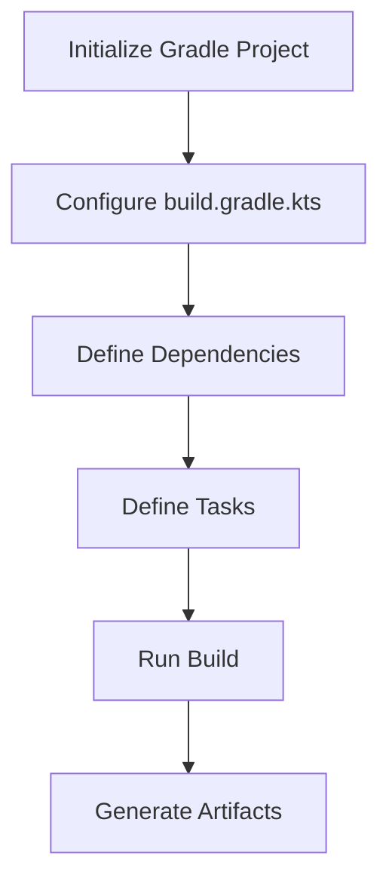
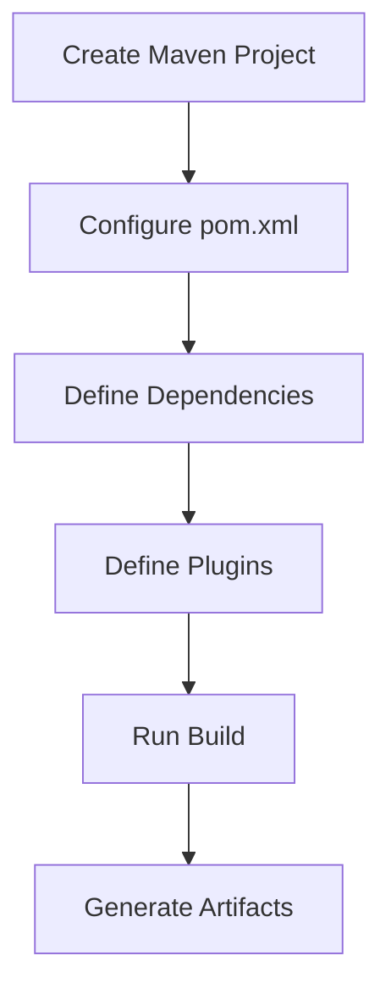

## 12.6 Build Tools

In the world of Kotlin development, build tools play a crucial role in automating tasks, managing dependencies, and ensuring seamless integration with the Java ecosystem. This section delves into the use of Gradle with Kotlin DSL and Maven for Kotlin projects, providing expert insights and practical examples to optimize your build process.

### Introduction to Build Tools

Build tools are essential for modern software development, automating the process of compiling source code, packaging binaries, running tests, and deploying applications. They help manage dependencies, ensure consistency across environments, and streamline the development workflow.

#### Key Concepts

- **Build Automation**: Automating repetitive tasks such as compiling code, packaging binaries, and running tests.
- **Dependency Management**: Handling external libraries and their versions to ensure compatibility and reduce conflicts.
- **Integration**: Seamlessly integrating with other tools and platforms, such as CI/CD pipelines and IDEs.

### Gradle with Kotlin DSL

Gradle is a powerful build automation tool that is widely used in the Java ecosystem. It offers flexibility and performance, making it a popular choice for Kotlin projects. The Kotlin DSL (Domain-Specific Language) for Gradle allows you to write build scripts using Kotlin, providing type safety and improved IDE support.

#### Why Use Kotlin DSL?

1. **Type Safety**: Kotlin DSL offers compile-time checks, reducing runtime errors and improving code reliability.
2. **IDE Support**: Enhanced code completion, refactoring, and navigation features in IDEs like IntelliJ IDEA.
3. **Readability**: Kotlin's concise syntax makes build scripts more readable and maintainable.

#### Setting Up Gradle with Kotlin DSL

To use Kotlin DSL in your Gradle project, you need to configure your `build.gradle.kts` file. Here's a step-by-step guide:

1. **Initialize a Gradle Project**: Use the following command to create a new Gradle project:

   ```bash
   gradle init --dsl kotlin
   ```

2. **Configure the `build.gradle.kts` File**: Define your project dependencies, plugins, and tasks.

   ```kotlin
   plugins {
       kotlin("jvm") version "1.8.0"
   }

   repositories {
       mavenCentral()
   }

   dependencies {
       implementation(kotlin("stdlib"))
   }
   ```

3. **Define Tasks**: Use Kotlin functions to define custom tasks.

   ```kotlin
   tasks.register("hello") {
       doLast {
           println("Hello, Kotlin DSL!")
       }
   }
   ```

#### Managing Dependencies

Gradle's dependency management is one of its strongest features. You can declare dependencies in your `build.gradle.kts` file, specifying the scope and version.

- **Implementation**: Used for dependencies required at compile time and runtime.

  ```kotlin
  dependencies {
      implementation("org.jetbrains.kotlin:kotlin-stdlib:1.8.0")
  }
  ```

- **Test Implementation**: Used for dependencies required only during testing.

  ```kotlin
  dependencies {
      testImplementation("org.jetbrains.kotlin:kotlin-test:1.8.0")
  }
  ```

#### Multi-Project Builds

Gradle supports multi-project builds, allowing you to manage complex projects with multiple modules.

- **Root Project**: Contains shared configurations and dependencies.

  ```kotlin
  // settings.gradle.kts
  include("moduleA", "moduleB")
  ```

- **Subprojects**: Each subproject has its own `build.gradle.kts` file.

  ```kotlin
  // moduleA/build.gradle.kts
  plugins {
      kotlin("jvm")
  }

  dependencies {
      implementation(project(":moduleB"))
  }
  ```

#### Visualizing Gradle Build Process



### Maven Support for Kotlin Projects

Maven is another popular build tool in the Java ecosystem, known for its convention-over-configuration approach. It provides a structured project layout and a vast repository of plugins and dependencies.

#### Why Use Maven for Kotlin?

1. **Mature Ecosystem**: Maven has a long history and a rich ecosystem of plugins and integrations.
2. **Convention Over Configuration**: Standardized project structure reduces configuration overhead.
3. **Integration**: Seamless integration with CI/CD tools and IDEs.

#### Setting Up Maven for Kotlin

To set up a Maven project for Kotlin, you need to configure the `pom.xml` file. Here's how:

1. **Create a Maven Project**: Use the following command to create a new Maven project:

   ```bash
   mvn archetype:generate -DgroupId=com.example -DartifactId=my-kotlin-app -DarchetypeArtifactId=maven-archetype-quickstart -DinteractiveMode=false
   ```

2. **Configure the `pom.xml` File**: Add the Kotlin plugin and dependencies.

   ```xml
   <project xmlns="http://maven.apache.org/POM/4.0.0"
            xmlns:xsi="http://www.w3.org/2001/XMLSchema-instance"
            xsi:schemaLocation="http://maven.apache.org/POM/4.0.0 http://maven.apache.org/xsd/maven-4.0.0.xsd">
       <modelVersion>4.0.0</modelVersion>
       <groupId>com.example</groupId>
       <artifactId>my-kotlin-app</artifactId>
       <version>1.0-SNAPSHOT</version>

       <properties>
           <kotlin.version>1.8.0</kotlin.version>
           <maven.compiler.source>1.8</maven.compiler.source>
           <maven.compiler.target>1.8</maven.compiler.target>
       </properties>

       <dependencies>
           <dependency>
               <groupId>org.jetbrains.kotlin</groupId>
               <artifactId>kotlin-stdlib</artifactId>
               <version>${kotlin.version}</version>
           </dependency>
       </dependencies>

       <build>
           <plugins>
               <plugin>
                   <groupId>org.jetbrains.kotlin</groupId>
                   <artifactId>kotlin-maven-plugin</artifactId>
                   <version>${kotlin.version}</version>
                   <executions>
                       <execution>
                           <goals>
                               <goal>compile</goal>
                               <goal>test-compile</goal>
                           </goals>
                       </execution>
                   </executions>
               </plugin>
           </plugins>
       </build>
   </project>
   ```

#### Managing Dependencies

Maven uses a centralized repository to manage dependencies, specified in the `pom.xml` file.

- **Dependencies**: Define dependencies with groupId, artifactId, and version.

  ```xml
  <dependency>
      <groupId>org.jetbrains.kotlin</groupId>
      <artifactId>kotlin-stdlib</artifactId>
      <version>1.8.0</version>
  </dependency>
  ```

- **Scopes**: Control the visibility and lifecycle of dependencies.

  - **Compile**: Default scope, available in all classpaths.
  - **Test**: Available only during testing.

#### Multi-Module Projects

Maven supports multi-module projects, allowing you to organize complex applications.

- **Parent POM**: Contains shared configurations and dependencies.

  ```xml
  <modules>
      <module>moduleA</module>
      <module>moduleB</module>
  </modules>
  ```

- **Child Modules**: Each module has its own `pom.xml` file.

  ```xml
  <parent>
      <groupId>com.example</groupId>
      <artifactId>my-kotlin-app</artifactId>
      <version>1.0-SNAPSHOT</version>
  </parent>
  ```

#### Visualizing Maven Build Process



### Comparing Gradle and Maven

Both Gradle and Maven have their strengths and are suitable for Kotlin projects. Here's a comparison to help you choose the right tool:

| Feature               | Gradle                                    | Maven                                  |
|-----------------------|-------------------------------------------|----------------------------------------|
| **Configuration**     | Flexible, script-based (Kotlin DSL)       | XML-based, convention over configuration |
| **Performance**       | Faster incremental builds                 | Slower due to XML parsing              |
| **Dependency Management** | Advanced features, dynamic versions   | Stable, mature ecosystem               |
| **IDE Support**       | Excellent with IntelliJ IDEA              | Good, widely supported                 |
| **Community**         | Growing, modern                           | Established, large                     |

### Best Practices for Using Build Tools

1. **Consistent Environments**: Use tools like Docker to ensure consistent build environments.
2. **Dependency Locking**: Lock dependency versions to avoid unexpected changes.
3. **Continuous Integration**: Integrate build tools with CI/CD pipelines for automated testing and deployment.
4. **Documentation**: Document build scripts and configurations for maintainability.

### Try It Yourself

Experiment with the following tasks to deepen your understanding of Gradle and Maven:

- Modify the Gradle build script to include a new dependency and observe the changes.
- Create a multi-module Maven project and configure shared dependencies.
- Compare the build times of a sample project using both Gradle and Maven.

### Conclusion

Mastering build tools like Gradle and Maven is essential for efficient Kotlin development. By leveraging the power of Kotlin DSL and Maven's mature ecosystem, you can streamline your build process, manage dependencies effectively, and integrate seamlessly with the Java ecosystem.

### Further Reading

- [Gradle Kotlin DSL Documentation](https://docs.gradle.org/current/userguide/kotlin_dsl.html)
- [Maven Official Documentation](https://maven.apache.org/guides/index.html)
- [Kotlin and Java Interoperability](https://kotlinlang.org/docs/java-interop.html)

## Quiz Time!



### What is the primary advantage of using Kotlin DSL with Gradle?

- [x] Type safety and improved IDE support
- [ ] Faster build times
- [ ] Reduced configuration complexity
- [ ] Better compatibility with Java

> **Explanation:** Kotlin DSL provides type safety and improved IDE support, making build scripts more reliable and easier to maintain.

### Which scope in Maven is used for dependencies required only during testing?

- [ ] Compile
- [x] Test
- [ ] Runtime
- [ ] Provided

> **Explanation:** The "Test" scope is used for dependencies that are only needed during the testing phase.

### What is a key feature of Gradle's dependency management?

- [x] Advanced features and dynamic versions
- [ ] XML-based configuration
- [ ] Limited to stable versions
- [ ] Manual dependency resolution

> **Explanation:** Gradle offers advanced dependency management features, including support for dynamic versions.

### In a multi-project Gradle build, where are shared configurations typically defined?

- [x] Root project
- [ ] Subprojects
- [ ] Individual task files
- [ ] Dependency files

> **Explanation:** Shared configurations in a multi-project Gradle build are typically defined in the root project.

### What is the main benefit of using Maven's convention over configuration approach?

- [x] Reduced configuration overhead
- [ ] Increased flexibility
- [ ] Faster build times
- [ ] Enhanced type safety

> **Explanation:** Maven's convention over configuration approach reduces the need for extensive configuration by following a standard project structure.

### Which build tool is known for faster incremental builds?

- [x] Gradle
- [ ] Maven
- [ ] Ant
- [ ] SBT

> **Explanation:** Gradle is known for its faster incremental builds, which improve performance.

### What is the purpose of dependency locking in build tools?

- [x] To avoid unexpected changes in dependencies
- [ ] To speed up the build process
- [ ] To improve IDE support
- [ ] To enhance type safety

> **Explanation:** Dependency locking ensures that the versions of dependencies remain consistent, avoiding unexpected changes.

### How can you ensure consistent build environments across different machines?

- [x] Use Docker
- [ ] Use different build tools
- [ ] Manually configure each environment
- [ ] Use only local dependencies

> **Explanation:** Docker can be used to create consistent build environments across different machines.

### Which tool provides a mature ecosystem and a large community?

- [ ] Gradle
- [x] Maven
- [ ] Ant
- [ ] SBT

> **Explanation:** Maven has a mature ecosystem and a large community, making it a popular choice for Java projects.

### True or False: Gradle's Kotlin DSL is XML-based.

- [ ] True
- [x] False

> **Explanation:** Gradle's Kotlin DSL is script-based, not XML-based. It uses Kotlin for defining build scripts.


