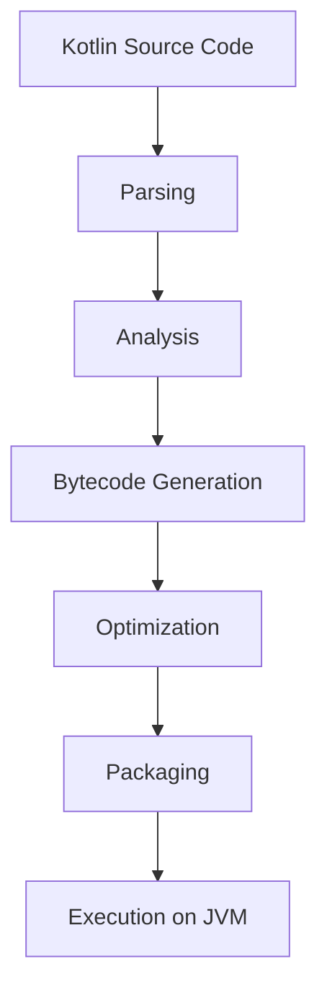

## 12.7 Bytecode and Decompilation

In this section, we delve into the fascinating world of Kotlin bytecode and decompilation. Understanding how Kotlin code is transformed into bytecode and executed on the Java Virtual Machine (JVM) is crucial for expert software engineers and architects. This knowledge not only aids in optimizing performance but also enhances interoperability with Java and other JVM languages.

### Introduction to Kotlin Bytecode

Kotlin, as a modern language, compiles to bytecode that runs on the JVM. This bytecode is a set of instructions that the JVM interprets or compiles to native machine code at runtime. The transformation from Kotlin source code to bytecode involves several stages, each of which can impact the performance and behavior of your application.

#### What is Bytecode?

Bytecode is an intermediate representation of your program, which is more abstract than machine code but lower-level than source code. It is designed to be executed by the JVM, making Java, Kotlin, and other JVM languages platform-independent. The JVM translates bytecode into machine code specific to the host machine, allowing the same bytecode to run on any device with a compatible JVM.

#### The Kotlin Compilation Process

The Kotlin compilation process involves several steps:

1. **Parsing**: The Kotlin compiler parses the source code into an Abstract Syntax Tree (AST).
2. **Analysis**: The AST is analyzed for semantic correctness, including type checking and symbol resolution.
3. **Bytecode Generation**: The compiler translates the AST into JVM bytecode.
4. **Optimization**: Various optimizations are applied to the bytecode to improve performance.
5. **Packaging**: The bytecode is packaged into a `.class` file or a JAR (Java Archive) for distribution.

### Analyzing Kotlin Bytecode

Understanding the bytecode generated by Kotlin can provide insights into the performance and behavior of your application. It can also help identify inefficiencies and potential areas for optimization.

#### Tools for Bytecode Inspection

Several tools can be used to inspect and analyze Kotlin bytecode:

- **javap**: A command-line tool that comes with the JDK, used to disassemble class files and view bytecode.
- **Kotlin Compiler**: The `-Xprint-` options allow you to view intermediate representations and bytecode.
- **IntelliJ IDEA**: Offers built-in support for viewing bytecode and decompiled code.
- **ASM**: A Java library for bytecode manipulation and analysis.

#### Using `javap` to Inspect Bytecode

The `javap` tool can be used to disassemble Kotlin-generated class files:

```bash
javap -c MyClass.class
```

This command outputs the bytecode instructions for `MyClass`, providing a detailed view of how Kotlin code is translated into JVM instructions.

### Performance Implications of Kotlin Bytecode

The performance of Kotlin applications can be influenced by how efficiently the bytecode is generated and executed. Understanding these implications can help in writing more performant Kotlin code.

#### Inline Functions and Performance

Kotlin's inline functions can reduce the overhead of function calls by embedding the function's bytecode directly into the caller's bytecode. This can lead to performance improvements, especially in high-frequency function calls.

#### Smart Casts and Type Checks

Kotlin's smart casts and type checks are optimized at the bytecode level to minimize performance overhead. The compiler generates efficient bytecode for these operations, often using JVM instructions like `checkcast` and `instanceof`.

#### Null Safety and Bytecode

Kotlin's null safety features are implemented through bytecode checks that ensure nullability constraints are respected at runtime. These checks can introduce some overhead, but they are crucial for maintaining the safety guarantees of Kotlin.

### Decompilation of Kotlin Bytecode

Decompilation is the process of converting bytecode back into a human-readable form. This can be useful for understanding how Kotlin code is executed on the JVM and for debugging purposes.

#### Tools for Decompilation

Several tools are available for decompiling Kotlin bytecode:

- **JD-GUI**: A graphical utility for viewing Java class files.
- **CFR**: A powerful command-line decompiler that supports Kotlin.
- **Procyon**: Another decompiler that can handle Kotlin bytecode.

#### Using JD-GUI for Decompilation

JD-GUI is a popular tool for decompiling Java and Kotlin bytecode. To use JD-GUI:

1. Open JD-GUI and load the `.class` file or JAR you wish to decompile.
2. Navigate through the decompiled source code to understand the bytecode's structure and logic.

### Visualizing Bytecode and Decompilation

To better understand the relationship between Kotlin code and the generated bytecode, let's visualize the process using a simple example.

#### Example: Kotlin Code to Bytecode

Consider the following Kotlin function:

```kotlin
fun add(a: Int, b: Int): Int {
    return a + b
}
```

The corresponding bytecode, when inspected using `javap`, might look like this:

```plaintext
public final int add(int, int);
  Code:
     0: iload_1
     1: iload_2
     2: iadd
     3: ireturn
```

#### Mermaid.js Diagram: Bytecode Execution Flow



*Figure 1: The process of compiling Kotlin source code into bytecode and executing it on the JVM.*

### Key Considerations for Bytecode and Decompilation

When working with Kotlin bytecode and decompilation, there are several important considerations to keep in mind:

- **Interoperability**: Ensure that the bytecode generated by Kotlin is compatible with Java and other JVM languages.
- **Performance**: Analyze the performance implications of the generated bytecode and optimize where necessary.
- **Security**: Be aware of the security implications of decompilation, as it can expose sensitive logic and data.
- **Obfuscation**: Consider using obfuscation tools to protect your bytecode from reverse engineering.

### Differences and Similarities with Java Bytecode

Kotlin bytecode is similar to Java bytecode in many respects, as both are designed to run on the JVM. However, there are some differences due to Kotlin's language features:

- **Null Safety**: Kotlin's null safety features are not present in Java, leading to additional bytecode instructions for null checks.
- **Coroutines**: Kotlin's coroutine support introduces additional bytecode constructs for managing asynchronous operations.
- **Extension Functions**: Kotlin's extension functions are compiled into static methods, which can be different from Java's method handling.

### Practical Exercises

To solidify your understanding of Kotlin bytecode and decompilation, try the following exercises:

1. **Inspect Bytecode**: Use `javap` to inspect the bytecode of a simple Kotlin program. Identify the bytecode instructions and their corresponding Kotlin statements.
2. **Decompile Bytecode**: Use JD-GUI to decompile a Kotlin class file and compare the decompiled code with the original source code.
3. **Optimize Bytecode**: Experiment with Kotlin's inline functions and observe the changes in the generated bytecode.

### Conclusion

Understanding Kotlin bytecode and decompilation is an essential skill for expert software engineers and architects. It enables you to optimize performance, ensure interoperability, and maintain security in your Kotlin applications. By mastering these concepts, you can write more efficient and robust Kotlin code.

Remember, this is just the beginning. As you progress, you'll uncover more advanced techniques and insights into Kotlin bytecode and decompilation. Keep experimenting, stay curious, and enjoy the journey!

## Quiz Time!



### What is bytecode?

- [x] An intermediate representation of code executed by the JVM.
- [ ] The source code written in Kotlin.
- [ ] Machine code specific to a processor.
- [ ] A high-level programming language.

> **Explanation:** Bytecode is an intermediate representation that the JVM interprets or compiles to native machine code at runtime.

### Which tool can be used to inspect Kotlin bytecode?

- [x] javap
- [ ] JD-GUI
- [ ] IntelliJ IDEA
- [ ] Procyon

> **Explanation:** `javap` is a command-line tool that disassembles class files to view bytecode.

### What is the purpose of inline functions in Kotlin?

- [x] To reduce the overhead of function calls.
- [ ] To increase the size of the bytecode.
- [ ] To make functions private.
- [ ] To add null safety.

> **Explanation:** Inline functions embed the function's bytecode directly into the caller's bytecode, reducing call overhead.

### How does Kotlin handle null safety in bytecode?

- [x] By adding bytecode checks for nullability constraints.
- [ ] By ignoring null values.
- [ ] By converting nulls to zero.
- [ ] By using Java's null handling.

> **Explanation:** Kotlin adds bytecode checks to ensure nullability constraints are respected at runtime.

### Which tool is used for decompiling Kotlin bytecode?

- [x] JD-GUI
- [ ] javap
- [ ] ASM
- [ ] Kotlin Compiler

> **Explanation:** JD-GUI is a graphical utility for viewing decompiled Java and Kotlin class files.

### What is the main benefit of decompiling bytecode?

- [x] Understanding how code is executed on the JVM.
- [ ] Increasing the size of the application.
- [ ] Obfuscating code.
- [ ] Compiling source code.

> **Explanation:** Decompiling bytecode helps understand the execution flow and logic of the code on the JVM.

### What does the `iload_1` instruction in bytecode do?

- [x] Loads an integer from the local variable at index 1.
- [ ] Stores an integer in the local variable at index 1.
- [ ] Adds two integers.
- [ ] Returns an integer.

> **Explanation:** `iload_1` loads an integer from the local variable at index 1 onto the operand stack.

### What is the role of the JVM in executing bytecode?

- [x] To interpret or compile bytecode to native machine code.
- [ ] To write bytecode.
- [ ] To convert bytecode to source code.
- [ ] To store bytecode in a database.

> **Explanation:** The JVM interprets or compiles bytecode to native machine code for execution.

### Which Kotlin feature introduces additional bytecode constructs?

- [x] Coroutines
- [ ] Data classes
- [ ] Smart casts
- [ ] Extension functions

> **Explanation:** Coroutines introduce additional bytecode constructs for managing asynchronous operations.

### True or False: Kotlin bytecode is identical to Java bytecode.

- [ ] True
- [x] False

> **Explanation:** While Kotlin bytecode is similar to Java bytecode, differences exist due to Kotlin's unique language features like null safety and coroutines.


