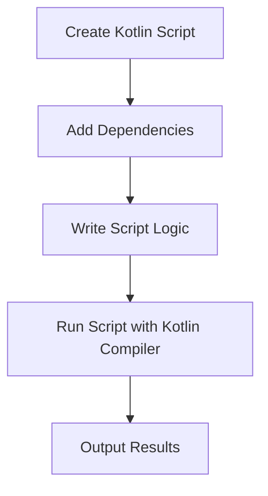

## 12.8 Kotlin Scripting

Kotlin scripting is an exciting feature that allows developers to leverage the expressive power of Kotlin for scripting tasks. This section delves into the world of Kotlin scripting, exploring its capabilities, use cases, and how it can be integrated into your development workflow. Whether you're automating tasks, building tools, or experimenting with new ideas, Kotlin scripting provides a flexible and powerful environment.

### Introduction to Kotlin Scripting

Kotlin scripting enables you to write scripts using the Kotlin language, allowing for quick prototyping and automation without the need for a full-fledged application. Scripts are typically used for tasks like automation, configuration, and data processing. Kotlin scripting combines the conciseness and safety of Kotlin with the flexibility of scripting languages.

#### Key Features of Kotlin Scripting

- **Conciseness**: Kotlin's concise syntax reduces boilerplate code, making scripts easier to write and maintain.
- **Type Safety**: Benefit from Kotlin's strong type system, reducing runtime errors.
- **Interoperability**: Seamlessly integrate with Java libraries and existing JVM infrastructure.
- **Tooling Support**: Use Kotlin scripting in various environments, including IntelliJ IDEA and command-line interfaces.

### Setting Up Kotlin Scripting

To start using Kotlin scripting, you need to set up your environment. This involves installing Kotlin and configuring your development tools.

#### Installing Kotlin

Kotlin can be installed as part of the IntelliJ IDEA or as a standalone command-line tool. Here's how to get started:

1. **Using IntelliJ IDEA**: If you use IntelliJ IDEA, Kotlin is included by default. You can create a new Kotlin script by selecting `File > New > Kotlin File/Class` and choosing `Script`.

2. **Command-Line Installation**: For command-line usage, download the Kotlin compiler from the [Kotlin website](https://kotlinlang.org/) and add it to your system's PATH.

#### Creating Your First Kotlin Script

Let's create a simple Kotlin script to print "Hello, Kotlin Scripting!":

```kotlin
// hello.kts
println("Hello, Kotlin Scripting!")
```

To run this script, use the Kotlin compiler from the command line:

```bash
kotlinc -script hello.kts
```

This command compiles and executes the script, displaying the output in your terminal.

### Advanced Scripting Features

Kotlin scripting offers advanced features that enhance its capabilities, making it suitable for complex scripting tasks.

#### Using Libraries in Scripts

Kotlin scripts can leverage external libraries, allowing you to reuse existing functionality. To include a library, use the `@file:DependsOn` annotation:

```kotlin
@file:DependsOn("com.squareup.okhttp3:okhttp:4.9.0")

import okhttp3.OkHttpClient
import okhttp3.Request

val client = OkHttpClient()
val request = Request.Builder().url("https://example.com").build()
val response = client.newCall(request).execute()
println(response.body?.string())
```

This script uses the OkHttp library to make an HTTP request. The `@file:DependsOn` annotation specifies the library dependency.

#### Scripting with Kotlin REPL

Kotlin's Read-Eval-Print Loop (REPL) is an interactive shell that allows you to execute Kotlin expressions in real-time. It's a great tool for experimentation and learning.

To start the Kotlin REPL, use the `kotlinc` command without any arguments:

```bash
kotlinc
```

You can then enter Kotlin expressions and see the results immediately:

```kotlin
>>> val greeting = "Hello, REPL!"
>>> println(greeting)
Hello, REPL!
```

### Automating Tasks with Kotlin Scripting

Kotlin scripting is ideal for automating repetitive tasks, such as file manipulation, data processing, and system administration.

#### File Manipulation

Let's write a script to list all files in a directory and print their names:

```kotlin
import java.io.File

val directory = File("path/to/directory")
directory.walk().forEach { file ->
    println(file.name)
}
```

This script uses Kotlin's standard library to traverse a directory and print the names of all files.

#### Data Processing

Kotlin scripting can be used for data processing tasks, such as reading and transforming data files. Here's an example of reading a CSV file and calculating the average of a column:

```kotlin
import java.io.File

val csvFile = File("data.csv")
val lines = csvFile.readLines()
val values = lines.drop(1).map { it.split(",")[1].toDouble() }
val average = values.average()
println("Average: $average")
```

This script reads a CSV file, extracts the second column, and calculates the average value.

### Integration with Build Tools

Kotlin scripting can be integrated with build tools like Gradle, enhancing build scripts with Kotlin's expressive syntax.

#### Gradle Kotlin DSL

Gradle's Kotlin DSL allows you to write build scripts in Kotlin, providing a type-safe and IDE-friendly alternative to Groovy. Here's a simple example of a Gradle build script using Kotlin DSL:

```kotlin
plugins {
    kotlin("jvm") version "1.8.0"
}

repositories {
    mavenCentral()
}

dependencies {
    implementation(kotlin("stdlib"))
}
```

This script sets up a Kotlin project with the necessary dependencies.

### Using Kotlin Scripting for Tooling

Kotlin scripting can be used to build custom tools and utilities, leveraging Kotlin's language features and library ecosystem.

#### Building a Command-Line Tool

Let's create a simple command-line tool using Kotlin scripting. This tool will count the number of words in a text file:

```kotlin
import java.io.File

if (args.isEmpty()) {
    println("Usage: kotlinc -script wordcount.kts <file>")
    return
}

val file = File(args[0])
val wordCount = file.readText().split("\\s+".toRegex()).size
println("Word count: $wordCount")
```

This script reads a file specified as a command-line argument and counts the words.

#### Developing a Custom DSL

Kotlin's support for Domain-Specific Languages (DSLs) can be extended to scripting, allowing you to create expressive scripts tailored to specific tasks. Here's an example of a simple DSL for building HTML:

```kotlin
fun html(init: HtmlBuilder.() -> Unit): String {
    val builder = HtmlBuilder()
    builder.init()
    return builder.toString()
}

class HtmlBuilder {
    private val elements = mutableListOf<String>()

    fun body(init: BodyBuilder.() -> Unit) {
        val body = BodyBuilder()
        body.init()
        elements.add("<body>${body}</body>")
    }

    override fun toString() = elements.joinToString("\n")
}

class BodyBuilder {
    private val elements = mutableListOf<String>()

    fun p(text: String) {
        elements.add("<p>$text</p>")
    }

    override fun toString() = elements.joinToString("\n")
}

val htmlContent = html {
    body {
        p("Hello, Kotlin DSL!")
        p("This is a paragraph.")
    }
}

println(htmlContent)
```

This script defines a simple DSL for generating HTML content, demonstrating Kotlin's capability for creating readable and expressive scripts.

### Visualizing Kotlin Scripting Workflow

To better understand the workflow of Kotlin scripting, let's visualize the process from script creation to execution.



**Diagram Description**: This flowchart illustrates the typical workflow for creating and executing a Kotlin script. It starts with creating the script, adding necessary dependencies, writing the script logic, running the script using the Kotlin compiler, and finally, outputting the results.

### Best Practices for Kotlin Scripting

To make the most of Kotlin scripting, consider the following best practices:

- **Keep Scripts Simple**: Focus on solving specific tasks. Avoid overcomplicating scripts with excessive logic.
- **Use Libraries Wisely**: Leverage existing libraries to reduce code duplication and improve script functionality.
- **Organize Code**: Use functions and classes to organize code, making scripts easier to read and maintain.
- **Document Scripts**: Add comments and documentation to explain the purpose and usage of scripts.
- **Test Scripts**: Regularly test scripts to ensure they work as expected and handle edge cases.

### Try It Yourself

Experiment with the provided examples by modifying them to suit your needs. Try adding new features, such as error handling or additional functionality. For instance, extend the word count script to ignore certain words or handle multiple files.

### Knowledge Check

To reinforce your understanding of Kotlin scripting, consider the following questions:

- How can you include external libraries in a Kotlin script?
- What are some use cases for Kotlin scripting in automation?
- How does Kotlin scripting integrate with build tools like Gradle?

### Conclusion

Kotlin scripting is a powerful tool for developers, offering a flexible and expressive environment for automation, tooling, and experimentation. By leveraging Kotlin's language features and library ecosystem, you can create efficient and maintainable scripts for a wide range of tasks. Remember, this is just the beginning. As you explore Kotlin scripting further, you'll discover new ways to enhance your development workflow and solve complex problems with ease.

## Quiz Time!



### What is the primary purpose of Kotlin scripting?

- [x] To automate tasks and build tools using Kotlin
- [ ] To replace Java for all JVM applications
- [ ] To compile Kotlin code into native binaries
- [ ] To create Android applications

> **Explanation:** Kotlin scripting is primarily used for automating tasks and building tools, leveraging Kotlin's expressive syntax and features.

### How can you include an external library in a Kotlin script?

- [x] Using the `@file:DependsOn` annotation
- [ ] Importing it directly in the script
- [ ] Adding it to the system's PATH
- [ ] Including it in a separate configuration file

> **Explanation:** The `@file:DependsOn` annotation is used to specify library dependencies in a Kotlin script.

### What is the Kotlin REPL used for?

- [x] Executing Kotlin expressions interactively
- [ ] Compiling Kotlin scripts into executables
- [ ] Debugging Kotlin applications
- [ ] Creating Android layouts

> **Explanation:** The Kotlin REPL (Read-Eval-Print Loop) is an interactive shell for executing Kotlin expressions in real-time.

### Which tool can you use to write build scripts in Kotlin?

- [x] Gradle Kotlin DSL
- [ ] Maven
- [ ] Ant
- [ ] Make

> **Explanation:** Gradle Kotlin DSL allows you to write build scripts in Kotlin, providing a type-safe and IDE-friendly alternative to Groovy.

### What is a common use case for Kotlin scripting?

- [x] Automating repetitive tasks
- [ ] Developing mobile applications
- [ ] Designing complex algorithms
- [ ] Building machine learning models

> **Explanation:** Kotlin scripting is commonly used for automating repetitive tasks, such as file manipulation and data processing.

### How do you run a Kotlin script from the command line?

- [x] Using the `kotlinc -script` command
- [ ] Using the `kotlin` command
- [ ] Using the `java` command
- [ ] Using the `gradle` command

> **Explanation:** The `kotlinc -script` command is used to compile and execute Kotlin scripts from the command line.

### What is a benefit of using Kotlin scripting for automation?

- [x] Type safety and concise syntax
- [ ] Faster execution than Java
- [ ] Native support for all operating systems
- [ ] Built-in support for machine learning

> **Explanation:** Kotlin scripting offers type safety and a concise syntax, making it ideal for automation tasks.

### How can Kotlin scripting be integrated with Gradle?

- [x] By using Gradle Kotlin DSL for build scripts
- [ ] By writing scripts in Groovy
- [ ] By using Maven plugins
- [ ] By creating custom Gradle tasks in Java

> **Explanation:** Gradle Kotlin DSL allows you to write build scripts in Kotlin, integrating Kotlin scripting with Gradle.

### What is a best practice for writing Kotlin scripts?

- [x] Keeping scripts simple and focused
- [ ] Using complex logic and multiple libraries
- [ ] Avoiding comments and documentation
- [ ] Writing scripts in multiple languages

> **Explanation:** Keeping scripts simple and focused is a best practice for writing maintainable Kotlin scripts.

### True or False: Kotlin scripting can only be used for JVM-based tasks.

- [ ] True
- [x] False

> **Explanation:** While Kotlin scripting is often used for JVM-based tasks, it can also be used for other purposes, such as automation and tooling, across different environments.


