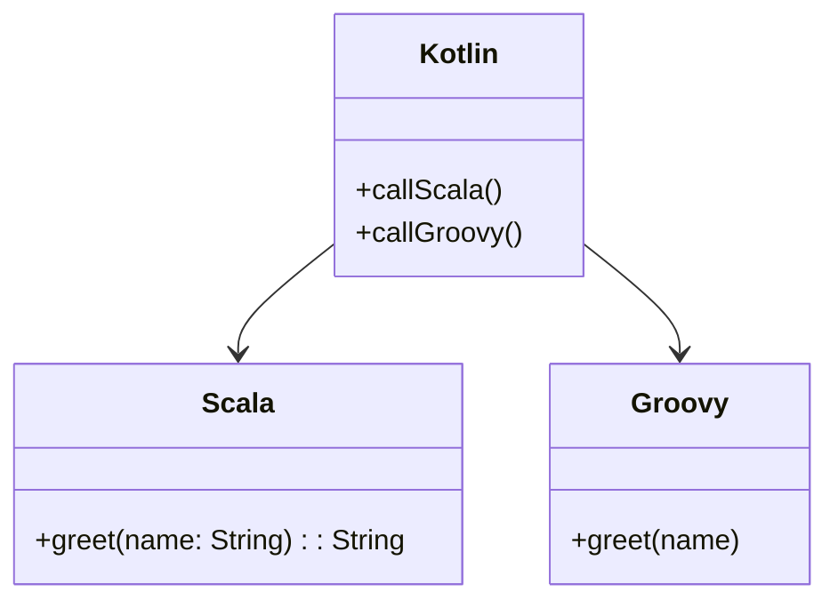

## 12.9 Integrating with JVM Languages

As a Kotlin developer, you are part of a rich ecosystem that includes a variety of JVM languages such as Java, Scala, and Groovy. Each of these languages has its own strengths and unique features, and integrating them can lead to more robust and flexible software solutions. In this section, we will explore how Kotlin can be integrated with these JVM languages, focusing on interoperability, multi-language project setups, and best practices.

### Understanding JVM Language Interoperability

The Java Virtual Machine (JVM) is a powerful platform that allows multiple languages to coexist and interact seamlessly. This interoperability is one of the JVM's greatest strengths, enabling developers to leverage the best features of each language. Let's delve into how Kotlin can be integrated with Scala and Groovy, two popular JVM languages.

#### Key Concepts in JVM Language Interoperability

1. **Bytecode Compatibility**: All JVM languages compile down to Java bytecode, which means they can run on the JVM and interact with each other at runtime.
2. **Inter-language Calls**: You can call functions and use classes from one JVM language in another, provided you handle language-specific constructs and idioms.
3. **Data Type Compatibility**: Understanding how data types map between languages is crucial for seamless integration.
4. **Build Tools and Configuration**: Tools like Gradle and Maven support multi-language projects, allowing you to configure and build projects that use multiple JVM languages.

### Integrating Kotlin with Scala

Scala is a JVM language that combines object-oriented and functional programming paradigms. It is known for its expressive syntax and powerful type system. Integrating Kotlin with Scala can enhance your project's flexibility and functionality.

#### Key Considerations for Kotlin-Scala Integration

- **Type System Compatibility**: Both Kotlin and Scala have advanced type systems. While Kotlin emphasizes null safety, Scala offers features like type inference and pattern matching. Understanding these differences is essential for smooth interoperability.
- **Functional Programming**: Scala's strong functional programming capabilities can complement Kotlin's support for higher-order functions and lambdas.
- **Library Usage**: Both languages have rich libraries. You can use Scala libraries in Kotlin projects and vice versa, but be mindful of language-specific idioms and conventions.

#### Code Example: Calling Scala from Kotlin

Let's look at a simple example where we call a Scala function from Kotlin.

Scala Code (`MyScalaClass.scala`):

```scala
class MyScalaClass {
  def greet(name: String): String = {
    s"Hello, $name from Scala!"
  }
}
```

Kotlin Code (`Main.kt`):

```kotlin
fun main() {
    val scalaObject = MyScalaClass()
    println(scalaObject.greet("Kotlin"))
}
```

In this example, we define a Scala class with a method `greet`. We then create an instance of this class in Kotlin and call the method, demonstrating basic interoperability.

#### Challenges and Solutions

- **Syntax Differences**: Scala's syntax can be quite different from Kotlin's, especially with constructs like pattern matching and implicit parameters. Familiarize yourself with these differences to avoid confusion.
- **Build Configuration**: Ensure your build tool (e.g., Gradle) is configured to handle both Kotlin and Scala source files. You may need to adjust source sets and dependencies accordingly.

### Integrating Kotlin with Groovy

Groovy is a dynamic language for the JVM known for its simplicity and ease of use. It is often used for scripting, testing, and building DSLs (Domain-Specific Languages).

#### Key Considerations for Kotlin-Groovy Integration

- **Dynamic vs. Static Typing**: Groovy is dynamically typed, while Kotlin is statically typed. This difference can affect how you pass data between the two languages.
- **Scripting and DSLs**: Groovy's scripting capabilities can be a powerful complement to Kotlin's concise syntax and static typing.
- **Testing**: Groovy's Spock framework is a popular choice for testing JVM applications and can be used alongside Kotlin.

#### Code Example: Calling Groovy from Kotlin

Let's see how we can call a Groovy script from Kotlin.

Groovy Code (`MyGroovyScript.groovy`):

```groovy
class MyGroovyClass {
    def greet(name) {
        return "Hello, $name from Groovy!"
    }
}
```

Kotlin Code (`Main.kt`):

```kotlin
fun main() {
    val groovyClass = MyGroovyClass()
    println(groovyClass.greet("Kotlin"))
}
```

Here, we define a simple Groovy class and call its method from Kotlin, demonstrating how the two languages can work together.

#### Challenges and Solutions

- **Dynamic Typing**: Be cautious with type conversions and nullability when interacting with Groovy code from Kotlin.
- **Gradle Integration**: Groovy is often used in Gradle build scripts. Ensure your build configuration supports both Kotlin and Groovy.

### Multi-language Projects

Integrating multiple JVM languages in a single project can provide significant advantages, such as leveraging the strengths of each language and fostering a more versatile codebase. However, it also introduces complexity in terms of project structure, build configuration, and team collaboration.

#### Best Practices for Multi-language Projects

1. **Clear Module Boundaries**: Define clear boundaries between modules written in different languages. This helps maintain separation of concerns and reduces the risk of language-specific issues.
2. **Consistent Build Configuration**: Use build tools like Gradle or Maven to manage dependencies and build processes consistently across languages.
3. **Code Style and Conventions**: Establish coding standards and conventions for each language to ensure consistency and readability.
4. **Cross-language Testing**: Implement comprehensive testing strategies that cover interactions between languages, including unit tests, integration tests, and end-to-end tests.

#### Example Project Structure

Here's an example of how you might structure a multi-language project using Kotlin, Scala, and Groovy:

```
my-multilang-project/
│
├── build.gradle
├── settings.gradle
│
├── src/
│   ├── main/
│   │   ├── kotlin/
│   │   │   └── com/example/kotlin/
│   │   │       └── Main.kt
│   │   │
│   │   ├── scala/
│   │   │   └── com/example/scala/
│   │   │       └── MyScalaClass.scala
│   │   │
│   │   └── groovy/
│   │       └── com/example/groovy/
│   │           └── MyGroovyClass.groovy
│
└─── test/
    ├── kotlin/
    ├── scala/
    └── groovy/
```

This structure separates source files by language, making it easier to manage and build the project.

### Visualizing JVM Language Integration

To better understand how Kotlin integrates with other JVM languages, let's visualize the interaction using a class diagram.



**Diagram Description**: This class diagram illustrates how a Kotlin class interacts with Scala and Groovy classes. The `Kotlin` class has methods to call functions from both `Scala` and `Groovy` classes, demonstrating interoperability.

### Try It Yourself

To deepen your understanding of JVM language integration, try modifying the code examples provided:

- **Extend the Scala class** to include additional methods and call them from Kotlin.
- **Add a new method** to the Groovy class that performs a different operation and invoke it from Kotlin.
- **Experiment with data types**: Pass complex data structures between Kotlin, Scala, and Groovy to see how they handle type conversions.

### References and Further Reading

- [Kotlin Official Documentation](https://kotlinlang.org/docs/reference/)
- [Scala Official Documentation](https://docs.scala-lang.org/)
- [Groovy Official Documentation](https://groovy-lang.org/documentation.html)
- [Gradle Multi-language Projects](https://docs.gradle.org/current/userguide/multi_project_builds.html)

### Knowledge Check

1. **What are the key considerations when integrating Kotlin with Scala?**
2. **How does Groovy's dynamic typing affect its integration with Kotlin?**
3. **What are some best practices for managing multi-language projects?**

### Conclusion

Integrating Kotlin with other JVM languages like Scala and Groovy opens up a world of possibilities for creating versatile and powerful applications. By understanding the nuances of each language and following best practices, you can harness the strengths of the JVM ecosystem to build robust, maintainable, and scalable software solutions. Remember, this is just the beginning. As you progress, you'll discover even more ways to leverage the power of JVM languages in your projects. Keep experimenting, stay curious, and enjoy the journey!

## Quiz Time!



### What is a key advantage of JVM language interoperability?

- [x] Ability to leverage the strengths of multiple languages
- [ ] Simplifies build configuration
- [ ] Reduces the need for testing
- [ ] Eliminates syntax differences

> **Explanation:** JVM language interoperability allows developers to leverage the strengths of multiple languages, enhancing the flexibility and functionality of software solutions.

### Which of the following is a challenge when integrating Kotlin with Scala?

- [ ] Dynamic typing
- [x] Syntax differences
- [ ] Lack of library support
- [ ] Incompatible build tools

> **Explanation:** Syntax differences between Kotlin and Scala can pose challenges during integration, requiring developers to familiarize themselves with language-specific constructs.

### How does Groovy's dynamic typing affect its integration with Kotlin?

- [x] Requires careful handling of type conversions
- [ ] Simplifies data exchange
- [ ] Eliminates the need for type checking
- [ ] Enhances performance

> **Explanation:** Groovy's dynamic typing requires careful handling of type conversions when interacting with Kotlin's statically typed system.

### What is a best practice for managing multi-language projects?

- [ ] Use a single module for all languages
- [x] Define clear module boundaries
- [ ] Avoid using build tools
- [ ] Minimize testing efforts

> **Explanation:** Defining clear module boundaries helps maintain separation of concerns and reduces the risk of language-specific issues in multi-language projects.

### Which build tool is commonly used for multi-language JVM projects?

- [x] Gradle
- [ ] Ant
- [ ] Make
- [ ] CMake

> **Explanation:** Gradle is a popular build tool that supports multi-language JVM projects, providing robust dependency management and build configuration capabilities.

### What is the primary focus of Groovy in the JVM ecosystem?

- [ ] Functional programming
- [ ] Static typing
- [x] Scripting and DSLs
- [ ] Low-level programming

> **Explanation:** Groovy is known for its simplicity and ease of use, making it a popular choice for scripting and building domain-specific languages (DSLs) in the JVM ecosystem.

### How can Kotlin and Scala complement each other in a project?

- [x] By combining Kotlin's null safety with Scala's functional programming capabilities
- [ ] By using Kotlin for scripting and Scala for testing
- [ ] By leveraging Kotlin's dynamic typing with Scala's static typing
- [ ] By using Scala for UI development and Kotlin for backend logic

> **Explanation:** Kotlin's null safety and Scala's functional programming capabilities can complement each other, enhancing a project's flexibility and functionality.

### What is a common use case for integrating Groovy with Kotlin?

- [ ] Building low-level system applications
- [ ] Developing high-performance games
- [x] Testing and scripting
- [ ] Implementing complex algorithms

> **Explanation:** Groovy is often used for testing and scripting in JVM applications, making it a common choice for integration with Kotlin in these contexts.

### Which of the following is a benefit of using multi-language projects?

- [x] Leveraging the strengths of each language
- [ ] Simplifying project structure
- [ ] Reducing the need for documentation
- [ ] Eliminating the need for testing

> **Explanation:** Multi-language projects allow developers to leverage the strengths of each language, enhancing the overall functionality and flexibility of the software.

### True or False: Kotlin can only be integrated with Java in the JVM ecosystem.

- [ ] True
- [x] False

> **Explanation:** Kotlin can be integrated with various JVM languages, including Scala and Groovy, not just Java.


