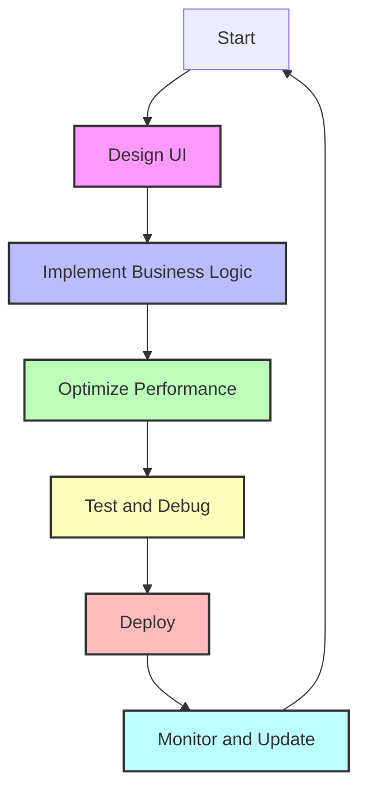

## 13.1 Best Practices for Android Development

In the rapidly evolving world of mobile development, creating efficient and responsive Android applications is crucial. Kotlin, with its modern language features and seamless integration with the Android ecosystem, offers a powerful toolset for developers. In this section, we will explore best practices for Android development using Kotlin, focusing on writing efficient, maintainable, and responsive applications.

### Introduction to Kotlin in Android Development

Kotlin has become the preferred language for Android development due to its concise syntax, safety features, and interoperability with Java. It allows developers to write more expressive and error-free code, leading to increased productivity and fewer bugs. Let's delve into some key Kotlin features that enhance Android development:

- **Null Safety:** Kotlin's type system eliminates null pointer exceptions, a common source of runtime crashes in Java.
- **Data Classes:** These provide a concise way to create classes that are primarily used to hold data.
- **Coroutines:** Kotlin coroutines simplify asynchronous programming, making it easier to write non-blocking code.

### Writing Efficient and Responsive Apps

To build efficient and responsive Android applications, developers must focus on optimizing performance, managing resources wisely, and ensuring a smooth user experience. Here are some best practices to achieve these goals:

#### 1. Leverage Kotlin's Null Safety

Null pointer exceptions are a notorious source of crashes in Android applications. Kotlin's null safety features help prevent these errors by distinguishing between nullable and non-nullable types. Use nullable types only when necessary and leverage Kotlin's safe call (`?.`) and Elvis operator (`?:`) to handle potential null values gracefully.

```kotlin
// Example of using safe calls and the Elvis operator
val length = nullableString?.length ?: 0
```

#### 2. Utilize Data Classes for Data Representation

Data classes in Kotlin provide a concise way to create classes that primarily hold data. They automatically generate useful methods such as `equals()`, `hashCode()`, and `toString()`, reducing boilerplate code.

```kotlin
// Example of a data class in Kotlin
data class User(val name: String, val age: Int)
```

#### 3. Optimize Performance with Coroutines

Kotlin coroutines offer a powerful way to handle asynchronous programming in Android. They allow you to write non-blocking code that is easy to read and maintain. Use coroutines to perform background tasks without blocking the main thread, ensuring a smooth user experience.

```kotlin
// Example of using coroutines for background tasks
fun fetchData() = CoroutineScope(Dispatchers.IO).launch {
    val data = fetchDataFromNetwork()
    withContext(Dispatchers.Main) {
        updateUI(data)
    }
}
```

#### 4. Minimize Memory Leaks

Memory leaks can severely impact the performance of Android applications. Use weak references and lifecycle-aware components to manage resources effectively. The `ViewModel` and `LiveData` components from Android Jetpack help manage UI-related data in a lifecycle-conscious way.

```kotlin
// Example of using ViewModel to manage UI-related data
class MyViewModel : ViewModel() {
    val data: LiveData<String> = MutableLiveData()
}
```

#### 5. Implement Efficient Layouts

Efficient layouts are crucial for responsive applications. Use `ConstraintLayout` to create complex layouts with a flat view hierarchy, reducing the time required to render the UI. Avoid deep nesting of views, which can lead to performance issues.

```xml
<!-- Example of a ConstraintLayout -->
<ConstraintLayout
    android:layout_width="match_parent"
    android:layout_height="match_parent">

    <TextView
        android:id="@+id/textView"
        android:layout_width="0dp"
        android:layout_height="wrap_content"
        app:layout_constraintStart_toStartOf="parent"
        app:layout_constraintEnd_toEndOf="parent"
        app:layout_constraintTop_toTopOf="parent"
        android:text="Hello, World!" />

</ConstraintLayout>
```

#### 6. Use RecyclerView for Efficient List Rendering

For displaying large data sets, use `RecyclerView` instead of `ListView`. `RecyclerView` is more flexible and efficient, providing features like view recycling and layout management.

```kotlin
// Example of setting up a RecyclerView
val recyclerView: RecyclerView = findViewById(R.id.recyclerView)
recyclerView.layoutManager = LinearLayoutManager(this)
recyclerView.adapter = MyAdapter(myDataset)
```

#### 7. Optimize Network Requests

Network requests can be a bottleneck in mobile applications. Use libraries like Retrofit and OkHttp to handle network operations efficiently. Implement caching strategies and reduce the number of network calls to improve performance.

```kotlin
// Example of using Retrofit for network requests
interface ApiService {
    @GET("users")
    suspend fun getUsers(): List<User>
}

val retrofit = Retrofit.Builder()
    .baseUrl("https://api.example.com/")
    .addConverterFactory(GsonConverterFactory.create())
    .build()

val service = retrofit.create(ApiService::class.java)
```

#### 8. Implement Caching Mechanisms

Caching can significantly improve the performance of your application by reducing the need for repeated network requests. Use libraries like Room for local data storage and implement caching strategies to store frequently accessed data.

```kotlin
// Example of using Room for local data storage
@Entity
data class User(
    @PrimaryKey val id: Int,
    val name: String
)

@Dao
interface UserDao {
    @Query("SELECT * FROM user")
    fun getAll(): List<User>

    @Insert
    fun insertAll(vararg users: User)
}

@Database(entities = [User::class], version = 1)
abstract class AppDatabase : RoomDatabase() {
    abstract fun userDao(): UserDao
}
```

#### 9. Use Dependency Injection

Dependency injection (DI) helps manage dependencies in a clean and scalable way. Use libraries like Dagger or Hilt to implement DI in your Android applications. DI promotes loose coupling and enhances testability.

```kotlin
// Example of using Hilt for dependency injection
@HiltAndroidApp
class MyApplication : Application()

@Module
@InstallIn(SingletonComponent::class)
object AppModule {
    @Provides
    fun provideApiService(): ApiService {
        return Retrofit.Builder()
            .baseUrl("https://api.example.com/")
            .addConverterFactory(GsonConverterFactory.create())
            .build()
            .create(ApiService::class.java)
    }
}
```

#### 10. Ensure Thread Safety

Concurrency issues can lead to unpredictable behavior and crashes. Use Kotlin's coroutines and structured concurrency to manage threads safely. Avoid using `GlobalScope` for launching coroutines and prefer using `CoroutineScope` tied to the lifecycle of your components.

```kotlin
// Example of using structured concurrency
class MyActivity : AppCompatActivity() {
    private val scope = CoroutineScope(Dispatchers.Main + Job())

    override fun onDestroy() {
        super.onDestroy()
        scope.cancel() // Cancel coroutines when the activity is destroyed
    }
}
```

### Visualizing Android Development Best Practices

To better understand the flow of Android development best practices, let's visualize the lifecycle of an Android application and how these practices fit into the development process.



### Try It Yourself

Experiment with the code examples provided in this section. Try modifying the `RecyclerView` adapter to display different data, or implement a caching strategy using Room. Explore the use of coroutines for handling network requests and see how it improves the responsiveness of your application.

### Knowledge Check

- How does Kotlin's null safety feature help prevent runtime crashes?
- What are the benefits of using data classes in Kotlin?
- How do coroutines improve the performance of Android applications?
- Why is it important to minimize memory leaks in Android development?
- What are the advantages of using `ConstraintLayout` for UI design?

### Embrace the Journey

Remember, mastering Android development with Kotlin is a continuous journey. As you apply these best practices, you'll build more efficient and responsive applications. Keep experimenting, stay curious, and enjoy the process of creating amazing Android apps!

### References and Links

- [Kotlin Documentation](https://kotlinlang.org/docs/home.html)
- [Android Developers Guide](https://developer.android.com/guide)
- [Jetpack Compose](https://developer.android.com/jetpack/compose)
- [Retrofit](https://square.github.io/retrofit/)
- [Room Persistence Library](https://developer.android.com/training/data-storage/room)

## Quiz Time!



### How does Kotlin's null safety feature help prevent runtime crashes?

- [x] By distinguishing between nullable and non-nullable types
- [ ] By automatically handling all null values
- [ ] By converting nulls to default values
- [ ] By eliminating the need for null checks

> **Explanation:** Kotlin's null safety feature helps prevent runtime crashes by distinguishing between nullable and non-nullable types, allowing developers to handle null values explicitly.

### What are the benefits of using data classes in Kotlin?

- [x] They reduce boilerplate code
- [x] They automatically generate useful methods like `equals()`, `hashCode()`, and `toString()`
- [ ] They improve application performance
- [ ] They enhance security

> **Explanation:** Data classes in Kotlin reduce boilerplate code by automatically generating useful methods like `equals()`, `hashCode()`, and `toString()`, making them ideal for data representation.

### How do coroutines improve the performance of Android applications?

- [x] By allowing non-blocking asynchronous programming
- [ ] By running tasks on the main thread
- [ ] By increasing CPU usage
- [ ] By simplifying UI design

> **Explanation:** Coroutines improve the performance of Android applications by allowing non-blocking asynchronous programming, which helps keep the main thread responsive.

### Why is it important to minimize memory leaks in Android development?

- [x] To improve application performance
- [x] To prevent crashes and slowdowns
- [ ] To enhance security
- [ ] To reduce code complexity

> **Explanation:** Minimizing memory leaks is important to improve application performance and prevent crashes and slowdowns, ensuring a smooth user experience.

### What are the advantages of using `ConstraintLayout` for UI design?

- [x] It reduces the view hierarchy depth
- [x] It provides a flexible way to design complex layouts
- [ ] It automatically optimizes performance
- [ ] It simplifies data binding

> **Explanation:** `ConstraintLayout` reduces the view hierarchy depth and provides a flexible way to design complex layouts, which can improve performance and maintainability.

### How can you manage dependencies effectively in Android applications?

- [x] By using dependency injection frameworks like Dagger or Hilt
- [ ] By hardcoding dependencies in each class
- [ ] By avoiding third-party libraries
- [ ] By using global variables

> **Explanation:** Managing dependencies effectively can be achieved by using dependency injection frameworks like Dagger or Hilt, which promote loose coupling and enhance testability.

### What is the role of `ViewModel` in Android development?

- [x] To manage UI-related data in a lifecycle-conscious way
- [ ] To handle network requests
- [ ] To design user interfaces
- [ ] To perform background tasks

> **Explanation:** `ViewModel` manages UI-related data in a lifecycle-conscious way, helping to prevent memory leaks and ensuring data survives configuration changes.

### How can you optimize network requests in Android applications?

- [x] By using libraries like Retrofit and OkHttp
- [x] By implementing caching strategies
- [ ] By increasing the number of requests
- [ ] By using synchronous requests

> **Explanation:** Optimizing network requests can be achieved by using libraries like Retrofit and OkHttp and implementing caching strategies to reduce the number of requests.

### What is the benefit of using `RecyclerView` over `ListView`?

- [x] `RecyclerView` is more flexible and efficient
- [ ] `RecyclerView` automatically handles all data binding
- [ ] `RecyclerView` is easier to implement
- [ ] `RecyclerView` requires less code

> **Explanation:** `RecyclerView` is more flexible and efficient than `ListView`, providing features like view recycling and layout management.

### True or False: Kotlin's coroutines can be used to perform background tasks without blocking the main thread.

- [x] True
- [ ] False

> **Explanation:** True. Kotlin's coroutines can be used to perform background tasks without blocking the main thread, ensuring a responsive user interface.


