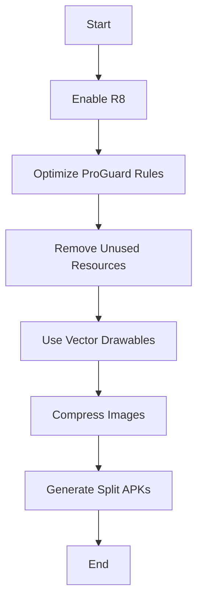
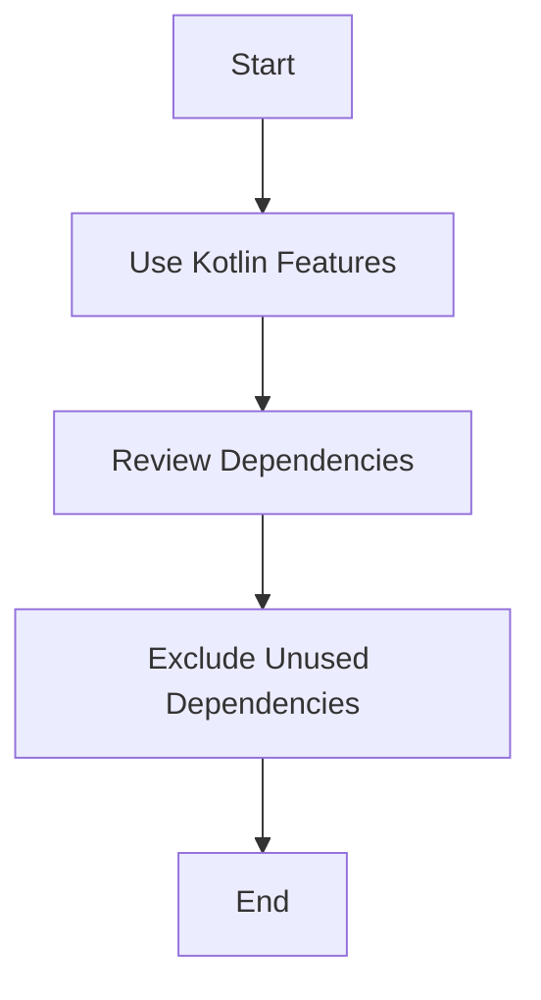

## 13.10 Performance Optimization

In the world of Android development, performance optimization is crucial for delivering a smooth and efficient user experience. As expert software engineers and architects, we must ensure our applications are not only functional but also optimized for performance. This section delves into the intricacies of profiling Android apps, reducing APK size, and minimizing method count, all within the context of Kotlin development.

### Introduction to Performance Optimization

Performance optimization in Android is a multifaceted process that involves analyzing and improving various aspects of an application. The goal is to enhance the app's responsiveness, reduce resource consumption, and ensure a seamless user experience. Let's explore the key areas of focus:

1. **Profiling**: Understanding the app's behavior and identifying bottlenecks.
2. **Reducing APK Size**: Minimizing the size of the application package to improve download times and storage usage.
3. **Minimizing Method Count**: Keeping the method count under control to avoid hitting the 64K method limit in Android.

### Profiling Android Apps

Profiling is the process of analyzing an application's runtime behavior to identify performance bottlenecks. It involves monitoring CPU usage, memory consumption, network activity, and more. Android Studio provides several tools to assist in profiling:

#### Android Profiler

The Android Profiler in Android Studio is a powerful tool that provides real-time data on CPU, memory, network, and energy usage. Here's how to use it effectively:

- **CPU Profiler**: Analyze CPU usage to identify methods consuming excessive processing power. Use the CPU Profiler to record method traces and visualize call stacks.
  
  ```kotlin
  // Example of a CPU-intensive operation
  fun calculateFactorial(n: Int): Long {
      return if (n == 1) 1 else n * calculateFactorial(n - 1)
  }
  ```

- **Memory Profiler**: Detect memory leaks and excessive allocations. The Memory Profiler helps track object allocations and garbage collection events.

- **Network Profiler**: Monitor network requests and responses to ensure efficient data usage. The Network Profiler displays request timelines and payload sizes.

- **Energy Profiler**: Evaluate the app's impact on battery life by analyzing energy consumption patterns.

#### Systrace

Systrace is a system-wide tracing tool that provides a detailed view of an app's performance. It captures data from the Android kernel and provides insights into CPU scheduling, disk activity, and more.

```shell
adb shell atrace --async_start -b 4096 -c -t 10 gfx view wm am
```

### Reducing APK Size

A smaller APK size leads to faster downloads and installations, making it crucial for user retention. Here are strategies to reduce APK size:

#### Code Shrinking with R8

R8 is a code shrinker and obfuscator that reduces the size of your APK by removing unused code and resources. It replaces the older ProGuard tool and offers better performance.

- **Enable R8**: Ensure R8 is enabled in your `build.gradle` file:

  ```groovy
  android {
      buildTypes {
          release {
              minifyEnabled true
              proguardFiles getDefaultProguardFile('proguard-android-optimize.txt'), 'proguard-rules.pro'
          }
      }
  }
  ```

- **Optimize ProGuard Rules**: Customize ProGuard rules to exclude unnecessary code and libraries.

#### Resource Optimization

- **Remove Unused Resources**: Use the `lint` tool to identify and remove unused resources.
  
- **Use Vector Drawables**: Replace raster images with vector drawables to reduce the size of drawable resources.

- **Split APKs**: Use the Android App Bundle to generate APKs for different device configurations, reducing the overall size.

#### Image Compression

- **Compress Images**: Use tools like `pngquant` or `ImageOptim` to compress images without losing quality.
  
- **WebP Format**: Convert images to WebP format, which offers better compression than PNG or JPEG.

### Minimizing Method Count

Android applications have a method limit of 64K due to the constraints of the DEX file format. Exceeding this limit requires enabling multidex, which can impact performance. Here are strategies to minimize method count:

#### Use Kotlin Features

Kotlin offers several features that help reduce method count:

- **Extension Functions**: Use extension functions to add functionality without increasing class size.

  ```kotlin
  // Extension function example
  fun String.isPalindrome(): Boolean {
      return this == this.reversed()
  }
  ```

- **Data Classes**: Use data classes to automatically generate boilerplate code like `equals()`, `hashCode()`, and `toString()`.

- **Lambda Expressions**: Replace anonymous inner classes with lambda expressions to reduce method count.

#### Optimize Dependencies

- **Review Dependencies**: Regularly review and update dependencies to ensure you're using the most efficient versions.

- **Exclude Unused Transitive Dependencies**: Use Gradle's `exclude` feature to remove unnecessary transitive dependencies.

  ```groovy
  dependencies {
      implementation('com.example:library:1.0') {
          exclude group: 'com.unused', module: 'unused-module'
      }
  }
  ```

### Code Examples and Best Practices

Let's explore some code examples and best practices for performance optimization in Kotlin:

#### Example: Efficient Data Handling

Efficient data handling is crucial for performance. Use Kotlin's collections and sequences to process data lazily:

```kotlin
// Using sequences for lazy evaluation
val numbers = (1..1000000).asSequence()
    .filter { it % 2 == 0 }
    .map { it * 2 }
    .toList()
```

#### Example: Avoiding Memory Leaks

Memory leaks can degrade performance over time. Use weak references and lifecycle-aware components to prevent leaks:

```kotlin
// Using a weak reference to avoid memory leaks
class MyActivity : AppCompatActivity() {
    private var myListener: MyListener? = null

    override fun onCreate(savedInstanceState: Bundle?) {
        super.onCreate(savedInstanceState)
        myListener = MyListener(this)
    }

    override fun onDestroy() {
        super.onDestroy()
        myListener = null
    }
}
```

### Visualizing Performance Optimization

To better understand the process of performance optimization, let's visualize the key components using Mermaid.js diagrams.

#### Diagram: APK Size Reduction Workflow



*Caption: A workflow diagram illustrating the steps to reduce APK size.*

#### Diagram: Method Count Optimization



*Caption: A diagram showing the process of optimizing method count.*

### References and Further Reading

- [Android Developers: Performance](https://developer.android.com/topic/performance)
- [Kotlin Documentation](https://kotlinlang.org/docs/home.html)
- [Android Studio Profilers](https://developer.android.com/studio/profile)

### Knowledge Check

Before we wrap up, let's reinforce what we've learned with a few questions:

1. What is the purpose of the Android Profiler?
2. How does R8 help in reducing APK size?
3. Why is it important to minimize method count in Android apps?

### Embrace the Journey

Remember, performance optimization is an ongoing process. As you continue to develop Android applications, keep experimenting with different techniques, stay curious, and enjoy the journey of creating efficient and responsive apps.

## Quiz Time!



### What is the primary goal of performance optimization in Android apps?

- [x] Enhance user experience by improving app responsiveness and reducing resource consumption.
- [ ] Increase the number of features in the app.
- [ ] Simplify the codebase.
- [ ] Reduce the number of developers needed.

> **Explanation:** The primary goal of performance optimization is to enhance the user experience by improving app responsiveness and reducing resource consumption.

### Which tool in Android Studio provides real-time data on CPU, memory, network, and energy usage?

- [x] Android Profiler
- [ ] Systrace
- [ ] Logcat
- [ ] ADB

> **Explanation:** The Android Profiler provides real-time data on CPU, memory, network, and energy usage.

### What is the purpose of R8 in Android development?

- [x] To shrink and obfuscate code, reducing APK size.
- [ ] To increase the number of methods in the app.
- [ ] To enhance the app's UI.
- [ ] To improve network performance.

> **Explanation:** R8 is used to shrink and obfuscate code, thereby reducing the APK size.

### How can you reduce the number of methods in an Android app?

- [x] Use Kotlin features like extension functions and data classes.
- [ ] Increase the number of dependencies.
- [ ] Use larger images.
- [ ] Avoid using lambda expressions.

> **Explanation:** Using Kotlin features like extension functions and data classes helps reduce the number of methods in an Android app.

### Which format offers better compression for images compared to PNG or JPEG?

- [x] WebP
- [ ] BMP
- [ ] TIFF
- [ ] GIF

> **Explanation:** WebP format offers better compression for images compared to PNG or JPEG.

### What is a common cause of memory leaks in Android apps?

- [x] Holding references to activities or contexts.
- [ ] Using small images.
- [ ] Optimizing network requests.
- [ ] Reducing APK size.

> **Explanation:** Holding references to activities or contexts can cause memory leaks in Android apps.

### Which of the following is not a method to reduce APK size?

- [ ] Enable R8
- [ ] Use vector drawables
- [ ] Compress images
- [x] Increase method count

> **Explanation:** Increasing method count does not reduce APK size; it can actually increase it.

### What is the benefit of using sequences in Kotlin?

- [x] They allow for lazy evaluation, improving performance.
- [ ] They increase the size of the APK.
- [ ] They make the code harder to read.
- [ ] They reduce the number of available methods.

> **Explanation:** Sequences allow for lazy evaluation, which can improve performance by processing data only as needed.

### How can you prevent memory leaks in Android apps?

- [x] Use weak references and lifecycle-aware components.
- [ ] Increase the number of activities.
- [ ] Use larger images.
- [ ] Avoid using lambda expressions.

> **Explanation:** Using weak references and lifecycle-aware components helps prevent memory leaks in Android apps.

### True or False: Profiling is only necessary during the initial development phase of an app.

- [ ] True
- [x] False

> **Explanation:** Profiling is an ongoing process and should be done throughout the app's lifecycle to continuously identify and resolve performance issues.


