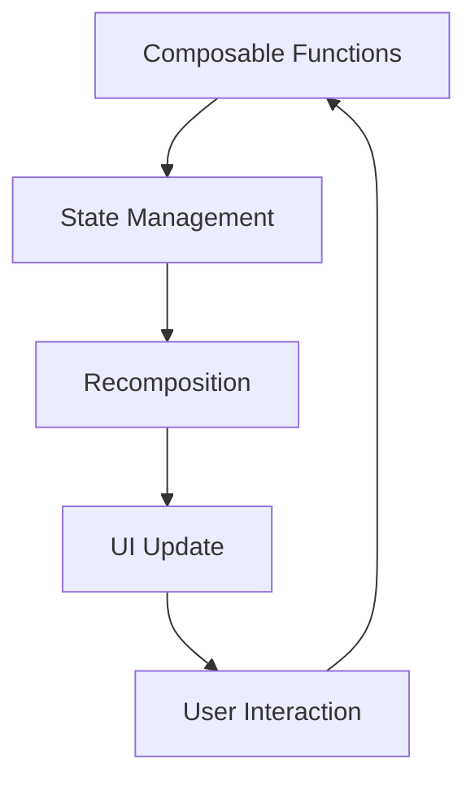

## 13.11 Jetpack Compose

Jetpack Compose is a modern toolkit for building native Android UIs with a declarative approach. It simplifies and accelerates UI development on Android with less code, powerful tools, and intuitive Kotlin APIs. In this section, we will delve into the core concepts of Jetpack Compose, its integration with existing projects, and how it leverages Kotlin's features to provide a seamless UI development experience.

### Introduction to Jetpack Compose

Jetpack Compose represents a paradigm shift in Android UI development. Unlike the traditional imperative approach, where developers manipulate UI components directly, Compose adopts a declarative style. This means you describe the UI in terms of what it should look like, and Compose takes care of the rest.

#### Key Concepts

- **Declarative UI**: Define what the UI should look like for a given state, and Compose will update the UI automatically when the state changes.
- **Composable Functions**: The building blocks of a Compose UI. These are Kotlin functions annotated with `@Composable` that describe the UI.
- **State Management**: Compose provides tools to manage state efficiently, ensuring that the UI updates in response to state changes.
- **Recomposition**: Compose intelligently updates only the parts of the UI that need to change, improving performance.

### Getting Started with Jetpack Compose

To start using Jetpack Compose, you need to set up your Android project with the necessary dependencies. Here’s a quick guide to getting started:

1. **Add Dependencies**: Ensure your `build.gradle` file includes the Compose dependencies.

   ```kotlin
   dependencies {
       implementation("androidx.compose.ui:ui:1.0.0")
       implementation("androidx.compose.material:material:1.0.0")
       implementation("androidx.compose.ui:ui-tooling:1.0.0")
   }
   ```

2. **Enable Compose**: In your `build.gradle` file, enable Jetpack Compose.

   ```kotlin
   android {
       buildFeatures {
           compose true
       }
       composeOptions {
           kotlinCompilerExtensionVersion = "1.0.0"
       }
   }
   ```

3. **Set Up Your Environment**: Use Android Studio Arctic Fox or later, which provides full support for Compose.

### Building Your First Compose UI

Let's build a simple UI with Jetpack Compose. We'll create a basic app that displays a greeting message.

#### Composable Functions

Composable functions are the core of Jetpack Compose. They are annotated with `@Composable` and can be combined to build complex UIs.

```kotlin
@Composable
fun Greeting(name: String) {
    Text(text = "Hello, $name!")
}
```

#### Setting Up the UI

To display the `Greeting` composable, use the `setContent` function in your `Activity`.

```kotlin
class MainActivity : ComponentActivity() {
    override fun onCreate(savedInstanceState: Bundle?) {
        super.onCreate(savedInstanceState)
        setContent {
            Greeting(name = "World")
        }
    }
}
```

### Understanding State in Jetpack Compose

State is a fundamental concept in Jetpack Compose. It determines what is displayed on the screen at any given time. Compose provides several ways to manage state:

- **State Hoisting**: Move state up to a common ancestor to share it between composables.
- **State Management Libraries**: Use libraries like `ViewModel` or `LiveData` for more complex state management.

#### Example: Counter App

Let's build a simple counter app to understand state management in Compose.

```kotlin
@Composable
fun Counter() {
    var count by remember { mutableStateOf(0) }

    Column(
        horizontalAlignment = Alignment.CenterHorizontally,
        verticalArrangement = Arrangement.Center
    ) {
        Text(text = "Count: $count")
        Button(onClick = { count++ }) {
            Text("Increment")
        }
    }
}
```

### Recomposition and Performance

Compose optimizes UI updates through recomposition, only redrawing parts of the UI that have changed. This results in efficient and performant applications.

#### Key Points

- **Immutable State**: Use immutable state objects to ensure predictable recompositions.
- **Derived State**: Use `derivedStateOf` to compute values that depend on other state objects.

### Integrating Jetpack Compose with Existing Projects

Jetpack Compose can be integrated into existing Android projects, allowing you to incrementally adopt Compose.

#### Interoperability with Views

Compose provides `AndroidView` and `ComposeView` to integrate with traditional Android Views.

```kotlin
@Composable
fun AndroidViewExample() {
    AndroidView(factory = { context ->
        TextView(context).apply {
            text = "This is an Android View"
        }
    })
}
```

### Advanced Compose Concepts

Jetpack Compose offers advanced features that enable developers to build complex UIs.

#### Custom Layouts

Compose allows you to create custom layouts using the `Layout` composable.

```kotlin
@Composable
fun CustomLayout(
    modifier: Modifier = Modifier,
    content: @Composable () -> Unit
) {
    Layout(
        content = content,
        modifier = modifier
    ) { measurables, constraints ->
        // Measure and position children here
    }
}
```

#### Animations

Compose provides a rich set of APIs for animations, making it easy to add motion to your UI.

```kotlin
@Composable
fun AnimatedVisibilityExample() {
    var visible by remember { mutableStateOf(true) }

    AnimatedVisibility(visible = visible) {
        Text("Hello, World!")
    }
}
```

### Design Patterns in Jetpack Compose

Jetpack Compose encourages the use of design patterns that promote clean, maintainable code.

#### MVVM with Compose

Compose integrates well with the MVVM (Model-View-ViewModel) pattern, leveraging `ViewModel` for state management.

```kotlin
class MyViewModel : ViewModel() {
    private val _uiState = MutableLiveData<String>("Initial State")
    val uiState: LiveData<String> = _uiState

    fun updateState(newState: String) {
        _uiState.value = newState
    }
}

@Composable
fun MyScreen(viewModel: MyViewModel = viewModel()) {
    val uiState by viewModel.uiState.observeAsState("")

    Text(text = uiState)
}
```

### Best Practices for Jetpack Compose

- **Keep Composables Small**: Break down UI into small, reusable composables.
- **Use State Effectively**: Manage state efficiently to avoid unnecessary recompositions.
- **Leverage Previews**: Use Android Studio's preview feature to visualize composables without running the app.

### Try It Yourself

Experiment with the code examples provided. Try modifying the `Greeting` composable to accept a list of names and display a greeting for each. Explore how state changes affect recomposition in the `Counter` app.

### Visualizing Jetpack Compose Architecture

Below is a diagram illustrating the architecture of Jetpack Compose, showing how composables interact with the state and UI.



### References and Further Reading

- [Jetpack Compose Documentation](https://developer.android.com/jetpack/compose/documentation)
- [Kotlin Official Website](https://kotlinlang.org/)
- [Android Developers Blog](https://android-developers.googleblog.com/)

### Knowledge Check

- What is the primary advantage of using Jetpack Compose over traditional Android Views?
- How does Jetpack Compose handle state changes in the UI?
- Explain the concept of recomposition in Jetpack Compose.

### Embrace the Journey

Jetpack Compose opens up new possibilities for Android developers, making UI development more intuitive and efficient. As you explore Compose, remember that this is just the beginning. Keep experimenting, stay curious, and enjoy the journey of building modern Android UIs with Kotlin!

## Quiz Time!



### What is the primary advantage of Jetpack Compose?

- [x] Declarative UI development
- [ ] Faster compilation times
- [ ] Larger APK sizes
- [ ] More complex code

> **Explanation:** Jetpack Compose allows for declarative UI development, simplifying the process of creating and updating UI components.

### How does Jetpack Compose handle state changes?

- [x] Through recomposition
- [ ] By restarting the application
- [ ] By using XML layouts
- [ ] By manually updating views

> **Explanation:** Jetpack Compose uses recomposition to efficiently update only the parts of the UI that need to change when the state changes.

### What annotation is used for composable functions?

- [x] @Composable
- [ ] @ComposableFunction
- [ ] @Jetpack
- [ ] @UI

> **Explanation:** The `@Composable` annotation is used to define composable functions in Jetpack Compose.

### Which component allows integration of traditional Android Views in Compose?

- [x] AndroidView
- [ ] ComposeView
- [ ] ViewGroup
- [ ] FrameLayout

> **Explanation:** `AndroidView` is used to integrate traditional Android Views within a Jetpack Compose UI.

### What is the role of `remember` in Jetpack Compose?

- [x] To store state across recompositions
- [ ] To create animations
- [ ] To define layouts
- [ ] To manage dependencies

> **Explanation:** `remember` is used in Jetpack Compose to store state across recompositions, ensuring that the state is retained.

### Which pattern is commonly used with Jetpack Compose for state management?

- [x] MVVM
- [ ] MVC
- [ ] Singleton
- [ ] Observer

> **Explanation:** The MVVM pattern is commonly used with Jetpack Compose, leveraging `ViewModel` for managing UI-related data.

### What tool is recommended for visualizing composables without running the app?

- [x] Android Studio's preview feature
- [ ] XML layout editor
- [ ] Logcat
- [ ] Emulator

> **Explanation:** Android Studio's preview feature allows developers to visualize composables without running the app, enhancing productivity.

### What is the purpose of `AnimatedVisibility` in Jetpack Compose?

- [x] To animate the appearance and disappearance of UI elements
- [ ] To create static layouts
- [ ] To manage state
- [ ] To handle user input

> **Explanation:** `AnimatedVisibility` is used to animate the appearance and disappearance of UI elements in Jetpack Compose.

### Can Jetpack Compose be integrated into existing projects?

- [x] True
- [ ] False

> **Explanation:** Jetpack Compose can be integrated into existing Android projects, allowing developers to incrementally adopt Compose.

### What is the recommended way to manage complex state in Jetpack Compose?

- [x] Using ViewModel and LiveData
- [ ] Using XML layouts
- [ ] Using static variables
- [ ] Using global state

> **Explanation:** For managing complex state in Jetpack Compose, it is recommended to use `ViewModel` and `LiveData` to ensure a clean separation of concerns.


