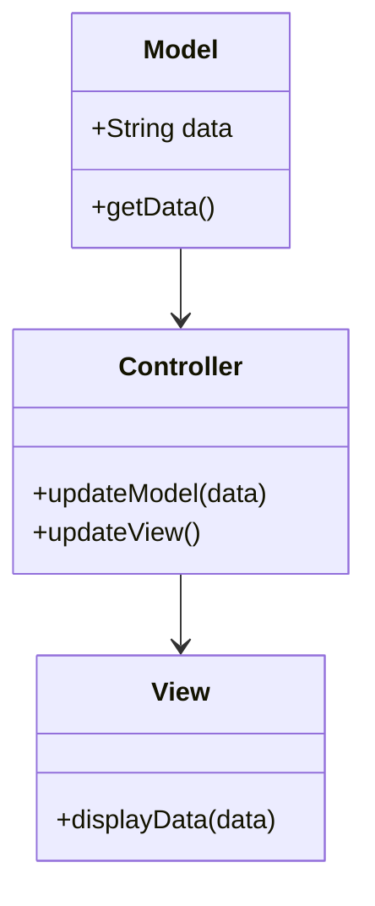
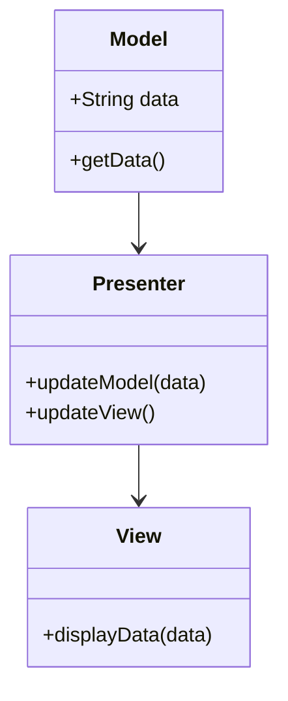
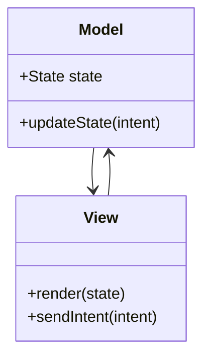

## 13.12 Android Architecture Patterns

In the realm of Android development, choosing the right architecture pattern is crucial for building scalable, maintainable, and testable applications. The three most prominent patterns are Model-View-Controller (MVC), Model-View-Presenter (MVP), and Model-View-Intent (MVI). Each pattern has its own strengths and weaknesses, and understanding these can help you select the best fit for your project.

### Understanding Architecture Patterns

Before diving into each pattern, let's clarify what an architecture pattern is. In software engineering, an architecture pattern provides a fundamental structure for software systems. It defines the organization of components, their interactions, and the responsibilities of each part. This helps in managing complexity, improving code reusability, and facilitating testing.

### Model-View-Controller (MVC)

#### Intent

The MVC pattern divides an application into three interconnected components:

- **Model**: Manages the data and business logic.
- **View**: Displays the data and sends user commands to the controller.
- **Controller**: Acts as an intermediary between Model and View, handling user input and updating the Model.

#### Key Participants

- **Model**: Represents the data and the rules that govern access to and updates of this data.
- **View**: Represents the UI components that display the data.
- **Controller**: Handles the input from the View and updates the Model accordingly.

#### Applicability

Use MVC when you want to separate the internal representations of information from the ways information is presented and accepted by the user.

#### Sample Code Snippet

```kotlin
// Model
data class User(val name: String, val age: Int)

// View
class UserView {
    fun printUserDetails(userName: String, userAge: Int) {
        println("User: $userName, Age: $userAge")
    }
}

// Controller
class UserController(private val model: User, private val view: UserView) {
    fun updateView() {
        view.printUserDetails(model.name, model.age)
    }
}
```

#### Design Considerations

- **Advantages**: Clear separation of concerns, easier to manage complexity.
- **Disadvantages**: Can lead to tight coupling between View and Controller.

#### Differences and Similarities

MVC is often confused with MVP. The primary difference is that in MVC, the Controller is more of a mediator, while in MVP, the Presenter has more control over the View.

### Model-View-Presenter (MVP)

#### Intent

MVP is an evolution of MVC, where the Presenter takes on a more active role in managing the View.

#### Key Participants

- **Model**: Similar to MVC, it holds the data and business logic.
- **View**: Displays data and routes user commands to the Presenter.
- **Presenter**: Retrieves data from the Model, applies logic, and updates the View.

#### Applicability

MVP is suitable for applications with complex user interfaces and logic that need to be unit tested.

#### Sample Code Snippet

```kotlin
// Model
data class User(val name: String, val age: Int)

// View Interface
interface UserView {
    fun showUserDetails(userName: String, userAge: Int)
}

// Presenter
class UserPresenter(private val view: UserView, private val model: User) {
    fun updateView() {
        view.showUserDetails(model.name, model.age)
    }
}

// View Implementation
class UserActivity : UserView {
    private val presenter = UserPresenter(this, User("John Doe", 30))

    override fun showUserDetails(userName: String, userAge: Int) {
        println("User: $userName, Age: $userAge")
    }
}
```

#### Design Considerations

- **Advantages**: Better separation of concerns, easier to test.
- **Disadvantages**: Can lead to more boilerplate code.

#### Differences and Similarities

MVP and MVC both separate concerns, but MVP provides a more testable architecture by isolating the View from the Presenter.

### Model-View-Intent (MVI)

#### Intent

MVI is a reactive architecture pattern that emphasizes unidirectional data flow and state management.

#### Key Participants

- **Model**: Represents the state of the application.
- **View**: Renders the state and sends user intents to the Model.
- **Intent**: Represents the user's intention to change the state.

#### Applicability

MVI is ideal for applications that require a high degree of state management and reactive programming.

#### Sample Code Snippet

```kotlin
// Model
data class UserState(val name: String, val age: Int)

// Intent
sealed class UserIntent {
    data class LoadUser(val userId: String) : UserIntent()
}

// View
interface UserView {
    fun render(state: UserState)
    fun userIntents(): Observable<UserIntent>
}

// ViewModel
class UserViewModel : ViewModel() {
    private val _state = MutableLiveData<UserState>()
    val state: LiveData<UserState> get() = _state

    fun processIntents(intents: Observable<UserIntent>) {
        intents.subscribe { intent ->
            when (intent) {
                is UserIntent.LoadUser -> loadUser(intent.userId)
            }
        }
    }

    private fun loadUser(userId: String) {
        // Simulate loading user
        _state.value = UserState("John Doe", 30)
    }
}
```

#### Design Considerations

- **Advantages**: Clear data flow, easier to manage complex state.
- **Disadvantages**: Can be overkill for simple applications.

#### Differences and Similarities

MVI differs from MVC and MVP by focusing on state management and reactive programming, making it more suitable for modern applications with complex state requirements.

### Choosing the Right Pattern

When deciding which pattern to use, consider the following factors:

- **Complexity**: For simple applications, MVC might suffice. For more complex applications, consider MVP or MVI.
- **Testing**: If unit testing is a priority, MVP and MVI offer better testability.
- **State Management**: MVI excels in applications with complex state management needs.
- **Team Experience**: Choose a pattern that your team is comfortable with and can implement effectively.

### Visualizing Architecture Patterns

To better understand these patterns, let's visualize them using Mermaid.js diagrams.

#### MVC Diagram



#### MVP Diagram



#### MVI Diagram



### Try It Yourself

To deepen your understanding, try modifying the code examples to:

- Add more fields to the `User` model and update the Views accordingly.
- Implement additional user intents in the MVI pattern.
- Experiment with different ways to handle user input in the MVC and MVP patterns.

### Conclusion

Understanding and applying the right architecture pattern is essential for building robust Android applications. As you continue your journey, remember that each pattern has its place, and the best choice depends on your specific project needs. Keep experimenting, stay curious, and enjoy the journey of mastering Android architecture patterns.

## Quiz Time!



### Which component in MVC handles user input and updates the model?

- [ ] Model
- [ ] View
- [x] Controller
- [ ] Presenter

> **Explanation:** In MVC, the Controller handles user input and updates the model accordingly.

### What is a key advantage of the MVP pattern over MVC?

- [ ] Easier to implement
- [x] Better testability
- [ ] Less boilerplate code
- [ ] Simpler architecture

> **Explanation:** MVP offers better testability by isolating the View from the Presenter, making it easier to unit test.

### In MVI, what does the Intent represent?

- [ ] The application's state
- [ ] The user interface
- [x] The user's intention to change the state
- [ ] The data model

> **Explanation:** In MVI, the Intent represents the user's intention to change the state of the application.

### Which pattern is most suitable for applications with complex state management?

- [ ] MVC
- [ ] MVP
- [x] MVI
- [ ] MVVM

> **Explanation:** MVI is ideal for applications that require a high degree of state management and reactive programming.

### What is a common disadvantage of the MVC pattern?

- [x] Tight coupling between View and Controller
- [ ] Difficult to test
- [ ] Complex state management
- [ ] High boilerplate code

> **Explanation:** A common disadvantage of MVC is the tight coupling between the View and Controller components.

### Which pattern emphasizes unidirectional data flow?

- [ ] MVC
- [ ] MVP
- [x] MVI
- [ ] MVVM

> **Explanation:** MVI emphasizes unidirectional data flow and state management.

### What is the primary role of the Presenter in MVP?

- [ ] Manage the application's state
- [ ] Handle user input
- [x] Retrieve data from the Model and update the View
- [ ] Display data to the user

> **Explanation:** In MVP, the Presenter retrieves data from the Model, applies logic, and updates the View.

### Which pattern is an evolution of MVC?

- [x] MVP
- [ ] MVI
- [ ] MVVM
- [ ] Clean Architecture

> **Explanation:** MVP is an evolution of MVC, where the Presenter takes on a more active role in managing the View.

### True or False: MVI is suitable for simple applications with minimal state management needs.

- [ ] True
- [x] False

> **Explanation:** MVI can be overkill for simple applications; it is more suitable for applications with complex state management needs.

### Which architecture pattern is often used in conjunction with reactive programming?

- [ ] MVC
- [ ] MVP
- [x] MVI
- [ ] MVVM

> **Explanation:** MVI is often used in conjunction with reactive programming due to its emphasis on state management and unidirectional data flow.


