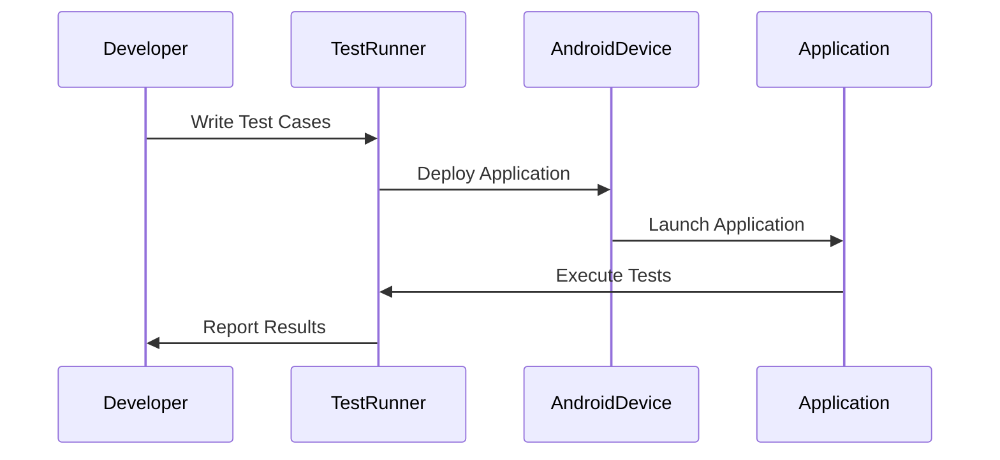

## 13.14 Testing on Android

In the realm of Android development, testing is a cornerstone of delivering robust, reliable, and high-quality applications. This section delves into the intricacies of testing Android applications using Kotlin, focusing on unit tests, instrumentation tests, and UI tests. We will explore the use of popular testing frameworks such as Espresso and Robolectric, providing you with the knowledge to implement effective testing strategies.

### Understanding Android Testing

Android testing is categorized into three main types: unit tests, instrumentation tests, and UI tests. Each type serves a distinct purpose and is crucial in ensuring different aspects of application quality.

#### Unit Tests

Unit tests are designed to test individual components of your application in isolation. They are fast, reliable, and help ensure that each part of your codebase functions as expected. In Android, unit tests typically focus on testing business logic, utility classes, and other non-UI components.

**Key Characteristics of Unit Tests:**
- **Isolation:** Tests are isolated from other parts of the application, ensuring that they only test the functionality of the component in question.
- **Speed:** Unit tests are generally fast because they do not require the Android framework or device/emulator to run.
- **Reliability:** They provide consistent results, making them ideal for continuous integration.

#### Instrumentation Tests

Instrumentation tests are used to test the interaction between different components of your application. They run on an Android device or emulator and allow you to test the behavior of your app in a real-world environment.

**Key Characteristics of Instrumentation Tests:**
- **Integration:** These tests verify that different parts of the application work together as expected.
- **Real Environment:** They run on actual devices or emulators, providing insights into how the app behaves in real-world scenarios.
- **Complexity:** Instrumentation tests can be more complex and slower than unit tests due to their reliance on the Android framework.

#### UI Tests

UI tests focus on verifying the user interface of your application. They ensure that the UI behaves as expected and provides a seamless user experience. Espresso is a popular framework for writing UI tests in Android.

**Key Characteristics of UI Tests:**
- **User Interaction:** Tests simulate user interactions with the app, such as clicking buttons and entering text.
- **Visual Verification:** They ensure that the UI elements are displayed correctly and respond to user actions.
- **End-to-End Testing:** UI tests often cover entire user flows, making them essential for ensuring a smooth user experience.

### Setting Up Your Testing Environment

Before diving into writing tests, it's essential to set up your testing environment. This includes configuring your project to support testing frameworks and tools.

#### Configuring Gradle for Testing

To enable testing in your Android project, you need to add the necessary dependencies to your `build.gradle` file.

```kotlin
dependencies {
    // Unit testing dependencies
    testImplementation "junit:junit:4.13.2"
    testImplementation "org.mockito:mockito-core:3.11.2"
    testImplementation "org.jetbrains.kotlin:kotlin-test-junit:1.5.31"

    // Instrumentation testing dependencies
    androidTestImplementation "androidx.test.ext:junit:1.1.3"
    androidTestImplementation "androidx.test.espresso:espresso-core:3.4.0"

    // Robolectric for unit testing with Android framework dependencies
    testImplementation "org.robolectric:robolectric:4.6.1"
}
```

Ensure that you sync your project after adding these dependencies to download and integrate them into your project.

#### Setting Up Test Directories

Android Studio provides default directories for organizing your tests:

- **Unit Tests:** Place your unit tests in the `src/test/java` directory.
- **Instrumentation Tests:** Place your instrumentation tests in the `src/androidTest/java` directory.

### Writing Unit Tests

Unit tests are the foundation of your testing strategy. They ensure that individual components of your application work as expected.

#### Writing a Simple Unit Test

Let's start by writing a simple unit test for a utility function. Consider a function that calculates the factorial of a number.

```kotlin
// Factorial.kt
fun factorial(n: Int): Int {
    return if (n <= 1) 1 else n * factorial(n - 1)
}
```

Now, let's write a unit test for this function.

```kotlin
// FactorialTest.kt
import org.junit.Assert.assertEquals
import org.junit.Test

class FactorialTest {

    @Test
    fun testFactorial() {
        assertEquals(1, factorial(0))
        assertEquals(1, factorial(1))
        assertEquals(2, factorial(2))
        assertEquals(6, factorial(3))
        assertEquals(24, factorial(4))
    }
}
```

**Explanation:**
- We use `assertEquals` to verify that the output of the `factorial` function matches the expected result.
- The `@Test` annotation indicates that the method is a test case.

#### Mocking Dependencies with Mockito

In real-world applications, you often need to test components that depend on external services or resources. Mockito is a popular framework for creating mock objects in unit tests.

Consider a `UserRepository` class that fetches user data from a remote server.

```kotlin
// UserRepository.kt
class UserRepository(private val apiService: ApiService) {
    fun getUser(userId: String): User {
        return apiService.getUser(userId)
    }
}
```

To test this class, we can use Mockito to mock the `ApiService` dependency.

```kotlin
// UserRepositoryTest.kt
import org.junit.Before
import org.junit.Test
import org.mockito.Mockito.*
import org.mockito.MockitoAnnotations

class UserRepositoryTest {

    private lateinit var apiService: ApiService
    private lateinit var userRepository: UserRepository

    @Before
    fun setUp() {
        MockitoAnnotations.openMocks(this)
        apiService = mock(ApiService::class.java)
        userRepository = UserRepository(apiService)
    }

    @Test
    fun testGetUser() {
        val userId = "123"
        val expectedUser = User(userId, "John Doe")
        `when`(apiService.getUser(userId)).thenReturn(expectedUser)

        val user = userRepository.getUser(userId)

        assertEquals(expectedUser, user)
        verify(apiService).getUser(userId)
    }
}
```

**Explanation:**
- We use `mock` to create a mock instance of `ApiService`.
- The `when` function specifies the behavior of the mock object.
- The `verify` function checks that the `getUser` method was called with the correct argument.

### Writing Instrumentation Tests

Instrumentation tests run on an Android device or emulator, allowing you to test the behavior of your app in a real-world environment.

#### Setting Up Espresso for UI Testing

Espresso is a powerful framework for writing UI tests in Android. It provides a simple API for interacting with UI elements and verifying their behavior.

To use Espresso, add the following dependencies to your `build.gradle` file:

```kotlin
androidTestImplementation "androidx.test.espresso:espresso-core:3.4.0"
androidTestImplementation "androidx.test.ext:junit:1.1.3"
```

#### Writing a Simple UI Test with Espresso

Let's write a simple UI test for an activity that displays a welcome message.

```kotlin
// MainActivity.kt
class MainActivity : AppCompatActivity() {

    override fun onCreate(savedInstanceState: Bundle?) {
        super.onCreate(savedInstanceState)
        setContentView(R.layout.activity_main)

        val welcomeTextView: TextView = findViewById(R.id.welcomeTextView)
        welcomeTextView.text = "Welcome to the app!"
    }
}
```

Now, let's write an Espresso test to verify that the welcome message is displayed correctly.

```kotlin
// MainActivityTest.kt
import androidx.test.ext.junit.runners.AndroidJUnit4
import androidx.test.rule.ActivityTestRule
import androidx.test.espresso.Espresso.onView
import androidx.test.espresso.assertion.ViewAssertions.matches
import androidx.test.espresso.matcher.ViewMatchers.withId
import androidx.test.espresso.matcher.ViewMatchers.withText
import org.junit.Rule
import org.junit.Test
import org.junit.runner.RunWith

@RunWith(AndroidJUnit4::class)
class MainActivityTest {

    @get:Rule
    val activityRule = ActivityTestRule(MainActivity::class.java)

    @Test
    fun testWelcomeMessage() {
        onView(withId(R.id.welcomeTextView))
            .check(matches(withText("Welcome to the app!")))
    }
}
```

**Explanation:**
- The `@RunWith(AndroidJUnit4::class)` annotation specifies that the test should be run with the AndroidJUnit4 test runner.
- The `ActivityTestRule` launches the activity before each test.
- The `onView` function is used to find a view by its ID, and `check` is used to verify that the view matches the expected condition.

### Writing Tests with Robolectric

Robolectric is a framework that allows you to run Android tests on the JVM, without the need for an emulator or device. This makes it ideal for testing Android components that do not require UI interactions.

#### Setting Up Robolectric

To use Robolectric, add the following dependency to your `build.gradle` file:

```kotlin
testImplementation "org.robolectric:robolectric:4.6.1"
```

#### Writing a Simple Test with Robolectric

Let's write a Robolectric test for the `MainActivity` class.

```kotlin
// MainActivityRobolectricTest.kt
import org.junit.Test
import org.junit.runner.RunWith
import org.robolectric.Robolectric
import org.robolectric.RobolectricTestRunner
import org.robolectric.annotation.Config
import org.junit.Assert.assertEquals

@RunWith(RobolectricTestRunner::class)
@Config(sdk = [28])
class MainActivityRobolectricTest {

    @Test
    fun testWelcomeMessage() {
        val activity = Robolectric.buildActivity(MainActivity::class.java).create().get()
        val welcomeTextView: TextView = activity.findViewById(R.id.welcomeTextView)

        assertEquals("Welcome to the app!", welcomeTextView.text)
    }
}
```

**Explanation:**
- The `@RunWith(RobolectricTestRunner::class)` annotation specifies that the test should be run with the Robolectric test runner.
- The `@Config` annotation specifies the SDK version to use for the test.
- The `Robolectric.buildActivity` function is used to create and start the activity.

### Best Practices for Android Testing

To ensure that your tests are effective and maintainable, follow these best practices:

#### Write Tests Before Code

Adopt a test-driven development (TDD) approach by writing tests before implementing the functionality. This ensures that your code is testable and meets the requirements.

#### Keep Tests Independent

Ensure that each test is independent and does not rely on the state or outcome of other tests. This makes your tests more reliable and easier to maintain.

#### Use Descriptive Test Names

Use descriptive names for your test methods to clearly indicate what they are testing. This makes it easier to understand the purpose of each test.

#### Mock External Dependencies

Use mocking frameworks like Mockito to isolate the component being tested from external dependencies. This allows you to focus on testing the component's behavior.

#### Run Tests Frequently

Run your tests frequently during development to catch issues early. Integrate your tests into your continuous integration pipeline to ensure that they are run automatically.

### Visualizing the Testing Process

To better understand the flow of testing in Android, let's visualize the process using a sequence diagram.



**Diagram Explanation:**
- The developer writes test cases and submits them to the test runner.
- The test runner deploys the application to an Android device or emulator.
- The application is launched, and the tests are executed.
- The test runner collects the results and reports them back to the developer.

### Try It Yourself

To solidify your understanding of Android testing, try modifying the code examples provided in this section. Experiment with different test scenarios, such as testing error conditions or edge cases. Consider writing additional tests for other components of your application.

### Knowledge Check

- What are the key differences between unit tests, instrumentation tests, and UI tests?
- How can you use Mockito to mock dependencies in unit tests?
- What are the benefits of using Robolectric for testing Android components?

### Embrace the Journey

Testing is an essential part of the software development process. By writing comprehensive tests, you can ensure that your Android applications are robust, reliable, and provide a seamless user experience. Remember, this is just the beginning. As you progress, you'll build more complex and interactive applications. Keep experimenting, stay curious, and enjoy the journey!

## Quiz Time!



### What is the primary purpose of unit tests in Android development?

- [x] To test individual components in isolation
- [ ] To test the entire application on a device
- [ ] To test the user interface
- [ ] To test network interactions

> **Explanation:** Unit tests focus on testing individual components of the application in isolation, ensuring that each part functions as expected.

### Which framework is commonly used for writing UI tests in Android?

- [ ] Robolectric
- [x] Espresso
- [ ] Mockito
- [ ] JUnit

> **Explanation:** Espresso is a popular framework for writing UI tests in Android, providing a simple API for interacting with UI elements.

### What is the role of the `ActivityTestRule` in Espresso tests?

- [x] To launch the activity before each test
- [ ] To mock dependencies
- [ ] To verify UI interactions
- [ ] To run tests on the JVM

> **Explanation:** `ActivityTestRule` is used to launch the activity before each test, providing a real environment for UI testing.

### How does Robolectric differ from traditional instrumentation tests?

- [x] It runs tests on the JVM without a device
- [ ] It requires an Android device or emulator
- [ ] It focuses on UI interactions
- [ ] It is slower than instrumentation tests

> **Explanation:** Robolectric allows you to run Android tests on the JVM, eliminating the need for an emulator or device.

### What is the benefit of using Mockito in unit tests?

- [x] To mock external dependencies
- [ ] To test UI interactions
- [x] To isolate components from external services
- [ ] To run tests on a device

> **Explanation:** Mockito is used to create mock objects, allowing you to isolate the component being tested from external dependencies.

### What is the purpose of the `@RunWith` annotation in Android tests?

- [x] To specify the test runner
- [ ] To mock dependencies
- [ ] To verify UI interactions
- [ ] To launch the application

> **Explanation:** The `@RunWith` annotation specifies the test runner to use for executing the test.

### Why is it important to keep tests independent?

- [x] To ensure reliability and maintainability
- [ ] To reduce test execution time
- [x] To prevent dependency on other tests
- [ ] To simplify test writing

> **Explanation:** Independent tests are more reliable and easier to maintain, as they do not rely on the state or outcome of other tests.

### What is the advantage of writing tests before code?

- [x] To ensure code is testable and meets requirements
- [ ] To reduce development time
- [ ] To simplify debugging
- [ ] To eliminate the need for documentation

> **Explanation:** Writing tests before code ensures that the code is testable and meets the requirements, following a test-driven development approach.

### Which directory is typically used for placing unit tests in an Android project?

- [x] `src/test/java`
- [ ] `src/androidTest/java`
- [ ] `src/main/java`
- [ ] `src/resources`

> **Explanation:** Unit tests are typically placed in the `src/test/java` directory in an Android project.

### True or False: Instrumentation tests can run without an Android device or emulator.

- [ ] True
- [x] False

> **Explanation:** Instrumentation tests require an Android device or emulator to run, as they test the interaction between different components in a real-world environment.


