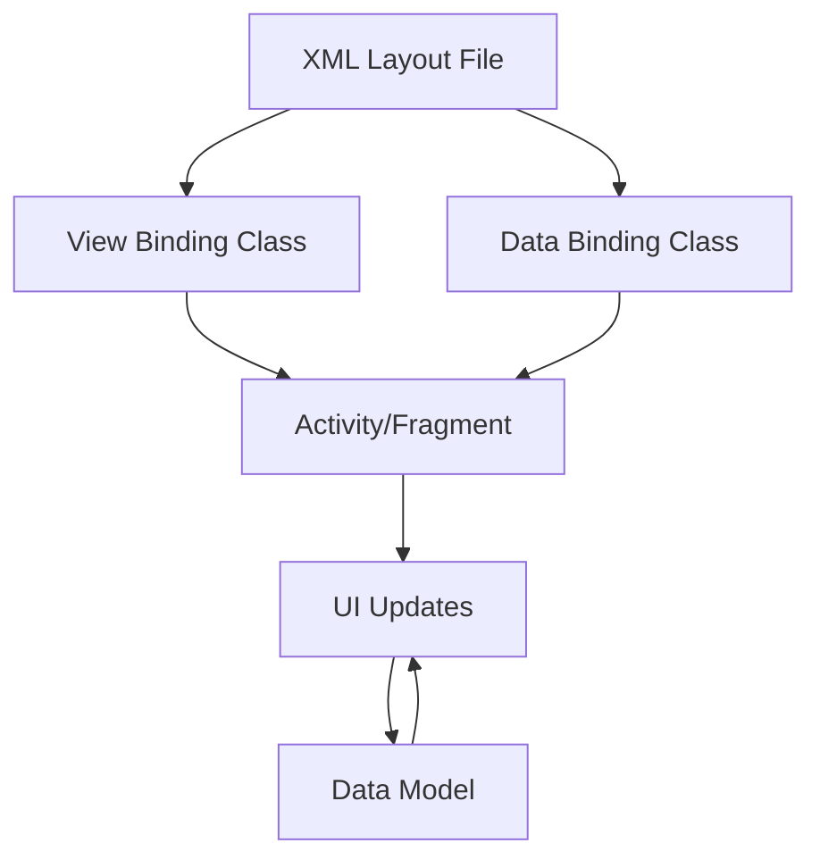

## 13.2 View Binding and Data Binding

In the realm of Android development, connecting the user interface (UI) with the underlying data model is a fundamental task. Two powerful tools in Kotlin for achieving this are **View Binding** and **Data Binding**. These tools not only simplify the process of UI development but also enhance code readability and maintainability by reducing boilerplate code. In this section, we will delve into the intricacies of View Binding and Data Binding, exploring their features, benefits, and practical applications in Kotlin-based Android projects.

### Introduction to View Binding and Data Binding

Before we dive into the specifics, let's understand what View Binding and Data Binding are and how they differ from each other.

- **View Binding**: This is a feature that generates a binding class for each XML layout file. It provides a direct reference to each view in the layout, eliminating the need for `findViewById()` calls. View Binding is straightforward and focuses on binding views to code.

- **Data Binding**: This is a more advanced feature that allows you to bind UI components in your layouts to data sources in your app using a declarative format. It supports two-way data binding, allowing changes in the UI to update the data model and vice versa.

Both tools aim to streamline the process of connecting UI components with data, but they serve slightly different purposes and offer different levels of functionality.

### View Binding: Simplifying UI References

#### Key Features of View Binding

1. **Type Safety**: View Binding generates a binding class for each XML layout file, providing type-safe access to all views. This reduces runtime errors caused by invalid view IDs.

2. **Null Safety**: View Binding ensures null safety by generating non-nullable references for views that are always present in the layout.

3. **Performance**: Since View Binding generates code at compile time, it has a minimal impact on runtime performance.

4. **Ease of Use**: It is easy to set up and use, making it a great choice for projects that do not require the full capabilities of Data Binding.

#### Setting Up View Binding

To enable View Binding in your Android project, follow these steps:

1. **Enable View Binding**: Add the following code to your `build.gradle` file:

   ```groovy
   android {
       ...
       viewBinding {
           enabled = true
       }
   }
   ```

2. **Generate Binding Classes**: Once View Binding is enabled, Android Studio will generate a binding class for each XML layout file. The name of the binding class is derived from the name of the XML file, with "Binding" appended to it. For example, `activity_main.xml` will generate `ActivityMainBinding`.

3. **Use the Binding Class**: In your activity or fragment, use the generated binding class to access views:

   ```kotlin
   class MainActivity : AppCompatActivity() {

       private lateinit var binding: ActivityMainBinding

       override fun onCreate(savedInstanceState: Bundle?) {
           super.onCreate(savedInstanceState)
           binding = ActivityMainBinding.inflate(layoutInflater)
           setContentView(binding.root)

           // Access views using binding
           binding.textView.text = "Hello, View Binding!"
       }
   }
   ```

#### Advantages of View Binding

- **Reduced Boilerplate**: By eliminating the need for `findViewById()`, View Binding significantly reduces boilerplate code.
- **Compile-Time Safety**: Errors related to view IDs are caught at compile time, reducing runtime crashes.
- **Improved Readability**: The generated binding classes make the code more readable and maintainable.

#### Limitations of View Binding

- **Limited Functionality**: View Binding does not support data binding expressions or two-way data binding.
- **No Layout Logic**: It cannot bind data directly to the UI or handle UI logic within the layout file.

### Data Binding: A Powerful Tool for UI and Data Synchronization

#### Key Features of Data Binding

1. **Declarative Layouts**: Data Binding allows you to write declarative layouts, where the UI components are directly bound to data sources.

2. **Two-Way Data Binding**: It supports two-way data binding, enabling automatic synchronization between the UI and data model.

3. **Binding Expressions**: You can use binding expressions to manipulate data directly within the XML layout files.

4. **Lifecycle Awareness**: Data Binding is lifecycle-aware, ensuring that data updates are synchronized with the UI lifecycle.

#### Setting Up Data Binding

To enable Data Binding in your Android project, follow these steps:

1. **Enable Data Binding**: Add the following code to your `build.gradle` file:

   ```groovy
   android {
       ...
       dataBinding {
           enabled = true
       }
   }
   ```

2. **Modify XML Layouts**: Wrap your XML layout with a `<layout>` tag to enable data binding:

   ```xml
   <layout xmlns:android="http://schemas.android.com/apk/res/android">
       <data>
           <variable
               name="user"
               type="com.example.User" />
       </data>

       <LinearLayout
           android:layout_width="match_parent"
           android:layout_height="match_parent"
           android:orientation="vertical">

           <TextView
               android:layout_width="wrap_content"
               android:layout_height="wrap_content"
               android:text="@{user.name}" />

       </LinearLayout>
   </layout>
   ```

3. **Generate Binding Classes**: Similar to View Binding, Data Binding generates a binding class for each layout file. Use this class to bind data to the UI:

   ```kotlin
   class MainActivity : AppCompatActivity() {

       private lateinit var binding: ActivityMainBinding

       override fun onCreate(savedInstanceState: Bundle?) {
           super.onCreate(savedInstanceState)
           binding = DataBindingUtil.setContentView(this, R.layout.activity_main)

           val user = User("John Doe")
           binding.user = user
       }
   }
   ```

#### Advantages of Data Binding

- **Declarative UI**: Data Binding allows you to define UI logic directly in XML, making the code more declarative and concise.
- **Two-Way Data Binding**: It supports two-way data binding, enabling seamless synchronization between the UI and data model.
- **Reduced Boilerplate**: By eliminating the need for manual data updates, Data Binding reduces boilerplate code.

#### Limitations of Data Binding

- **Complexity**: Data Binding can be complex to set up and use, especially for large projects.
- **Performance Overhead**: The use of binding expressions can introduce a performance overhead, especially if not used judiciously.

### Comparing View Binding and Data Binding

| Feature                | View Binding                          | Data Binding                             |
|------------------------|---------------------------------------|------------------------------------------|
| **Setup Complexity**   | Simple                                | Moderate to Complex                      |
| **Boilerplate Reduction** | High                              | Very High                                |
| **Type Safety**        | Yes                                   | Yes                                      |
| **Null Safety**        | Yes                                   | Yes                                      |
| **Two-Way Binding**    | No                                    | Yes                                      |
| **Declarative Layouts**| No                                    | Yes                                      |
| **Lifecycle Awareness**| No                                    | Yes                                      |
| **Performance**        | High                                  | Moderate (due to binding expressions)    |

### When to Use View Binding vs Data Binding

- **Use View Binding** when you need a simple, type-safe way to access views without the overhead of data binding expressions. It is ideal for projects where the UI logic is handled in the code rather than in the XML.

- **Use Data Binding** when you want to create a more declarative UI with direct data binding capabilities. It is suitable for projects where the UI and data model need to be tightly coupled, and two-way data binding is required.

### Practical Applications and Examples

#### Example 1: Using View Binding in a Simple Activity

Let's create a simple activity using View Binding to display a message:

```kotlin
class SimpleActivity : AppCompatActivity() {

    private lateinit var binding: ActivitySimpleBinding

    override fun onCreate(savedInstanceState: Bundle?) {
        super.onCreate(savedInstanceState)
        binding = ActivitySimpleBinding.inflate(layoutInflater)
        setContentView(binding.root)

        binding.messageTextView.text = "Welcome to View Binding!"
    }
}
```

In this example, we use the generated `ActivitySimpleBinding` class to access the `messageTextView` and set its text.

#### Example 2: Using Data Binding for Two-Way Binding

Let's create an activity using Data Binding to demonstrate two-way data binding:

```kotlin
class TwoWayBindingActivity : AppCompatActivity() {

    private lateinit var binding: ActivityTwoWayBinding
    private val user = User("Jane Doe")

    override fun onCreate(savedInstanceState: Bundle?) {
        super.onCreate(savedInstanceState)
        binding = DataBindingUtil.setContentView(this, R.layout.activity_two_way)
        binding.user = user

        // Observe changes in the user object
        user.name.observe(this, Observer { newName ->
            Toast.makeText(this, "Name changed to $newName", Toast.LENGTH_SHORT).show()
        })
    }
}
```

In this example, we bind the `user` object to the layout and observe changes in the user's name using LiveData.

### Visualizing the Binding Process

To better understand the binding process, let's visualize how View Binding and Data Binding work in an Android application.



**Diagram Description**: This diagram illustrates the flow of View Binding and Data Binding in an Android application. The XML layout file is processed to generate binding classes, which are then used in activities or fragments to update the UI and synchronize with the data model.

### Try It Yourself

To gain hands-on experience with View Binding and Data Binding, try modifying the code examples provided in this section. Experiment with different layouts and data models to see how these tools can simplify your UI development process.

### Knowledge Check

- What are the main differences between View Binding and Data Binding?
- How does two-way data binding work in Data Binding?
- What are the advantages of using View Binding over `findViewById()`?

### Conclusion

View Binding and Data Binding are powerful tools in Kotlin for Android development, each offering unique benefits for connecting UI components with data. By understanding their features and applications, you can choose the right tool for your project and enhance your development workflow. Remember, this is just the beginning. As you progress, you'll build more complex and interactive applications. Keep experimenting, stay curious, and enjoy the journey!

## Quiz Time!



### What is one of the main advantages of View Binding over `findViewById()`?

- [x] Type safety
- [ ] More complex setup
- [ ] Two-way data binding
- [ ] Performance overhead

> **Explanation:** View Binding provides type-safe access to views, reducing runtime errors compared to `findViewById()`.

### Which feature is exclusive to Data Binding and not available in View Binding?

- [ ] Type safety
- [ ] Null safety
- [x] Two-way data binding
- [ ] Compile-time safety

> **Explanation:** Two-way data binding is a feature exclusive to Data Binding, allowing automatic synchronization between the UI and data model.

### How do you enable View Binding in an Android project?

- [x] Add `viewBinding { enabled = true }` in `build.gradle`
- [ ] Use `findViewById()` in activities
- [ ] Wrap XML layout with `<layout>` tag
- [ ] Use `DataBindingUtil.setContentView()`

> **Explanation:** To enable View Binding, you need to add `viewBinding { enabled = true }` in the `build.gradle` file.

### What does Data Binding allow you to do that View Binding does not?

- [ ] Access views without `findViewById()`
- [x] Write declarative layouts with binding expressions
- [ ] Generate binding classes
- [ ] Ensure type safety

> **Explanation:** Data Binding allows you to write declarative layouts with binding expressions, which is not possible with View Binding.

### Which binding tool is more suitable for projects requiring tight coupling between UI and data model?

- [ ] View Binding
- [x] Data Binding
- [ ] Both are equally suitable
- [ ] Neither

> **Explanation:** Data Binding is more suitable for projects requiring tight coupling between UI and data model due to its support for two-way data binding.

### What is a potential drawback of using Data Binding?

- [ ] Lack of type safety
- [x] Performance overhead due to binding expressions
- [ ] Inability to access views
- [ ] No support for two-way binding

> **Explanation:** Data Binding can introduce a performance overhead due to the use of binding expressions, especially if not used judiciously.

### Which of the following is NOT a benefit of View Binding?

- [ ] Reduced boilerplate code
- [ ] Compile-time safety
- [ ] Null safety
- [x] Two-way data binding

> **Explanation:** View Binding does not support two-way data binding; this is a feature of Data Binding.

### How does Data Binding ensure lifecycle awareness?

- [ ] By generating non-nullable references
- [ ] By providing type-safe access to views
- [x] By synchronizing data updates with the UI lifecycle
- [ ] By eliminating `findViewById()` calls

> **Explanation:** Data Binding is lifecycle-aware, ensuring that data updates are synchronized with the UI lifecycle.

### What is the purpose of the `<layout>` tag in Data Binding?

- [ ] To enable View Binding
- [x] To wrap XML layouts for Data Binding
- [ ] To provide type-safe access to views
- [ ] To eliminate `findViewById()` calls

> **Explanation:** The `<layout>` tag is used to wrap XML layouts for Data Binding, enabling the use of binding expressions.

### True or False: View Binding supports two-way data binding.

- [ ] True
- [x] False

> **Explanation:** False. View Binding does not support two-way data binding; this feature is exclusive to Data Binding.


