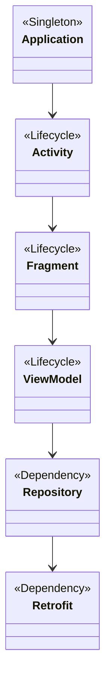

## 13.3 Dependency Injection with Hilt/Dagger

Dependency Injection (DI) is a fundamental design pattern in software engineering that facilitates the development of loosely coupled, testable, and maintainable code. In the context of Android development, managing dependencies efficiently is crucial due to the platform's unique lifecycle and resource constraints. This section delves into the use of Hilt and Dagger, two powerful DI frameworks, to simplify dependency management in Android applications.

### Introduction to Dependency Injection

**Dependency Injection** is a design pattern that allows a class to receive its dependencies from an external source rather than creating them itself. This pattern promotes loose coupling and enhances testability by allowing dependencies to be swapped easily.

#### Benefits of Dependency Injection

- **Improved Testability**: By decoupling dependencies, classes can be tested in isolation using mock objects.
- **Enhanced Maintainability**: Changes to dependencies require minimal modifications to the dependent classes.
- **Increased Flexibility**: Dependencies can be configured and swapped at runtime, allowing for dynamic behavior changes.

### Understanding Dagger

**Dagger** is a fully static, compile-time dependency injection framework for Java and Kotlin. It is known for its performance and efficiency, as it generates code that mimics the behavior of hand-written dependency injection.

#### Key Concepts in Dagger

- **Modules**: Classes annotated with `@Module` that provide dependencies.
- **Components**: Interfaces annotated with `@Component` that connect modules and inject dependencies.
- **Scopes**: Annotations that define the lifecycle of dependencies, such as `@Singleton`.
- **Providers**: Methods annotated with `@Provides` that specify how to create instances of dependencies.

#### Setting Up Dagger in an Android Project

To integrate Dagger into your Android project, follow these steps:

1. **Add Dependencies**: Include Dagger dependencies in your `build.gradle` file.

   ```kotlin
   dependencies {
       implementation 'com.google.dagger:dagger:2.x'
       kapt 'com.google.dagger:dagger-compiler:2.x'
   }
   ```

2. **Create a Module**: Define a module to provide dependencies.

   ```kotlin
   @Module
   class NetworkModule {
       @Provides
       fun provideRetrofit(): Retrofit {
           return Retrofit.Builder()
               .baseUrl("https://api.example.com")
               .build()
       }
   }
   ```

3. **Define a Component**: Create a component to connect modules and inject dependencies.

   ```kotlin
   @Component(modules = [NetworkModule::class])
   interface AppComponent {
       fun inject(activity: MainActivity)
   }
   ```

4. **Inject Dependencies**: Use the component to inject dependencies into your classes.

   ```kotlin
   class MainActivity : AppCompatActivity() {
       @Inject lateinit var retrofit: Retrofit

       override fun onCreate(savedInstanceState: Bundle?) {
           super.onCreate(savedInstanceState)
           DaggerAppComponent.create().inject(this)
       }
   }
   ```

### Simplifying Dependency Injection with Hilt

**Hilt** is a dependency injection library built on top of Dagger, specifically designed for Android. It simplifies the DI setup by providing a set of standard components and annotations that integrate seamlessly with the Android framework.

#### Key Features of Hilt

- **Ease of Use**: Hilt reduces boilerplate code by automatically generating necessary Dagger components.
- **Android Integration**: Hilt provides predefined components for common Android classes like `Activity`, `Fragment`, `ViewModel`, etc.
- **Lifecycle Awareness**: Hilt components are aware of Android lifecycle, ensuring that dependencies are scoped appropriately.

#### Setting Up Hilt in an Android Project

1. **Add Dependencies**: Include Hilt dependencies in your `build.gradle` file.

   ```kotlin
   dependencies {
       implementation "com.google.dagger:hilt-android:2.x"
       kapt "com.google.dagger:hilt-android-compiler:2.x"
   }
   ```

2. **Initialize Hilt**: Annotate your `Application` class with `@HiltAndroidApp`.

   ```kotlin
   @HiltAndroidApp
   class MyApplication : Application()
   ```

3. **Inject Dependencies**: Use `@Inject` to request dependencies in your classes.

   ```kotlin
   @AndroidEntryPoint
   class MainActivity : AppCompatActivity() {
       @Inject lateinit var retrofit: Retrofit

       override fun onCreate(savedInstanceState: Bundle?) {
           super.onCreate(savedInstanceState)
           setContentView(R.layout.activity_main)
       }
   }
   ```

4. **Provide Dependencies**: Define modules using `@Module` and `@InstallIn` to specify the component scope.

   ```kotlin
   @Module
   @InstallIn(SingletonComponent::class)
   object NetworkModule {
       @Provides
       fun provideRetrofit(): Retrofit {
           return Retrofit.Builder()
               .baseUrl("https://api.example.com")
               .build()
       }
   }
   ```

### Hilt vs. Dagger: A Comparative Analysis

While both Hilt and Dagger are built on the same underlying principles, they cater to different needs and use cases.

#### Advantages of Hilt

- **Reduced Boilerplate**: Hilt automates much of the setup required by Dagger, reducing the amount of code developers need to write.
- **Android-Specific Features**: Hilt provides built-in support for Android components, making it easier to integrate DI into Android apps.
- **Simplified Scoping**: Hilt manages component lifecycles automatically, ensuring that dependencies are scoped correctly.

#### When to Use Dagger

- **Complex Projects**: For projects with complex DI requirements or custom scopes, Dagger offers more flexibility and control.
- **Non-Android Projects**: Dagger is suitable for Java and Kotlin projects outside the Android ecosystem.

### Practical Examples and Code Walkthroughs

Let's explore some practical examples to illustrate how Hilt and Dagger can be used in real-world Android applications.

#### Example 1: Network Module with Hilt

In this example, we'll create a network module using Hilt to provide a `Retrofit` instance.

```kotlin
@Module
@InstallIn(SingletonComponent::class)
object NetworkModule {
    @Provides
    fun provideRetrofit(): Retrofit {
        return Retrofit.Builder()
            .baseUrl("https://api.example.com")
            .build()
    }
}
```

In the `MainActivity`, we can inject the `Retrofit` instance as follows:

```kotlin
@AndroidEntryPoint
class MainActivity : AppCompatActivity() {
    @Inject lateinit var retrofit: Retrofit

    override fun onCreate(savedInstanceState: Bundle?) {
        super.onCreate(savedInstanceState)
        setContentView(R.layout.activity_main)
    }
}
```

#### Example 2: ViewModel Injection with Hilt

Hilt makes it easy to inject dependencies into `ViewModel` classes, which are crucial for managing UI-related data in a lifecycle-conscious way.

```kotlin
@HiltViewModel
class MainViewModel @Inject constructor(
    private val repository: Repository
) : ViewModel() {
    // ViewModel logic
}
```

In the `MainActivity`, we can obtain the `ViewModel` using Hilt:

```kotlin
@AndroidEntryPoint
class MainActivity : AppCompatActivity() {
    private val viewModel: MainViewModel by viewModels()

    override fun onCreate(savedInstanceState: Bundle?) {
        super.onCreate(savedInstanceState)
        setContentView(R.layout.activity_main)
    }
}
```

### Visualizing Dependency Injection with Hilt

To better understand how Hilt manages dependencies, let's visualize the process using a class diagram.



**Diagram Description**: This diagram illustrates the hierarchy of Android components and their dependencies managed by Hilt. The `Application` class serves as the root component, with `Activity`, `Fragment`, and `ViewModel` as lifecycle-aware components. Dependencies like `Repository` and `Retrofit` are injected into the `ViewModel`.

### Design Considerations and Best Practices

When using Hilt or Dagger, consider the following best practices to ensure efficient and maintainable code:

- **Scope Appropriately**: Use the correct scope for each dependency to avoid memory leaks and ensure proper lifecycle management.
- **Minimize Module Complexity**: Keep modules focused and avoid overloading them with too many responsibilities.
- **Use Interfaces**: Depend on abstractions rather than concrete implementations to enhance flexibility and testability.
- **Leverage Hilt's Features**: Take advantage of Hilt's Android-specific features to simplify DI setup and reduce boilerplate code.

### Differences and Similarities Between Hilt and Dagger

While Hilt and Dagger share many similarities, they also have distinct differences that cater to different use cases.

- **Similarities**:
  - Both are built on the same core principles of dependency injection.
  - Both generate code at compile-time, ensuring efficient runtime performance.

- **Differences**:
  - Hilt is tailored for Android, providing built-in support for Android components and lifecycle management.
  - Dagger offers more flexibility for complex DI setups and non-Android projects.

### Try It Yourself: Experimenting with Hilt and Dagger

To deepen your understanding of Hilt and Dagger, try modifying the code examples provided. Experiment with different scopes, modules, and components to see how they affect dependency management.

- **Challenge**: Create a new module to provide a `Database` instance and inject it into a `Repository` class.
- **Experiment**: Change the scope of a dependency and observe how it affects the lifecycle of the dependent components.

### Knowledge Check

Before we conclude, let's reinforce your understanding with a few questions:

- What are the key benefits of using dependency injection in Android development?
- How does Hilt simplify dependency injection compared to Dagger?
- What are the primary components of Dagger, and how do they interact?
- How can you inject dependencies into a `ViewModel` using Hilt?

### Conclusion

Dependency Injection is a powerful design pattern that enhances the modularity, testability, and maintainability of Android applications. By leveraging Hilt and Dagger, developers can manage dependencies efficiently, reduce boilerplate code, and focus on building robust applications. As you continue your journey in Android development, remember to experiment, explore new patterns, and embrace the power of dependency injection to create scalable and maintainable codebases.

## Quiz Time!



### What is the primary purpose of Dependency Injection?

- [x] To decouple dependencies and enhance testability
- [ ] To increase code complexity
- [ ] To reduce application performance
- [ ] To eliminate the need for interfaces

> **Explanation:** Dependency Injection decouples dependencies, making code more testable and maintainable.

### Which annotation is used to define a module in Dagger?

- [ ] @Component
- [x] @Module
- [ ] @Inject
- [ ] @Provides

> **Explanation:** The `@Module` annotation is used to define a class that provides dependencies in Dagger.

### How does Hilt simplify Dependency Injection in Android?

- [x] By providing built-in support for Android components
- [ ] By eliminating the need for annotations
- [ ] By increasing the amount of boilerplate code
- [ ] By removing lifecycle awareness

> **Explanation:** Hilt simplifies DI by providing built-in support for Android components and reducing boilerplate code.

### What is the role of a `Component` in Dagger?

- [x] To connect modules and inject dependencies
- [ ] To provide network connectivity
- [ ] To manage application resources
- [ ] To handle user interactions

> **Explanation:** A `Component` in Dagger connects modules and injects dependencies into classes.

### Which annotation is used to inject dependencies in Hilt?

- [ ] @Component
- [ ] @Module
- [x] @Inject
- [ ] @Provides

> **Explanation:** The `@Inject` annotation is used to request dependencies in Hilt.

### What is a key advantage of using Hilt over Dagger in Android development?

- [x] Reduced boilerplate code
- [ ] Increased application size
- [ ] More complex setup
- [ ] Less flexibility

> **Explanation:** Hilt reduces boilerplate code by automating much of the DI setup required by Dagger.

### Which of the following is a lifecycle-aware component in Hilt?

- [x] ViewModel
- [ ] Database
- [ ] NetworkModule
- [ ] Repository

> **Explanation:** `ViewModel` is a lifecycle-aware component in Hilt, allowing for dependency injection with lifecycle management.

### In Dagger, what is the purpose of the `@Provides` annotation?

- [x] To specify how to create instances of dependencies
- [ ] To define a component
- [ ] To inject dependencies
- [ ] To manage application resources

> **Explanation:** The `@Provides` annotation in Dagger specifies how to create instances of dependencies.

### Which scope annotation is used to define a singleton in Dagger?

- [x] @Singleton
- [ ] @ActivityScoped
- [ ] @FragmentScoped
- [ ] @ViewModelScoped

> **Explanation:** The `@Singleton` annotation is used to define a singleton scope in Dagger.

### True or False: Hilt can only be used in Android projects.

- [x] True
- [ ] False

> **Explanation:** Hilt is specifically designed for Android projects, providing built-in support for Android components.


