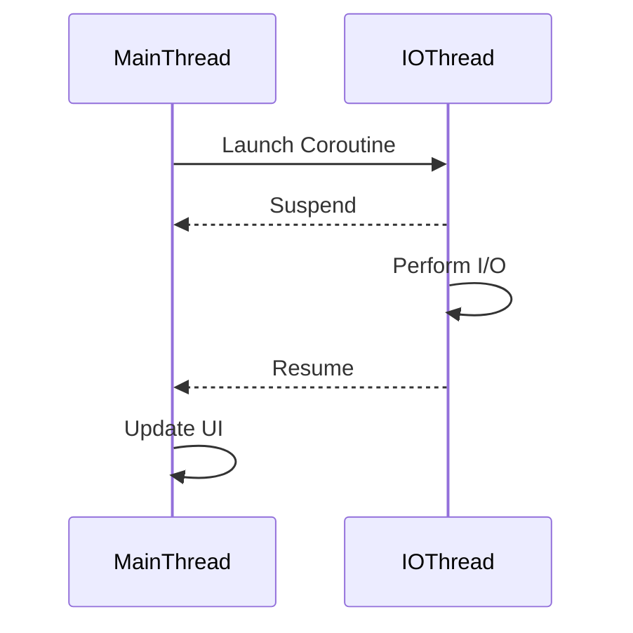

## 13.4 Coroutines on Android

In the ever-evolving landscape of Android development, managing background tasks efficiently is crucial for creating responsive and user-friendly applications. Kotlin Coroutines offer a modern, powerful solution for handling asynchronous programming, replacing older paradigms like `AsyncTask` and `Loader`. This section delves into the intricacies of using Coroutines on Android, providing expert insights and practical examples to help you master this essential tool.

### Introduction to Coroutines

Coroutines are a concurrency design pattern that you can use on Android to simplify code that executes asynchronously. They allow you to write asynchronous code in a sequential manner, making it easier to read and maintain. Unlike traditional threading, coroutines are lightweight and can be suspended and resumed without blocking a thread.

#### Key Concepts

- **Suspending Functions**: Functions that can be paused and resumed at a later time. They are marked with the `suspend` keyword.
- **Coroutine Scopes**: Define the lifecycle of coroutines. They help manage the coroutines' lifecycle and automatically cancel them when they are no longer needed.
- **Dispatchers**: Determine the thread on which a coroutine runs. Common dispatchers include `Dispatchers.Main` for UI operations and `Dispatchers.IO` for I/O operations.

### Why Replace AsyncTask and Loader?

`AsyncTask` and `Loader` were once the go-to solutions for background processing in Android. However, they come with several limitations:

- **Complexity**: Managing threads and callbacks can lead to complex and error-prone code.
- **Lifecycle Management**: `AsyncTask` does not handle configuration changes well, often leading to memory leaks.
- **Performance**: `AsyncTask` operates on a single background thread, which can become a bottleneck.

Coroutines address these issues by providing a more intuitive and efficient way to handle asynchronous tasks.

### Setting Up Coroutines in Android

To start using coroutines in your Android project, you need to add the necessary dependencies to your `build.gradle` file:

```kotlin
dependencies {
    implementation 'org.jetbrains.kotlinx:kotlinx-coroutines-core:1.6.0'
    implementation 'org.jetbrains.kotlinx:kotlinx-coroutines-android:1.6.0'
}
```

These libraries provide the core coroutine functionality and Android-specific extensions.

### Basic Coroutine Usage

Let's start with a simple example of using coroutines to perform a network request on a background thread and update the UI on the main thread.

```kotlin
import kotlinx.coroutines.*

fun fetchData() {
    GlobalScope.launch(Dispatchers.Main) {
        val data = withContext(Dispatchers.IO) {
            // Simulate network request
            fetchFromNetwork()
        }
        // Update UI with data
        updateUI(data)
    }
}

suspend fun fetchFromNetwork(): String {
    delay(1000) // Simulate network delay
    return "Data from network"
}

fun updateUI(data: String) {
    println("UI updated with: $data")
}
```

#### Explanation

- **GlobalScope.launch**: Starts a new coroutine in the global scope. It's generally better to use structured concurrency with specific scopes.
- **Dispatchers.IO**: Used for I/O operations, such as network requests.
- **withContext**: Changes the context of the coroutine, allowing you to switch between threads.
- **delay**: A suspending function that pauses the coroutine without blocking the thread.

### Structured Concurrency

Structured concurrency ensures that you don't leave any coroutines running longer than necessary. It ties the lifecycle of coroutines to the lifecycle of a specific scope, such as an Activity or ViewModel.

#### Using CoroutineScope

Instead of using `GlobalScope`, you should define a `CoroutineScope` tied to your component's lifecycle.

```kotlin
class MyViewModel : ViewModel() {
    private val viewModelScope = CoroutineScope(Dispatchers.Main + Job())

    fun fetchData() {
        viewModelScope.launch {
            val data = withContext(Dispatchers.IO) {
                fetchFromNetwork()
            }
            updateUI(data)
        }
    }

    override fun onCleared() {
        super.onCleared()
        viewModelScope.cancel()
    }
}
```

#### Explanation

- **CoroutineScope**: Defines a scope for coroutines tied to the ViewModel's lifecycle.
- **Job**: A handle to manage the lifecycle of the coroutine. It can be used to cancel the coroutine when the ViewModel is cleared.

### Coroutine Builders

Coroutine builders are functions that help you create and manage coroutines. The most common builders are `launch` and `async`.

#### Launch

`launch` is used to start a new coroutine without blocking the current thread. It returns a `Job` that can be used to manage the coroutine's lifecycle.

```kotlin
fun exampleLaunch() {
    CoroutineScope(Dispatchers.Main).launch {
        // Coroutine code
    }
}
```

#### Async

`async` is used to start a coroutine that returns a result. It returns a `Deferred` object, which is a non-blocking cancellable future.

```kotlin
fun exampleAsync() {
    CoroutineScope(Dispatchers.Main).launch {
        val result = async(Dispatchers.IO) {
            // Perform some computation
            42
        }
        println("Result: ${result.await()}")
    }
}
```

### Handling Exceptions

Coroutines provide a structured way to handle exceptions using `try-catch` blocks and `CoroutineExceptionHandler`.

#### Using Try-Catch

You can use `try-catch` within a coroutine to handle exceptions.

```kotlin
fun handleException() {
    CoroutineScope(Dispatchers.Main).launch {
        try {
            val data = withContext(Dispatchers.IO) {
                fetchFromNetwork()
            }
            updateUI(data)
        } catch (e: Exception) {
            handleError(e)
        }
    }
}
```

#### CoroutineExceptionHandler

For global exception handling, use `CoroutineExceptionHandler`.

```kotlin
val handler = CoroutineExceptionHandler { _, exception ->
    println("Caught $exception")
}

fun handleGlobalException() {
    CoroutineScope(Dispatchers.Main + handler).launch {
        // Coroutine code
    }
}
```

### Cancellation and Timeouts

Coroutines can be cancelled at any time. This is particularly useful for stopping long-running operations when they are no longer needed.

#### Cancelling Coroutines

You can cancel a coroutine by calling `cancel()` on its `Job`.

```kotlin
fun cancelCoroutine() {
    val job = CoroutineScope(Dispatchers.Main).launch {
        // Long-running operation
    }
    job.cancel()
}
```

#### Using Timeouts

You can use `withTimeout` to automatically cancel a coroutine if it takes too long.

```kotlin
fun timeoutExample() {
    CoroutineScope(Dispatchers.Main).launch {
        try {
            withTimeout(1000) {
                // Coroutine code
            }
        } catch (e: TimeoutCancellationException) {
            println("Operation timed out")
        }
    }
}
```

### Advanced Coroutine Patterns

#### Channels

Channels are a way to communicate between coroutines. They are similar to blocking queues but are non-blocking.

```kotlin
fun channelExample() = runBlocking {
    val channel = Channel<Int>()
    launch {
        for (x in 1..5) channel.send(x * x)
        channel.close()
    }
    for (y in channel) println(y)
}
```

#### Flows

Flows are a cold asynchronous data stream that can produce values asynchronously.

```kotlin
fun flowExample() = runBlocking {
    flow {
        for (i in 1..3) {
            delay(100)
            emit(i)
        }
    }.collect { value ->
        println(value)
    }
}
```

### Visualizing Coroutine Execution

To better understand how coroutines work, let's visualize their execution flow:



This diagram illustrates how a coroutine can switch between different threads, performing I/O operations on a background thread and updating the UI on the main thread.

### Best Practices for Using Coroutines on Android

- **Use Structured Concurrency**: Always tie coroutines to a lifecycle to avoid memory leaks.
- **Choose the Right Dispatcher**: Use `Dispatchers.Main` for UI updates and `Dispatchers.IO` for I/O operations.
- **Handle Exceptions Gracefully**: Use `try-catch` and `CoroutineExceptionHandler` to manage exceptions.
- **Avoid GlobalScope**: Prefer using specific scopes like `viewModelScope` or `lifecycleScope`.
- **Test Your Coroutines**: Use tools like `runBlockingTest` to test coroutine code.

### Try It Yourself

Experiment with the code examples provided. Try modifying the `fetchFromNetwork` function to simulate different network conditions, or use `channels` and `flows` to handle data streams. This hands-on practice will deepen your understanding of coroutines and their applications on Android.

### Conclusion

Kotlin Coroutines provide a powerful and efficient way to manage background tasks on Android. By replacing older paradigms like `AsyncTask` and `Loader`, coroutines offer a more intuitive and scalable approach to asynchronous programming. As you continue to explore and experiment with coroutines, you'll find them to be an indispensable tool in your Android development toolkit.

## Quiz Time!



### What is a coroutine in Kotlin?

- [x] A concurrency design pattern for asynchronous programming.
- [ ] A type of thread in Kotlin.
- [ ] A data structure for managing collections.
- [ ] A UI component in Android.

> **Explanation:** Coroutines are a concurrency design pattern that simplifies asynchronous programming by allowing code to be written in a sequential manner.

### Which keyword is used to define a suspending function in Kotlin?

- [ ] async
- [ ] launch
- [x] suspend
- [ ] delay

> **Explanation:** The `suspend` keyword is used to define a suspending function, which can be paused and resumed.

### What is the purpose of CoroutineScope in Kotlin?

- [ ] To define the return type of a coroutine.
- [x] To manage the lifecycle of coroutines.
- [ ] To specify the UI components in a coroutine.
- [ ] To handle exceptions in coroutines.

> **Explanation:** CoroutineScope is used to manage the lifecycle of coroutines, ensuring they are cancelled when no longer needed.

### How can you switch the context of a coroutine to a different thread?

- [ ] Using `launch`
- [ ] Using `async`
- [x] Using `withContext`
- [ ] Using `delay`

> **Explanation:** `withContext` is used to switch the context of a coroutine to a different thread.

### What is the role of Dispatchers.IO?

- [ ] To handle UI updates.
- [x] To perform I/O operations.
- [ ] To manage network requests.
- [ ] To execute coroutines on the main thread.

> **Explanation:** Dispatchers.IO is used for I/O operations, such as reading from or writing to a disk or network.

### How do you handle exceptions in coroutines?

- [ ] Using `try-catch` blocks.
- [ ] Using `CoroutineExceptionHandler`.
- [x] Both of the above.
- [ ] None of the above.

> **Explanation:** Exceptions in coroutines can be handled using `try-catch` blocks and `CoroutineExceptionHandler`.

### What is the difference between `launch` and `async`?

- [ ] `launch` returns a result, `async` does not.
- [ ] `async` is used for UI operations, `launch` is not.
- [x] `launch` does not return a result, `async` returns a `Deferred`.
- [ ] `launch` is synchronous, `async` is asynchronous.

> **Explanation:** `launch` starts a coroutine without returning a result, while `async` returns a `Deferred` object, which can be used to obtain a result.

### How can you cancel a coroutine?

- [ ] By using `stop()`.
- [ ] By using `pause()`.
- [x] By calling `cancel()` on its `Job`.
- [ ] By using `terminate()`.

> **Explanation:** A coroutine can be cancelled by calling `cancel()` on its `Job`.

### What is the purpose of `withTimeout` in coroutines?

- [ ] To execute a coroutine on a background thread.
- [ ] To handle exceptions in coroutines.
- [x] To cancel a coroutine if it takes too long.
- [ ] To switch the context of a coroutine.

> **Explanation:** `withTimeout` is used to automatically cancel a coroutine if it takes longer than the specified time.

### True or False: GlobalScope is recommended for managing coroutines in Android applications.

- [ ] True
- [x] False

> **Explanation:** GlobalScope is not recommended for managing coroutines in Android applications because it is not tied to any lifecycle, which can lead to memory leaks.


