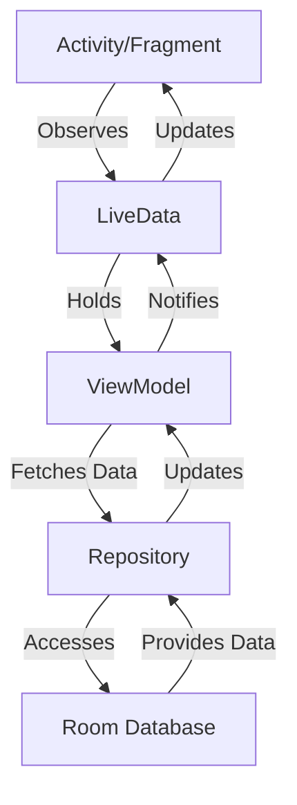

## 13.5 Working with Jetpack Components in Android Development

Jetpack Components are a set of libraries and tools designed to help Android developers create robust, maintainable, and scalable applications. These components simplify complex tasks and promote best practices, allowing developers to focus on building high-quality apps. In this section, we will delve into the core Jetpack Components: **Lifecycle-aware components**, **LiveData**, **ViewModel**, and **Room**. We will explore their features, benefits, and how they can be effectively used in Kotlin-based Android applications.

### Introduction to Jetpack Components

Jetpack is a suite of libraries, tools, and guidance to help developers write high-quality apps more easily. These components are unbundled from the platform APIs, meaning they are backward-compatible and can be updated more frequently. Jetpack consists of four main categories: Architecture, UI, Foundation, and Behavior.

#### Lifecycle-aware Components

Lifecycle-aware components are designed to help you manage the lifecycle of your app components, such as activities and fragments. They allow you to build components that can automatically adjust their behavior based on the current lifecycle state of the app component they are associated with. This helps in reducing memory leaks and crashes, ensuring a smoother user experience.

### Understanding Lifecycle in Android

The lifecycle of an Android component (Activity or Fragment) is a complex process that involves multiple states and transitions. Managing these states manually can lead to errors and memory leaks. Jetpack's lifecycle-aware components provide a robust solution to this problem.

#### Lifecycle States and Events

The lifecycle of an Android component can be broken down into several states and events:

- **States**: CREATED, STARTED, RESUMED, PAUSED, STOPPED, DESTROYED.
- **Events**: ON_CREATE, ON_START, ON_RESUME, ON_PAUSE, ON_STOP, ON_DESTROY.

Lifecycle-aware components can observe these states and events, allowing them to perform actions at the right time.

```kotlin
class MyObserver : LifecycleObserver {

    @OnLifecycleEvent(Lifecycle.Event.ON_RESUME)
    fun onResume() {
        // Code to execute when the component is resumed
    }

    @OnLifecycleEvent(Lifecycle.Event.ON_PAUSE)
    fun onPause() {
        // Code to execute when the component is paused
    }
}
```

In the above example, `MyObserver` is a lifecycle-aware component that reacts to the lifecycle events of an associated component.

### LiveData: Observing Data Changes

**LiveData** is an observable data holder class that is lifecycle-aware. It respects the lifecycle of other app components, such as activities, fragments, or services. This awareness ensures that LiveData only updates app component observers that are in an active lifecycle state.

#### Key Features of LiveData

- **Lifecycle Awareness**: Automatically manages updates based on the lifecycle state of the observer.
- **No Memory Leaks**: Observers are bound to lifecycle objects and clean up after themselves when their associated lifecycle is destroyed.
- **Always Up-to-date Data**: Observers receive the latest data upon becoming active.
- **Decoupled Architecture**: Promotes a separation of concerns by allowing UI components to observe data without having direct access to the data source.

#### Using LiveData in Kotlin

To use LiveData, you typically start by defining a LiveData object in your ViewModel:

```kotlin
class MyViewModel : ViewModel() {
    private val _data = MutableLiveData<String>()
    val data: LiveData<String> get() = _data

    fun updateData(newData: String) {
        _data.value = newData
    }
}
```

In your activity or fragment, you can observe this LiveData object:

```kotlin
class MyActivity : AppCompatActivity() {

    private lateinit var viewModel: MyViewModel

    override fun onCreate(savedInstanceState: Bundle?) {
        super.onCreate(savedInstanceState)
        setContentView(R.layout.activity_main)

        viewModel = ViewModelProvider(this).get(MyViewModel::class.java)

        viewModel.data.observe(this, Observer { newData ->
            // Update the UI with the new data
            textView.text = newData
        })
    }
}
```

### ViewModel: Managing UI-related Data

The **ViewModel** class is designed to store and manage UI-related data in a lifecycle-conscious way. It allows data to survive configuration changes such as screen rotations.

#### Key Features of ViewModel

- **Lifecycle Awareness**: ViewModel objects are automatically retained during configuration changes.
- **Separation of Concerns**: Keeps UI-related data separate from UI controllers, promoting a cleaner architecture.
- **Efficient Memory Usage**: ViewModel is only destroyed when the associated activity or fragment is finished.

#### Implementing ViewModel in Kotlin

Creating a ViewModel is straightforward. You extend the `ViewModel` class and define your data and methods:

```kotlin
class MyViewModel : ViewModel() {
    private val _counter = MutableLiveData<Int>()
    val counter: LiveData<Int> get() = _counter

    init {
        _counter.value = 0
    }

    fun incrementCounter() {
        _counter.value = (_counter.value ?: 0) + 1
    }
}
```

In your activity or fragment, you can obtain an instance of your ViewModel:

```kotlin
class MyFragment : Fragment() {

    private lateinit var viewModel: MyViewModel

    override fun onCreateView(
        inflater: LayoutInflater, container: ViewGroup?,
        savedInstanceState: Bundle?
    ): View? {
        val view = inflater.inflate(R.layout.fragment_main, container, false)

        viewModel = ViewModelProvider(this).get(MyViewModel::class.java)

        viewModel.counter.observe(viewLifecycleOwner, Observer { count ->
            // Update the UI with the new count
            textView.text = count.toString()
        })

        button.setOnClickListener {
            viewModel.incrementCounter()
        }

        return view
    }
}
```

### Room: A Robust SQLite Object Mapping Library

**Room** is a persistence library that provides an abstraction layer over SQLite to allow fluent database access while harnessing the full power of SQLite.

#### Key Features of Room

- **Compile-time Verification**: SQL queries are verified at compile time, reducing runtime errors.
- **Seamless Integration with LiveData and RxJava**: Room supports observable queries, allowing you to get live updates as the data changes.
- **Migration Support**: Room provides a simple API to define migrations between different versions of your database schema.

#### Using Room in Kotlin

To use Room, you need to define your database entities, data access objects (DAOs), and the database class.

##### Define an Entity

An entity represents a table within the database. You define an entity by creating a data class and annotating it with `@Entity`.

```kotlin
@Entity(tableName = "user_table")
data class User(
    @PrimaryKey(autoGenerate = true) val id: Int,
    val name: String,
    val age: Int
)
```

##### Create a DAO

A Data Access Object (DAO) defines the methods that access the database. You annotate a DAO class with `@Dao`.

```kotlin
@Dao
interface UserDao {

    @Insert(onConflict = OnConflictStrategy.IGNORE)
    suspend fun insert(user: User)

    @Query("SELECT * FROM user_table ORDER BY name ASC")
    fun getAllUsers(): LiveData<List<User>>
}
```

##### Define the Database

The database class provides the main access point to the persisted data. You annotate the class with `@Database`.

```kotlin
@Database(entities = [User::class], version = 1, exportSchema = false)
abstract class UserDatabase : RoomDatabase() {
    abstract fun userDao(): UserDao

    companion object {
        @Volatile
        private var INSTANCE: UserDatabase? = null

        fun getDatabase(context: Context): UserDatabase {
            return INSTANCE ?: synchronized(this) {
                val instance = Room.databaseBuilder(
                    context.applicationContext,
                    UserDatabase::class.java,
                    "user_database"
                ).build()
                INSTANCE = instance
                instance
            }
        }
    }
}
```

### Integrating Jetpack Components

Integrating these components into your Android application can significantly enhance its architecture and maintainability. Let's explore how these components can work together to create a robust application.

#### Combining LiveData and ViewModel

LiveData and ViewModel are often used together to manage UI-related data in a lifecycle-aware manner. The ViewModel holds the data, and LiveData allows the UI to observe changes to this data.

```kotlin
class UserViewModel(application: Application) : AndroidViewModel(application) {

    private val repository: UserRepository
    val allUsers: LiveData<List<User>>

    init {
        val userDao = UserDatabase.getDatabase(application).userDao()
        repository = UserRepository(userDao)
        allUsers = repository.allUsers
    }
}
```

In the above example, `UserViewModel` uses a repository to fetch data from the database and exposes it as LiveData.

#### Using Room with LiveData

Room's integration with LiveData allows you to observe database changes directly in your UI components. This ensures that your UI is always up-to-date with the latest data.

```kotlin
class UserRepository(private val userDao: UserDao) {

    val allUsers: LiveData<List<User>> = userDao.getAllUsers()

    suspend fun insert(user: User) {
        userDao.insert(user)
    }
}
```

In this example, `UserRepository` provides a clean API for accessing data and interacts with the `UserDao` to fetch data from the database.

### Best Practices for Using Jetpack Components

To get the most out of Jetpack Components, consider the following best practices:

- **Use ViewModel for UI-related Data**: Always use ViewModel to store and manage UI-related data. This ensures that your data survives configuration changes.
- **Leverage LiveData for Observability**: Use LiveData to observe changes in your data. This promotes a reactive programming style and ensures that your UI is always in sync with your data.
- **Design for Separation of Concerns**: Keep your UI logic separate from your business logic. Use ViewModel and LiveData to achieve this separation.
- **Handle Lifecycle Events Appropriately**: Use lifecycle-aware components to manage resources and perform actions based on lifecycle events. This reduces memory leaks and improves app stability.
- **Optimize Database Access with Room**: Use Room to manage your database interactions. Its compile-time verification and integration with LiveData make it a powerful tool for managing data persistence.

### Visualizing Jetpack Components Interaction

To better understand how these components interact, let's visualize their relationships and data flow.



**Diagram Description**: This diagram illustrates the interaction between Activity/Fragment, LiveData, ViewModel, Repository, and Room Database. The Activity/Fragment observes LiveData, which holds data in the ViewModel. The ViewModel fetches data from the Repository, which accesses the Room Database. Data flows back from the database to the ViewModel, updating the LiveData and subsequently the UI.

### Try It Yourself

Experiment with the code examples provided in this section. Try modifying the `User` entity to include additional fields, such as email or phone number. Update the DAO and ViewModel to handle these new fields and observe how the changes propagate through the application.

### Knowledge Check

- How do lifecycle-aware components help in managing Android component lifecycles?
- What are the benefits of using LiveData in an Android application?
- How does ViewModel contribute to a cleaner architecture in Android apps?
- Describe how Room integrates with LiveData to provide real-time data updates.

### Embrace the Journey

Remember, mastering Jetpack Components is a journey. As you continue to explore and experiment with these components, you'll discover new ways to enhance your Android applications. Keep learning, stay curious, and enjoy the process of building robust and maintainable apps with Jetpack Components!

## Quiz Time!



### What is the primary purpose of lifecycle-aware components in Android?

- [x] To manage the lifecycle of app components and reduce memory leaks.
- [ ] To enhance the UI design of Android applications.
- [ ] To provide network connectivity features.
- [ ] To handle user authentication.

> **Explanation:** Lifecycle-aware components help manage the lifecycle of app components, reducing memory leaks and improving app stability.

### How does LiveData ensure that it only updates observers that are in an active lifecycle state?

- [x] By being lifecycle-aware and automatically managing updates.
- [ ] By using manual checks in the code.
- [ ] By requiring developers to manually update observers.
- [ ] By using a separate thread for updates.

> **Explanation:** LiveData is lifecycle-aware, meaning it automatically manages updates based on the lifecycle state of the observer.

### What is a key benefit of using ViewModel in Android applications?

- [x] It retains UI-related data during configuration changes.
- [ ] It provides network connectivity features.
- [ ] It enhances the UI design of Android applications.
- [ ] It handles user authentication.

> **Explanation:** ViewModel retains UI-related data during configuration changes, ensuring data persistence.

### How does Room provide compile-time verification of SQL queries?

- [x] By verifying SQL queries at compile time, reducing runtime errors.
- [ ] By using runtime checks in the code.
- [ ] By requiring developers to manually verify queries.
- [ ] By using a separate thread for query execution.

> **Explanation:** Room verifies SQL queries at compile time, reducing the likelihood of runtime errors.

### Which Jetpack component is used to observe changes in data and update the UI accordingly?

- [x] LiveData
- [ ] ViewModel
- [ ] Room
- [ ] LifecycleObserver

> **Explanation:** LiveData is used to observe changes in data and update the UI accordingly.

### What is the role of a Data Access Object (DAO) in Room?

- [x] It defines methods to access the database.
- [ ] It manages the lifecycle of app components.
- [ ] It provides network connectivity features.
- [ ] It handles user authentication.

> **Explanation:** A DAO defines methods to access the database, allowing for data retrieval and manipulation.

### How does Room integrate with LiveData?

- [x] By allowing observable queries that provide live updates.
- [ ] By requiring manual updates to the UI.
- [ ] By using a separate thread for data updates.
- [ ] By providing network connectivity features.

> **Explanation:** Room integrates with LiveData by allowing observable queries that provide live updates to the UI.

### What is the primary purpose of the ViewModel class in Android?

- [x] To store and manage UI-related data in a lifecycle-conscious way.
- [ ] To enhance the UI design of Android applications.
- [ ] To provide network connectivity features.
- [ ] To handle user authentication.

> **Explanation:** The ViewModel class is designed to store and manage UI-related data in a lifecycle-conscious way.

### How does LiveData promote a separation of concerns in Android applications?

- [x] By allowing UI components to observe data without direct access to the data source.
- [ ] By requiring manual updates to the UI.
- [ ] By using a separate thread for data updates.
- [ ] By providing network connectivity features.

> **Explanation:** LiveData promotes a separation of concerns by allowing UI components to observe data without direct access to the data source.

### True or False: Room allows for seamless integration with RxJava for observable queries.

- [x] True
- [ ] False

> **Explanation:** Room supports seamless integration with RxJava, allowing for observable queries and live data updates.


