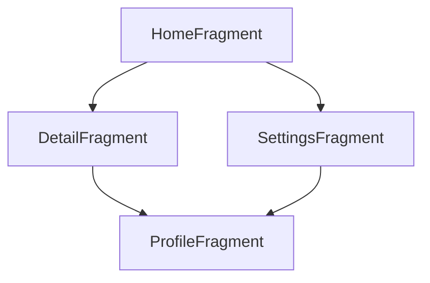

## 13.6 Navigation Component

In the world of Android development, managing in-app navigation can be a complex task, especially as applications grow in size and complexity. The Navigation Component, part of Android Jetpack, provides a robust framework for handling navigation within an app. It simplifies navigation between fragments, activities, and other components, ensuring a seamless user experience.

### Introduction to Navigation Component

The Navigation Component is designed to handle in-app navigation, offering a consistent and predictable user experience. It provides a set of tools and APIs to manage navigation, including:

- **Navigation Graph**: A resource file that defines all the possible paths a user can take through your app.
- **NavHostFragment**: A container that displays the destinations defined in your navigation graph.
- **NavController**: An object that manages app navigation within a NavHost.
- **Safe Args**: A Gradle plugin that generates type-safe classes for passing data between destinations.
- **Deep Links**: URLs that navigate users directly to specific content within your app.

Let's delve into each of these components and explore how they work together to facilitate smooth navigation in Android applications.

### Setting Up the Navigation Component

Before diving into the specifics, let's set up the Navigation Component in a Kotlin-based Android project.

#### Step 1: Add Dependencies

To use the Navigation Component, you need to add the necessary dependencies to your `build.gradle` file:

```groovy
dependencies {
    def nav_version = "2.5.0"

    implementation "androidx.navigation:navigation-fragment-ktx:$nav_version"
    implementation "androidx.navigation:navigation-ui-ktx:$nav_version"
}
```

These dependencies include the core libraries for navigation and UI integration.

#### Step 2: Create a Navigation Graph

A navigation graph is an XML resource file that defines the navigation paths in your app. You can create a navigation graph by right-clicking on the `res` directory and selecting `New > Android Resource File`. Name the file `nav_graph.xml` and set the resource type to `Navigation`.

Here's a simple example of a navigation graph:

```xml
<?xml version="1.0" encoding="utf-8"?>
<navigation xmlns:android="http://schemas.android.com/apk/res/android"
    xmlns:app="http://schemas.android.com/apk/res-auto"
    xmlns:tools="http://schemas.android.com/tools"
    app:startDestination="@id/homeFragment">

    <fragment
        android:id="@+id/homeFragment"
        android:name="com.example.app.HomeFragment"
        android:label="Home"
        tools:layout="@layout/fragment_home" />

    <fragment
        android:id="@+id/detailFragment"
        android:name="com.example.app.DetailFragment"
        android:label="Detail"
        tools:layout="@layout/fragment_detail">
        <argument
            android:name="itemId"
            app:argType="string" />
    </fragment>

    <action
        android:id="@+id/action_homeFragment_to_detailFragment"
        app:destination="@id/detailFragment"
        app:enterAnim="@anim/slide_in_right"
        app:exitAnim="@anim/slide_out_left" />
</navigation>
```

In this example, we define two fragments: `HomeFragment` and `DetailFragment`. We also define an action to navigate from the home fragment to the detail fragment, with custom animations.

#### Step 3: Set Up NavHostFragment

The `NavHostFragment` is a container that displays the destinations defined in your navigation graph. Add it to your activity's layout file:

```xml
<androidx.fragment.app.FragmentContainerView
    android:id="@+id/nav_host_fragment"
    android:layout_width="match_parent"
    android:layout_height="match_parent"
    app:navGraph="@navigation/nav_graph"
    android:name="androidx.navigation.fragment.NavHostFragment" />
```

This fragment container will host the navigation graph defined earlier.

#### Step 4: Connect NavController

The `NavController` is responsible for managing app navigation within the `NavHostFragment`. You can obtain a reference to the `NavController` in your activity or fragment:

```kotlin
val navController = findNavController(R.id.nav_host_fragment)
```

You can then use the `NavController` to navigate between destinations:

```kotlin
navController.navigate(R.id.action_homeFragment_to_detailFragment)
```

### Safe Args: Type-Safe Navigation

One of the standout features of the Navigation Component is Safe Args, which generates type-safe classes for passing data between destinations. This eliminates the need for manual bundle creation and ensures compile-time safety.

#### Enabling Safe Args

To enable Safe Args, add the following plugin to your `build.gradle` file:

```groovy
plugins {
    id 'androidx.navigation.safeargs.kotlin'
}
```

#### Passing Data with Safe Args

Let's revisit the navigation graph example. The `DetailFragment` has an argument `itemId` of type `String`. With Safe Args, you can pass this argument safely:

```kotlin
val action = HomeFragmentDirections.actionHomeFragmentToDetailFragment(itemId = "123")
navController.navigate(action)
```

In the `DetailFragment`, you can retrieve the argument using the generated `Args` class:

```kotlin
val args: DetailFragmentArgs by navArgs()
val itemId = args.itemId
```

### Deep Links: Navigating with URLs

Deep links allow users to navigate directly to specific content within your app using URLs. This is particularly useful for integrating with external sources or handling notifications.

#### Defining Deep Links

You can define deep links in your navigation graph using the `<deepLink>` element:

```xml
<fragment
    android:id="@+id/detailFragment"
    android:name="com.example.app.DetailFragment"
    android:label="Detail">
    <deepLink
        app:uri="https://www.example.com/detail/{itemId}" />
</fragment>
```

In this example, the `DetailFragment` can be accessed via the URL `https://www.example.com/detail/{itemId}`.

#### Handling Deep Links

To handle deep links, you need to configure an `intent-filter` in your manifest file:

```xml
<activity
    android:name=".MainActivity">
    <intent-filter>
        <action android:name="android.intent.action.VIEW" />
        <category android:name="android.intent.category.DEFAULT" />
        <category android:name="android.intent.category.BROWSABLE" />
        <data
            android:scheme="https"
            android:host="www.example.com"
            android:pathPattern="/detail/.*" />
    </intent-filter>
</activity>
```

With this configuration, your app can respond to deep links matching the specified pattern.

### Advanced Navigation Concepts

The Navigation Component offers several advanced features to enhance your app's navigation experience.

#### Nested Graphs

You can create nested navigation graphs to encapsulate related navigation flows. This is useful for organizing complex navigation structures.

```xml
<navigation
    android:id="@+id/nested_graph"
    app:startDestination="@id/innerFragment">

    <fragment
        android:id="@+id/innerFragment"
        android:name="com.example.app.InnerFragment"
        android:label="Inner" />
</navigation>
```

#### Global Actions

Global actions allow you to define actions that can be accessed from any destination within the navigation graph. This is useful for common actions like navigating to a settings screen.

```xml
<action
    android:id="@+id/action_global_settings"
    app:destination="@id/settingsFragment" />
```

#### Conditional Navigation

You can implement conditional navigation by checking conditions before navigating. For example, you might want to check if a user is logged in before navigating to a profile screen.

```kotlin
if (userIsLoggedIn) {
    navController.navigate(R.id.profileFragment)
} else {
    navController.navigate(R.id.loginFragment)
}
```

### Visualizing Navigation Flow

To better understand the navigation flow in your app, you can visualize it using a flowchart. Here's an example of how the navigation flow might look:



This diagram illustrates the possible navigation paths between fragments in the app.

### Best Practices for Using Navigation Component

- **Keep Navigation Graphs Simple**: Avoid overly complex navigation graphs. Use nested graphs to organize related flows.
- **Use Safe Args for Data Passing**: Always use Safe Args for passing data between destinations to ensure type safety.
- **Leverage Deep Links**: Utilize deep links to provide direct access to specific content within your app.
- **Handle Back Navigation**: Ensure that back navigation works as expected by configuring the back stack correctly.
- **Test Navigation Thoroughly**: Test all navigation paths to ensure a seamless user experience.

### Try It Yourself

To get hands-on experience with the Navigation Component, try modifying the code examples provided. Here are a few suggestions:

- Add a new fragment to the navigation graph and create an action to navigate to it.
- Implement a deep link that navigates directly to the new fragment.
- Use Safe Args to pass data to the new fragment and retrieve it.

### Knowledge Check

- **What is the primary purpose of the Navigation Component?**
- **How do you enable Safe Args in a Kotlin project?**
- **What is the role of a NavHostFragment?**
- **How can you define a deep link in a navigation graph?**
- **What are global actions, and when should you use them?**

### Summary

The Navigation Component is a powerful tool for managing in-app navigation in Android applications. By leveraging features like Safe Args and deep links, you can create a seamless and intuitive user experience. Remember, this is just the beginning. As you progress, you'll build more complex navigation flows and integrate additional features. Keep experimenting, stay curious, and enjoy the journey!

## Quiz Time!



### What is the primary purpose of the Navigation Component?

- [x] To manage in-app navigation between fragments and activities.
- [ ] To handle network requests.
- [ ] To manage app resources.
- [ ] To optimize app performance.

> **Explanation:** The Navigation Component is specifically designed to manage in-app navigation, providing a consistent and predictable user experience.

### How do you enable Safe Args in a Kotlin project?

- [x] By adding the `androidx.navigation.safeargs.kotlin` plugin to the build.gradle file.
- [ ] By importing the Safe Args library in the Kotlin file.
- [ ] By configuring Safe Args in the AndroidManifest.xml.
- [ ] By enabling Safe Args in the project settings.

> **Explanation:** Safe Args is enabled by adding the `androidx.navigation.safeargs.kotlin` plugin to the build.gradle file, which generates type-safe classes for navigation.

### What is the role of a NavHostFragment?

- [x] It acts as a container that displays destinations defined in the navigation graph.
- [ ] It manages network requests within the app.
- [ ] It handles user input and gestures.
- [ ] It optimizes app performance.

> **Explanation:** The NavHostFragment is a container that hosts the navigation graph, displaying the destinations and managing navigation transitions.

### How can you define a deep link in a navigation graph?

- [x] By using the `<deepLink>` element within a fragment or activity in the navigation graph.
- [ ] By adding a deep link entry in the AndroidManifest.xml.
- [ ] By configuring deep links in the build.gradle file.
- [ ] By defining deep links in the app's settings.

> **Explanation:** Deep links are defined using the `<deepLink>` element within a fragment or activity in the navigation graph, specifying the URI pattern.

### What are global actions, and when should you use them?

- [x] Global actions are actions that can be accessed from any destination within the navigation graph, used for common actions like navigating to a settings screen.
- [ ] Global actions are actions that are limited to a single fragment.
- [ ] Global actions are used to manage network requests globally.
- [ ] Global actions are used to optimize app performance.

> **Explanation:** Global actions are defined in the navigation graph and can be accessed from any destination, making them ideal for common actions like navigating to settings.

### What is the advantage of using Safe Args?

- [x] It ensures type-safe navigation and data passing between destinations.
- [ ] It optimizes app performance.
- [ ] It handles network requests efficiently.
- [ ] It manages app resources.

> **Explanation:** Safe Args generates type-safe classes for passing data between destinations, ensuring compile-time safety and reducing runtime errors.

### How can you handle conditional navigation in the Navigation Component?

- [x] By checking conditions before calling `navController.navigate()`.
- [ ] By configuring conditions in the navigation graph.
- [ ] By using a special conditional navigation library.
- [ ] By defining conditions in the AndroidManifest.xml.

> **Explanation:** Conditional navigation is handled by checking conditions in the code before calling `navController.navigate()` to determine the appropriate destination.

### What is the purpose of a navigation graph?

- [x] To define all possible navigation paths and destinations in an app.
- [ ] To manage app resources.
- [ ] To handle network requests.
- [ ] To optimize app performance.

> **Explanation:** A navigation graph is an XML resource file that defines all possible navigation paths and destinations, serving as a blueprint for app navigation.

### How can you visualize the navigation flow in your app?

- [x] By using flowcharts or diagrams to represent navigation paths.
- [ ] By writing detailed documentation.
- [ ] By configuring visualization settings in the app.
- [ ] By using a special visualization library.

> **Explanation:** Visualizing the navigation flow using flowcharts or diagrams helps understand the possible navigation paths and improve app design.

### True or False: The Navigation Component can only be used with fragments.

- [ ] True
- [x] False

> **Explanation:** The Navigation Component can be used with both fragments and activities, providing a flexible framework for managing navigation in Android apps.


