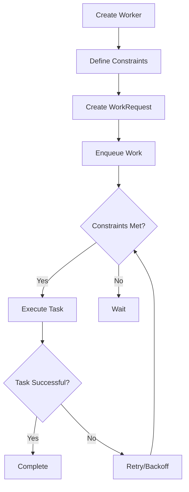

## 13.7 WorkManager

In the realm of Android development, efficiently managing background tasks is crucial for maintaining a responsive and user-friendly application. WorkManager, a part of Android Jetpack, provides a robust solution for scheduling and executing deferrable, guaranteed background work. This section delves into the intricacies of WorkManager, exploring its capabilities, constraints, and best practices for implementation in Kotlin.

### Understanding WorkManager

WorkManager is designed to handle background tasks that need guaranteed execution, even if the app exits or the device restarts. It is ideal for tasks such as uploading logs, syncing data, or processing images. WorkManager abstracts the complexity of choosing between different APIs like `JobScheduler`, `Firebase JobDispatcher`, or `AlarmManager`, providing a unified API that works on all devices running API level 14 and above.

#### Key Features of WorkManager

- **Guaranteed Execution**: Ensures that tasks are executed, even if the app is killed or the device restarts.
- **Constraint-based Execution**: Allows tasks to be executed only when specific conditions are met, such as network availability or device charging.
- **Chaining and Parallel Execution**: Supports chaining of tasks and running multiple tasks in parallel.
- **Backoff and Retry Policies**: Provides mechanisms to retry tasks in case of failure, with configurable backoff policies.
- **Observability**: Offers APIs to observe the status of work, making it easy to track progress and handle results.

### Getting Started with WorkManager

To use WorkManager in your Kotlin project, begin by adding the necessary dependencies to your `build.gradle` file:

```groovy
dependencies {
    def work_version = "2.7.0"
    implementation "androidx.work:work-runtime-ktx:$work_version"
}
```

#### Creating a Worker

A `Worker` is the fundamental unit of WorkManager, representing a single task. To create a Worker, subclass the `Worker` class and override the `doWork()` method. This method contains the code to be executed in the background.

```kotlin
import android.content.Context
import androidx.work.Worker
import androidx.work.WorkerParameters

class UploadWorker(appContext: Context, workerParams: WorkerParameters) : Worker(appContext, workerParams) {

    override fun doWork(): Result {
        // Perform the upload task
        return try {
            // Simulate upload task
            uploadData()
            Result.success()
        } catch (e: Exception) {
            Result.retry()
        }
    }

    private fun uploadData() {
        // Code to upload data
    }
}
```

### Scheduling Work with WorkManager

To schedule a task, create a `WorkRequest` and enqueue it using `WorkManager`. There are two types of WorkRequests: `OneTimeWorkRequest` for tasks that run once, and `PeriodicWorkRequest` for tasks that repeat at regular intervals.

#### One-Time Work Request

```kotlin
import androidx.work.OneTimeWorkRequestBuilder
import androidx.work.WorkManager

val uploadWorkRequest = OneTimeWorkRequestBuilder<UploadWorker>().build()
WorkManager.getInstance(context).enqueue(uploadWorkRequest)
```

#### Periodic Work Request

```kotlin
import androidx.work.PeriodicWorkRequestBuilder
import java.util.concurrent.TimeUnit

val periodicWorkRequest = PeriodicWorkRequestBuilder<UploadWorker>(15, TimeUnit.MINUTES).build()
WorkManager.getInstance(context).enqueue(periodicWorkRequest)
```

### Handling Constraints

WorkManager allows you to specify constraints that must be met for a task to execute. Common constraints include network availability, device charging status, and battery level.

#### Example: Network Constraint

```kotlin
import androidx.work.Constraints
import androidx.work.NetworkType

val constraints = Constraints.Builder()
    .setRequiredNetworkType(NetworkType.CONNECTED)
    .build()

val constrainedWorkRequest = OneTimeWorkRequestBuilder<UploadWorker>()
    .setConstraints(constraints)
    .build()

WorkManager.getInstance(context).enqueue(constrainedWorkRequest)
```

### Implementing Retry and Backoff Policies

WorkManager provides built-in support for retrying tasks that fail. You can specify a backoff policy to determine how retries are handled.

#### Example: Exponential Backoff

```kotlin
import androidx.work.BackoffPolicy
import androidx.work.OneTimeWorkRequestBuilder
import java.util.concurrent.TimeUnit

val workRequest = OneTimeWorkRequestBuilder<UploadWorker>()
    .setBackoffCriteria(BackoffPolicy.EXPONENTIAL, 10, TimeUnit.SECONDS)
    .build()

WorkManager.getInstance(context).enqueue(workRequest)
```

### Chaining Work Requests

WorkManager supports chaining multiple WorkRequests to create complex workflows. You can chain tasks sequentially or in parallel.

#### Sequential Chaining

```kotlin
val workA = OneTimeWorkRequestBuilder<WorkerA>().build()
val workB = OneTimeWorkRequestBuilder<WorkerB>().build()

WorkManager.getInstance(context)
    .beginWith(workA)
    .then(workB)
    .enqueue()
```

#### Parallel Execution

```kotlin
val workA = OneTimeWorkRequestBuilder<WorkerA>().build()
val workB = OneTimeWorkRequestBuilder<WorkerB>().build()

WorkManager.getInstance(context)
    .beginWith(listOf(workA, workB))
    .enqueue()
```

### Observing Work Status

You can observe the status of a WorkRequest to update the UI or handle results. WorkManager provides LiveData support for observing work status.

```kotlin
val workId = uploadWorkRequest.id
WorkManager.getInstance(context).getWorkInfoByIdLiveData(workId)
    .observe(lifecycleOwner, { workInfo ->
        if (workInfo != null && workInfo.state.isFinished) {
            // Handle completion
        }
    })
```

### Design Considerations

When using WorkManager, consider the following design aspects:

- **Idempotency**: Ensure that your tasks can be safely retried without causing unintended side effects.
- **Resource Management**: Be mindful of device resources, such as battery and network usage, when scheduling tasks.
- **Error Handling**: Implement robust error handling and retry mechanisms to ensure task completion.
- **Testing**: Test your WorkManager implementation thoroughly, especially in scenarios involving constraints and retries.

### Differences and Similarities with Other Patterns

WorkManager is often compared to other background processing tools like `JobScheduler` and `AlarmManager`. Unlike these tools, WorkManager provides a unified API that works across all Android versions and handles task persistence and constraints more effectively.

### Try It Yourself

Experiment with the following modifications to the code examples:

- **Add a Constraint**: Modify the `UploadWorker` to only execute when the device is charging.
- **Implement a Retry Mechanism**: Change the backoff policy to linear and observe the behavior.
- **Chain Multiple Tasks**: Create a workflow that involves three tasks executed in sequence.

### Visualizing WorkManager Workflow



### Knowledge Check

- **What is the primary purpose of WorkManager?**
- **How does WorkManager handle task retries?**
- **What are the benefits of using constraints in WorkManager?**

### Conclusion

WorkManager is a powerful tool for managing background tasks in Android applications. By understanding its features and best practices, you can ensure efficient and reliable task execution, enhancing the overall user experience. Remember, this is just the beginning. As you progress, you'll build more complex and interactive applications. Keep experimenting, stay curious, and enjoy the journey!

## Quiz Time!



### What is the primary purpose of WorkManager?

- [x] To schedule and execute deferrable, guaranteed background work.
- [ ] To manage UI components.
- [ ] To handle database operations.
- [ ] To perform network requests.

> **Explanation:** WorkManager is designed for scheduling and executing background tasks that need guaranteed execution.

### Which API level does WorkManager support?

- [x] API level 14 and above.
- [ ] API level 21 and above.
- [ ] API level 16 and above.
- [ ] API level 19 and above.

> **Explanation:** WorkManager provides a unified API that works on all devices running API level 14 and above.

### What is a Worker in WorkManager?

- [x] A class representing a single background task.
- [ ] A UI component.
- [ ] A database entity.
- [ ] A network request handler.

> **Explanation:** A Worker is the fundamental unit of WorkManager, representing a single task to be executed in the background.

### How can you specify constraints for a WorkRequest?

- [x] By using the Constraints.Builder class.
- [ ] By setting properties in the AndroidManifest.
- [ ] By configuring the build.gradle file.
- [ ] By using XML layout files.

> **Explanation:** Constraints for a WorkRequest are specified using the Constraints.Builder class.

### What is the purpose of backoff policies in WorkManager?

- [x] To determine how retries are handled for failed tasks.
- [ ] To manage UI updates.
- [ ] To handle database transactions.
- [ ] To configure network settings.

> **Explanation:** Backoff policies in WorkManager determine how retries are handled for tasks that fail.

### How can you observe the status of a WorkRequest?

- [x] By using LiveData support provided by WorkManager.
- [ ] By checking the AndroidManifest.
- [ ] By querying the database.
- [ ] By inspecting the build.gradle file.

> **Explanation:** WorkManager provides LiveData support for observing the status of a WorkRequest.

### What is the benefit of chaining WorkRequests?

- [x] To create complex workflows by executing tasks sequentially or in parallel.
- [ ] To improve UI performance.
- [ ] To reduce network latency.
- [ ] To manage database connections.

> **Explanation:** Chaining WorkRequests allows for creating complex workflows by executing tasks in a specified order.

### What should you consider when implementing WorkManager?

- [x] Idempotency, resource management, error handling, and testing.
- [ ] UI design, color schemes, and animations.
- [ ] Database schema, indexing, and normalization.
- [ ] Network protocols, encryption, and compression.

> **Explanation:** When implementing WorkManager, consider idempotency, resource management, error handling, and testing.

### How does WorkManager differ from JobScheduler?

- [x] WorkManager provides a unified API that works across all Android versions and handles task persistence and constraints more effectively.
- [ ] WorkManager is only available on API level 21 and above.
- [ ] WorkManager is used for managing UI components.
- [ ] WorkManager is used for database operations.

> **Explanation:** WorkManager provides a unified API that works across all Android versions, unlike JobScheduler, which is limited to newer versions.

### True or False: WorkManager can execute tasks even if the app is killed or the device restarts.

- [x] True
- [ ] False

> **Explanation:** WorkManager ensures that tasks are executed, even if the app is killed or the device restarts.


