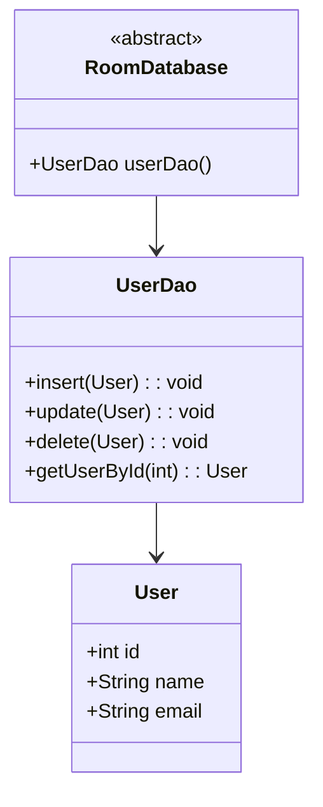

## 13.8 Room Persistence Library

The Room Persistence Library is an essential component for Android developers looking to manage local databases efficiently. It provides an abstraction layer over SQLite, allowing for more robust database access while harnessing the full power of SQLite. In this section, we will explore the Room Persistence Library in-depth, focusing on its integration with Kotlin, concurrency management, and ensuring data integrity.

### Introduction to Room Persistence Library

The Room Persistence Library is part of Android Jetpack, designed to simplify database management in Android applications. It provides a higher-level API over SQLite, enabling developers to work with databases using Kotlin's expressive syntax and type safety.

#### Key Features

- **Compile-time verification of SQL queries**: Room verifies SQL queries at compile time, reducing runtime errors.
- **Simplified database access**: By using annotations, Room reduces boilerplate code, making database access more straightforward.
- **Seamless integration with LiveData and Kotlin Coroutines**: Room supports reactive programming patterns, making it easier to work with asynchronous data streams.
- **Migration support**: Room provides tools to handle database migrations, ensuring data integrity across app updates.

### Setting Up Room in Your Kotlin Project

To start using Room, you need to include the necessary dependencies in your `build.gradle` file:

```kotlin
dependencies {
    def room_version = "2.5.0"

    implementation "androidx.room:room-runtime:$room_version"
    kapt "androidx.room:room-compiler:$room_version"

    // Optional - Kotlin Extensions and Coroutines support for Room
    implementation "androidx.room:room-ktx:$room_version"
}
```

Ensure you have applied the Kotlin KAPT plugin for annotation processing:

```kotlin
apply plugin: 'kotlin-kapt'
```

### Core Components of Room

Room consists of three main components:

1. **Entity**: Represents a table within the database.
2. **DAO (Data Access Object)**: Defines methods for accessing the database.
3. **Database**: Provides the main access point to the persisted data.

#### Defining an Entity

An entity in Room is a Kotlin data class annotated with `@Entity`. Each field in the class represents a column in the table.

```kotlin
@Entity(tableName = "users")
data class User(
    @PrimaryKey(autoGenerate = true) val id: Int = 0,
    val name: String,
    val email: String
)
```

- **@Entity**: Specifies that this class is an entity.
- **@PrimaryKey**: Denotes the primary key of the table. The `autoGenerate` attribute is used to auto-increment the ID.

#### Creating a DAO

The DAO is an interface or abstract class annotated with `@Dao`. It contains methods for accessing the database.

```kotlin
@Dao
interface UserDao {
    @Insert
    suspend fun insert(user: User)

    @Update
    suspend fun update(user: User)

    @Delete
    suspend fun delete(user: User)

    @Query("SELECT * FROM users WHERE id = :userId")
    suspend fun getUserById(userId: Int): User?
}
```

- **@Insert, @Update, @Delete**: Annotations for basic CRUD operations.
- **@Query**: Used to define custom SQL queries.

#### Setting Up the Database

The database class is an abstract class annotated with `@Database`. It extends `RoomDatabase` and provides DAOs.

```kotlin
@Database(entities = [User::class], version = 1, exportSchema = false)
abstract class AppDatabase : RoomDatabase() {
    abstract fun userDao(): UserDao
}
```

- **@Database**: Specifies the entities and version of the database.
- **Room.databaseBuilder**: Used to create an instance of the database.

### Working with Room and Kotlin Coroutines

Room integrates seamlessly with Kotlin Coroutines, allowing for asynchronous database operations without blocking the main thread.

#### Performing Asynchronous Operations

Using coroutines, you can perform database operations in a non-blocking manner:

```kotlin
class UserRepository(private val userDao: UserDao) {

    suspend fun addUser(user: User) {
        userDao.insert(user)
    }

    suspend fun getUser(userId: Int): User? {
        return userDao.getUserById(userId)
    }
}
```

- **suspend functions**: Used to perform operations asynchronously.

### Concurrency and Data Integrity

Managing concurrency and ensuring data integrity are crucial when dealing with databases. Room provides several mechanisms to handle these challenges.

#### Transactions

Room supports transactions, allowing multiple operations to be executed atomically.

```kotlin
@Transaction
suspend fun updateUserAndLog(user: User, log: Log) {
    userDao.update(user)
    logDao.insert(log)
}
```

- **@Transaction**: Ensures that all operations within the function are executed as a single transaction.

#### Handling Concurrency

Room provides mechanisms to handle concurrency, ensuring that database operations do not lead to data inconsistencies.

- **Coroutines**: Use coroutines to perform database operations off the main thread.
- **LiveData**: Use LiveData to observe database changes and update the UI reactively.

### Migration Strategies

As your application evolves, you may need to change the database schema. Room provides tools to handle migrations safely.

#### Defining a Migration

A migration defines how to transform the schema from one version to another.

```kotlin
val MIGRATION_1_2 = object : Migration(1, 2) {
    override fun migrate(database: SupportSQLiteDatabase) {
        database.execSQL("ALTER TABLE users ADD COLUMN age INTEGER DEFAULT 0 NOT NULL")
    }
}
```

- **Migration class**: Defines the migration logic between two versions.

#### Applying Migrations

When building the database, apply migrations to ensure data integrity:

```kotlin
val db = Room.databaseBuilder(
    context.applicationContext,
    AppDatabase::class.java, "database-name"
).addMigrations(MIGRATION_1_2).build()
```

### Testing with Room

Testing is a critical aspect of database management. Room provides tools to facilitate testing.

#### Using In-Memory Databases

For testing purposes, you can use an in-memory database, which is faster and does not persist data.

```kotlin
val db = Room.inMemoryDatabaseBuilder(
    context.applicationContext,
    AppDatabase::class.java
).build()
```

#### Writing Test Cases

Use JUnit and AndroidX Test libraries to write test cases for your database operations.

```kotlin
@Test
fun testInsertUser() = runBlocking {
    val user = User(name = "John Doe", email = "john.doe@example.com")
    userDao.insert(user)

    val retrievedUser = userDao.getUserById(user.id)
    assertEquals(user.name, retrievedUser?.name)
}
```

### Best Practices for Room

To make the most of Room, consider the following best practices:

- **Use Primary Keys**: Always define a primary key for your entities.
- **Avoid Long-Running Operations on the Main Thread**: Use coroutines or LiveData to perform operations asynchronously.
- **Handle Migrations Carefully**: Ensure that migrations are well-tested to prevent data loss.
- **Leverage Room's Compile-Time Checks**: Take advantage of Room's compile-time checks to catch errors early.

### Advanced Room Features

Room offers several advanced features that can enhance your database management capabilities.

#### Multi-Threading with Room

Room supports multi-threading, allowing you to perform database operations on different threads safely.

- **Coroutines**: Use coroutines to manage threading efficiently.
- **Executor**: Customize the executor used by Room for background operations.

#### Using Type Converters

Room supports custom data types through type converters.

```kotlin
class Converters {
    @TypeConverter
    fun fromTimestamp(value: Long?): Date? {
        return value?.let { Date(it) }
    }

    @TypeConverter
    fun dateToTimestamp(date: Date?): Long? {
        return date?.time
    }
}
```

- **@TypeConverter**: Annotate methods to convert custom types to and from supported types.

#### Room with RxJava

Room also integrates with RxJava, allowing for reactive programming patterns.

```kotlin
@Query("SELECT * FROM users")
fun getAllUsers(): Flowable<List<User>>
```

- **Flowable**: Use RxJava's Flowable to observe database changes reactively.

### Visualizing Room Architecture

To better understand how Room fits into your application architecture, consider the following diagram:



- **RoomDatabase**: Represents the database, providing access to DAOs.
- **UserDao**: Defines methods for accessing user data.
- **User**: Represents the user entity.

### Try It Yourself

To solidify your understanding of Room, try modifying the code examples provided:

- **Add a new field** to the `User` entity and update the DAO and database accordingly.
- **Implement a new DAO method** to retrieve users by email.
- **Create a migration** to add a new table to the database.

### Conclusion

The Room Persistence Library is a powerful tool for managing local databases in Android applications. By leveraging its features, you can ensure efficient data access, maintain data integrity, and handle concurrency effectively. As you continue to explore Room, remember to experiment with its advanced features and integrate it with other components of your application architecture.

### Resources for Further Learning

- [Android Developers: Room Persistence Library](https://developer.android.com/training/data-storage/room)
- [Kotlin Coroutines Guide](https://kotlinlang.org/docs/coroutines-guide.html)
- [RxJava Documentation](https://github.com/ReactiveX/RxJava)

## Quiz Time!



### What is the primary purpose of the Room Persistence Library in Android?

- [x] To provide an abstraction layer over SQLite for easier database management
- [ ] To replace SQLite with a new database engine
- [ ] To manage network requests in Android applications
- [ ] To handle UI rendering in Android apps

> **Explanation:** Room provides an abstraction layer over SQLite, simplifying database management while leveraging SQLite's capabilities.

### Which annotation is used to define a table in Room?

- [x] @Entity
- [ ] @Table
- [ ] @Database
- [ ] @Column

> **Explanation:** The `@Entity` annotation is used to define a table in Room.

### How does Room ensure compile-time verification of SQL queries?

- [x] By checking SQL queries during the build process
- [ ] By executing SQL queries at runtime
- [ ] By using reflection to verify queries
- [ ] By logging SQL errors during app execution

> **Explanation:** Room verifies SQL queries at compile time, reducing runtime errors.

### Which of the following is NOT a component of Room?

- [ ] Entity
- [ ] DAO
- [ ] Database
- [x] Service

> **Explanation:** Service is not a component of Room. Room consists of Entity, DAO, and Database components.

### What is the role of the @Dao annotation in Room?

- [x] To define methods for accessing the database
- [ ] To specify the primary key of a table
- [ ] To create a new database instance
- [ ] To handle database migrations

> **Explanation:** The `@Dao` annotation is used to define methods for accessing the database.

### How can you perform asynchronous database operations with Room?

- [x] By using Kotlin Coroutines
- [ ] By using AsyncTask
- [ ] By using Thread
- [ ] By using Handler

> **Explanation:** Room integrates with Kotlin Coroutines to perform asynchronous database operations.

### What is the purpose of the @Transaction annotation in Room?

- [x] To ensure multiple operations are executed atomically
- [ ] To define a new database transaction
- [ ] To rollback changes in case of an error
- [ ] To log database transactions

> **Explanation:** The `@Transaction` annotation ensures that multiple operations are executed atomically.

### Which method is used to create an in-memory database for testing in Room?

- [x] Room.inMemoryDatabaseBuilder
- [ ] Room.databaseBuilder
- [ ] Room.createInMemoryDatabase
- [ ] Room.testDatabaseBuilder

> **Explanation:** `Room.inMemoryDatabaseBuilder` is used to create an in-memory database for testing.

### What is the benefit of using LiveData with Room?

- [x] To observe database changes and update the UI reactively
- [ ] To perform synchronous database operations
- [ ] To manage network requests
- [ ] To handle UI animations

> **Explanation:** LiveData allows observing database changes and updating the UI reactively.

### True or False: Room supports custom data types through type converters.

- [x] True
- [ ] False

> **Explanation:** Room supports custom data types by using type converters to convert them to and from supported types.



Remember, mastering Room is just one step in your journey as an Android developer. Keep exploring, experimenting, and building amazing applications with Kotlin and Android!
