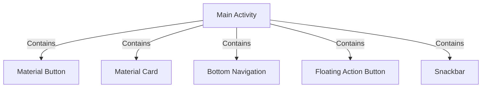

## 13.9 Material Design and UI

Material Design is a design language developed by Google, intended to create a unified experience across platforms and devices. It emphasizes clean, bold, and intentional design, providing a consistent user experience. In this section, we will explore how to implement Material Design principles in Android applications using Kotlin, focusing on Material Components and modern UI patterns.

### Understanding Material Design

Material Design is based on the principles of tangible surfaces, bold graphic design, and meaningful motion. It aims to create a visual language that synthesizes classic design principles with the innovation and possibility of technology and science.

#### Key Principles of Material Design

1. **Material is the Metaphor**: Material Design uses the metaphor of physical materials to create a sense of space and hierarchy. Elements should behave like real-world objects, with surfaces and edges that provide visual cues.

2. **Bold, Graphic, Intentional**: The design should be bold and intentional, with a focus on typography, color, and imagery to guide the user’s attention.

3. **Motion Provides Meaning**: Motion is used to convey how elements interact and respond to user input. Transitions should be smooth and meaningful, helping users understand changes in the interface.

### Implementing Material Design in Android

To implement Material Design in Android, Google provides a set of Material Components that can be used to create applications that adhere to Material Design guidelines. These components are available through the Material Components for Android library.

#### Setting Up Material Components

To use Material Components in your Android project, you need to include the Material Components library in your `build.gradle` file:

```kotlin
dependencies {
    implementation 'com.google.android.material:material:1.4.0'
}
```

#### Using Material Components

Material Components provide a wide range of UI elements, such as buttons, cards, and navigation drawers, that follow Material Design principles. Let's explore some of these components and how to use them in Kotlin.

##### Material Buttons

Material Buttons are an essential part of Material Design, offering various styles and configurations. Here's how to create a Material Button in XML:

```xml
<com.google.android.material.button.MaterialButton
    android:id="@+id/materialButton"
    android:layout_width="wrap_content"
    android:layout_height="wrap_content"
    android:text="Material Button"
    style="@style/Widget.MaterialComponents.Button" />
```

In Kotlin, you can interact with this button as follows:

```kotlin
val materialButton: MaterialButton = findViewById(R.id.materialButton)
materialButton.setOnClickListener {
    // Handle button click
}
```

##### Material Cards

Material Cards are used to display content and actions on a single topic. They can contain a variety of elements, such as text, images, and buttons.

```xml
<com.google.android.material.card.MaterialCardView
    android:layout_width="match_parent"
    android:layout_height="wrap_content"
    app:cardCornerRadius="8dp"
    app:cardElevation="4dp">

    <TextView
        android:layout_width="wrap_content"
        android:layout_height="wrap_content"
        android:text="This is a Material Card" />
</com.google.android.material.card.MaterialCardView>
```

##### Material Navigation Drawer

A Navigation Drawer provides access to destinations in your app. It can be implemented using the `DrawerLayout` and `NavigationView` components.

```xml
<androidx.drawerlayout.widget.DrawerLayout
    android:layout_width="match_parent"
    android:layout_height="match_parent">

    <!-- Main content -->

    <com.google.android.material.navigation.NavigationView
        android:layout_width="wrap_content"
        android:layout_height="match_parent"
        app:menu="@menu/navigation_menu" />
</androidx.drawerlayout.widget.DrawerLayout>
```

### Creating a Consistent UI with Material Theming

Material Theming allows you to customize Material Components to reflect your brand’s style. It involves defining a color palette, typography, and shape scheme.

#### Defining a Color Palette

Define your app's color palette in `colors.xml`:

```xml
<color name="primaryColor">#6200EE</color>
<color name="primaryVariantColor">#3700B3</color>
<color name="secondaryColor">#03DAC5</color>
```

Apply these colors in your theme:

```xml
<style name="AppTheme" parent="Theme.MaterialComponents.DayNight.DarkActionBar">
    <item name="colorPrimary">@color/primaryColor</item>
    <item name="colorPrimaryVariant">@color/primaryVariantColor</item>
    <item name="colorSecondary">@color/secondaryColor</item>
</style>
```

#### Customizing Typography

Typography is a key aspect of Material Design. Define custom fonts in `res/font` and apply them in your theme:

```xml
<style name="AppTheme" parent="Theme.MaterialComponents.DayNight.DarkActionBar">
    <item name="fontFamily">@font/roboto</item>
</style>
```

#### Shaping Components

Material Components can be customized with different shapes. Define shapes in `shapes.xml`:

```xml
<shape xmlns:android="http://schemas.android.com/apk/res/android"
    android:shape="rectangle">
    <corners android:radius="8dp" />
</shape>
```

### Advanced UI Patterns with Material Design

Material Design encourages the use of advanced UI patterns to create engaging and intuitive user experiences. Let's explore some of these patterns.

#### Bottom Navigation

Bottom Navigation is used to navigate between primary destinations in an app. It provides quick access to top-level views.

```xml
<com.google.android.material.bottomnavigation.BottomNavigationView
    android:id="@+id/bottomNavigationView"
    android:layout_width="match_parent"
    android:layout_height="wrap_content"
    app:menu="@menu/bottom_navigation_menu" />
```

In Kotlin, handle navigation item selection:

```kotlin
val bottomNavigationView: BottomNavigationView = findViewById(R.id.bottomNavigationView)
bottomNavigationView.setOnNavigationItemSelectedListener { item ->
    when (item.itemId) {
        R.id.nav_home -> {
            // Navigate to home
            true
        }
        R.id.nav_profile -> {
            // Navigate to profile
            true
        }
        else -> false
    }
}
```

#### Floating Action Button (FAB)

The Floating Action Button is a circular button that triggers a primary action in your app.

```xml
<com.google.android.material.floatingactionbutton.FloatingActionButton
    android:id="@+id/fab"
    android:layout_width="wrap_content"
    android:layout_height="wrap_content"
    app:srcCompat="@drawable/ic_add" />
```

In Kotlin, handle FAB clicks:

```kotlin
val fab: FloatingActionButton = findViewById(R.id.fab)
fab.setOnClickListener {
    // Handle FAB click
}
```

#### Snackbar

A Snackbar provides brief feedback about an operation through a message at the bottom of the screen.

```kotlin
Snackbar.make(view, "Action completed", Snackbar.LENGTH_SHORT).show()
```

### Designing for Accessibility

Accessibility is an important aspect of UI design, ensuring that applications are usable by everyone, including people with disabilities.

#### Best Practices for Accessibility

- **Content Descriptions**: Provide content descriptions for UI elements that convey meaning.
- **Contrast and Color**: Ensure sufficient contrast between text and background colors.
- **Touch Targets**: Make touch targets large enough for easy interaction.

#### Implementing Accessibility in Kotlin

Use the `contentDescription` attribute in XML:

```xml
<ImageView
    android:layout_width="wrap_content"
    android:layout_height="wrap_content"
    android:contentDescription="@string/image_description" />
```

### Testing and Debugging Material UI

Testing and debugging are crucial for ensuring that your UI behaves as expected across different devices and screen sizes.

#### Using Android Studio Layout Inspector

The Layout Inspector in Android Studio allows you to inspect the view hierarchy and properties of your app’s UI.

#### Writing UI Tests with Espresso

Espresso is a testing framework for writing UI tests in Android. Here's a simple test for a button click:

```kotlin
@Test
fun testButtonClick() {
    onView(withId(R.id.materialButton)).perform(click())
    onView(withText("Action completed")).check(matches(isDisplayed()))
}
```

### Try It Yourself

Experiment with the code examples provided in this section. Try modifying the styles and properties of Material Components to see how they affect the UI. For instance, change the color palette or typography and observe the impact on the app's appearance.

### Visualizing Material Design Components

To better understand the relationships and hierarchy of Material Design components, let's visualize a simple layout using a Mermaid.js diagram.



This diagram represents a typical Android activity layout containing various Material Design components.

### Key Takeaways

- Material Design provides a unified design language that enhances user experience across platforms.
- Material Components offer ready-to-use UI elements that adhere to Material Design principles.
- Customizing themes and styles allows you to create a unique brand identity while maintaining consistency.
- Accessibility and testing are crucial for creating inclusive and reliable applications.

### References and Further Reading

- [Material Design Guidelines](https://material.io/design)
- [Material Components for Android](https://github.com/material-components/material-components-android)
- [Android Developers - Material Design](https://developer.android.com/guide/topics/ui/look-and-feel)

## Quiz Time!



### What is the primary purpose of Material Design?

- [x] To create a unified design language across platforms
- [ ] To replace all existing design languages
- [ ] To focus solely on typography
- [ ] To eliminate the need for UI testing

> **Explanation:** Material Design aims to create a consistent and unified design language across different platforms and devices.

### Which component is used to display brief feedback messages in Material Design?

- [ ] Toast
- [x] Snackbar
- [ ] AlertDialog
- [ ] Notification

> **Explanation:** A Snackbar is used to provide brief feedback about an operation at the bottom of the screen.

### How do you define a custom color palette in an Android app?

- [ ] In the `strings.xml` file
- [x] In the `colors.xml` file
- [ ] In the `styles.xml` file
- [ ] In the `dimens.xml` file

> **Explanation:** Custom color palettes are defined in the `colors.xml` file.

### What is the role of a Floating Action Button (FAB) in Material Design?

- [ ] To display a list of actions
- [x] To trigger a primary action
- [ ] To navigate between screens
- [ ] To display notifications

> **Explanation:** A Floating Action Button (FAB) is used to trigger a primary action in an app.

### Which tool can be used to inspect the view hierarchy of an Android app?

- [ ] Espresso
- [ ] JUnit
- [x] Layout Inspector
- [ ] Logcat

> **Explanation:** The Layout Inspector in Android Studio allows developers to inspect the view hierarchy and properties of an app’s UI.

### What is the purpose of the `contentDescription` attribute in Android?

- [ ] To define the layout of a view
- [x] To provide accessibility information
- [ ] To specify the color of a view
- [ ] To set the text size of a view

> **Explanation:** The `contentDescription` attribute provides accessibility information for UI elements, helping users with disabilities.

### How can you handle a button click in Kotlin?

- [ ] Using a `switch` statement
- [x] Using a `setOnClickListener` method
- [ ] Using a `try-catch` block
- [ ] Using a `for` loop

> **Explanation:** The `setOnClickListener` method is used to handle button clicks in Kotlin.

### What is the main advantage of using Material Components in Android?

- [x] They adhere to Material Design principles
- [ ] They are faster than other components
- [ ] They are easier to code
- [ ] They eliminate the need for testing

> **Explanation:** Material Components are designed to adhere to Material Design principles, providing a consistent and unified user experience.

### Which of the following is a key principle of Material Design?

- [ ] Minimalism
- [x] Motion Provides Meaning
- [ ] Complexity
- [ ] Randomness

> **Explanation:** "Motion Provides Meaning" is one of the key principles of Material Design, emphasizing the use of motion to convey interactions and changes.

### True or False: Material Theming allows you to customize the appearance of Material Components to reflect your brand's style.

- [x] True
- [ ] False

> **Explanation:** Material Theming enables customization of Material Components to align with a brand's unique style, including color, typography, and shape.



Remember, this is just the beginning. As you progress, you'll build more complex and interactive user interfaces. Keep experimenting, stay curious, and enjoy the journey!
