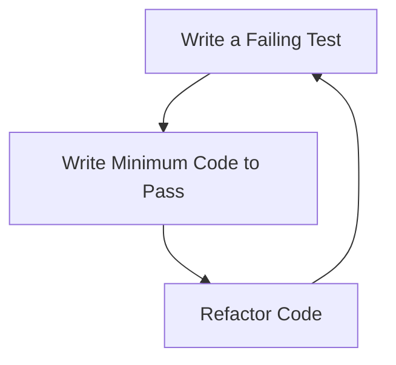

## 14.1 Test-Driven Development (TDD) in Kotlin

Test-Driven Development (TDD) is a software development approach that emphasizes writing tests before writing the actual code. This methodology encourages developers to think through the design and requirements of a feature before implementation, ensuring that the code meets its intended purpose. In this section, we will delve into the principles of TDD, its application in Kotlin, and how it can enhance the development process.

### Understanding Test-Driven Development

TDD is a cycle of writing a test, writing the minimum code to pass the test, and then refactoring the code. This cycle is often summarized as "Red-Green-Refactor":

1. **Red**: Write a test that defines a function or improvements of a function, which should fail initially because the function isn't implemented yet.
2. **Green**: Write the minimum amount of code necessary to pass the test.
3. **Refactor**: Clean up the code, ensuring that it remains functional and efficient.

#### Benefits of TDD

- **Improved Code Quality**: By writing tests first, developers ensure that the code meets the specified requirements.
- **Reduced Bugs**: Tests catch errors early in the development process.
- **Better Design**: TDD encourages developers to think about the design and architecture of their code before implementation.
- **Documentation**: Tests serve as documentation for the code, explaining what it is supposed to do.

### TDD in Kotlin

Kotlin, with its expressive syntax and powerful features, is well-suited for TDD. Its interoperability with Java allows developers to use existing Java testing frameworks like JUnit, while Kotlin-specific libraries such as Kotest offer additional functionality tailored to Kotlin's features.

#### Setting Up a Kotlin Project for TDD

Before diving into TDD, ensure your Kotlin project is set up with the necessary testing libraries. Here's a simple setup using Gradle:

```kotlin
plugins {
    kotlin("jvm") version "1.8.0"
    id("org.jetbrains.kotlin.plugin.allopen") version "1.8.0"
}

repositories {
    mavenCentral()
}

dependencies {
    testImplementation("org.junit.jupiter:junit-jupiter:5.8.1")
    testImplementation("io.kotest:kotest-runner-junit5:5.0.0")
    testImplementation("io.mockk:mockk:1.12.0")
}

tasks.test {
    useJUnitPlatform()
}
```

This setup includes JUnit for running tests and Kotest for writing expressive test cases.

### Writing Tests First

The core principle of TDD is to write tests before writing the actual code. This approach ensures that the code is designed to meet the test requirements from the outset.

#### Example: TDD for a Simple Calculator

Let's walk through a TDD example by developing a simple calculator in Kotlin.

1. **Red Phase**: Write a failing test.

```kotlin
import io.kotest.core.spec.style.StringSpec
import io.kotest.matchers.shouldBe

class CalculatorTest : StringSpec({
    "addition should return the sum of two numbers" {
        val calculator = Calculator()
        calculator.add(2, 3) shouldBe 5
    }
})
```

In this test, we define a `Calculator` class with an `add` method that should return the sum of two numbers. Since the `Calculator` class does not exist yet, this test will fail.

2. **Green Phase**: Implement the minimum code to pass the test.

```kotlin
class Calculator {
    fun add(a: Int, b: Int): Int {
        return a + b
    }
}
```

With this implementation, the test should pass, as the `add` method now returns the sum of two numbers.

3. **Refactor Phase**: Clean up the code.

In this simple example, there isn't much to refactor, but in more complex scenarios, you might optimize the code, improve readability, or remove duplication.

### Advanced TDD Concepts in Kotlin

#### Mocking and Stubbing

In TDD, it's often necessary to isolate the unit being tested from its dependencies. This is where mocking and stubbing come into play. Kotlin's `mockk` library is a powerful tool for creating mocks and stubs.

```kotlin
import io.mockk.every
import io.mockk.mockk
import io.mockk.verify

class CalculatorService(private val calculator: Calculator) {
    fun calculateSum(a: Int, b: Int): Int {
        return calculator.add(a, b)
    }
}

class CalculatorServiceTest : StringSpec({
    "calculateSum should return the correct sum" {
        val calculator = mockk<Calculator>()
        every { calculator.add(2, 3) } returns 5

        val service = CalculatorService(calculator)
        service.calculateSum(2, 3) shouldBe 5

        verify { calculator.add(2, 3) }
    }
})
```

In this example, we mock the `Calculator` class to test the `CalculatorService` without relying on the actual implementation of `Calculator`.

#### Parameterized Tests

Parameterized tests allow you to run the same test logic with different inputs. Kotest supports parameterized tests, making it easy to test multiple scenarios with minimal code.

```kotlin
import io.kotest.data.forAll
import io.kotest.data.row
import io.kotest.matchers.shouldBe

class ParameterizedCalculatorTest : StringSpec({
    "addition should return the correct sum for various inputs" {
        forAll(
            row(1, 1, 2),
            row(2, 2, 4),
            row(3, 3, 6)
        ) { a, b, result ->
            val calculator = Calculator()
            calculator.add(a, b) shouldBe result
        }
    }
})
```

This test runs the same addition logic with different sets of inputs, verifying that the `add` method behaves correctly in each case.

### Visualizing the TDD Cycle

To better understand the TDD process, let's visualize the Red-Green-Refactor cycle using a flowchart.



**Caption**: The TDD cycle involves writing a failing test, implementing code to pass the test, and refactoring the code.

### Best Practices for TDD in Kotlin

- **Keep Tests Simple**: Write clear and concise tests that focus on a single aspect of the code.
- **Test Behavior, Not Implementation**: Focus on what the code should do, not how it does it.
- **Use Descriptive Names**: Name your tests clearly to indicate what they are verifying.
- **Avoid Over-Mocking**: Use mocks sparingly to avoid coupling tests too closely to the implementation.
- **Refactor Regularly**: Continuously improve the code and tests to maintain readability and efficiency.

### Challenges and Considerations

While TDD offers many benefits, it also presents challenges:

- **Initial Time Investment**: Writing tests first can slow down initial development, but it pays off in reduced debugging time later.
- **Complexity in Testing**: Some features are difficult to test, requiring careful consideration of test design.
- **Cultural Shift**: Adopting TDD requires a mindset change and commitment from the entire development team.

### Try It Yourself

Experiment with TDD in Kotlin by modifying the calculator example:

- **Add a Subtraction Method**: Write a test for a `subtract` method and implement it.
- **Test Edge Cases**: Consider edge cases such as adding very large numbers or negative numbers.
- **Refactor the Calculator**: Introduce additional operations and refactor the code to maintain clarity and efficiency.

### References and Further Reading

- [JUnit 5 User Guide](https://junit.org/junit5/docs/current/user-guide/)
- [Kotest Documentation](https://kotest.io/docs/home.html)
- [MockK Documentation](https://mockk.io/)

### Knowledge Check

Let's reinforce what we've learned with some questions and exercises.

## Quiz Time!



### What is the first step in the TDD cycle?

- [x] Write a failing test
- [ ] Write the minimum code to pass the test
- [ ] Refactor the code
- [ ] Deploy the code

> **Explanation:** The first step in TDD is to write a failing test that defines the desired functionality.

### Which Kotlin library is commonly used for writing expressive test cases?

- [ ] JUnit
- [x] Kotest
- [ ] Mockito
- [ ] Espresso

> **Explanation:** Kotest is a Kotlin-specific library that provides expressive test case writing capabilities.

### What is the main advantage of writing tests before code?

- [x] It ensures the code meets specified requirements
- [ ] It speeds up initial development
- [ ] It eliminates the need for refactoring
- [ ] It guarantees bug-free code

> **Explanation:** Writing tests first ensures that the code is designed to meet the specified requirements.

### In TDD, what does the "Green" phase involve?

- [ ] Writing a failing test
- [x] Writing the minimum code to pass the test
- [ ] Refactoring the code
- [ ] Deploying the code

> **Explanation:** The "Green" phase involves writing the minimum code necessary to pass the test.

### What is a common tool for mocking in Kotlin?

- [ ] JUnit
- [x] MockK
- [ ] Espresso
- [ ] Kotest

> **Explanation:** MockK is a popular tool for creating mocks and stubs in Kotlin.

### Which phase of TDD focuses on cleaning up the code?

- [ ] Red
- [ ] Green
- [x] Refactor
- [ ] Deploy

> **Explanation:** The Refactor phase focuses on cleaning up and optimizing the code.

### What is the purpose of parameterized tests?

- [x] To run the same test logic with different inputs
- [ ] To test the UI of an application
- [ ] To mock dependencies
- [ ] To refactor code

> **Explanation:** Parameterized tests allow running the same test logic with different sets of inputs.

### What should tests focus on according to TDD best practices?

- [ ] Implementation details
- [x] Behavior
- [ ] Performance
- [ ] Code style

> **Explanation:** Tests should focus on the behavior of the code, not the implementation details.

### What is a challenge of adopting TDD?

- [x] Initial time investment
- [ ] Lack of documentation
- [ ] Increased debugging time
- [ ] Reduced code quality

> **Explanation:** The initial time investment in writing tests can be a challenge, but it reduces debugging time later.

### True or False: TDD eliminates the need for refactoring.

- [ ] True
- [x] False

> **Explanation:** TDD encourages regular refactoring to improve code quality and maintainability.



Remember, TDD is a powerful approach that can significantly improve the quality and reliability of your code. As you continue to practice TDD in Kotlin, you'll find that it becomes an integral part of your development process, leading to better-designed and more maintainable software. Keep experimenting, stay curious, and enjoy the journey!
