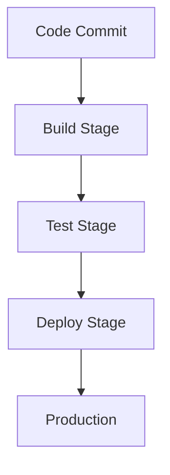
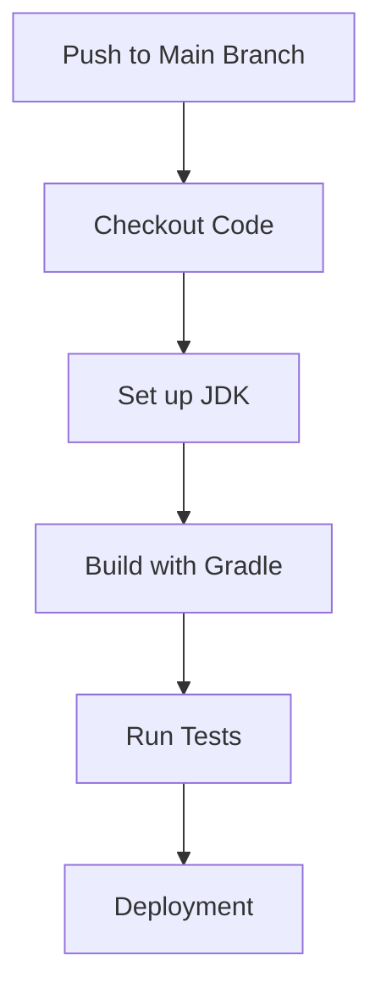
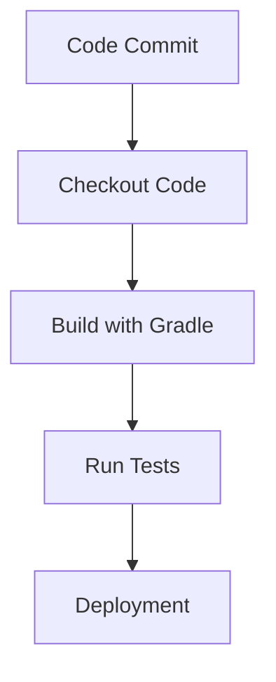

## 14.10 Continuous Integration/Continuous Deployment

In the modern software development landscape, Continuous Integration (CI) and Continuous Deployment (CD) are indispensable practices that streamline the development process, enhance code quality, and accelerate delivery. For Kotlin projects, leveraging CI/CD pipelines can significantly improve collaboration, testing, and deployment efficiency. In this section, we will explore the concepts of CI/CD, delve into setting up pipelines using popular tools like Jenkins, GitHub Actions, and CircleCI, and provide practical insights into optimizing your Kotlin development workflow.

### Understanding Continuous Integration (CI)

Continuous Integration is a development practice where developers integrate code into a shared repository frequently, ideally several times a day. Each integration is verified by an automated build and automated tests, allowing teams to detect problems early.

#### Key Benefits of CI
- **Early Bug Detection:** By integrating frequently, bugs are detected early, making them easier and less costly to fix.
- **Improved Collaboration:** CI encourages collaboration as developers work on a shared codebase, reducing integration issues.
- **Faster Feedback:** Automated tests provide immediate feedback, allowing developers to address issues promptly.

### Understanding Continuous Deployment (CD)

Continuous Deployment extends CI by automatically deploying code changes to production after passing the automated tests. This practice ensures that software can be released to users quickly and reliably.

#### Key Benefits of CD
- **Faster Time to Market:** Automating the deployment process reduces the time taken to deliver features to users.
- **Reduced Risk:** Frequent deployments mean smaller changes, which are easier to troubleshoot and less risky.
- **Improved Quality:** Automated testing and deployment ensure that only code that meets quality standards is released.

### Setting Up CI/CD Pipelines

Setting up a CI/CD pipeline involves configuring automated processes for building, testing, and deploying code. Let's explore how to set up CI/CD pipelines using Jenkins, GitHub Actions, and CircleCI for Kotlin projects.

#### Jenkins

Jenkins is a widely-used open-source automation server that supports building, deploying, and automating software development processes.

##### Setting Up Jenkins for Kotlin Projects

1. **Install Jenkins:**
   - Download and install Jenkins from the [official website](https://www.jenkins.io/).
   - Set up Jenkins by following the installation wizard.

2. **Configure Jenkins:**
   - Install necessary plugins such as Git, Gradle, and Kotlin.
   - Create a new Jenkins job and configure the source code repository.

3. **Create a Jenkinsfile:**
   - Define your CI/CD pipeline in a `Jenkinsfile` using the Groovy-based Pipeline DSL.
   - Example Jenkinsfile for a Kotlin project:

   ```groovy
   pipeline {
       agent any
       stages {
           stage('Build') {
               steps {
                   sh './gradlew build'
               }
           }
           stage('Test') {
               steps {
                   sh './gradlew test'
               }
           }
           stage('Deploy') {
               steps {
                   sh './gradlew deploy'
               }
           }
       }
   }
   ```

4. **Run the Pipeline:**
   - Trigger the pipeline manually or configure it to run automatically on code commits.

##### Jenkins Pipeline Visualization



**Description:** This diagram illustrates the flow of a Jenkins pipeline from code commit to production deployment.

#### GitHub Actions

GitHub Actions is a CI/CD platform that allows you to automate your build, test, and deployment pipeline directly from your GitHub repository.

##### Setting Up GitHub Actions for Kotlin Projects

1. **Create a Workflow File:**
   - In your GitHub repository, create a `.github/workflows` directory.
   - Add a YAML file (e.g., `ci.yml`) to define your workflow.

2. **Define the Workflow:**
   - Example workflow file for a Kotlin project:

   ```yaml
   name: CI

   on:
     push:
       branches:
         - main
     pull_request:
       branches:
         - main

   jobs:
     build:
       runs-on: ubuntu-latest

       steps:
       - name: Checkout code
         uses: actions/checkout@v2

       - name: Set up JDK 11
         uses: actions/setup-java@v2
         with:
           java-version: '11'

       - name: Build with Gradle
         run: ./gradlew build

       - name: Run tests
         run: ./gradlew test
   ```

3. **Monitor Workflow Runs:**
   - View the status of your workflow runs in the GitHub Actions tab of your repository.

##### GitHub Actions Workflow Visualization



**Description:** This diagram shows the steps in a GitHub Actions workflow for a Kotlin project.

#### CircleCI

CircleCI is a cloud-based CI/CD tool that automates the software development process using continuous integration and deployment.

##### Setting Up CircleCI for Kotlin Projects

1. **Create a CircleCI Configuration File:**
   - In your project root, create a `.circleci/config.yml` file.

2. **Define the Configuration:**
   - Example CircleCI configuration for a Kotlin project:

   ```yaml
   version: 2.1

   jobs:
     build:
       docker:
         - image: circleci/openjdk:11-jdk
       steps:
         - checkout
         - run:
             name: Build with Gradle
             command: ./gradlew build
         - run:
             name: Run Tests
             command: ./gradlew test

   workflows:
     version: 2
     build_and_test:
       jobs:
         - build
   ```

3. **Connect Your Repository:**
   - Log in to CircleCI and connect your GitHub repository.
   - Trigger builds automatically on code commits.

##### CircleCI Workflow Visualization



**Description:** This diagram illustrates the steps in a CircleCI workflow for a Kotlin project.

### Integrating CI/CD with Kotlin Projects

Integrating CI/CD pipelines with Kotlin projects involves configuring build tools, managing dependencies, and ensuring compatibility with Kotlin-specific features.

#### Configuring Build Tools

- **Gradle:** Use Gradle as the build tool for Kotlin projects. Ensure that your `build.gradle.kts` file is correctly configured for building and testing Kotlin code.
- **Maven:** If using Maven, configure the `pom.xml` file to include Kotlin plugins and dependencies.

#### Managing Dependencies

- **Kotlin DSL:** Use Kotlin DSL for managing dependencies in Gradle. This provides a more idiomatic and type-safe way to configure your build scripts.
- **Dependency Management:** Regularly update dependencies to ensure compatibility and security.

#### Ensuring Compatibility

- **Kotlin Versions:** Ensure that the Kotlin version used in your project is compatible with your CI/CD tools.
- **Testing Frameworks:** Use Kotlin-compatible testing frameworks such as JUnit5 and Kotest for writing and running tests.

### Best Practices for CI/CD in Kotlin Projects

Implementing CI/CD effectively requires following best practices to ensure smooth and efficient pipelines.

#### Maintain Clean and Modular Code

- **Code Quality:** Use static analysis tools like Detekt to maintain code quality and consistency.
- **Modularization:** Break down your project into smaller, modular components to improve build times and maintainability.

#### Optimize Build and Test Processes

- **Parallel Builds:** Configure your CI/CD pipelines to run builds and tests in parallel to reduce execution time.
- **Caching:** Use caching mechanisms to store dependencies and build artifacts, speeding up subsequent builds.

#### Implement Robust Testing Strategies

- **Comprehensive Testing:** Implement unit, integration, and end-to-end tests to ensure code reliability.
- **Test Coverage:** Use tools like JaCoCo to measure test coverage and identify untested code paths.

#### Ensure Security and Compliance

- **Security Scans:** Integrate security scanning tools into your CI/CD pipeline to detect vulnerabilities.
- **Compliance Checks:** Implement compliance checks to ensure adherence to coding standards and regulations.

### Advanced CI/CD Concepts

For expert developers, exploring advanced CI/CD concepts can further enhance the efficiency and reliability of your pipelines.

#### Continuous Delivery vs. Continuous Deployment

- **Continuous Delivery:** Involves automatically deploying code to a staging environment, requiring manual approval for production deployment.
- **Continuous Deployment:** Automates the entire deployment process, pushing code changes to production without manual intervention.

#### Blue-Green Deployment

- **Blue-Green Deployment:** A strategy where two identical environments (blue and green) are maintained. Traffic is routed to the green environment while the blue environment is updated, minimizing downtime.

#### Canary Releases

- **Canary Releases:** Involves deploying new features to a small subset of users before a full rollout, allowing for testing and feedback.

### Try It Yourself

Experiment with setting up a CI/CD pipeline for a sample Kotlin project using one of the tools discussed. Modify the pipeline to include additional stages, such as code quality checks or security scans, and observe the impact on the build process.

### Knowledge Check

- **Question:** What is the primary goal of Continuous Integration?
- **Question:** How does Continuous Deployment differ from Continuous Delivery?
- **Question:** What are the benefits of using GitHub Actions for CI/CD?
- **Question:** How can caching improve CI/CD pipeline performance?
- **Question:** What is the purpose of a Jenkinsfile?

### Embrace the Journey

Remember, mastering CI/CD is a journey. As you progress, you'll discover new tools and techniques to optimize your development workflow. Keep experimenting, stay curious, and enjoy the journey!

## Quiz Time!



### What is the primary goal of Continuous Integration?

- [x] To integrate code frequently and detect issues early
- [ ] To automate deployment to production
- [ ] To replace manual testing
- [ ] To eliminate the need for version control

> **Explanation:** Continuous Integration focuses on integrating code frequently to detect issues early and improve collaboration.

### How does Continuous Deployment differ from Continuous Delivery?

- [x] Continuous Deployment automates the entire deployment process
- [ ] Continuous Deployment requires manual approval for production
- [ ] Continuous Delivery automates deployment to production
- [ ] Continuous Delivery eliminates the need for testing

> **Explanation:** Continuous Deployment automates the entire deployment process, while Continuous Delivery requires manual approval for production deployment.

### What are the benefits of using GitHub Actions for CI/CD?

- [x] Integration with GitHub repositories
- [x] Customizable workflows
- [ ] Requires separate hosting
- [ ] Limited to Java projects

> **Explanation:** GitHub Actions integrates seamlessly with GitHub repositories and allows for customizable workflows.

### How can caching improve CI/CD pipeline performance?

- [x] By storing dependencies and build artifacts
- [ ] By reducing code complexity
- [ ] By eliminating the need for testing
- [ ] By automating deployment

> **Explanation:** Caching stores dependencies and build artifacts, speeding up subsequent builds and improving pipeline performance.

### What is the purpose of a Jenkinsfile?

- [x] To define a CI/CD pipeline in Jenkins
- [ ] To store application logs
- [ ] To manage dependencies
- [ ] To configure network settings

> **Explanation:** A Jenkinsfile is used to define a CI/CD pipeline in Jenkins, specifying the stages and steps of the pipeline.

### What is Blue-Green Deployment?

- [x] A deployment strategy with two identical environments
- [ ] A testing framework
- [ ] A version control system
- [ ] A build tool

> **Explanation:** Blue-Green Deployment involves maintaining two identical environments, allowing for seamless updates with minimal downtime.

### What is a Canary Release?

- [x] Deploying new features to a small subset of users
- [ ] A type of unit test
- [ ] A security scan
- [ ] A build optimization technique

> **Explanation:** A Canary Release involves deploying new features to a small subset of users for testing and feedback before a full rollout.

### What is the role of Jenkins in CI/CD?

- [x] Automating build, test, and deployment processes
- [ ] Managing source code repositories
- [ ] Providing cloud hosting
- [ ] Designing user interfaces

> **Explanation:** Jenkins automates the build, test, and deployment processes, facilitating CI/CD pipelines.

### How does Continuous Integration improve collaboration?

- [x] By encouraging frequent code integration
- [ ] By eliminating the need for version control
- [ ] By automating deployment
- [ ] By replacing manual testing

> **Explanation:** Continuous Integration encourages frequent code integration, improving collaboration and reducing integration issues.

### True or False: Continuous Deployment requires manual approval for production deployment.

- [ ] True
- [x] False

> **Explanation:** Continuous Deployment automates the entire deployment process, pushing code changes to production without manual intervention.


