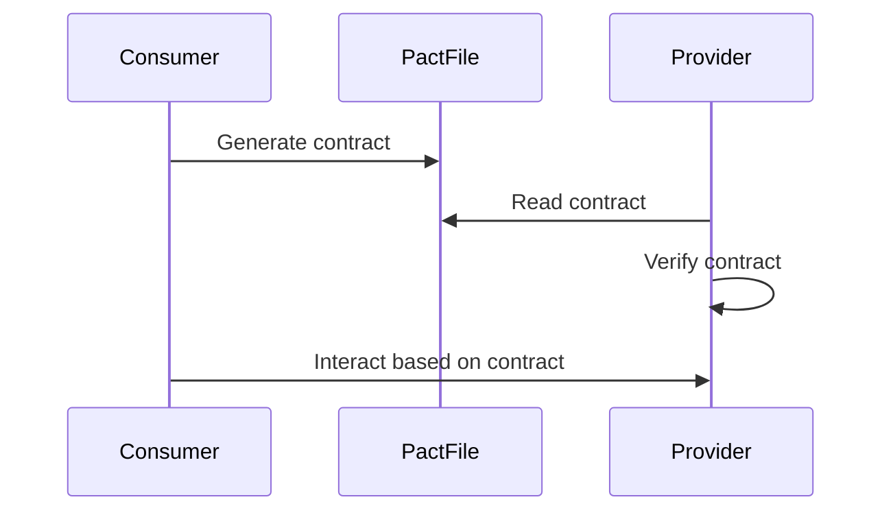

## 14.11 Contract Testing with Pact

In the world of microservices, ensuring that services can communicate reliably is crucial. As systems grow in complexity, traditional integration tests can become cumbersome and brittle. This is where contract testing, and specifically Pact, comes into play. In this section, we will delve into the concept of contract testing with Pact, focusing on consumer-driven contract tests, and how they can be effectively implemented in Kotlin.

### Understanding Contract Testing

**Contract testing** is a method of testing interactions between services by verifying that they adhere to a contract. This contract defines the expected interactions between a consumer (the service making the request) and a provider (the service fulfilling the request). By ensuring that both parties adhere to this contract, we can confidently deploy services independently without fear of breaking integrations.

#### Key Concepts

- **Consumer-Driven Contracts**: The consumer defines the contract, specifying the interactions it expects from the provider. This approach ensures that the provider's API evolves in a way that continues to meet the consumer's needs.
- **Provider States**: These are predefined states that the provider must be in to satisfy the contract. They ensure that the provider can handle the consumer's requests under various conditions.
- **Pact Files**: These are JSON files that store the contracts. They are generated by the consumer tests and used by the provider tests to verify compliance.

### Why Use Pact for Contract Testing?

Pact is a widely-used tool for implementing consumer-driven contract testing. It provides a framework for defining, verifying, and maintaining contracts between microservices. Here are some reasons to consider using Pact:

- **Language Support**: Pact supports multiple languages, including Kotlin, making it a versatile choice for diverse tech stacks.
- **Decoupled Testing**: Pact allows for testing interactions without needing both services to be running simultaneously, reducing the complexity of integration testing.
- **Feedback Loop**: By focusing on consumer-driven contracts, Pact ensures that changes to the provider's API do not break existing consumers, fostering a more collaborative development process.

### Setting Up Pact in a Kotlin Project

To use Pact in a Kotlin project, we need to set up both the consumer and provider tests. Let's walk through the setup process.

#### Adding Dependencies

First, add the necessary dependencies to your `build.gradle.kts` file:

```kotlin
dependencies {
    testImplementation("au.com.dius.pact.consumer:junit5:4.3.0")
    testImplementation("au.com.dius.pact.provider:junit5:4.3.0")
}
```

These dependencies include the Pact libraries for both consumer and provider testing, leveraging JUnit 5 for test execution.

### Writing Consumer Tests

Consumer tests are written to define the expected interactions with the provider. These tests generate the Pact files that describe the contract.

#### Example Consumer Test

Let's consider a simple example where our consumer service needs to fetch user data from a provider service.

```kotlin
import au.com.dius.pact.consumer.dsl.PactDslWithProvider
import au.com.dius.pact.consumer.junit5.PactConsumerTestExt
import au.com.dius.pact.consumer.junit5.PactTestFor
import au.com.dius.pact.core.model.RequestResponsePact
import org.junit.jupiter.api.extension.ExtendWith
import kotlin.test.Test
import kotlin.test.assertEquals

@ExtendWith(PactConsumerTestExt::class)
@PactTestFor(providerName = "UserProvider")
class UserConsumerPactTest {

    @Pact(consumer = "UserConsumer")
    fun createPact(builder: PactDslWithProvider): RequestResponsePact {
        return builder
            .given("User with ID 1 exists")
            .uponReceiving("A request for user data")
            .path("/user/1")
            .method("GET")
            .willRespondWith()
            .status(200)
            .body("""{"id": 1, "name": "John Doe"}""")
            .toPact()
    }

    @Test
    fun testUserData(mockServer: MockServer) {
        val response = khttp.get("${mockServer.getUrl()}/user/1")
        assertEquals(200, response.statusCode)
        assertEquals("John Doe", response.jsonObject.getString("name"))
    }
}
```

In this example, we define a contract for a GET request to `/user/1`, expecting a 200 response with a JSON body. The test verifies that the consumer can handle this response correctly.

### Writing Provider Tests

Provider tests verify that the provider service adheres to the contract defined by the consumer.

#### Example Provider Test

Continuing with our user data example, let's write a provider test to ensure compliance with the contract.

```kotlin
import au.com.dius.pact.provider.junit5.PactVerificationContext
import au.com.dius.pact.provider.junit5.PactVerificationExtension
import au.com.dius.pact.provider.junit5.PactVerificationInvocationContextProvider
import org.junit.jupiter.api.TestTemplate
import org.junit.jupiter.api.extension.ExtendWith

@ExtendWith(PactVerificationExtension::class)
class UserProviderPactTest {

    @TestTemplate
    @ExtendWith(PactVerificationInvocationContextProvider::class)
    fun verifyPact(context: PactVerificationContext) {
        context.verifyInteraction()
    }
}
```

This test uses the PactVerificationExtension to verify that the provider's implementation satisfies the contract. The `verifyInteraction` method checks the provider's response against the expectations defined in the Pact file.

### Visualizing Contract Testing Workflow

To better understand the workflow of contract testing with Pact, let's visualize the process using a Mermaid.js sequence diagram.



**Diagram Description**: This sequence diagram illustrates the contract testing workflow. The consumer generates a contract, which is stored in a Pact file. The provider reads this contract and verifies its implementation against it. The consumer then interacts with the provider based on the verified contract.

### Best Practices for Contract Testing with Pact

- **Version Control**: Store Pact files in version control to track changes over time and ensure consistency across environments.
- **Automate Verification**: Integrate contract verification into your CI/CD pipeline to catch breaking changes early.
- **Collaboration**: Encourage collaboration between consumer and provider teams to ensure that contracts accurately reflect business requirements.

### Common Challenges and Solutions

- **Evolving APIs**: As APIs evolve, contracts must be updated. Use versioning strategies to manage changes and maintain backward compatibility.
- **Complex Interactions**: For complex interactions, break down contracts into smaller, manageable pieces to simplify testing and verification.
- **Environment Parity**: Ensure that test environments closely mirror production to avoid discrepancies in contract verification.

### Try It Yourself

To get hands-on experience with contract testing using Pact, try modifying the consumer and provider tests to handle additional scenarios, such as:

- Testing error responses, such as 404 or 500 status codes.
- Adding additional fields to the response body and updating the contract accordingly.
- Implementing provider states to test different conditions.

### Further Reading and Resources

- [Pact Documentation](https://docs.pact.io/): Official documentation for Pact, providing detailed guides and examples.
- [Consumer-Driven Contracts: A Service Evolution Pattern](https://martinfowler.com/articles/consumerDrivenContracts.html): An article by Martin Fowler discussing the principles of consumer-driven contracts.
- [Microservices Patterns](https://microservices.io/patterns/): A collection of patterns for building microservices, including contract testing.

### Conclusion

Contract testing with Pact is a powerful technique for ensuring reliable interactions between microservices. By focusing on consumer-driven contracts, teams can foster collaboration, reduce integration issues, and confidently deploy services independently. As you continue your journey with Kotlin and microservices, remember that contract testing is a valuable tool in your testing arsenal, helping you build robust, scalable systems.

## Quiz Time!



### What is the primary purpose of contract testing?

- [x] To verify that services adhere to a predefined contract
- [ ] To test the performance of a service
- [ ] To ensure code coverage
- [ ] To check for security vulnerabilities

> **Explanation:** Contract testing ensures that services adhere to a predefined contract, verifying interactions between consumers and providers.

### What is a consumer-driven contract?

- [x] A contract defined by the consumer specifying expected interactions
- [ ] A contract defined by the provider specifying expected interactions
- [ ] A contract that is automatically generated by the testing framework
- [ ] A contract that is only used for performance testing

> **Explanation:** In consumer-driven contracts, the consumer defines the expected interactions, ensuring the provider meets these expectations.

### What is the role of a Pact file in contract testing?

- [x] To store the contract between consumer and provider
- [ ] To execute the tests
- [ ] To compile the Kotlin code
- [ ] To deploy the application

> **Explanation:** Pact files store the contract details, which are used by both consumer and provider tests to verify interactions.

### Which library is used for contract testing in Kotlin?

- [x] Pact
- [ ] JUnit
- [ ] Mockito
- [ ] Spring

> **Explanation:** Pact is a library used for contract testing, supporting consumer-driven contract tests in Kotlin.

### What is a provider state in Pact?

- [x] A predefined state that the provider must be in to satisfy the contract
- [ ] The current status of the provider's server
- [ ] The version of the provider's API
- [ ] The configuration settings of the provider

> **Explanation:** Provider states are predefined conditions that the provider must meet to satisfy the contract, ensuring accurate testing.

### How can contract testing be integrated into a CI/CD pipeline?

- [x] By automating contract verification
- [ ] By manually running tests
- [ ] By using only unit tests
- [ ] By skipping integration tests

> **Explanation:** Automating contract verification in CI/CD pipelines helps catch breaking changes early, ensuring reliable deployments.

### What is a common challenge in contract testing?

- [x] Evolving APIs
- [ ] Lack of testing tools
- [ ] High test execution time
- [ ] Limited language support

> **Explanation:** Evolving APIs can pose challenges in maintaining contracts, requiring versioning strategies to manage changes.

### What is the benefit of using consumer-driven contracts?

- [x] Ensures that the provider's API evolves to meet consumer needs
- [ ] Reduces the need for unit tests
- [ ] Increases the complexity of testing
- [ ] Limits the provider's flexibility

> **Explanation:** Consumer-driven contracts ensure that the provider's API evolves in a way that continues to meet the consumer's needs.

### How does Pact support multiple languages?

- [x] By providing libraries for different programming languages
- [ ] By using a universal testing framework
- [ ] By translating code automatically
- [ ] By using a single language for all tests

> **Explanation:** Pact supports multiple languages by providing libraries tailored to different programming environments, including Kotlin.

### True or False: Contract testing can replace all other forms of testing.

- [ ] True
- [x] False

> **Explanation:** False. Contract testing complements other forms of testing but does not replace them. It focuses on verifying interactions between services.


