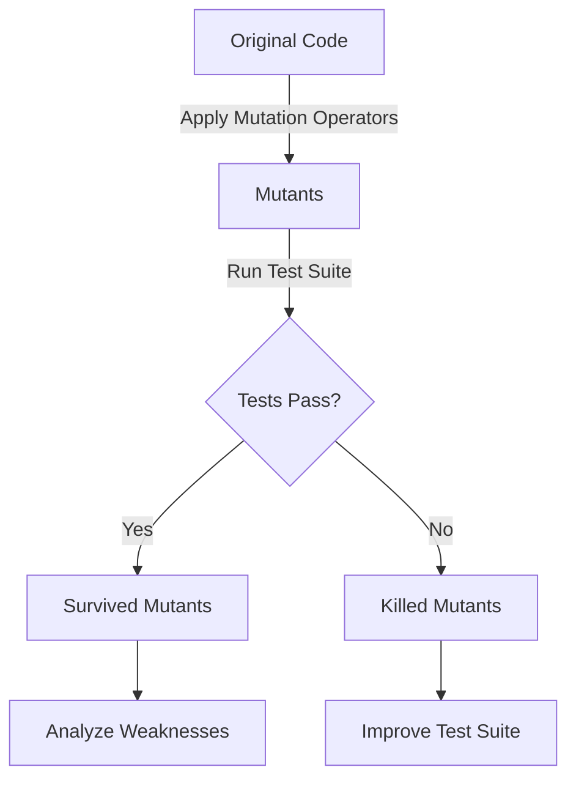

## 14.12 Mutation Testing

In the world of software development, ensuring the quality and reliability of your code is paramount. One of the most effective ways to achieve this is through rigorous testing. However, how can we be sure that our tests are truly effective? This is where mutation testing comes into play. In this section, we will delve into the concept of mutation testing, its importance, and how we can implement it in Kotlin using tools like Pitest.

### Understanding Mutation Testing

**Mutation Testing** is a method used to evaluate the quality of a test suite. It involves introducing small changes, or "mutations," to the code and then running the test suite to see if the tests can detect these changes. The idea is that a good test suite should fail when the code is altered in unexpected ways. If the tests pass despite the mutations, it indicates that the tests might not be thorough enough.

#### Key Concepts

- **Mutants**: These are the altered versions of the original code. Each mutant represents a small change, such as altering an operator or changing a constant.
- **Mutation Operators**: These are the rules used to create mutants. Common operators include changing arithmetic operators, logical operators, and modifying control flow.
- **Mutation Score**: This is the percentage of mutants that are detected by the test suite. A higher mutation score indicates a more effective test suite.

### The Importance of Mutation Testing

Mutation testing provides several benefits:

1. **Identifying Weaknesses**: It helps identify parts of the code that are not adequately tested.
2. **Improving Test Coverage**: By revealing gaps in the test suite, developers can write additional tests to cover these areas.
3. **Ensuring Robustness**: It ensures that the tests are not only present but are also capable of catching errors and changes in the code.

### Implementing Mutation Testing in Kotlin

To implement mutation testing in Kotlin, we can use a tool like **Pitest**. Pitest is a mutation testing framework for Java and JVM languages, including Kotlin. It integrates seamlessly with build tools like Gradle and Maven.

#### Setting Up Pitest

Let's walk through setting up Pitest for a Kotlin project using Gradle.

1. **Add Pitest Plugin**: First, add the Pitest plugin to your `build.gradle.kts` file.

   ```kotlin
   plugins {
       id("info.solidsoft.pitest") version "1.5.2"
   }
   ```

2. **Configure Pitest**: Configure the Pitest plugin to specify the target classes and test classes.

   ```kotlin
   pitest {
       targetClasses.set(listOf("com.example.*")) // Classes to mutate
       targetTests.set(listOf("com.example.*Test")) // Test classes
       mutators.set(listOf("DEFAULTS")) // Use default mutators
       threads.set(4) // Number of threads to use
   }
   ```

3. **Run Mutation Tests**: Execute the mutation tests using the Gradle task.

   ```bash
   ./gradlew pitest
   ```

#### Analyzing Results

After running Pitest, it generates a report that shows the mutation score and details about each mutant. The report includes:

- **Survived Mutants**: These are mutants that were not detected by the test suite, indicating potential weaknesses.
- **Killed Mutants**: These are mutants that were successfully detected by the tests.

### Code Example: Mutation Testing in Action

Let's consider a simple Kotlin class and its corresponding test suite.

```kotlin
// Calculator.kt
package com.example

class Calculator {
    fun add(a: Int, b: Int): Int {
        return a + b
    }

    fun subtract(a: Int, b: Int): Int {
        return a - b
    }
}
```

```kotlin
// CalculatorTest.kt
package com.example

import org.junit.jupiter.api.Assertions.assertEquals
import org.junit.jupiter.api.Test

class CalculatorTest {

    private val calculator = Calculator()

    @Test
    fun testAdd() {
        assertEquals(5, calculator.add(2, 3))
    }

    @Test
    fun testSubtract() {
        assertEquals(1, calculator.subtract(3, 2))
    }
}
```

When we run Pitest on this code, it might introduce mutations such as changing `+` to `-` in the `add` method. If the test suite does not detect this change, it indicates that the tests are not robust enough.

### Visualizing Mutation Testing

To better understand the process of mutation testing, let's visualize it using a flowchart.



**Caption**: This flowchart illustrates the mutation testing process, where mutations are applied to the original code, and the test suite is run to determine if the mutants are detected.

### Enhancing Test Suites with Mutation Testing

Mutation testing is not just about identifying weaknesses; it's also about improving the test suite. Here are some strategies to enhance your tests:

1. **Increase Test Coverage**: Write additional tests to cover the areas where mutants survived.
2. **Refactor Tests**: Ensure that tests are clear and focused on specific functionalities.
3. **Use Assertions Effectively**: Make sure that assertions are comprehensive and cover edge cases.

### Pitfalls and Considerations

While mutation testing is a powerful tool, there are some considerations to keep in mind:

- **Performance Overhead**: Running mutation tests can be time-consuming, especially for large codebases.
- **False Positives**: Sometimes, mutants may survive due to reasons unrelated to test quality, such as equivalent mutants that do not change the program's behavior.
- **Complexity**: Understanding and interpreting mutation testing results can be complex and may require a learning curve.

### Differences and Similarities with Other Testing Techniques

Mutation testing is often compared to other testing techniques like code coverage analysis. While code coverage measures how much of the code is executed during testing, mutation testing assesses the effectiveness of the tests themselves. Both techniques are complementary and can be used together to ensure comprehensive testing.

### Try It Yourself

To get hands-on experience with mutation testing, try modifying the `Calculator` class and observe how the test suite responds. Experiment with different mutation operators and see how they affect the mutation score. This will give you a deeper understanding of how mutation testing works and how it can be used to improve your test suites.

### Conclusion

Mutation testing is a valuable technique for assessing and improving the effectiveness of your test suites. By using tools like Pitest, you can identify weaknesses in your tests and ensure that your software is robust and reliable. Remember, this is just the beginning. As you progress, you'll build more complex and effective test suites. Keep experimenting, stay curious, and enjoy the journey!

## Quiz Time!



### What is the primary goal of mutation testing?

- [x] To assess the effectiveness of a test suite
- [ ] To increase code coverage
- [ ] To improve code performance
- [ ] To refactor code

> **Explanation:** The primary goal of mutation testing is to assess the effectiveness of a test suite by introducing small changes to the code and checking if the tests can detect them.


### What are mutants in the context of mutation testing?

- [x] Altered versions of the original code
- [ ] Test cases that fail
- [ ] Bugs in the code
- [ ] New features added to the code

> **Explanation:** In mutation testing, mutants are altered versions of the original code created by applying mutation operators.


### Which tool is commonly used for mutation testing in Kotlin?

- [x] Pitest
- [ ] JUnit
- [ ] Mockito
- [ ] Gradle

> **Explanation:** Pitest is a mutation testing framework commonly used for Java and JVM languages, including Kotlin.


### What does a high mutation score indicate?

- [x] A more effective test suite
- [ ] More bugs in the code
- [ ] Higher code complexity
- [ ] Better code performance

> **Explanation:** A high mutation score indicates a more effective test suite, as it means that a higher percentage of mutants were detected by the tests.


### What is a potential drawback of mutation testing?

- [x] Performance overhead
- [ ] Increased code coverage
- [ ] Improved test quality
- [ ] Easier test maintenance

> **Explanation:** One potential drawback of mutation testing is the performance overhead, as running mutation tests can be time-consuming.


### How can mutation testing help improve test coverage?

- [x] By identifying parts of the code that are not adequately tested
- [ ] By reducing the number of test cases
- [ ] By increasing code complexity
- [ ] By refactoring code

> **Explanation:** Mutation testing helps improve test coverage by identifying parts of the code that are not adequately tested, allowing developers to write additional tests.


### What is the role of mutation operators in mutation testing?

- [x] To create mutants by applying specific changes to the code
- [ ] To execute test cases
- [ ] To refactor code
- [ ] To improve code performance

> **Explanation:** Mutation operators are used to create mutants by applying specific changes to the code, such as altering operators or modifying control flow.


### What is a survived mutant?

- [x] A mutant that was not detected by the test suite
- [ ] A mutant that was detected by the test suite
- [ ] A bug in the code
- [ ] A new feature added to the code

> **Explanation:** A survived mutant is one that was not detected by the test suite, indicating potential weaknesses in the tests.


### How can you run mutation tests using Pitest in a Kotlin project?

- [x] By executing the `./gradlew pitest` command
- [ ] By running `./gradlew test`
- [ ] By using the `java` command
- [ ] By executing `./gradlew build`

> **Explanation:** You can run mutation tests using Pitest in a Kotlin project by executing the `./gradlew pitest` command.


### Mutation testing is primarily used to assess the effectiveness of a test suite.

- [x] True
- [ ] False

> **Explanation:** True. Mutation testing is primarily used to assess the effectiveness of a test suite by introducing small changes to the code and checking if the tests can detect them.


