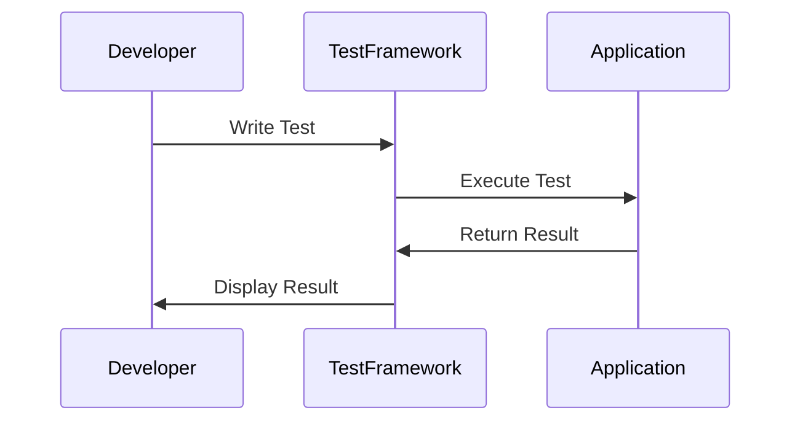

## 14.2 Unit Testing Frameworks

Unit testing is a critical component of software development, ensuring that individual parts of a program work as intended. In Kotlin, several frameworks facilitate unit testing, each with unique features and capabilities. This section delves into three prominent unit testing frameworks: JUnit5, Kotest, and Spek. We'll explore their features, provide code examples, and discuss best practices for using these frameworks in Kotlin projects.

### Introduction to Unit Testing in Kotlin

Unit testing involves testing the smallest parts of an application, such as functions or methods, in isolation from the rest of the application. The primary goal is to validate that each unit of the software performs as expected. Kotlin, with its concise syntax and interoperability with Java, provides a robust environment for unit testing.

#### Why Unit Testing?

- **Improved Code Quality**: By testing individual units, developers can catch bugs early in the development process.
- **Facilitates Refactoring**: With a comprehensive suite of unit tests, developers can refactor code with confidence, knowing that existing functionality is preserved.
- **Documentation**: Unit tests can serve as documentation for the code, illustrating how the code is intended to be used.

### JUnit5 with Kotlin

JUnit5 is the latest version of the popular Java testing framework, JUnit. It introduces several new features and improvements over its predecessors, making it a powerful tool for testing Kotlin applications.

#### Key Features of JUnit5

- **Modular Architecture**: JUnit5 is composed of three sub-projects: JUnit Platform, JUnit Jupiter, and JUnit Vintage.
- **Annotations**: JUnit5 introduces new annotations such as `@Test`, `@BeforeEach`, `@AfterEach`, `@BeforeAll`, and `@AfterAll`.
- **Dynamic Testing**: JUnit5 supports dynamic tests, allowing developers to generate tests at runtime.
- **Assertions**: JUnit5 provides a rich set of assertions to validate test outcomes.

#### Setting Up JUnit5 in Kotlin

To use JUnit5 in a Kotlin project, you need to include the necessary dependencies in your `build.gradle.kts` file:

```kotlin
dependencies {
    testImplementation("org.junit.jupiter:junit-jupiter:5.8.1")
}
```

#### Writing Tests with JUnit5

Here's a simple example of a unit test using JUnit5 in Kotlin:

```kotlin
import org.junit.jupiter.api.Assertions.assertEquals
import org.junit.jupiter.api.Test

class CalculatorTest {

    @Test
    fun `addition should return correct sum`() {
        val calculator = Calculator()
        val result = calculator.add(2, 3)
        assertEquals(5, result, "2 + 3 should equal 5")
    }
}

class Calculator {
    fun add(a: Int, b: Int): Int = a + b
}
```

In this example, we define a `Calculator` class with an `add` method and a corresponding test class `CalculatorTest` to verify the addition functionality.

#### Best Practices with JUnit5

- **Use Descriptive Test Names**: Use backticks in Kotlin to write descriptive test names that explain the test's purpose.
- **Leverage Annotations**: Use JUnit5 annotations to manage test lifecycle events and organize tests.
- **Write Independent Tests**: Ensure that each test is independent and does not rely on the state or outcome of other tests.

### Kotest

Kotest, formerly known as KotlinTest, is a testing framework designed specifically for Kotlin. It offers a wide range of features and a flexible DSL for writing tests.

#### Key Features of Kotest

- **DSL for Testing**: Kotest provides a domain-specific language (DSL) that makes writing tests more expressive and readable.
- **Matchers and Assertions**: Kotest includes a comprehensive set of matchers and assertions.
- **Property Testing**: Kotest supports property-based testing, allowing developers to define properties that should hold true for a wide range of inputs.
- **Test Lifecycle Callbacks**: Kotest provides hooks for test lifecycle events, enabling setup and teardown logic.

#### Setting Up Kotest

To use Kotest in your Kotlin project, add the following dependencies to your `build.gradle.kts` file:

```kotlin
dependencies {
    testImplementation("io.kotest:kotest-runner-junit5:5.0.0")
    testImplementation("io.kotest:kotest-assertions-core:5.0.0")
}
```

#### Writing Tests with Kotest

Here's an example of a simple test using Kotest:

```kotlin
import io.kotest.core.spec.style.StringSpec
import io.kotest.matchers.shouldBe

class CalculatorSpec : StringSpec({
    "addition should return correct sum" {
        val calculator = Calculator()
        calculator.add(2, 3) shouldBe 5
    }
})

class Calculator {
    fun add(a: Int, b: Int): Int = a + b
}
```

In this example, we use Kotest's `StringSpec` style to define a test for the `add` method of the `Calculator` class. The `shouldBe` matcher is used to assert the expected outcome.

#### Best Practices with Kotest

- **Utilize DSL Features**: Take advantage of Kotest's DSL to write clear and concise tests.
- **Explore Property Testing**: Use property testing to verify that your code behaves correctly for a wide range of inputs.
- **Organize Tests with Contexts**: Use contexts to group related tests and provide additional structure.

### Spek

Spek is another testing framework for Kotlin, inspired by the RSpec framework for Ruby. It emphasizes behavior-driven development (BDD) and provides a clear and structured way to write tests.

#### Key Features of Spek

- **Behavior-Driven Development**: Spek encourages writing tests in a BDD style, focusing on the behavior of the system.
- **Structured Tests**: Spek's DSL allows for a hierarchical structure of tests, making it easy to organize and understand.
- **Lifecycle Management**: Spek provides hooks for managing the lifecycle of tests, including setup and teardown.

#### Setting Up Spek

To use Spek in your Kotlin project, add the following dependencies to your `build.gradle.kts` file:

```kotlin
dependencies {
    testImplementation("org.spekframework.spek2:spek-dsl-jvm:2.0.17")
    testRuntimeOnly("org.spekframework.spek2:spek-runner-junit5:2.0.17")
}
```

#### Writing Tests with Spek

Here's an example of a simple test using Spek:

```kotlin
import org.spekframework.spek2.Spek
import org.spekframework.spek2.style.specification.describe
import kotlin.test.assertEquals

object CalculatorSpec : Spek({
    describe("a calculator") {
        val calculator = Calculator()

        context("addition") {
            it("should return the correct sum") {
                assertEquals(5, calculator.add(2, 3))
            }
        }
    }
})

class Calculator {
    fun add(a: Int, b: Int): Int = a + b
}
```

In this example, we use Spek's `describe` and `context` blocks to organize tests for the `Calculator` class. The `it` block defines individual test cases.

#### Best Practices with Spek

- **Embrace BDD**: Use Spek's BDD style to write tests that clearly express the behavior of the system.
- **Structure Tests Hierarchically**: Organize tests using `describe`, `context`, and `it` blocks to create a clear and logical structure.
- **Utilize Lifecycle Hooks**: Use Spek's lifecycle hooks to manage setup and teardown logic effectively.

### Comparing JUnit5, Kotest, and Spek

Each of these frameworks has its strengths and is suited to different testing needs. Here's a comparison to help you choose the right framework for your project:

| Feature                | JUnit5                     | Kotest                     | Spek                       |
|------------------------|----------------------------|----------------------------|----------------------------|
| **DSL Support**        | Basic                      | Advanced                   | Advanced                   |
| **BDD Style**          | Limited                    | Supported                  | Fully Supported            |
| **Property Testing**   | Limited                    | Supported                  | Limited                    |
| **Test Lifecycle**     | Annotations                | Callbacks                  | Callbacks                  |
| **Assertions**         | Rich Set                   | Comprehensive              | Basic                      |
| **Integration**        | Widely Supported           | Supported                  | Supported                  |

### Choosing the Right Framework

- **Use JUnit5** if you need a widely supported framework with a rich set of features and annotations.
- **Choose Kotest** if you prefer a Kotlin-specific framework with a powerful DSL and support for property testing.
- **Opt for Spek** if you want a BDD-style framework with a clear and structured approach to testing.

### Try It Yourself

Experiment with the code examples provided in this section. Try modifying the `Calculator` class to include additional operations like subtraction, multiplication, and division. Write corresponding tests using JUnit5, Kotest, and Spek to verify the new functionality.

### Visualizing the Testing Process

To better understand the testing process, let's visualize the flow of a typical unit test using a sequence diagram:



This diagram illustrates the interaction between the developer, the test framework, and the application during the testing process.

### References and Further Reading

- [JUnit5 User Guide](https://junit.org/junit5/docs/current/user-guide/)
- [Kotest Documentation](https://kotest.io/docs/home.html)
- [Spek Framework](https://spekframework.org/)

### Knowledge Check

- What are the key differences between JUnit5, Kotest, and Spek?
- How can you leverage Kotest's property testing feature?
- What is the advantage of using a BDD-style framework like Spek?

### Embrace the Journey

Remember, mastering unit testing is a journey. As you continue to explore and experiment with different frameworks, you'll gain a deeper understanding of how to write effective and reliable tests. Keep pushing the boundaries, stay curious, and enjoy the process of becoming a proficient Kotlin developer!

## Quiz Time!



### Which of the following is a key feature of JUnit5?

- [x] Modular Architecture
- [ ] Property Testing
- [ ] BDD Style
- [ ] Advanced DSL

> **Explanation:** JUnit5 is known for its modular architecture, which includes JUnit Platform, JUnit Jupiter, and JUnit Vintage.

### What is a primary advantage of using Kotest?

- [ ] Limited DSL Support
- [x] Comprehensive Matchers and Assertions
- [ ] Basic BDD Style
- [ ] Limited Integration

> **Explanation:** Kotest offers a comprehensive set of matchers and assertions, making it a powerful tool for writing expressive tests.

### Which framework is best suited for BDD-style testing?

- [ ] JUnit5
- [ ] Kotest
- [x] Spek
- [ ] None of the above

> **Explanation:** Spek is designed for BDD-style testing, providing a clear and structured way to write behavior-driven tests.

### How can you set up JUnit5 in a Kotlin project?

- [x] Add `org.junit.jupiter:junit-jupiter` dependency
- [ ] Add `io.kotest:kotest-runner-junit5` dependency
- [ ] Add `org.spekframework.spek2:spek-dsl-jvm` dependency
- [ ] Add `org.junit.vintage:junit-vintage-engine` dependency

> **Explanation:** To set up JUnit5, you need to include the `org.junit.jupiter:junit-jupiter` dependency in your project.

### What is a key feature of Kotest?

- [x] Property Testing
- [ ] Limited Assertions
- [ ] Basic Lifecycle Management
- [ ] Limited DSL Support

> **Explanation:** Kotest supports property-based testing, allowing developers to define properties that should hold true for a wide range of inputs.

### Which framework provides lifecycle hooks for managing test setup and teardown?

- [ ] JUnit5
- [x] Kotest
- [x] Spek
- [ ] None of the above

> **Explanation:** Both Kotest and Spek provide lifecycle hooks for managing test setup and teardown, allowing for more flexible test management.

### What is the purpose of using the `@Test` annotation in JUnit5?

- [x] To mark a method as a test case
- [ ] To define a test lifecycle event
- [ ] To provide a test description
- [ ] To execute a test suite

> **Explanation:** The `@Test` annotation in JUnit5 is used to mark a method as a test case, indicating that it should be executed as part of the test suite.

### Which framework is known for its advanced DSL for writing tests?

- [ ] JUnit5
- [x] Kotest
- [ ] Spek
- [ ] None of the above

> **Explanation:** Kotest is known for its advanced DSL, which makes writing tests more expressive and readable.

### What is a benefit of using Spek for testing?

- [ ] Limited BDD Support
- [ ] Basic Assertions
- [x] Structured Tests
- [ ] Limited Integration

> **Explanation:** Spek provides a structured way to write tests, using `describe`, `context`, and `it` blocks to organize and understand tests.

### True or False: JUnit5 supports dynamic tests, allowing developers to generate tests at runtime.

- [x] True
- [ ] False

> **Explanation:** JUnit5 supports dynamic tests, enabling developers to generate and execute tests at runtime, providing greater flexibility in testing.


