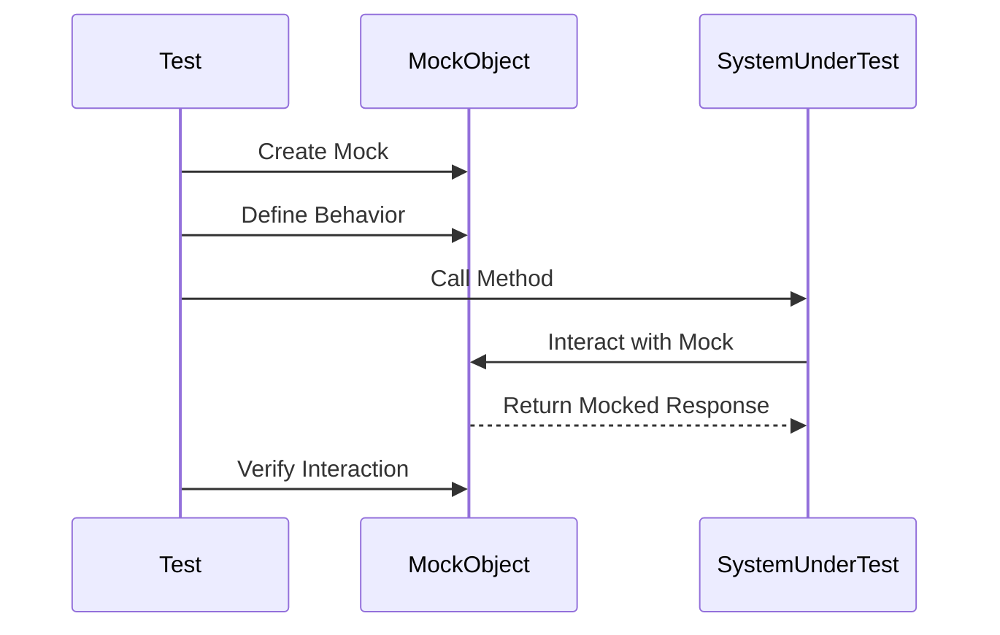

## 14.3 Mocking Libraries

In the realm of software testing, mocking is a crucial technique that allows developers to simulate the behavior of complex, real-world objects. This is particularly important in Kotlin, where coroutines and suspension functions add layers of complexity to testing scenarios. In this section, we will delve into two prominent mocking libraries in Kotlin: MockK and Mockito. We will explore how these libraries can be used to effectively mock coroutines and suspension functions, ensuring robust and reliable test suites.

### Introduction to Mocking in Kotlin

Mocking is the process of creating a simulated version of an object to test the behavior of other objects that interact with it. This is especially useful in unit testing, where the goal is to isolate the unit of work and test its functionality independently from external dependencies.

#### Why Mocking?

- **Isolation**: Mocking allows you to test a unit of code in isolation by replacing its dependencies with mock objects.
- **Control**: You can control the behavior of mock objects, making it easier to test different scenarios.
- **Performance**: Mocking can improve test performance by avoiding the overhead of real object interactions, such as database calls or network requests.
- **Simplicity**: It simplifies the setup of test environments by eliminating the need for complex configurations.

### MockK: A Kotlin-Specific Mocking Library

MockK is a powerful and flexible mocking library designed specifically for Kotlin. It provides a range of features that make it easy to mock Kotlin-specific constructs, such as coroutines, extension functions, and more.

#### Key Features of MockK

- **Kotlin-first Approach**: MockK is designed with Kotlin in mind, offering a syntax and feature set that aligns with Kotlin's idioms.
- **Coroutine Support**: MockK provides built-in support for mocking coroutines and suspension functions.
- **Relaxed Mocks**: By default, MockK creates relaxed mocks that return default values for all methods, reducing boilerplate code.
- **Verification**: MockK allows you to verify interactions with mock objects, ensuring that methods are called with the expected arguments.

#### Basic MockK Example

Let's start with a simple example of using MockK to mock a Kotlin class.

```kotlin
import io.mockk.mockk
import io.mockk.every
import io.mockk.verify

class UserService {
    fun getUser(id: String): User {
        // Imagine this method interacts with a database
        return User(id, "John Doe")
    }
}

data class User(val id: String, val name: String)

fun main() {
    val mockUserService = mockk<UserService>()
    
    every { mockUserService.getUser("123") } returns User("123", "Mock User")
    
    val user = mockUserService.getUser("123")
    println(user.name) // Output: Mock User
    
    verify { mockUserService.getUser("123") }
}
```

In this example, we create a mock of `UserService` and define the behavior of the `getUser` method using `every`. We then verify that the method was called with the expected argument.

### Mocking Coroutines with MockK

Kotlin's coroutines introduce a new paradigm for asynchronous programming, and testing coroutine-based code can be challenging. MockK provides excellent support for mocking coroutines and suspension functions.

#### Mocking Suspension Functions

Suspension functions are a core part of Kotlin's coroutine framework. MockK allows you to mock these functions seamlessly.

```kotlin
import io.mockk.coEvery
import io.mockk.coVerify
import io.mockk.mockk
import kotlinx.coroutines.runBlocking

class CoroutineService {
    suspend fun fetchData(): String {
        // Simulate a network call
        return "Real Data"
    }
}

fun main() = runBlocking {
    val mockService = mockk<CoroutineService>()
    
    coEvery { mockService.fetchData() } returns "Mock Data"
    
    val data = mockService.fetchData()
    println(data) // Output: Mock Data
    
    coVerify { mockService.fetchData() }
}
```

In this example, we use `coEvery` to define the behavior of the `fetchData` suspension function and `coVerify` to verify its invocation.

#### Mocking Coroutine Scopes

MockK also supports mocking coroutine scopes, allowing you to test code that launches coroutines in specific scopes.

```kotlin
import io.mockk.coEvery
import io.mockk.coVerify
import io.mockk.mockk
import kotlinx.coroutines.CoroutineScope
import kotlinx.coroutines.launch
import kotlinx.coroutines.runBlocking

class CoroutineScopeService {
    fun startProcess(scope: CoroutineScope) {
        scope.launch {
            // Simulate a long-running process
            println("Process started")
        }
    }
}

fun main() = runBlocking {
    val mockService = mockk<CoroutineScopeService>()
    
    coEvery { mockService.startProcess(any()) } answers {
        println("Mock process started")
    }
    
    mockService.startProcess(this)
    
    coVerify { mockService.startProcess(any()) }
}
```

Here, we mock the `startProcess` method to simulate a coroutine launch within a given scope.

### Mockito: A Versatile Mocking Library

Mockito is a widely-used mocking library in the Java ecosystem that also supports Kotlin. While not as Kotlin-specific as MockK, Mockito provides a robust set of features for mocking Java and Kotlin classes.

#### Key Features of Mockito

- **Java Compatibility**: Mockito is compatible with both Java and Kotlin, making it a versatile choice for projects that use both languages.
- **Flexible Stubbing**: Mockito allows you to define flexible stubbing rules for mock objects.
- **Verification**: Like MockK, Mockito supports verification of method calls on mock objects.

#### Basic Mockito Example

Let's see how to use Mockito to mock a simple Kotlin class.

```kotlin
import org.mockito.Mockito.*
import org.junit.jupiter.api.Test
import kotlin.test.assertEquals

class UserServiceTest {

    @Test
    fun testGetUser() {
        val mockUserService = mock(UserService::class.java)
        
        `when`(mockUserService.getUser("123")).thenReturn(User("123", "Mock User"))
        
        val user = mockUserService.getUser("123")
        assertEquals("Mock User", user.name)
        
        verify(mockUserService).getUser("123")
    }
}
```

In this example, we use Mockito's `mock` function to create a mock of `UserService` and define the behavior of the `getUser` method using `when`. We then verify that the method was called with the expected argument.

### Mocking Coroutines with Mockito

While Mockito is not designed specifically for Kotlin, it can still be used to mock coroutines and suspension functions with some additional setup.

#### Mocking Suspension Functions

To mock suspension functions with Mockito, you can use the `runBlocking` function to execute the test within a coroutine context.

```kotlin
import kotlinx.coroutines.runBlocking
import org.junit.jupiter.api.Test
import org.mockito.Mockito.*
import kotlin.test.assertEquals

class CoroutineServiceTest {

    @Test
    fun testFetchData() = runBlocking {
        val mockService = mock(CoroutineService::class.java)
        
        `when`(mockService.fetchData()).thenReturn("Mock Data")
        
        val data = mockService.fetchData()
        assertEquals("Mock Data", data)
        
        verify(mockService).fetchData()
    }
}
```

In this example, we use `runBlocking` to execute the test within a coroutine context, allowing us to mock the `fetchData` suspension function.

#### Mocking Coroutine Scopes

Mocking coroutine scopes with Mockito requires a similar approach to MockK, using `runBlocking` to provide a coroutine context.

```kotlin
import kotlinx.coroutines.CoroutineScope
import kotlinx.coroutines.launch
import kotlinx.coroutines.runBlocking
import org.junit.jupiter.api.Test
import org.mockito.Mockito.*

class CoroutineScopeServiceTest {

    @Test
    fun testStartProcess() = runBlocking {
        val mockService = mock(CoroutineScopeService::class.java)
        
        doAnswer {
            println("Mock process started")
        }.`when`(mockService).startProcess(any())
        
        mockService.startProcess(this)
        
        verify(mockService).startProcess(any())
    }
}
```

Here, we use `doAnswer` to define the behavior of the `startProcess` method when invoked with any coroutine scope.

### Choosing Between MockK and Mockito

When deciding between MockK and Mockito for your Kotlin projects, consider the following factors:

- **Kotlin Features**: If your project heavily relies on Kotlin-specific features like coroutines, MockK may be a better choice due to its native support for these constructs.
- **Java Interoperability**: If your project involves a significant amount of Java code, Mockito's compatibility with both Java and Kotlin might be advantageous.
- **Ease of Use**: MockK's Kotlin-first approach often results in more concise and readable test code, especially when dealing with Kotlin-specific features.

### Visualizing Mocking Concepts

To better understand the flow of mocking in Kotlin, let's visualize the interaction between a test, a mock object, and the system under test.



This sequence diagram illustrates the typical flow of a test using mocking. The test creates a mock object, defines its behavior, calls a method on the system under test, and verifies the interaction with the mock object.

### Try It Yourself

To solidify your understanding of mocking in Kotlin, try modifying the code examples provided in this section:

- **Change the Return Values**: Modify the return values of the mocked methods and observe how it affects the test outcomes.
- **Add More Verifications**: Introduce additional verifications to ensure that methods are called with specific arguments.
- **Experiment with Coroutines**: Create more complex coroutine scenarios and use MockK or Mockito to mock their behavior.

### Knowledge Check

Before moving on, let's summarize the key takeaways from this section:

- Mocking is essential for isolating units of code and testing their behavior independently.
- MockK is a Kotlin-specific mocking library that provides excellent support for coroutines and Kotlin constructs.
- Mockito is a versatile mocking library compatible with both Java and Kotlin, but requires additional setup for mocking coroutines.
- Choosing between MockK and Mockito depends on your project's specific needs and the features you rely on.

### References and Further Reading

- [MockK Documentation](https://mockk.io/)
- [Mockito Documentation](https://site.mockito.org/)
- [Kotlin Coroutines Guide](https://kotlinlang.org/docs/coroutines-guide.html)

## Quiz Time!



### What is the primary purpose of mocking in software testing?

- [x] To simulate the behavior of complex, real-world objects.
- [ ] To replace all real objects with fake ones.
- [ ] To increase the performance of production code.
- [ ] To eliminate the need for unit tests.

> **Explanation:** Mocking is used to simulate the behavior of complex objects, allowing for isolated testing of code units.

### Which library is designed specifically for Kotlin and provides native support for coroutines?

- [x] MockK
- [ ] Mockito
- [ ] JUnit
- [ ] Espresso

> **Explanation:** MockK is designed specifically for Kotlin and offers native support for Kotlin-specific features like coroutines.

### How does MockK handle default values for methods in relaxed mocks?

- [x] It returns default values for all methods.
- [ ] It throws an exception if a method is called.
- [ ] It requires explicit definition of return values.
- [ ] It logs a warning message.

> **Explanation:** MockK's relaxed mocks return default values for all methods, reducing boilerplate code.

### What function is used in MockK to define the behavior of a suspension function?

- [x] coEvery
- [ ] every
- [ ] coVerify
- [ ] verify

> **Explanation:** `coEvery` is used in MockK to define the behavior of suspension functions.

### Which function is used in Mockito to execute tests within a coroutine context?

- [x] runBlocking
- [ ] launch
- [ ] async
- [ ] delay

> **Explanation:** `runBlocking` is used to execute tests within a coroutine context in Mockito.

### What is a key advantage of using MockK over Mockito in Kotlin projects?

- [x] Native support for Kotlin-specific features.
- [ ] Better Java interoperability.
- [ ] More extensive documentation.
- [ ] Faster execution time.

> **Explanation:** MockK offers native support for Kotlin-specific features, making it a better choice for Kotlin projects.

### Which method is used in Mockito to define the behavior of a method call?

- [x] `when`
- [ ] `doAnswer`
- [ ] `coEvery`
- [ ] `verify`

> **Explanation:** `when` is used in Mockito to define the behavior of method calls.

### What is the purpose of the `coVerify` function in MockK?

- [x] To verify interactions with suspension functions.
- [ ] To define the behavior of suspension functions.
- [ ] To create mock objects.
- [ ] To execute tests in a coroutine context.

> **Explanation:** `coVerify` is used to verify interactions with suspension functions in MockK.

### Which library would you choose for a project that heavily relies on Java code?

- [x] Mockito
- [ ] MockK
- [ ] JUnit
- [ ] Espresso

> **Explanation:** Mockito is compatible with both Java and Kotlin, making it suitable for projects with significant Java code.

### True or False: MockK can be used to mock coroutine scopes.

- [x] True
- [ ] False

> **Explanation:** MockK supports mocking coroutine scopes, allowing for testing of coroutine-based code.



Remember, mastering mocking libraries in Kotlin is a journey. As you continue to experiment and apply these concepts, you'll gain confidence in writing effective and reliable tests. Keep exploring, stay curious, and enjoy the process!
