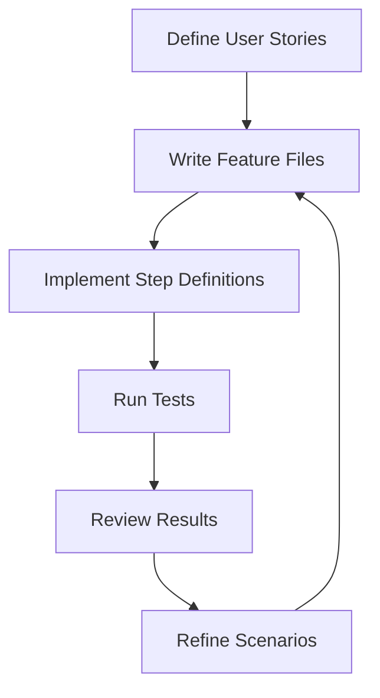

## 14.4 Behavioral Testing

Behavioral testing is a critical aspect of software development that focuses on verifying the behavior of an application from the end user's perspective. In Kotlin, behavioral testing can be effectively implemented using Behavior-Driven Development (BDD) frameworks such as Cucumber. This section will explore the concepts of BDD, how to write feature files and step definitions, and how to integrate these practices into your Kotlin projects.

### Understanding Behavioral Testing

Behavioral testing is a testing approach that emphasizes the behavior of software applications. It involves testing the application as a whole to ensure that it behaves as expected in various scenarios. This type of testing is user-centric and focuses on the application's functionality from the end user's perspective.

#### Key Concepts of Behavioral Testing

- **User Stories**: Descriptions of features from the user's perspective.
- **Scenarios**: Specific situations that describe how the application should behave.
- **Acceptance Criteria**: Conditions that must be met for a feature to be considered complete.

### Introduction to Behavior-Driven Development (BDD)

Behavior-Driven Development (BDD) is an agile software development process that encourages collaboration among developers, QA, and non-technical or business participants in a software project. BDD extends Test-Driven Development (TDD) by writing test cases in a natural language that non-programmers can read.

#### Benefits of BDD

- **Improved Communication**: BDD fosters better communication between technical and non-technical stakeholders.
- **Clear Requirements**: It helps in defining clear and unambiguous requirements.
- **Early Bug Detection**: BDD enables early detection of bugs by validating requirements before development.

### Cucumber: A BDD Framework

Cucumber is a popular BDD tool that allows you to write tests in a human-readable format using the Gherkin language. It bridges the gap between business and technical teams by allowing them to collaborate on defining the behavior of an application.

#### Key Features of Cucumber

- **Gherkin Syntax**: A simple, readable language for writing test cases.
- **Step Definitions**: Code that links Gherkin steps to application code.
- **Reports**: Detailed reports of test execution.

### Writing Feature Files in Cucumber

Feature files are the cornerstone of Cucumber tests. They contain scenarios written in Gherkin syntax that describe the behavior of the application.

#### Structure of a Feature File

A feature file typically includes the following components:

- **Feature**: A high-level description of a software feature.
- **Scenario**: A specific example of how the feature should behave.
- **Given**: The initial context of the system.
- **When**: The action or event that triggers the behavior.
- **Then**: The expected outcome or result.

#### Example of a Feature File

```gherkin
Feature: User Login

  Scenario: Successful login with valid credentials
    Given the user is on the login page
    When the user enters valid credentials
    Then the user should be redirected to the dashboard

  Scenario: Unsuccessful login with invalid credentials
    Given the user is on the login page
    When the user enters invalid credentials
    Then an error message should be displayed
```

### Implementing Step Definitions

Step definitions are the glue between the Gherkin steps and the application code. They are written in Kotlin and define the actions to be performed for each step in the scenario.

#### Writing Step Definitions in Kotlin

To implement step definitions, you need to create a Kotlin class and annotate methods with Cucumber annotations such as `@Given`, `@When`, and `@Then`.

#### Example of Step Definitions

```kotlin
import io.cucumber.java.en.Given
import io.cucumber.java.en.When
import io.cucumber.java.en.Then
import kotlin.test.assertEquals

class LoginSteps {

    private var loginPage: LoginPage = LoginPage()
    private var dashboardPage: DashboardPage? = null
    private var errorMessage: String? = null

    @Given("the user is on the login page")
    fun userIsOnLoginPage() {
        loginPage.open()
    }

    @When("the user enters valid credentials")
    fun userEntersValidCredentials() {
        dashboardPage = loginPage.login("validUser", "validPassword")
    }

    @When("the user enters invalid credentials")
    fun userEntersInvalidCredentials() {
        errorMessage = loginPage.login("invalidUser", "invalidPassword")
    }

    @Then("the user should be redirected to the dashboard")
    fun userShouldBeRedirectedToDashboard() {
        assertEquals(true, dashboardPage?.isDisplayed())
    }

    @Then("an error message should be displayed")
    fun errorMessageShouldBeDisplayed() {
        assertEquals("Invalid credentials", errorMessage)
    }
}
```

### Integrating Cucumber with Kotlin Projects

Integrating Cucumber into a Kotlin project involves setting up the necessary dependencies and configuring the test runner.

#### Setting Up Dependencies

Add the following dependencies to your `build.gradle.kts` file:

```kotlin
dependencies {
    testImplementation("io.cucumber:cucumber-java:7.0.0")
    testImplementation("io.cucumber:cucumber-junit:7.0.0")
    testImplementation("org.jetbrains.kotlin:kotlin-test:1.5.31")
}
```

#### Configuring the Test Runner

Create a test runner class to execute the Cucumber tests. Annotate the class with `@RunWith(Cucumber::class)` and specify the location of the feature files.

```kotlin
import io.cucumber.junit.Cucumber
import io.cucumber.junit.CucumberOptions
import org.junit.runner.RunWith

@RunWith(Cucumber::class)
@CucumberOptions(
    features = ["src/test/resources/features"],
    glue = ["com.example.steps"]
)
class CucumberTestRunner
```

### Best Practices for Behavioral Testing

To maximize the effectiveness of behavioral testing, consider the following best practices:

- **Collaborate with Stakeholders**: Involve business stakeholders in writing feature files to ensure alignment with business requirements.
- **Keep Scenarios Simple**: Write concise and focused scenarios that test a single behavior.
- **Use Tags**: Organize and filter scenarios using tags to manage large test suites.
- **Automate Regularly**: Integrate behavioral tests into your CI/CD pipeline for continuous validation.

### Visualizing the BDD Process

To better understand the BDD process, let's visualize the workflow using a flowchart.



**Caption**: This flowchart illustrates the iterative process of BDD, starting from defining user stories to refining scenarios based on test results.

### Try It Yourself

Now that we've covered the basics of behavioral testing with Cucumber in Kotlin, it's time to try it yourself. Here are a few exercises to get you started:

1. **Modify the Feature File**: Add a new scenario to the feature file that tests a different aspect of the login functionality, such as password recovery.
2. **Enhance Step Definitions**: Implement additional step definitions to handle the new scenario.
3. **Experiment with Tags**: Use tags to categorize scenarios and run a subset of tests based on specific tags.

### Knowledge Check

Before we conclude, let's reinforce what we've learned with a few questions:

- What is the primary focus of behavioral testing?
- How does BDD improve communication among stakeholders?
- What is the role of feature files in Cucumber?
- How do step definitions connect Gherkin steps to application code?
- Why is it important to keep scenarios simple and focused?

### Summary

Behavioral testing using BDD frameworks like Cucumber provides a powerful way to ensure that your Kotlin applications behave as expected from the user's perspective. By writing feature files and step definitions, you can create a shared understanding of application behavior among all stakeholders. Remember, this is just the beginning. As you continue to explore behavioral testing, you'll discover more advanced techniques and tools that can further enhance your testing strategy.

## Quiz Time!



### What is the primary focus of behavioral testing?

- [x] Verifying the behavior of an application from the end user's perspective
- [ ] Testing the internal code structure
- [ ] Ensuring code coverage
- [ ] Optimizing performance

> **Explanation:** Behavioral testing focuses on verifying the behavior of an application from the end user's perspective, ensuring it meets user expectations.

### How does BDD improve communication among stakeholders?

- [x] By using a common language that both technical and non-technical stakeholders can understand
- [ ] By reducing the number of meetings
- [ ] By automating all testing processes
- [ ] By focusing solely on technical requirements

> **Explanation:** BDD improves communication by using a common language (Gherkin) that is understandable by both technical and non-technical stakeholders, facilitating collaboration.

### What is the role of feature files in Cucumber?

- [x] To describe the behavior of the application in a human-readable format
- [ ] To store application code
- [ ] To compile the application
- [ ] To manage database connections

> **Explanation:** Feature files in Cucumber describe the behavior of the application in a human-readable format using Gherkin syntax.

### How do step definitions connect Gherkin steps to application code?

- [x] By providing the implementation for each Gherkin step
- [ ] By compiling the Gherkin steps
- [ ] By generating feature files
- [ ] By executing database queries

> **Explanation:** Step definitions provide the implementation for each Gherkin step, connecting the human-readable scenarios to the actual application code.

### Why is it important to keep scenarios simple and focused?

- [x] To ensure each scenario tests a single behavior and is easy to understand
- [ ] To reduce the number of lines of code
- [ ] To minimize the use of resources
- [ ] To increase test execution speed

> **Explanation:** Keeping scenarios simple and focused ensures that each scenario tests a single behavior, making them easier to understand and maintain.

### What language does Cucumber use to write feature files?

- [x] Gherkin
- [ ] Kotlin
- [ ] Java
- [ ] Python

> **Explanation:** Cucumber uses the Gherkin language to write feature files, which is a simple, human-readable language.

### What is a key benefit of using BDD?

- [x] Early detection of bugs by validating requirements before development
- [ ] Faster code compilation
- [ ] Reduced need for documentation
- [ ] Increased application performance

> **Explanation:** BDD enables early detection of bugs by validating requirements before development, ensuring that the application meets user expectations.

### Which annotation is used in Cucumber to define a step that sets up the initial context?

- [x] @Given
- [ ] @When
- [ ] @Then
- [ ] @Context

> **Explanation:** The `@Given` annotation is used in Cucumber to define a step that sets up the initial context or state of the system.

### What is the purpose of the `@RunWith` annotation in the Cucumber test runner?

- [x] To specify the test runner class for executing Cucumber tests
- [ ] To define a step definition
- [ ] To compile feature files
- [ ] To manage database connections

> **Explanation:** The `@RunWith` annotation specifies the test runner class for executing Cucumber tests, allowing the integration of Cucumber with JUnit.

### True or False: BDD is only useful for technical stakeholders.

- [ ] True
- [x] False

> **Explanation:** False. BDD is useful for both technical and non-technical stakeholders as it uses a common language to describe application behavior, facilitating collaboration.


