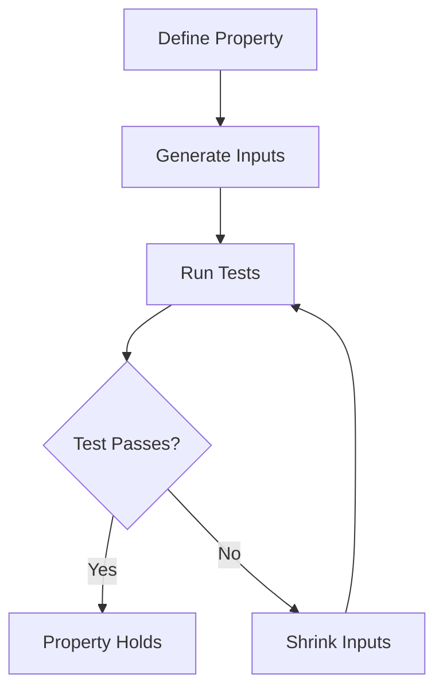

## 14.5 Property-Based Testing

In the realm of software testing, ensuring that your code behaves correctly under a wide range of conditions is crucial. While traditional unit testing focuses on specific examples, property-based testing takes a different approach by verifying that certain properties hold true across a broad set of inputs. In this section, we will explore property-based testing in Kotlin using the Kotest framework, a powerful tool that allows us to automatically generate test cases and enhance our software's robustness.

### Understanding Property-Based Testing

**Property-based testing** is a testing methodology where you define properties or invariants that your code should satisfy, and the testing framework automatically generates a wide range of input data to verify these properties. This approach contrasts with example-based testing, where you manually specify input-output pairs.

#### Key Concepts of Property-Based Testing

1. **Properties**: These are general statements about your code that should always be true. For example, a property for a sorting function might be that the output list is always sorted.

2. **Generators**: These are used to create a wide variety of input data for your tests. They help in exploring edge cases that you might not have considered.

3. **Shrinking**: When a test fails, the framework attempts to simplify the input data to find the minimal failing case, making it easier to diagnose the problem.

4. **Randomization**: Inputs are often generated randomly, which helps in discovering unexpected edge cases.

### Why Use Property-Based Testing?

- **Comprehensive Coverage**: By testing with a wide range of inputs, you can uncover edge cases that example-based tests might miss.

- **Robustness**: Ensures that your code behaves correctly across a spectrum of scenarios.

- **Efficiency**: Reduces the need to manually write numerous test cases.

- **Insightful Failures**: When a test fails, the framework provides minimal failing cases, which are easier to analyze.

### Introducing Kotest for Property-Based Testing

[Kotest](https://kotest.io/) is a powerful testing framework for Kotlin that supports property-based testing. It provides a rich set of features for defining properties, generating test data, and shrinking inputs.

#### Setting Up Kotest

To get started with Kotest, you need to add the following dependencies to your `build.gradle.kts` file:

```kotlin
dependencies {
    testImplementation("io.kotest:kotest-runner-junit5:5.0.0")
    testImplementation("io.kotest:kotest-property:5.0.0")
}
```

Ensure that you have the JUnit 5 platform configured, as Kotest runs on top of it.

### Defining Properties in Kotest

In Kotest, properties are defined using the `forAll` function, which allows you to specify a property and automatically generates test cases to verify it.

#### Example: Testing a Sorting Function

Let's consider a simple sorting function and define a property that the output list should always be sorted.

```kotlin
import io.kotest.core.spec.style.StringSpec
import io.kotest.property.forAll
import io.kotest.property.arbitrary.int
import io.kotest.property.arbitrary.list

class SortingTest : StringSpec({
    "sorted list should have elements in non-decreasing order" {
        forAll(list(int())) { list ->
            val sortedList = list.sorted()
            sortedList == sortedList.sorted()
        }
    }
})
```

**Explanation**:

- We use `forAll` to define a property that should hold true for all generated lists of integers.
- The property checks that the sorted list is equal to itself when sorted again, ensuring non-decreasing order.

### Generating Test Cases Automatically

Kotest provides a variety of generators for different data types, and you can also create custom generators.

#### Built-in Generators

Kotest includes generators for common data types such as integers, strings, and lists. These generators can be combined to create complex data structures.

#### Custom Generators

You can define custom generators to suit your specific needs. Here's an example of a custom generator for a pair of integers:

```kotlin
import io.kotest.property.Arb
import io.kotest.property.arbitrary.int
import io.kotest.property.arbitrary.pair

val customPairGen = Arb.pair(Arb.int(), Arb.int())
```

### Shrinking: Simplifying Failing Cases

When a property fails, Kotest attempts to shrink the input to find the simplest failing case. This process helps in diagnosing the issue more effectively.

#### Example of Shrinking

Consider a property that fails for a specific list of integers. Kotest will automatically try to reduce the list to the smallest size that still causes the failure.

```kotlin
"sum of list should be non-negative" {
    forAll(list(int())) { list ->
        list.sum() >= 0
    }
}
```

If this property fails, Kotest will shrink the list to find the minimal case that causes the failure, such as a single negative integer.

### Visualizing Property-Based Testing

To better understand the flow of property-based testing, let's visualize the process using a flowchart.



**Caption**: This flowchart illustrates the process of property-based testing, from defining properties to generating inputs, running tests, and shrinking inputs when a test fails.

### Advanced Features of Kotest

Kotest offers several advanced features that enhance property-based testing:

#### 1. **Edge Cases**

Kotest automatically generates edge cases for certain data types, such as zero, negative numbers, and empty lists. This feature ensures that your properties are tested against potential boundary conditions.

#### 2. **Configurable Parameters**

You can configure the number of test cases, the seed for randomization, and other parameters to fine-tune your testing strategy.

```kotlin
forAll(Arb.int(), iterations = 1000) { a ->
    // Property to test
}
```

#### 3. **Combinators**

Kotest provides combinators to create complex properties by combining simpler ones. This feature allows you to build more expressive and comprehensive tests.

### Try It Yourself: Experimenting with Kotest

To get hands-on experience with property-based testing, try modifying the code examples provided. Here are a few suggestions:

- Change the data type of the list in the sorting example to a list of strings and define a property for alphabetical order.
- Create a custom generator for a complex data structure, such as a tree, and define properties for its invariants.
- Experiment with different configurations for the number of iterations and randomization seed.

### Best Practices for Property-Based Testing

1. **Start Simple**: Begin with simple properties and gradually increase complexity as you gain confidence.

2. **Focus on Invariants**: Identify key invariants in your code and define properties around them.

3. **Leverage Shrinking**: Use shrinking to simplify failing cases and gain insights into the root cause of failures.

4. **Combine with Example-Based Tests**: Use property-based testing alongside example-based tests for comprehensive coverage.

5. **Iterate and Refine**: Continuously refine your properties and generators based on test results and code changes.

### Common Pitfalls and How to Avoid Them

- **Overly Complex Properties**: Keep properties simple and focused. Complex properties can be difficult to understand and maintain.

- **Ignoring Edge Cases**: Ensure that your properties account for edge cases, such as empty inputs and boundary values.

- **Insufficient Test Coverage**: Use a combination of property-based and example-based tests to achieve comprehensive coverage.

### Conclusion

Property-based testing is a powerful methodology that complements traditional testing approaches by providing comprehensive coverage and uncovering edge cases. By leveraging Kotest's capabilities, you can define properties, generate test cases automatically, and enhance your software's robustness. Remember, this is just the beginning. As you progress, you'll build more complex and reliable software. Keep experimenting, stay curious, and enjoy the journey!

## Quiz Time!



### What is the primary focus of property-based testing?

- [x] Verifying that certain properties hold true across a broad set of inputs.
- [ ] Testing specific input-output pairs.
- [ ] Ensuring code coverage.
- [ ] Writing fewer tests.

> **Explanation:** Property-based testing focuses on verifying that properties hold true for a wide range of inputs, rather than testing specific examples.

### What is the role of generators in property-based testing?

- [x] To create a wide variety of input data for tests.
- [ ] To execute the tests.
- [ ] To simplify failing cases.
- [ ] To provide test reports.

> **Explanation:** Generators are used to create diverse input data, allowing the testing framework to explore a wide range of scenarios.

### How does shrinking help in property-based testing?

- [x] It simplifies the input data to find the minimal failing case.
- [ ] It increases the complexity of test cases.
- [ ] It generates more test cases.
- [ ] It provides detailed test reports.

> **Explanation:** Shrinking helps by reducing the input data to the simplest form that still causes the test to fail, making it easier to diagnose issues.

### Which Kotest function is used to define properties?

- [x] forAll
- [ ] test
- [ ] check
- [ ] verify

> **Explanation:** The `forAll` function in Kotest is used to define properties that should hold true for all generated inputs.

### What is a key advantage of property-based testing over example-based testing?

- [x] It provides comprehensive coverage by testing a wide range of inputs.
- [ ] It requires fewer test cases.
- [ ] It is easier to write.
- [ ] It focuses on specific examples.

> **Explanation:** Property-based testing offers comprehensive coverage by automatically generating a wide range of inputs, uncovering edge cases that example-based tests might miss.

### What is the purpose of the `Arb` class in Kotest?

- [x] To provide arbitrary generators for test data.
- [ ] To execute test cases.
- [ ] To configure test parameters.
- [ ] To report test results.

> **Explanation:** The `Arb` class in Kotest provides arbitrary generators for creating diverse test data.

### How can you configure the number of test cases in Kotest?

- [x] By setting the `iterations` parameter in the `forAll` function.
- [ ] By modifying the test runner settings.
- [ ] By changing the test configuration file.
- [ ] By using the `testCount` function.

> **Explanation:** You can configure the number of test cases by setting the `iterations` parameter in the `forAll` function.

### What is an edge case in the context of property-based testing?

- [x] A boundary condition or special case that might cause failures.
- [ ] A common scenario that is frequently tested.
- [ ] A test case that always passes.
- [ ] A scenario that is irrelevant to the test.

> **Explanation:** An edge case is a boundary condition or special case that might cause failures, and property-based testing helps identify such cases.

### True or False: Property-based testing can replace example-based testing entirely.

- [ ] True
- [x] False

> **Explanation:** False. Property-based testing complements example-based testing, but it does not replace it entirely. Both approaches are valuable for achieving comprehensive test coverage.

### What is a common pitfall to avoid in property-based testing?

- [x] Overly complex properties that are difficult to understand.
- [ ] Using too many generators.
- [ ] Writing too few test cases.
- [ ] Ignoring test results.

> **Explanation:** Overly complex properties can be difficult to understand and maintain, so it's important to keep them simple and focused.


