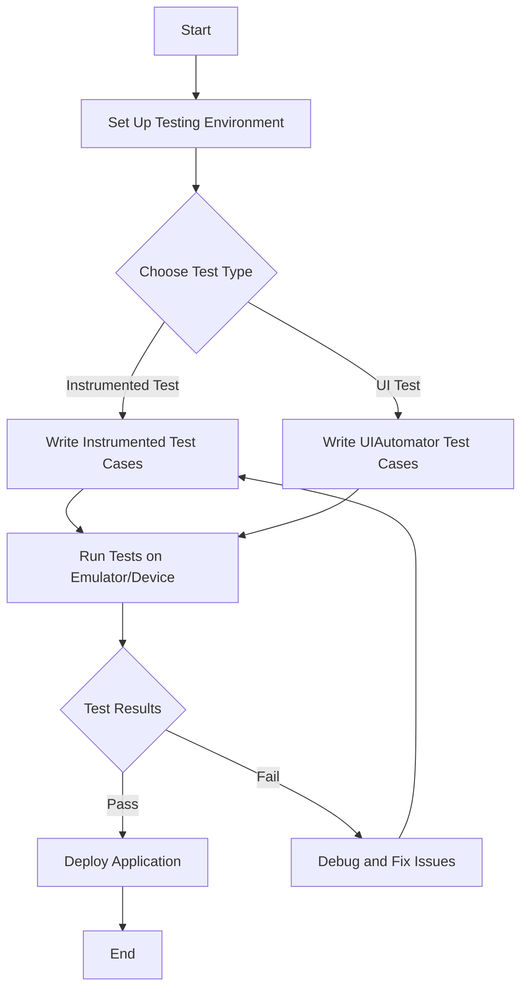

## 14.6 Android Testing

In the world of Android development, testing is a crucial component that ensures the reliability and quality of applications. As expert software engineers and architects, understanding the nuances of Android testing with Kotlin can significantly enhance the robustness of your applications. This section delves into the intricacies of Android testing, focusing on instrumented and UI tests, and utilizing tools like XCTest and UIAutomator.

### Introduction to Android Testing

Android testing can be broadly categorized into two types: **instrumented tests** and **UI tests**. Instrumented tests run on real devices or emulators and interact with the Android framework, while UI tests focus on the user interface, ensuring that the app behaves as expected from a user's perspective.

#### Why Android Testing Matters

Testing is essential for:

- **Ensuring Functionality**: Verifying that the app performs its intended functions.
- **Improving Quality**: Detecting bugs and issues early in the development cycle.
- **Enhancing User Experience**: Ensuring that the app is intuitive and user-friendly.
- **Facilitating Maintenance**: Making it easier to update and maintain the app over time.

### Instrumented Tests

Instrumented tests are designed to run on an Android device or emulator. They have access to the Android framework APIs, allowing them to test interactions with the app's components.

#### Setting Up Instrumented Tests

To set up instrumented tests in an Android project using Kotlin, follow these steps:

1. **Add Dependencies**: Ensure your `build.gradle` file includes the necessary testing libraries.

   ```kotlin
   dependencies {
       androidTestImplementation 'androidx.test.ext:junit:1.1.3'
       androidTestImplementation 'androidx.test.espresso:espresso-core:3.4.0'
   }
   ```

2. **Create Test Classes**: Organize your test classes under the `androidTest` source set.

3. **Write Test Cases**: Use JUnit and Espresso to write test cases that interact with the UI and verify behavior.

#### Writing Instrumented Tests

Let's explore a simple example of an instrumented test using Espresso:

```kotlin
@RunWith(AndroidJUnit4::class)
class ExampleInstrumentedTest {

    @Test
    fun useAppContext() {
        // Context of the app under test.
        val appContext = InstrumentationRegistry.getInstrumentation().targetContext
        assertEquals("com.example.myapp", appContext.packageName)
    }

    @Test
    fun testButtonClick() {
        // Find the button and perform a click action
        onView(withId(R.id.my_button)).perform(click())

        // Verify that the text view displays the expected text
        onView(withId(R.id.my_text_view)).check(matches(withText("Button Clicked")))
    }
}
```

**Explanation**:

- **`@RunWith(AndroidJUnit4::class)`**: Specifies that the test should run with the AndroidJUnit4 test runner.
- **`onView(withId(R.id.my_button))`**: Finds a view with the specified ID.
- **`perform(click())`**: Simulates a click action on the view.
- **`check(matches(withText("Button Clicked")))`**: Verifies that the view displays the expected text.

#### Best Practices for Instrumented Tests

- **Isolate Tests**: Ensure tests are independent and do not rely on each other's outcomes.
- **Use Mock Data**: Avoid using real data sources to prevent unintended side effects.
- **Optimize Performance**: Keep tests concise to reduce execution time.

### UI Tests with UIAutomator

UIAutomator is a powerful tool for testing the UI of Android applications. It allows you to write tests that interact with the app's user interface, simulating user actions and verifying UI elements.

#### Setting Up UIAutomator

To use UIAutomator, add the following dependency to your `build.gradle` file:

```kotlin
dependencies {
    androidTestImplementation 'androidx.test.uiautomator:uiautomator:2.2.0'
}
```

#### Writing UI Tests with UIAutomator

Here's an example of a UI test using UIAutomator:

```kotlin
@RunWith(AndroidJUnit4::class)
class ExampleUiAutomatorTest {

    private lateinit var device: UiDevice

    @Before
    fun setUp() {
        device = UiDevice.getInstance(InstrumentationRegistry.getInstrumentation())
    }

    @Test
    fun testOpenSettings() {
        // Press the home button
        device.pressHome()

        // Open the app drawer
        val appDrawer = device.findObject(UiSelector().description("Apps"))
        appDrawer.click()

        // Launch the Settings app
        val settingsApp = device.findObject(UiSelector().text("Settings"))
        settingsApp.clickAndWaitForNewWindow()

        // Verify that the Settings app is open
        val settingsTitle = device.findObject(UiSelector().text("Settings"))
        assertTrue(settingsTitle.exists())
    }
}
```

**Explanation**:

- **`UiDevice.getInstance()`**: Retrieves the device instance for interacting with the UI.
- **`device.pressHome()`**: Simulates pressing the home button.
- **`findObject(UiSelector())`**: Finds a UI element based on the specified selector.
- **`clickAndWaitForNewWindow()`**: Clicks the element and waits for a new window to open.

#### Best Practices for UIAutomator Tests

- **Use Descriptive Selectors**: Ensure selectors are specific and descriptive to avoid false positives.
- **Handle Delays**: Account for UI transitions and loading times using appropriate wait methods.
- **Test Across Devices**: Run tests on various devices and screen sizes to ensure compatibility.

### XCTest for Android

While XCTest is primarily associated with iOS testing, it can be adapted for Android testing through cross-platform testing frameworks. These frameworks allow you to write tests that can be executed on both iOS and Android, providing a unified testing strategy.

#### Cross-Platform Testing with XCTest

Tools like Appium and Detox facilitate cross-platform testing by allowing you to write tests in a single language and run them on multiple platforms.

##### Setting Up Appium for Cross-Platform Testing

1. **Install Appium**: Follow the installation instructions on the [Appium website](http://appium.io/).

2. **Configure Appium**: Set up your Appium server and configure it to run tests on Android devices.

3. **Write Cross-Platform Tests**: Use a language like JavaScript or Python to write tests that can be executed on both Android and iOS.

##### Example of a Cross-Platform Test with Appium

```javascript
const { Builder, By, until } = require('selenium-webdriver');

(async function example() {
    let driver = await new Builder().forBrowser('chrome').build();
    try {
        await driver.get('http://www.example.com');
        await driver.findElement(By.name('q')).sendKeys('Appium');
        await driver.findElement(By.name('btnK')).click();
        await driver.wait(until.titleIs('Appium - Google Search'), 1000);
    } finally {
        await driver.quit();
    }
})();
```

**Explanation**:

- **`Builder().forBrowser('chrome')`**: Initializes a new browser session.
- **`driver.get('http://www.example.com')`**: Navigates to the specified URL.
- **`findElement(By.name('q'))`**: Finds an element by its name attribute.
- **`sendKeys('Appium')`**: Simulates typing into the element.
- **`click()`**: Simulates a click action on the element.

#### Best Practices for Cross-Platform Testing

- **Maintain Consistency**: Ensure tests are consistent across platforms by using common test scenarios.
- **Leverage Platform-Specific Features**: Take advantage of platform-specific features where applicable, but ensure core functionality is tested uniformly.
- **Optimize Test Execution**: Use parallel testing to reduce execution time and improve efficiency.

### Visualizing Android Testing Workflow

To better understand the Android testing workflow, let's visualize the process using a flowchart.



**Description**: This flowchart illustrates the Android testing workflow, starting from setting up the testing environment to writing and executing tests, and finally deploying the application if tests pass.

### Knowledge Check

Let's reinforce our understanding with a few questions:

- What are the two main types of Android tests?
- How does UIAutomator differ from Espresso?
- What is the primary use of XCTest in Android testing?

### Try It Yourself

Experiment with the provided code examples by modifying them to suit your application's needs. For instance, try changing the UI element selectors in the UIAutomator test to interact with different parts of your app. Observe how the tests behave and adjust them to improve reliability and coverage.

### Conclusion

Android testing is a vital aspect of application development, ensuring that apps are reliable, functional, and user-friendly. By mastering instrumented and UI tests, and leveraging tools like XCTest and UIAutomator, you can build robust applications that meet user expectations and withstand the rigors of real-world usage.

### References and Further Reading

- [Android Testing Documentation](https://developer.android.com/training/testing)
- [Espresso Testing Framework](https://developer.android.com/training/testing/espresso)
- [UIAutomator Documentation](https://developer.android.com/training/testing/ui-automator)
- [Appium Official Site](http://appium.io/)
- [JUnit 5 User Guide](https://junit.org/junit5/docs/current/user-guide/)

## Quiz Time!



### What are the two main types of Android tests?

- [x] Instrumented tests and UI tests
- [ ] Unit tests and integration tests
- [ ] Functional tests and performance tests
- [ ] Load tests and stress tests

> **Explanation:** Android testing primarily involves instrumented tests, which run on devices or emulators, and UI tests, which focus on the user interface.

### Which tool is primarily used for UI testing in Android?

- [ ] JUnit
- [ ] Mockito
- [x] UIAutomator
- [ ] Gradle

> **Explanation:** UIAutomator is a tool used for UI testing in Android, allowing interaction with the app's user interface.

### What is the purpose of the `@RunWith(AndroidJUnit4::class)` annotation?

- [x] It specifies the test runner for Android tests.
- [ ] It initializes the test environment.
- [ ] It marks a method as a test case.
- [ ] It sets up mock data for testing.

> **Explanation:** The `@RunWith(AndroidJUnit4::class)` annotation specifies that the test should run with the AndroidJUnit4 test runner.

### How does UIAutomator differ from Espresso?

- [x] UIAutomator interacts with the entire device UI, while Espresso focuses on the app's UI.
- [ ] UIAutomator is used for unit testing, while Espresso is for UI testing.
- [ ] UIAutomator is a Java library, while Espresso is a Kotlin library.
- [ ] UIAutomator is faster than Espresso.

> **Explanation:** UIAutomator can interact with the entire device UI, whereas Espresso is limited to the app's UI.

### What is the primary use of XCTest in Android testing?

- [ ] It is used for unit testing.
- [ ] It is used for performance testing.
- [x] It is used for cross-platform testing.
- [ ] It is used for integration testing.

> **Explanation:** XCTest can be adapted for Android testing through cross-platform testing frameworks, allowing tests to be executed on both iOS and Android.

### Which method is used to simulate a click action in Espresso?

- [ ] perform(type())
- [x] perform(click())
- [ ] perform(swipe())
- [ ] perform(longClick())

> **Explanation:** The `perform(click())` method is used to simulate a click action on a view in Espresso tests.

### In UIAutomator, what does the `clickAndWaitForNewWindow()` method do?

- [x] Clicks an element and waits for a new window to open.
- [ ] Clicks an element and closes the current window.
- [ ] Clicks an element and refreshes the page.
- [ ] Clicks an element and logs the action.

> **Explanation:** The `clickAndWaitForNewWindow()` method clicks an element and waits for a new window to open, which is useful for navigating between screens.

### What is the advantage of using cross-platform testing frameworks like Appium?

- [ ] They are faster than native testing tools.
- [ ] They provide better UI testing capabilities.
- [x] They allow writing tests that run on multiple platforms.
- [ ] They are easier to set up than native tools.

> **Explanation:** Cross-platform testing frameworks like Appium allow you to write tests that can be executed on both Android and iOS, providing a unified testing strategy.

### What is the role of the `InstrumentationRegistry` in Android testing?

- [x] It provides access to the instrumentation and target context.
- [ ] It initializes the test environment.
- [ ] It manages test dependencies.
- [ ] It handles test execution results.

> **Explanation:** The `InstrumentationRegistry` provides access to the instrumentation and target context, which is essential for running instrumented tests.

### True or False: UIAutomator tests can only be run on emulators.

- [ ] True
- [x] False

> **Explanation:** UIAutomator tests can be run on both emulators and real devices, allowing for comprehensive UI testing across different environments.


