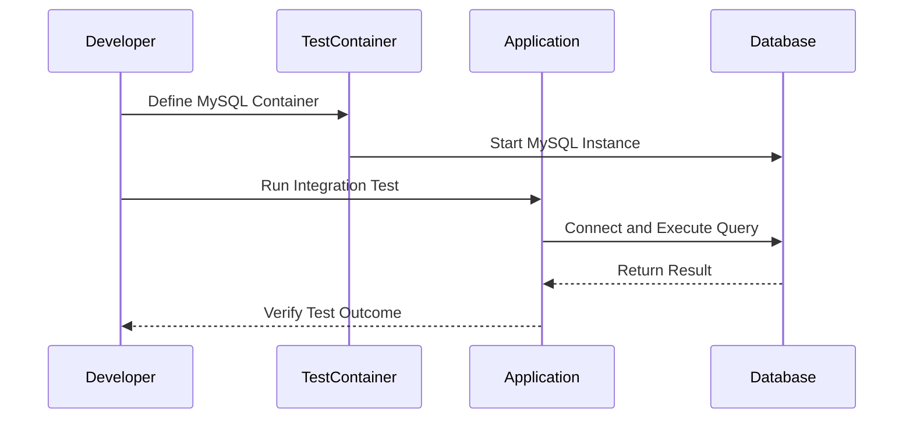

## 14.7 Integration Testing

Integration testing is a critical phase in the software development lifecycle that focuses on verifying the interactions between different components or modules of a system. Unlike unit testing, which tests individual components in isolation, integration testing ensures that these components work together as expected. In this section, we will delve into the intricacies of integration testing in Kotlin, explore best practices, and demonstrate how to leverage tools like Testcontainers to enhance your testing strategy.

### Understanding Integration Testing

Integration testing is designed to identify issues that may arise when different parts of a system interact. It is crucial for detecting problems such as incorrect data exchange, interface mismatches, and unexpected behavior when components are combined. Integration tests can be performed at various levels, including:

- **Component Integration Testing:** Focuses on testing interactions between integrated components or modules.
- **System Integration Testing:** Involves testing the entire system's interactions with external systems or services.

#### Key Objectives of Integration Testing

- **Verify Data Flow:** Ensure data is correctly passed between components.
- **Validate Interfaces:** Confirm that interfaces between components are correctly implemented.
- **Detect Integration Issues:** Identify problems that may not be evident in unit testing.
- **Ensure System Cohesion:** Confirm that the system functions as a cohesive unit.

### Integration Testing in Kotlin

Kotlin, with its expressive syntax and interoperability with Java, provides a robust platform for performing integration testing. Let's explore some best practices and tools that can help you effectively conduct integration tests in Kotlin.

#### Best Practices for Integration Testing

1. **Define Clear Test Scenarios:** Clearly outline the scenarios you want to test, focusing on critical paths and edge cases.
2. **Use Realistic Test Data:** Employ data that closely resembles production data to ensure tests are meaningful.
3. **Isolate External Dependencies:** Use mocks or stubs to isolate external dependencies, ensuring tests are reliable and repeatable.
4. **Automate Tests:** Automate your integration tests to run as part of your continuous integration (CI) pipeline.
5. **Maintain Test Independence:** Ensure tests do not depend on each other to avoid cascading failures.

#### Tools for Integration Testing in Kotlin

Several tools can aid in performing integration tests in Kotlin, with Testcontainers being one of the most popular choices.

### Using Testcontainers for Integration Testing

[Testcontainers](https://www.testcontainers.org/) is a Java library that provides lightweight, throwaway instances of common databases, web browsers, or anything else that can run in a Docker container. It is particularly useful for integration testing as it allows you to test against real instances of services without the overhead of managing them manually.

#### Benefits of Using Testcontainers

- **Realistic Testing Environment:** Test against real instances of services, ensuring tests are as close to production as possible.
- **Isolation:** Each test can run in its own isolated environment, reducing interference between tests.
- **Ease of Use:** Testcontainers integrates seamlessly with JUnit, making it easy to set up and use in Kotlin projects.

#### Setting Up Testcontainers in Kotlin

To get started with Testcontainers in Kotlin, you need to add the necessary dependencies to your project. Here's how you can set up Testcontainers with Gradle:

```kotlin
dependencies {
    testImplementation("org.testcontainers:testcontainers:1.16.0")
    testImplementation("org.testcontainers:junit-jupiter:1.16.0")
    testImplementation("org.testcontainers:mysql:1.16.0")
}
```

#### Example: Testing with a MySQL Database

Let's walk through an example of using Testcontainers to test a Kotlin application that interacts with a MySQL database.

**Step 1: Define the Testcontainer**

First, define a MySQL container in your test class:

```kotlin
import org.junit.jupiter.api.Test
import org.junit.jupiter.api.extension.ExtendWith
import org.testcontainers.containers.MySQLContainer
import org.testcontainers.junit.jupiter.Container
import org.testcontainers.junit.jupiter.Testcontainers

@Testcontainers
class MySQLIntegrationTest {

    @Container
    val mysqlContainer = MySQLContainer<Nothing>("mysql:5.7").apply {
        withDatabaseName("testdb")
        withUsername("test")
        withPassword("test")
    }

    @Test
    fun `test database interaction`() {
        // Your test logic here
    }
}
```

**Step 2: Implement the Test Logic**

Within the test method, you can interact with the database using the connection details provided by the container:

```kotlin
@Test
fun `test database interaction`() {
    val jdbcUrl = mysqlContainer.jdbcUrl
    val username = mysqlContainer.username
    val password = mysqlContainer.password

    // Use these details to connect to the database and perform your tests
    // Example: Using JDBC to connect and execute queries
    val connection = DriverManager.getConnection(jdbcUrl, username, password)
    val statement = connection.createStatement()
    val resultSet = statement.executeQuery("SELECT 1")

    assertTrue(resultSet.next())
    assertEquals(1, resultSet.getInt(1))
}
```

### Visualizing Integration Testing Workflow

To better understand the integration testing workflow, let's visualize the process using a sequence diagram.



### Advanced Integration Testing Techniques

#### Testing Microservices

In a microservices architecture, integration testing can become complex due to the number of services involved. Testcontainers can help by allowing you to spin up instances of each service in isolation. Consider using Docker Compose with Testcontainers to manage multiple containers.

#### Testing with Kafka

Testcontainers also supports Kafka, enabling you to test message-driven applications. Here's a brief example of setting up a Kafka container:

```kotlin
import org.testcontainers.containers.KafkaContainer
import org.testcontainers.utility.DockerImageName

val kafkaContainer = KafkaContainer(DockerImageName.parse("confluentinc/cp-kafka:latest"))
kafkaContainer.start()

// Use kafkaContainer.bootstrapServers to connect your application to Kafka
```

### Design Considerations for Integration Testing

When designing integration tests, consider the following:

- **Test Granularity:** Determine the appropriate level of granularity for your tests. Too granular tests may be brittle, while too coarse tests may miss important interactions.
- **Environment Parity:** Strive for parity between your testing and production environments to catch issues early.
- **Performance:** Integration tests can be slower than unit tests. Balance the need for thorough testing with the time it takes to run tests.

### Differences and Similarities with Other Testing Types

Integration testing is often confused with other types of testing. Here's how it differs:

- **Unit Testing:** Focuses on individual components in isolation, while integration testing focuses on interactions between components.
- **System Testing:** Involves testing the entire system as a whole, including interactions with external systems.
- **End-to-End Testing:** Tests the complete workflow from start to finish, often involving multiple systems and interfaces.

### Try It Yourself

To solidify your understanding of integration testing in Kotlin, try modifying the example provided:

- Change the database from MySQL to PostgreSQL and update the queries accordingly.
- Add additional tests to verify data integrity and error handling.
- Experiment with other Testcontainers modules, such as Redis or Elasticsearch.

### Knowledge Check

- Why is integration testing important in software development?
- How does Testcontainers help in creating realistic testing environments?
- What are the key differences between integration testing and unit testing?

### Conclusion

Integration testing is an essential practice for ensuring that different components of a system work together seamlessly. By leveraging tools like Testcontainers, you can create realistic and isolated testing environments that mimic production conditions. Remember, the goal of integration testing is to catch issues early and ensure that your system functions as a cohesive unit. Keep experimenting, stay curious, and enjoy the journey of mastering integration testing in Kotlin!

## Quiz Time!



### What is the primary focus of integration testing?

- [x] Testing interactions between components
- [ ] Testing individual components in isolation
- [ ] Testing the entire system as a whole
- [ ] Testing user interfaces

> **Explanation:** Integration testing focuses on verifying the interactions between different components or modules of a system.

### Which tool is commonly used for integration testing in Kotlin?

- [x] Testcontainers
- [ ] JUnit
- [ ] Mockito
- [ ] Espresso

> **Explanation:** Testcontainers is a popular tool for integration testing in Kotlin, providing lightweight, throwaway instances of services using Docker containers.

### How does Testcontainers enhance integration testing?

- [x] By providing real instances of services in isolated environments
- [ ] By mocking external dependencies
- [ ] By automating unit tests
- [ ] By generating test data automatically

> **Explanation:** Testcontainers allows you to test against real instances of services in isolated environments, ensuring tests are realistic and reliable.

### What is a key benefit of using Testcontainers?

- [x] Realistic testing environment
- [ ] Faster test execution
- [ ] Simplified test data generation
- [ ] Automated test case creation

> **Explanation:** Testcontainers provides a realistic testing environment by allowing you to test against real instances of services.

### What is a common challenge in integration testing for microservices?

- [x] Managing interactions between multiple services
- [ ] Testing individual service logic
- [ ] Automating test execution
- [ ] Generating test reports

> **Explanation:** In a microservices architecture, integration testing can become complex due to the number of services involved and their interactions.

### What is the main difference between integration testing and unit testing?

- [x] Integration testing focuses on interactions between components, while unit testing focuses on individual components.
- [ ] Integration testing is faster than unit testing.
- [ ] Integration testing is performed before unit testing.
- [ ] Integration testing requires more test data than unit testing.

> **Explanation:** Integration testing focuses on the interactions between components, whereas unit testing focuses on testing individual components in isolation.

### How can you achieve environment parity in integration testing?

- [x] By using tools like Testcontainers to mimic production environments
- [ ] By using mock objects for all external dependencies
- [ ] By running tests on the production environment
- [ ] By using only unit tests

> **Explanation:** Tools like Testcontainers help achieve environment parity by allowing you to test against real instances of services in environments that mimic production.

### What is a potential drawback of integration testing?

- [x] It can be slower than unit testing.
- [ ] It is less reliable than unit testing.
- [ ] It cannot be automated.
- [ ] It does not provide meaningful results.

> **Explanation:** Integration tests can be slower than unit tests due to the complexity and the number of components involved.

### Which of the following is NOT a type of integration testing?

- [x] User Interface Testing
- [ ] Component Integration Testing
- [ ] System Integration Testing
- [ ] Microservices Integration Testing

> **Explanation:** User Interface Testing is not a type of integration testing; it focuses on testing the user interface of an application.

### True or False: Testcontainers can only be used with MySQL databases.

- [ ] True
- [x] False

> **Explanation:** Testcontainers supports a wide range of services, including databases like MySQL, PostgreSQL, and others, as well as message brokers and other systems.


