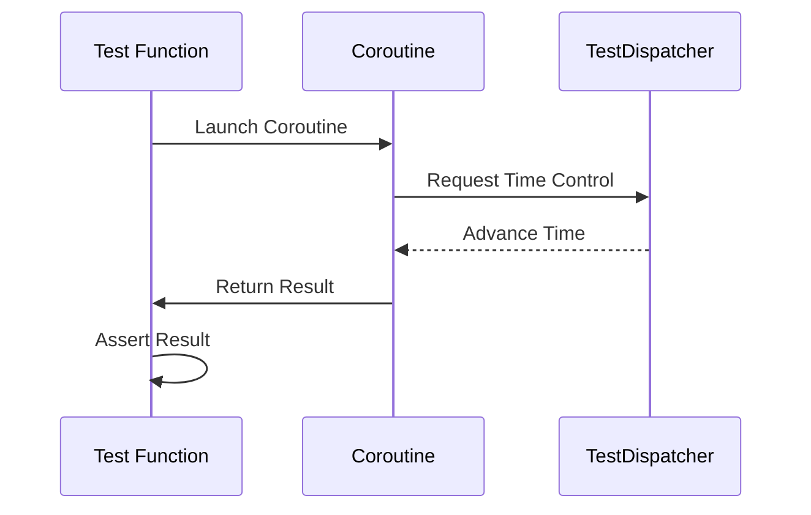

## 14.8 Testing Coroutines

Testing asynchronous code is a crucial aspect of software development, especially when working with Kotlin's coroutines. Coroutines provide a powerful way to handle asynchronous programming, but they also introduce complexities when it comes to testing. In this section, we will delve into the intricacies of testing coroutines, leveraging tools like `runBlockingTest` and `TestCoroutineDispatcher`, and explore best practices to ensure your asynchronous code is robust and reliable.

### Understanding Coroutines in Kotlin

Before diving into testing, let's briefly revisit what coroutines are and why they are essential in Kotlin. Coroutines are a concurrency design pattern that you can use on the JVM to simplify code that executes asynchronously. They allow you to write asynchronous code in a sequential manner, making it easier to read and maintain.

Coroutines are lightweight and can be suspended and resumed, which makes them ideal for tasks like network requests, database operations, and other I/O-bound operations. However, their asynchronous nature can make testing challenging, as traditional testing approaches may not be sufficient.

### Challenges in Testing Coroutines

Testing coroutines involves several challenges:

1. **Asynchronous Execution**: Coroutines can run concurrently, making it difficult to predict the order of execution.
2. **Non-blocking Nature**: Coroutines do not block the main thread, which can lead to tests passing or failing inconsistently if not handled properly.
3. **Time-dependent Logic**: Many coroutine-based operations depend on timing, which can be tricky to simulate in tests.

To address these challenges, Kotlin provides several tools and libraries that facilitate coroutine testing.

### Key Tools for Testing Coroutines

#### `runBlockingTest`

The `runBlockingTest` function is a part of the `kotlinx-coroutines-test` library. It allows you to run coroutine code in a blocking manner, making it easier to test asynchronous code.

```kotlin
import kotlinx.coroutines.test.runBlockingTest
import kotlinx.coroutines.delay
import kotlin.test.Test
import kotlin.test.assertEquals

class CoroutineTest {

    @Test
    fun testCoroutineFunction() = runBlockingTest {
        val result = someCoroutineFunction()
        assertEquals(expectedValue, result)
    }

    suspend fun someCoroutineFunction(): String {
        delay(1000) // Simulate a delay
        return "Hello, World!"
    }
}
```

**Key Points**:
- `runBlockingTest` provides a controlled environment for testing coroutines.
- It allows you to simulate delays and other time-dependent operations without actually waiting.

#### `TestCoroutineDispatcher`

The `TestCoroutineDispatcher` is another essential tool for testing coroutines. It allows you to control the execution of coroutines, making it easier to test time-dependent logic.

```kotlin
import kotlinx.coroutines.test.TestCoroutineDispatcher
import kotlinx.coroutines.test.runBlockingTest
import kotlinx.coroutines.launch
import kotlin.test.Test
import kotlin.test.assertEquals

class DispatcherTest {

    private val testDispatcher = TestCoroutineDispatcher()

    @Test
    fun testWithDispatcher() = runBlockingTest {
        val result = mutableListOf<String>()
        launch(testDispatcher) {
            delay(1000)
            result.add("Hello")
        }
        launch(testDispatcher) {
            delay(2000)
            result.add("World")
        }

        testDispatcher.advanceTimeBy(2000)
        assertEquals(listOf("Hello", "World"), result)
    }
}
```

**Key Points**:
- `TestCoroutineDispatcher` allows you to manually control the passage of time.
- You can use `advanceTimeBy` to simulate the passage of time and test time-dependent logic.

### Best Practices for Testing Coroutines

#### 1. Use `runBlockingTest` for Unit Tests

When writing unit tests for coroutine-based functions, prefer using `runBlockingTest` as it simplifies the testing of asynchronous code by providing a synchronous-like environment.

#### 2. Leverage `TestCoroutineDispatcher` for Time Control

Use `TestCoroutineDispatcher` to control the execution of coroutines and simulate time-dependent operations. This is particularly useful for testing functions that involve delays, timeouts, or scheduled tasks.

#### 3. Avoid Global State

Coroutines can run concurrently, leading to potential issues with shared mutable state. Ensure your tests are isolated and do not rely on global state, which can lead to flaky tests.

#### 4. Test Edge Cases

As with any testing, ensure you cover edge cases, such as handling exceptions, timeouts, and cancellation scenarios. Coroutines provide structured concurrency, which can help manage these cases effectively.

#### 5. Use Mocking Libraries

Consider using mocking libraries like MockK or Mockito to mock dependencies and isolate the code under test. This can be particularly useful when testing coroutine-based functions that interact with external systems.

### Advanced Coroutine Testing Techniques

#### Testing Coroutine Cancellation

Testing cancellation in coroutines is crucial, as improper handling can lead to resource leaks or inconsistent states.

```kotlin
import kotlinx.coroutines.*
import kotlinx.coroutines.test.runBlockingTest
import kotlin.test.Test
import kotlin.test.assertTrue

class CancellationTest {

    @Test
    fun testCancellation() = runBlockingTest {
        val job = launch {
            try {
                repeat(1000) { i ->
                    println("Job: I'm sleeping $i ...")
                    delay(500L)
                }
            } finally {
                println("Job: I'm running finally")
            }
        }

        delay(1300L) // Delay a bit
        job.cancelAndJoin() // Cancel the job and wait for its completion
        assertTrue(job.isCancelled)
    }
}
```

**Key Points**:
- Use `cancelAndJoin` to cancel a coroutine and wait for its completion.
- Ensure your coroutine code handles cancellation properly, using `try-finally` blocks if necessary.

#### Testing Coroutine Exceptions

Handling exceptions in coroutines is different from traditional exception handling. Use structured concurrency to manage exceptions effectively.

```kotlin
import kotlinx.coroutines.*
import kotlinx.coroutines.test.runBlockingTest
import kotlin.test.Test
import kotlin.test.assertFailsWith

class ExceptionTest {

    @Test
    fun testExceptionHandling() = runBlockingTest {
        val exception = assertFailsWith<IllegalArgumentException> {
            launch {
                throw IllegalArgumentException("Invalid argument")
            }
        }
        assertEquals("Invalid argument", exception.message)
    }
}
```

**Key Points**:
- Use `assertFailsWith` to test for expected exceptions in coroutines.
- Ensure your coroutine code is robust against unexpected exceptions.

### Visualizing Coroutine Testing

To better understand the flow of coroutine testing, let's visualize the process using a sequence diagram.



**Diagram Explanation**:
- The test function launches a coroutine and requests time control from the `TestDispatcher`.
- The `TestDispatcher` advances time, allowing the coroutine to complete its execution.
- The coroutine returns the result to the test function, which then asserts the expected outcome.

### Try It Yourself

To solidify your understanding, try modifying the code examples provided:

1. **Experiment with Different Delays**: Change the delay values in the `TestCoroutineDispatcher` example and observe how it affects the test outcome.
2. **Test Cancellation Scenarios**: Modify the cancellation test to include additional logic in the `finally` block and ensure it executes as expected.
3. **Handle More Exceptions**: Extend the exception handling test to cover multiple exception types and verify the behavior.

### References and Further Reading

- [Kotlin Coroutines Guide](https://kotlinlang.org/docs/coroutines-guide.html)
- [Kotlinx Coroutines Test](https://kotlin.github.io/kotlinx.coroutines/kotlinx-coroutines-test/)
- [MockK Library](https://mockk.io/)
- [Mockito for Kotlin](https://site.mockito.org/)

### Knowledge Check

- **What is the purpose of `runBlockingTest` in coroutine testing?**
- **How does `TestCoroutineDispatcher` help in testing time-dependent logic?**
- **Why is it important to avoid global state in coroutine tests?**
- **How can you test coroutine cancellation effectively?**
- **What is the role of `assertFailsWith` in testing coroutine exceptions?**

### Embrace the Journey

Remember, mastering coroutine testing is a journey. As you experiment with different scenarios and techniques, you'll gain a deeper understanding of asynchronous programming in Kotlin. Keep exploring, stay curious, and enjoy the process of building robust and reliable applications!

## Quiz Time!



### What is the primary purpose of `runBlockingTest`?

- [x] To provide a controlled environment for testing coroutines.
- [ ] To execute coroutines in a non-blocking manner.
- [ ] To replace `runBlocking` in production code.
- [ ] To handle exceptions in coroutines.

> **Explanation:** `runBlockingTest` is used to create a controlled environment for testing coroutines, allowing asynchronous code to be tested in a synchronous manner.

### How does `TestCoroutineDispatcher` assist in testing?

- [x] It allows manual control of time in coroutine tests.
- [ ] It automatically handles exceptions in coroutines.
- [ ] It provides a real-time execution environment.
- [ ] It replaces the need for `runBlockingTest`.

> **Explanation:** `TestCoroutineDispatcher` enables manual control over the passage of time, which is crucial for testing time-dependent logic in coroutines.

### Why should global state be avoided in coroutine tests?

- [x] To prevent flaky tests due to shared mutable state.
- [ ] To improve test execution speed.
- [ ] To simplify test setup.
- [ ] To reduce code complexity.

> **Explanation:** Global state can lead to flaky tests because coroutines can run concurrently, causing unpredictable interactions with shared mutable state.

### What is a key benefit of using `assertFailsWith` in coroutine tests?

- [x] It verifies that a specific exception is thrown.
- [ ] It handles coroutine cancellation.
- [ ] It provides detailed error messages.
- [ ] It improves test performance.

> **Explanation:** `assertFailsWith` is used to assert that a specific exception is thrown during coroutine execution, ensuring that error handling is tested.

### How can you simulate time passage in coroutine tests?

- [x] By using `TestCoroutineDispatcher` and `advanceTimeBy`.
- [ ] By using `delay` in tests.
- [ ] By running tests in real-time.
- [ ] By using `runBlockingTest` alone.

> **Explanation:** `TestCoroutineDispatcher` allows you to simulate time passage using methods like `advanceTimeBy`, which is essential for testing time-dependent logic.

### What is the role of `cancelAndJoin` in coroutine testing?

- [x] To cancel a coroutine and wait for its completion.
- [ ] To start a coroutine.
- [ ] To handle exceptions in coroutines.
- [ ] To replace `runBlockingTest`.

> **Explanation:** `cancelAndJoin` is used to cancel a coroutine and wait for its completion, ensuring that any cleanup logic is executed.

### Which tool is used to control coroutine execution in tests?

- [x] TestCoroutineDispatcher
- [ ] runBlockingTest
- [ ] CoroutineScope
- [ ] GlobalScope

> **Explanation:** `TestCoroutineDispatcher` is specifically designed to control coroutine execution and simulate time passage in tests.

### What is a common challenge in testing coroutines?

- [x] Handling asynchronous execution and timing.
- [ ] Writing synchronous code.
- [ ] Managing large datasets.
- [ ] Implementing complex algorithms.

> **Explanation:** The asynchronous nature of coroutines introduces challenges related to execution order and timing, which must be addressed in tests.

### How can you test coroutine exceptions effectively?

- [x] By using `assertFailsWith` to verify expected exceptions.
- [ ] By ignoring exceptions in tests.
- [ ] By using `runBlockingTest` alone.
- [ ] By manually catching exceptions.

> **Explanation:** `assertFailsWith` allows you to test that specific exceptions are thrown during coroutine execution, ensuring robust error handling.

### True or False: `runBlockingTest` is suitable for production code.

- [ ] True
- [x] False

> **Explanation:** `runBlockingTest` is designed for testing purposes and should not be used in production code, where `runBlocking` or other coroutine builders are more appropriate.


