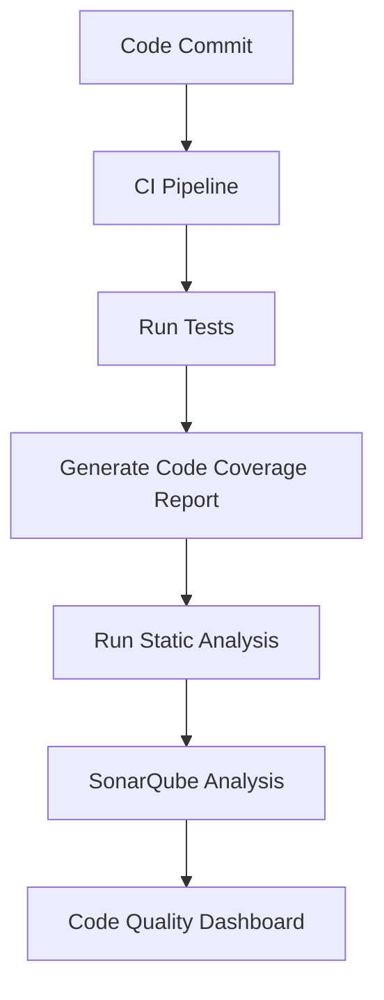

## 14.9 Code Coverage and Static Analysis

In the realm of software development, ensuring code quality is paramount. Code coverage and static analysis are two critical practices that help maintain high standards of code quality. In this section, we will delve into these concepts, focusing on their application in Kotlin development. We'll explore tools like SonarQube and Detekt, which are instrumental in achieving robust code quality.

### Understanding Code Coverage

**Code Coverage** is a measure used to describe the degree to which the source code of a program is executed when a particular test suite runs. It provides insights into which parts of your code are being tested and which are not. Higher code coverage often correlates with a lower chance of undetected bugs.

#### Types of Code Coverage

1. **Line Coverage**: Measures the percentage of lines of code executed by the tests.
2. **Branch Coverage**: Evaluates whether each possible branch (e.g., `if` and `else` statements) has been executed.
3. **Function Coverage**: Checks if each function in the code has been called.
4. **Statement Coverage**: Ensures that each statement in the code has been executed.

### Tools for Code Coverage in Kotlin

#### JaCoCo

JaCoCo (Java Code Coverage) is a popular code coverage library for Java and Kotlin projects. It integrates seamlessly with build tools like Gradle and Maven, providing detailed reports on code coverage.

**Setting Up JaCoCo with Gradle**

```kotlin
plugins {
    id("jacoco")
}

jacoco {
    toolVersion = "0.8.7"
}

tasks.jacocoTestReport {
    reports {
        xml.required.set(true)
        html.required.set(true)
    }
}

tasks.test {
    finalizedBy(tasks.jacocoTestReport)
}
```

This configuration enables JaCoCo in your Kotlin project, generating both XML and HTML reports after running tests.

### Static Analysis in Kotlin

**Static Analysis** involves examining the code without executing it to find potential errors, code smells, and deviations from coding standards. It helps in identifying issues early in the development cycle.

#### Benefits of Static Analysis

- **Early Detection of Bugs**: Identifies potential issues before runtime.
- **Improved Code Quality**: Enforces coding standards and best practices.
- **Reduced Technical Debt**: Helps maintain clean and maintainable codebases.

### Tools for Static Analysis in Kotlin

#### Detekt

Detekt is a static code analysis tool specifically designed for Kotlin. It provides a wide range of rules to detect code smells, complexity issues, and style violations.

**Setting Up Detekt with Gradle**

```kotlin
plugins {
    id("io.gitlab.arturbosch.detekt") version "1.18.1"
}

detekt {
    config = files("path/to/detekt-config.yml")
    buildUponDefaultConfig = true
}

tasks.detekt {
    reports {
        html.required.set(true)
        xml.required.set(true)
    }
}
```

This setup configures Detekt to use a custom configuration file and generate reports in HTML and XML formats.

### Integrating SonarQube with Kotlin Projects

**SonarQube** is a powerful tool for continuous inspection of code quality. It supports multiple languages, including Kotlin, and provides detailed insights into code quality metrics.

#### Setting Up SonarQube

1. **Install SonarQube**: Download and install SonarQube on your server.
2. **Configure SonarQube Scanner**: Add the SonarQube plugin to your Gradle build script.

```kotlin
plugins {
    id("org.sonarqube") version "3.3"
}

sonarqube {
    properties {
        property("sonar.projectKey", "your_project_key")
        property("sonar.host.url", "http://localhost:9000")
        property("sonar.login", "your_sonar_token")
    }
}
```

3. **Run SonarQube Analysis**: Execute the SonarQube analysis using the command:

```bash
./gradlew sonarqube
```

### Code Coverage and Static Analysis Workflow

To effectively use code coverage and static analysis, integrate these tools into your continuous integration (CI) pipeline. This ensures that code quality checks are automated and consistent.

**Sample CI Workflow with GitHub Actions**

```yaml
name: Kotlin CI

on: [push, pull_request]

jobs:
  build:
    runs-on: ubuntu-latest

    steps:
    - uses: actions/checkout@v2

    - name: Set up JDK 11
      uses: actions/setup-java@v2
      with:
        java-version: '11'

    - name: Build with Gradle
      run: ./gradlew build

    - name: Run Tests
      run: ./gradlew test

    - name: Code Coverage
      run: ./gradlew jacocoTestReport

    - name: Static Analysis
      run: ./gradlew detekt

    - name: SonarQube Analysis
      run: ./gradlew sonarqube
      env:
        SONAR_TOKEN: ${{ secrets.SONAR_TOKEN }}
```

### Visualizing Code Quality Metrics

To better understand the flow of code quality metrics, let's visualize the process using a Mermaid.js diagram.



**Diagram Description**: This flowchart illustrates the integration of code coverage and static analysis in a CI pipeline, culminating in a comprehensive code quality dashboard.

### Best Practices for Code Coverage and Static Analysis

1. **Set Realistic Coverage Goals**: Aim for meaningful coverage metrics rather than 100% coverage.
2. **Regularly Update Static Analysis Rules**: Keep your static analysis rules up-to-date to catch new types of issues.
3. **Integrate with CI/CD**: Automate code quality checks to ensure consistency.
4. **Review Reports Regularly**: Use the insights from reports to continuously improve code quality.

### Common Pitfalls and How to Avoid Them

- **Ignoring Code Coverage Reports**: Ensure that coverage reports are reviewed and acted upon.
- **Overlooking False Positives**: Regularly review static analysis findings to filter out false positives.
- **Neglecting Configuration**: Customize tools to fit your project's specific needs.

### Try It Yourself

Experiment with the provided code examples by modifying the Detekt configuration to include custom rules or adjust the JaCoCo settings to generate different types of reports. This hands-on approach will deepen your understanding of these tools.

### Further Reading and Resources

- [JaCoCo Official Documentation](https://www.jacoco.org/jacoco/trunk/doc/)
- [Detekt GitHub Repository](https://github.com/detekt/detekt)
- [SonarQube Documentation](https://docs.sonarqube.org/latest/)
- [GitHub Actions Documentation](https://docs.github.com/en/actions)

### Knowledge Check

To reinforce your understanding, consider these questions:

- What are the different types of code coverage?
- How does static analysis differ from dynamic analysis?
- What are the benefits of integrating SonarQube into your CI pipeline?

### Embrace the Journey

Remember, achieving high code quality is a continuous journey. By integrating code coverage and static analysis into your development workflow, you're taking significant steps toward building reliable and maintainable software. Keep experimenting, stay curious, and enjoy the journey!

## Quiz Time!



### What is the primary purpose of code coverage?

- [x] To measure the extent of code executed during tests
- [ ] To find runtime errors in the code
- [ ] To optimize the performance of the code
- [ ] To ensure code adheres to style guidelines

> **Explanation:** Code coverage measures how much of the code is executed during testing, helping identify untested parts.

### Which tool is specifically designed for static analysis in Kotlin?

- [ ] JaCoCo
- [x] Detekt
- [ ] SonarQube
- [ ] JUnit

> **Explanation:** Detekt is a static analysis tool tailored for Kotlin, focusing on code smells and style violations.

### What is a key benefit of static analysis?

- [x] Early detection of potential issues
- [ ] Improving runtime performance
- [ ] Reducing code execution time
- [ ] Enhancing user interface design

> **Explanation:** Static analysis helps in identifying potential issues early in the development cycle, before runtime.

### How can SonarQube be integrated into a Kotlin project?

- [x] By adding the SonarQube plugin to the Gradle build script
- [ ] By writing custom scripts for analysis
- [ ] By manually reviewing code reports
- [ ] By using a separate IDE

> **Explanation:** SonarQube can be integrated by adding its plugin to the build script, allowing automated analysis.

### What is the role of JaCoCo in Kotlin projects?

- [x] To provide code coverage reports
- [ ] To enforce coding standards
- [ ] To optimize code execution
- [ ] To manage dependencies

> **Explanation:** JaCoCo is used to generate code coverage reports, indicating which parts of the code are tested.

### Which of the following is a type of code coverage?

- [x] Branch Coverage
- [ ] Style Coverage
- [ ] Performance Coverage
- [ ] Usability Coverage

> **Explanation:** Branch coverage measures whether each possible branch in the code has been executed.

### What should be regularly updated in static analysis tools?

- [x] Analysis rules
- [ ] User interface
- [ ] Code execution paths
- [ ] Network configurations

> **Explanation:** Regularly updating analysis rules ensures that new types of issues can be detected.

### What is a common pitfall in using static analysis tools?

- [x] Overlooking false positives
- [ ] Improving code readability
- [ ] Enhancing code performance
- [ ] Reducing code complexity

> **Explanation:** Overlooking false positives can lead to ignoring important issues or addressing non-issues.

### How does integrating code quality tools with CI/CD benefit development?

- [x] Ensures consistent code quality checks
- [ ] Increases code execution speed
- [ ] Reduces the need for testing
- [ ] Enhances user interface design

> **Explanation:** Integrating with CI/CD automates code quality checks, ensuring they are consistently applied.

### True or False: Static analysis requires code execution to find issues.

- [ ] True
- [x] False

> **Explanation:** Static analysis examines the code without executing it, identifying potential issues early.


