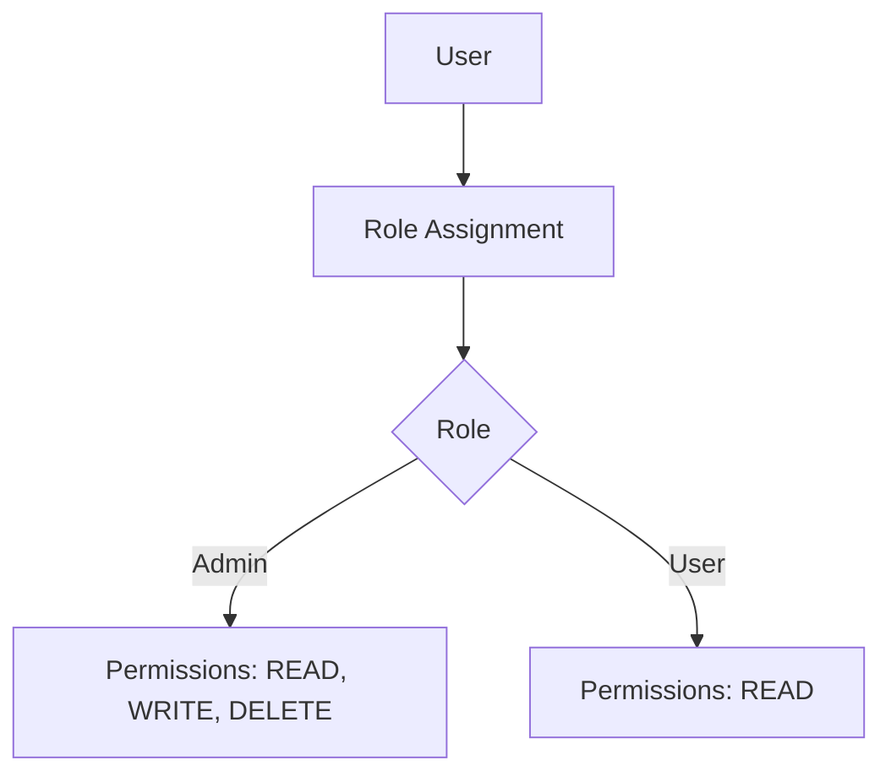
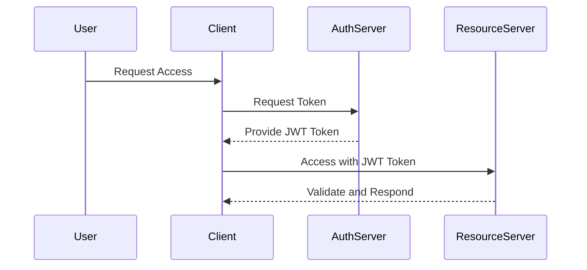
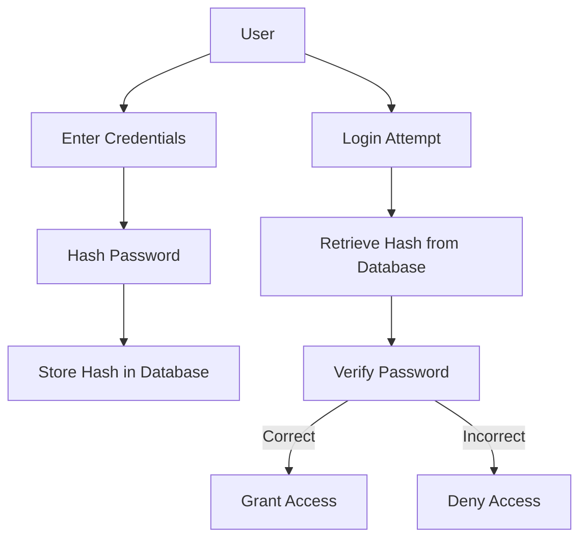

## 15.1 Authentication and Authorization Patterns

In today's digital landscape, securing applications is paramount. Authentication and authorization are two critical components in ensuring that only the right users have access to the right resources. In this section, we will delve into the various patterns and practices for implementing authentication and authorization in Kotlin applications. We will explore concepts such as role-based access control (RBAC), OAuth2, JWT (JSON Web Tokens), and more, providing code examples and diagrams to illustrate these patterns.

### Introduction to Authentication and Authorization

Authentication is the process of verifying the identity of a user or system. It answers the question, "Who are you?" Authorization, on the other hand, determines what an authenticated user is allowed to do. It answers the question, "What can you do?" Together, these processes form the backbone of application security.

#### Key Concepts

- **Authentication**: The process of verifying the identity of a user or system.
- **Authorization**: The process of determining what resources a user or system can access.
- **Role-Based Access Control (RBAC)**: A method of restricting access based on the roles assigned to users.
- **OAuth2**: An open standard for access delegation, commonly used for token-based authentication.
- **JWT (JSON Web Tokens)**: A compact, URL-safe means of representing claims to be transferred between two parties.

### Role-Based Access Control (RBAC)

RBAC is a popular method for managing user permissions within an application. It involves assigning roles to users and granting permissions to those roles. This approach simplifies permission management by grouping permissions into roles rather than assigning them individually to each user.

#### Implementing RBAC in Kotlin

Let's explore how to implement RBAC in a Kotlin application. We'll create a simple system where users can have roles such as "Admin" or "User," and each role has specific permissions.

```kotlin
// Define roles as an enum
enum class Role {
    ADMIN, USER
}

// Define permissions
enum class Permission {
    READ, WRITE, DELETE
}

// Map roles to permissions
val rolePermissions = mapOf(
    Role.ADMIN to setOf(Permission.READ, Permission.WRITE, Permission.DELETE),
    Role.USER to setOf(Permission.READ)
)

// User class with roles
data class User(val name: String, val roles: Set<Role>)

// Function to check if a user has a specific permission
fun hasPermission(user: User, permission: Permission): Boolean {
    return user.roles.any { role -> rolePermissions[role]?.contains(permission) == true }
}

// Example usage
fun main() {
    val adminUser = User("Alice", setOf(Role.ADMIN))
    val normalUser = User("Bob", setOf(Role.USER))

    println("Admin has WRITE permission: ${hasPermission(adminUser, Permission.WRITE)}") // true
    println("User has DELETE permission: ${hasPermission(normalUser, Permission.DELETE)}") // false
}
```

In this example, we define roles and permissions as enums and map roles to their respective permissions. The `hasPermission` function checks if a user has a specific permission based on their roles.

#### Diagram: RBAC Workflow



**Caption**: This diagram illustrates the RBAC workflow, where users are assigned roles, and roles are mapped to permissions.

### OAuth2 and JWT for Authentication

OAuth2 is a widely used protocol for authorization, allowing third-party applications to access user data without exposing credentials. JWT is often used in conjunction with OAuth2 to securely transmit information between parties.

#### Implementing OAuth2 with JWT in Kotlin

To implement OAuth2 with JWT in Kotlin, we can use libraries like Spring Security or Ktor. Here, we'll focus on a basic implementation using JWT for authentication.

```kotlin
import io.jsonwebtoken.Jwts
import io.jsonwebtoken.SignatureAlgorithm
import java.util.Date

// Secret key for signing JWTs
val secretKey = "mySecretKey"

// Function to generate a JWT token
fun generateToken(username: String): String {
    return Jwts.builder()
        .setSubject(username)
        .setIssuedAt(Date())
        .setExpiration(Date(System.currentTimeMillis() + 1000 * 60 * 60)) // 1 hour expiration
        .signWith(SignatureAlgorithm.HS256, secretKey.toByteArray())
        .compact()
}

// Function to validate a JWT token
fun validateToken(token: String): Boolean {
    try {
        val claims = Jwts.parser()
            .setSigningKey(secretKey.toByteArray())
            .parseClaimsJws(token)
            .body
        return claims.expiration.after(Date())
    } catch (e: Exception) {
        return false
    }
}

// Example usage
fun main() {
    val token = generateToken("Alice")
    println("Generated Token: $token")
    println("Is token valid? ${validateToken(token)}")
}
```

In this example, we use the `io.jsonwebtoken` library to generate and validate JWT tokens. The `generateToken` function creates a token with a subject (username) and an expiration time. The `validateToken` function checks if the token is valid and not expired.

#### Diagram: OAuth2 and JWT Authentication Flow



**Caption**: This diagram illustrates the OAuth2 and JWT authentication flow, where a client requests access, receives a JWT token from the authentication server, and uses it to access resources on the resource server.

### Implementing Secure Authentication and Authorization

Implementing secure authentication and authorization involves several best practices and considerations. Let's explore some of these practices and how they can be applied in Kotlin applications.

#### Best Practices for Secure Authentication

1. **Use Strong Password Policies**: Enforce strong password requirements, such as minimum length, complexity, and expiration.

2. **Implement Multi-Factor Authentication (MFA)**: Add an extra layer of security by requiring users to provide additional verification, such as a code sent to their mobile device.

3. **Secure Password Storage**: Store passwords securely using hashing algorithms like bcrypt or Argon2.

4. **Use HTTPS**: Ensure all communication between clients and servers is encrypted using HTTPS.

5. **Limit Login Attempts**: Prevent brute-force attacks by limiting the number of failed login attempts.

#### Best Practices for Secure Authorization

1. **Principle of Least Privilege**: Grant users the minimum permissions necessary to perform their tasks.

2. **Regularly Review Permissions**: Periodically review and update user permissions to ensure they are still appropriate.

3. **Implement Access Control Lists (ACLs)**: Use ACLs to define which users or roles have access to specific resources.

4. **Audit and Monitor Access**: Keep logs of access attempts and monitor for suspicious activity.

### Code Example: Secure Password Storage

Let's implement secure password storage in a Kotlin application using the `bcrypt` library.

```kotlin
import org.mindrot.jbcrypt.BCrypt

// Function to hash a password
fun hashPassword(password: String): String {
    return BCrypt.hashpw(password, BCrypt.gensalt())
}

// Function to check a password against a hash
fun checkPassword(password: String, hashed: String): Boolean {
    return BCrypt.checkpw(password, hashed)
}

// Example usage
fun main() {
    val password = "securePassword123"
    val hashedPassword = hashPassword(password)
    println("Hashed Password: $hashedPassword")

    val isPasswordCorrect = checkPassword("securePassword123", hashedPassword)
    println("Is password correct? $isPasswordCorrect") // true
}
```

In this example, we use the `BCrypt` library to hash passwords securely. The `hashPassword` function generates a hash for a given password, and the `checkPassword` function verifies if a password matches the stored hash.

### Diagram: Secure Authentication Process



**Caption**: This diagram illustrates the secure authentication process, where user passwords are hashed and stored securely, and login attempts are verified against the stored hash.

### Try It Yourself

Now that we've explored various authentication and authorization patterns, it's time to try implementing them yourself. Here are some suggestions for experimentation:

1. **Modify the RBAC Example**: Add more roles and permissions, and test the `hasPermission` function with different user scenarios.

2. **Extend the JWT Example**: Implement additional claims in the JWT token, such as roles or permissions, and update the `validateToken` function to check these claims.

3. **Enhance the Secure Password Storage Example**: Integrate the password hashing functions into a simple login system and test with different passwords.

### Knowledge Check

To reinforce your understanding, consider the following questions:

- What is the difference between authentication and authorization?
- How does role-based access control simplify permission management?
- What are some best practices for secure authentication and authorization?

### Conclusion

In this section, we've explored various patterns and practices for implementing authentication and authorization in Kotlin applications. By understanding and applying these patterns, you can build secure applications that protect user data and ensure only authorized access to resources. Remember, security is an ongoing process, and it's essential to stay informed about the latest best practices and vulnerabilities.

## Quiz Time!



### What is the primary purpose of authentication in an application?

- [x] To verify the identity of a user or system
- [ ] To determine what resources a user can access
- [ ] To encrypt data for secure transmission
- [ ] To manage user roles and permissions

> **Explanation:** Authentication is the process of verifying the identity of a user or system.

### What is the role of JWT in authentication?

- [x] To securely transmit information between parties
- [ ] To hash passwords for secure storage
- [ ] To encrypt data for secure transmission
- [ ] To manage user roles and permissions

> **Explanation:** JWT (JSON Web Tokens) is used to securely transmit information between parties.

### Which library is commonly used for password hashing in Kotlin?

- [x] BCrypt
- [ ] Argon2
- [ ] SHA-256
- [ ] MD5

> **Explanation:** BCrypt is a commonly used library for password hashing in Kotlin.

### What is the principle of least privilege?

- [x] Granting users the minimum permissions necessary to perform their tasks
- [ ] Allowing users to access all resources by default
- [ ] Encrypting all data before storage
- [ ] Using multi-factor authentication for all users

> **Explanation:** The principle of least privilege involves granting users the minimum permissions necessary to perform their tasks.

### Which protocol is widely used for access delegation in authentication?

- [x] OAuth2
- [ ] SSL/TLS
- [ ] HTTP
- [ ] FTP

> **Explanation:** OAuth2 is a widely used protocol for access delegation in authentication.

### What is the purpose of role-based access control (RBAC)?

- [x] To manage user permissions based on roles
- [ ] To encrypt data for secure transmission
- [ ] To verify the identity of a user or system
- [ ] To store passwords securely

> **Explanation:** RBAC is used to manage user permissions based on roles.

### What is a common practice to prevent brute-force attacks?

- [x] Limit the number of failed login attempts
- [ ] Use weak password policies
- [ ] Allow unlimited login attempts
- [ ] Store passwords in plain text

> **Explanation:** Limiting the number of failed login attempts is a common practice to prevent brute-force attacks.

### Which of the following is a best practice for secure password storage?

- [x] Use hashing algorithms like bcrypt
- [ ] Store passwords in plain text
- [ ] Use symmetric encryption for passwords
- [ ] Allow users to choose any password

> **Explanation:** Using hashing algorithms like bcrypt is a best practice for secure password storage.

### What does the `validateToken` function do in the JWT example?

- [x] Checks if the token is valid and not expired
- [ ] Generates a new JWT token
- [ ] Encrypts the token for secure transmission
- [ ] Assigns roles to the user

> **Explanation:** The `validateToken` function checks if the token is valid and not expired.

### True or False: OAuth2 is used for encrypting data.

- [ ] True
- [x] False

> **Explanation:** OAuth2 is not used for encrypting data; it is used for access delegation.



Remember, this is just the beginning. As you progress, you'll build more secure and robust applications. Keep experimenting, stay curious, and enjoy the journey!
