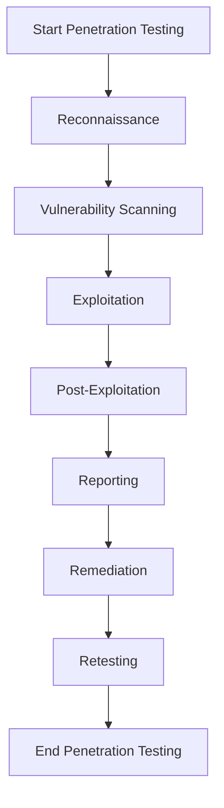

## 15.10 Penetration Testing

In the world of software development, ensuring the security of applications is paramount. Penetration testing, often referred to as pen testing, is a critical process for assessing the security posture of applications, including those developed in Kotlin. This section provides a comprehensive guide to penetration testing, focusing on methodologies, tools, and techniques that are particularly relevant to Kotlin applications. 

### Introduction to Penetration Testing

Penetration testing is a simulated cyber-attack against your application to check for exploitable vulnerabilities. It involves assessing the security of the application by attempting to exploit weaknesses in the system, such as insecure code, unpatched software, or misconfigured systems. The goal is to identify vulnerabilities before malicious actors can exploit them.

#### Why Penetration Testing is Important

- **Identify Vulnerabilities:** Discover weaknesses in your application that could be exploited by attackers.
- **Improve Security Posture:** Strengthen your security defenses by addressing identified vulnerabilities.
- **Compliance and Standards:** Meet industry regulations and standards that require regular security assessments.
- **Risk Management:** Understand the potential impact of vulnerabilities and prioritize remediation efforts.

### Penetration Testing Methodologies

There are several methodologies for conducting penetration tests, each with its own focus and approach. Here are some of the most commonly used methodologies:

#### Black Box Testing

In black box testing, the tester has no prior knowledge of the system. This approach simulates an external attack where the attacker has no insider information. It is useful for identifying vulnerabilities that could be exploited by an outsider.

#### White Box Testing

White box testing involves a comprehensive examination of the application with full knowledge of the system, including source code, architecture, and network details. This method is effective for identifying vulnerabilities that may not be visible from an external perspective.

#### Gray Box Testing

Gray box testing is a hybrid approach where the tester has partial knowledge of the system. This method combines elements of both black box and white box testing, providing a balanced view of the application's security posture.

### Tools for Penetration Testing

Penetration testing requires a variety of tools to identify and exploit vulnerabilities. Here are some essential tools for pen testing Kotlin applications:

#### OWASP ZAP (Zed Attack Proxy)

OWASP ZAP is an open-source tool for finding vulnerabilities in web applications. It is particularly useful for testing Kotlin-based web applications. ZAP can be used to perform automated scans and manual testing.

#### Burp Suite

Burp Suite is a popular tool for web application security testing. It provides a comprehensive set of tools for performing penetration tests, including a proxy server, scanner, and intruder.

#### Metasploit Framework

Metasploit is a powerful tool for developing and executing exploit code against a remote target machine. It is widely used for penetration testing and can be integrated with other tools for comprehensive testing.

#### Nmap

Nmap is a network scanning tool used to discover hosts and services on a computer network. It is useful for identifying open ports and services that could be exploited.

#### Nikto

Nikto is a web server scanner that tests for dangerous files, outdated server software, and other vulnerabilities. It is a useful tool for identifying potential security issues in web applications.

### Techniques for Penetration Testing

Penetration testing involves a variety of techniques to identify and exploit vulnerabilities. Here are some common techniques used in pen testing:

#### SQL Injection

SQL injection is a technique where an attacker inserts malicious SQL code into an input field to manipulate the database. It is one of the most common vulnerabilities and can lead to data breaches.

```kotlin
fun executeQuery(userInput: String) {
    val query = "SELECT * FROM users WHERE username = '$userInput'"
    // Vulnerable to SQL injection if userInput is not sanitized
    val resultSet = statement.executeQuery(query)
}
```

**Mitigation:** Use prepared statements or parameterized queries to prevent SQL injection.

```kotlin
fun executeSafeQuery(userInput: String) {
    val query = "SELECT * FROM users WHERE username = ?"
    val preparedStatement = connection.prepareStatement(query)
    preparedStatement.setString(1, userInput)
    val resultSet = preparedStatement.executeQuery()
}
```

#### Cross-Site Scripting (XSS)

XSS is a vulnerability that allows attackers to inject malicious scripts into web pages viewed by other users. It can be used to steal cookies, session tokens, or other sensitive information.

```kotlin
fun displayUserInput(userInput: String): String {
    // Vulnerable to XSS if userInput is not sanitized
    return "<div>$userInput</div>"
}
```

**Mitigation:** Escape user input before displaying it in the browser.

```kotlin
fun displaySafeUserInput(userInput: String): String {
    val escapedInput = HtmlUtils.htmlEscape(userInput)
    return "<div>$escapedInput</div>"
}
```

#### Cross-Site Request Forgery (CSRF)

CSRF is an attack that tricks a user into performing actions they did not intend to perform. It exploits the trust that a web application has in the user's browser.

**Mitigation:** Use anti-CSRF tokens to validate requests.

```kotlin
// Generate CSRF token
val csrfToken = UUID.randomUUID().toString()

// Validate CSRF token
fun validateCsrfToken(requestToken: String): Boolean {
    return requestToken == csrfToken
}
```

### Visualizing Penetration Testing Workflow

To better understand the penetration testing process, let's visualize the workflow using a flowchart.



**Description:** This flowchart illustrates the typical workflow of a penetration test, from reconnaissance to retesting.

### Penetration Testing in Kotlin Applications

When conducting penetration tests on Kotlin applications, it's important to consider the unique aspects of the Kotlin language and its ecosystem. Here are some specific considerations:

#### Kotlin-Specific Security Concerns

- **Null Safety:** While Kotlin's null safety features reduce the risk of null pointer exceptions, they do not eliminate all security risks. Ensure that null safety is not bypassed in critical code paths.
- **Coroutines:** Asynchronous programming with coroutines can introduce concurrency issues if not handled properly. Ensure that shared mutable state is avoided and proper synchronization is used.

#### Testing Kotlin Multiplatform Projects

Kotlin Multiplatform projects allow sharing code across different platforms. When testing these projects, ensure that security assessments cover all target platforms, including JVM, JavaScript, and Native.

### Best Practices for Penetration Testing

To conduct effective penetration tests, follow these best practices:

- **Define Scope:** Clearly define the scope of the penetration test, including the systems and applications to be tested.
- **Obtain Authorization:** Ensure that you have proper authorization to conduct the penetration test to avoid legal issues.
- **Use a Methodical Approach:** Follow a structured methodology to ensure comprehensive coverage of the application.
- **Document Findings:** Document all findings, including vulnerabilities, exploits, and recommendations for remediation.
- **Collaborate with Development Teams:** Work closely with development teams to understand the application architecture and address vulnerabilities effectively.

### Try It Yourself

To gain hands-on experience with penetration testing, try experimenting with the following exercises:

1. **Modify SQL Injection Code:** Experiment with the vulnerable SQL injection code example provided earlier. Try injecting different SQL commands and observe the results.

2. **Create an XSS Attack:** Use the vulnerable XSS code example to inject a script that displays an alert box. Then, implement the mitigation and verify that the attack is no longer possible.

3. **Implement CSRF Protection:** Implement CSRF protection in a sample web application and test its effectiveness using a CSRF attack scenario.

### Knowledge Check

- **Question:** What are the three main types of penetration testing methodologies?
- **Question:** How can SQL injection vulnerabilities be mitigated in Kotlin applications?
- **Question:** What is the purpose of using anti-CSRF tokens in web applications?

### Conclusion

Penetration testing is an essential process for assessing and improving the security posture of Kotlin applications. By understanding the methodologies, tools, and techniques involved, you can effectively identify and address vulnerabilities in your applications. Remember, this is just the beginning. As you progress, you'll build more secure and robust applications. Keep experimenting, stay curious, and enjoy the journey!

## Quiz Time!



### What is the primary goal of penetration testing?

- [x] To identify vulnerabilities before malicious actors can exploit them.
- [ ] To develop new features in an application.
- [ ] To improve the user interface of an application.
- [ ] To increase the application's performance.

> **Explanation:** The primary goal of penetration testing is to identify vulnerabilities in an application before they can be exploited by malicious actors.

### Which tool is commonly used for web application security testing?

- [x] Burp Suite
- [ ] Eclipse
- [ ] IntelliJ IDEA
- [ ] Visual Studio Code

> **Explanation:** Burp Suite is a popular tool used for web application security testing.

### What is SQL injection?

- [x] A technique where an attacker inserts malicious SQL code into an input field.
- [ ] A method for encrypting SQL queries.
- [ ] A way to optimize SQL database performance.
- [ ] A process for backing up SQL databases.

> **Explanation:** SQL injection is a technique where an attacker inserts malicious SQL code into an input field to manipulate the database.

### How can cross-site scripting (XSS) vulnerabilities be mitigated?

- [x] By escaping user input before displaying it in the browser.
- [ ] By using global variables.
- [ ] By increasing server memory.
- [ ] By optimizing database queries.

> **Explanation:** XSS vulnerabilities can be mitigated by escaping user input before displaying it in the browser to prevent the execution of malicious scripts.

### What is the purpose of using anti-CSRF tokens?

- [x] To validate requests and prevent CSRF attacks.
- [ ] To encrypt data in transit.
- [ ] To improve application performance.
- [ ] To manage user sessions.

> **Explanation:** Anti-CSRF tokens are used to validate requests and prevent cross-site request forgery (CSRF) attacks.

### Which of the following is a network scanning tool?

- [x] Nmap
- [ ] Kotlin
- [ ] Gradle
- [ ] Git

> **Explanation:** Nmap is a network scanning tool used to discover hosts and services on a computer network.

### What is the difference between black box and white box testing?

- [x] Black box testing involves no prior knowledge of the system, while white box testing involves full knowledge.
- [ ] Black box testing is faster than white box testing.
- [ ] White box testing is less secure than black box testing.
- [ ] Black box testing is more expensive than white box testing.

> **Explanation:** Black box testing involves no prior knowledge of the system, simulating an external attack, while white box testing involves full knowledge, allowing for a comprehensive examination.

### What is the role of Metasploit in penetration testing?

- [x] It is a tool for developing and executing exploit code against a remote target machine.
- [ ] It is a tool for designing user interfaces.
- [ ] It is a tool for managing database connections.
- [ ] It is a tool for writing Kotlin code.

> **Explanation:** Metasploit is a powerful tool used for developing and executing exploit code against a remote target machine in penetration testing.

### What does the acronym CSRF stand for?

- [x] Cross-Site Request Forgery
- [ ] Cross-Site Resource Fetching
- [ ] Client-Side Resource Fetching
- [ ] Client-Side Request Forgery

> **Explanation:** CSRF stands for Cross-Site Request Forgery, which is an attack that tricks a user into performing actions they did not intend to perform.

### True or False: Penetration testing can help meet industry regulations and standards.

- [x] True
- [ ] False

> **Explanation:** True. Penetration testing can help organizations meet industry regulations and standards that require regular security assessments.


