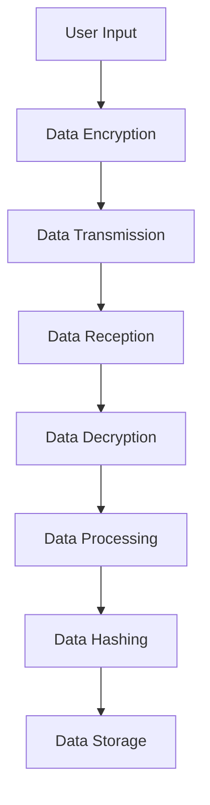

## 15.11 Security in Multiplatform Projects

In today's interconnected world, developing applications that run seamlessly across multiple platforms is not just a convenience but a necessity. Kotlin's multiplatform capabilities offer developers the flexibility to share code across different environments such as Android, iOS, and the web. However, with this flexibility comes the challenge of ensuring consistent security measures across these platforms. This section delves into the intricacies of implementing security in Kotlin multiplatform projects, focusing on consistent encryption and hashing techniques.

### Introduction to Multiplatform Security

Security in multiplatform projects involves ensuring that data remains protected regardless of the platform on which the application is running. This means implementing robust encryption and hashing techniques that work consistently across Android, iOS, and other platforms. Let's explore the key concepts and strategies for achieving this.

### Understanding Encryption and Hashing

Before diving into implementation, it's crucial to understand the difference between encryption and hashing:

- **Encryption** is the process of converting plaintext into ciphertext using an algorithm and a key. It is reversible, meaning that with the correct key, the original data can be retrieved.
- **Hashing** is a one-way function that converts data into a fixed-size string of characters, which is typically a hash code. It is not reversible, making it ideal for verifying data integrity.

### Consistent Encryption Across Platforms

To ensure data security, encryption must be consistent across all platforms. This involves using standardized algorithms and managing keys securely.

#### Choosing the Right Encryption Algorithm

Common encryption algorithms include AES (Advanced Encryption Standard), RSA (Rivest-Shamir-Adleman), and ECC (Elliptic Curve Cryptography). For most applications, AES is recommended due to its balance of security and performance.

```kotlin
// Example of AES encryption in Kotlin
import javax.crypto.Cipher
import javax.crypto.KeyGenerator
import javax.crypto.SecretKey
import javax.crypto.spec.IvParameterSpec

fun encrypt(data: ByteArray, secretKey: SecretKey, iv: ByteArray): ByteArray {
    val cipher = Cipher.getInstance("AES/CBC/PKCS5Padding")
    val ivSpec = IvParameterSpec(iv)
    cipher.init(Cipher.ENCRYPT_MODE, secretKey, ivSpec)
    return cipher.doFinal(data)
}
```

#### Key Management

Managing encryption keys securely is critical. Consider using a secure key management system or platform-specific secure storage solutions like Android's Keystore or iOS's Keychain.

### Hashing for Data Integrity

Hashing ensures data integrity by generating a unique hash code for the data. Any change in the data results in a different hash code, making it easy to detect tampering.

#### Implementing Hashing in Kotlin

Kotlin provides libraries for hashing, such as `java.security.MessageDigest`, which can be used to implement hashing algorithms like SHA-256.

```kotlin
// Example of SHA-256 hashing in Kotlin
import java.security.MessageDigest

fun hash(data: String): String {
    val bytes = data.toByteArray()
    val md = MessageDigest.getInstance("SHA-256")
    val digest = md.digest(bytes)
    return digest.fold("") { str, it -> str + "%02x".format(it) }
}
```

### Handling Security Across Platforms

Implementing security in a multiplatform project involves ensuring that encryption and hashing work consistently across different environments. Here are some strategies to achieve this:

#### Using Kotlin Multiplatform Libraries

Kotlin Multiplatform libraries like `kotlinx-serialization` and `ktor` can help manage data serialization and network communication securely across platforms.

#### Platform-Specific Implementations

While Kotlin Multiplatform allows for shared code, some platform-specific implementations may be necessary for security features. For example, using Android's Keystore and iOS's Keychain for secure key storage.

### Visualizing Multiplatform Security

To better understand the flow of data and security measures in a multiplatform project, let's visualize the architecture using a Mermaid.js diagram.



**Figure 1:** This diagram illustrates the flow of data through encryption, transmission, decryption, processing, hashing, and storage in a multiplatform application.

### Best Practices for Multiplatform Security

1. **Use Strong Encryption Algorithms:** Always use well-established encryption algorithms like AES or RSA.
2. **Secure Key Management:** Store keys securely using platform-specific solutions.
3. **Consistent Hashing:** Use the same hashing algorithms across platforms to ensure data integrity.
4. **Regular Security Audits:** Conduct regular security audits to identify and fix vulnerabilities.
5. **Stay Updated:** Keep libraries and dependencies updated to protect against known vulnerabilities.

### Try It Yourself

Experiment with the provided code examples by modifying the encryption algorithm or hash function. Try implementing a simple multiplatform project that encrypts and hashes data consistently across Android and iOS.

### References and Further Reading

- [Kotlin Multiplatform Documentation](https://kotlinlang.org/docs/multiplatform.html)
- [OWASP Cryptographic Storage Cheat Sheet](https://cheatsheetseries.owasp.org/cheatsheets/Cryptographic_Storage_Cheat_Sheet.html)
- [Android Keystore System](https://developer.android.com/training/articles/keystore)
- [iOS Keychain Services](https://developer.apple.com/documentation/security/keychain_services)

### Knowledge Check

- Explain the difference between encryption and hashing.
- Describe how to manage encryption keys securely in a multiplatform project.
- What are the benefits of using Kotlin Multiplatform libraries for security?

### Conclusion

Ensuring security in multiplatform projects is a complex but essential task. By implementing consistent encryption and hashing techniques, developers can protect data across different environments. Remember, security is an ongoing process that requires regular updates and audits to stay ahead of potential threats. Keep experimenting, stay curious, and enjoy the journey of building secure multiplatform applications!

## Quiz Time!



### What is the main purpose of encryption in a multiplatform project?

- [x] To convert plaintext into ciphertext for secure data transmission
- [ ] To generate a unique hash code for data integrity
- [ ] To manage encryption keys securely
- [ ] To store data in a platform-specific secure storage

> **Explanation:** Encryption is used to convert plaintext into ciphertext, ensuring secure data transmission across platforms.

### Which encryption algorithm is recommended for most applications due to its balance of security and performance?

- [x] AES (Advanced Encryption Standard)
- [ ] RSA (Rivest-Shamir-Adleman)
- [ ] ECC (Elliptic Curve Cryptography)
- [ ] DES (Data Encryption Standard)

> **Explanation:** AES is recommended for its balance of security and performance, making it suitable for most applications.

### What is the primary function of hashing in data security?

- [x] To generate a unique hash code for verifying data integrity
- [ ] To encrypt data for secure transmission
- [ ] To manage encryption keys
- [ ] To store data securely

> **Explanation:** Hashing generates a unique hash code that verifies data integrity, ensuring that data has not been tampered with.

### Which Kotlin library can be used for secure data serialization across platforms?

- [x] kotlinx-serialization
- [ ] kotlinx-coroutines
- [ ] kotlinx-html
- [ ] kotlinx-datetime

> **Explanation:** `kotlinx-serialization` is used for secure data serialization across platforms, ensuring consistent data handling.

### What is a key consideration when managing encryption keys in a multiplatform project?

- [x] Using platform-specific secure storage solutions
- [ ] Using the same key for all platforms
- [ ] Storing keys in plain text
- [ ] Avoiding key rotation

> **Explanation:** Using platform-specific secure storage solutions, like Android's Keystore and iOS's Keychain, is crucial for secure key management.

### Which of the following is NOT a best practice for multiplatform security?

- [ ] Use strong encryption algorithms
- [ ] Secure key management
- [ ] Regular security audits
- [x] Use different hashing algorithms for each platform

> **Explanation:** Using different hashing algorithms for each platform can lead to inconsistencies and potential security vulnerabilities.

### What is the role of Kotlin Multiplatform libraries in security?

- [x] To manage data serialization and network communication securely across platforms
- [ ] To provide platform-specific encryption algorithms
- [ ] To store encryption keys securely
- [ ] To perform regular security audits

> **Explanation:** Kotlin Multiplatform libraries help manage data serialization and network communication securely across platforms.

### Which platform-specific solution is recommended for secure key storage on Android?

- [x] Android's Keystore
- [ ] iOS's Keychain
- [ ] Kotlin Multiplatform
- [ ] Java's KeyStore

> **Explanation:** Android's Keystore is the recommended solution for secure key storage on Android devices.

### What is the benefit of conducting regular security audits in a multiplatform project?

- [x] To identify and fix vulnerabilities
- [ ] To generate unique hash codes
- [ ] To encrypt data for secure transmission
- [ ] To store data securely

> **Explanation:** Regular security audits help identify and fix vulnerabilities, ensuring the ongoing security of the project.

### True or False: Hashing is a reversible process, allowing the original data to be retrieved.

- [ ] True
- [x] False

> **Explanation:** Hashing is a one-way process, meaning the original data cannot be retrieved from the hash code.


