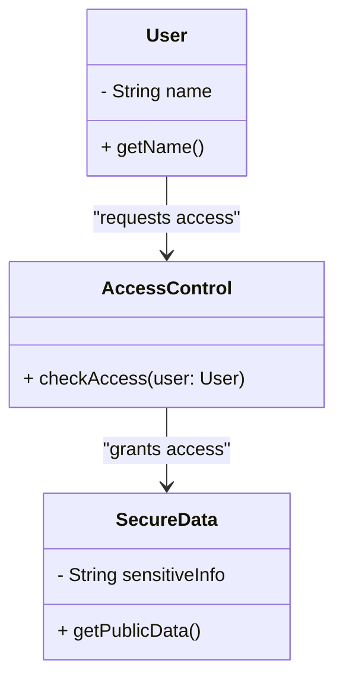

## 15.12 Secure Design Principles

In the realm of software engineering, security is paramount. As Kotlin developers and architects, understanding and implementing secure design principles is crucial to building robust, resilient, and secure applications. This section delves into two fundamental secure design principles: the Principle of Least Privilege and Fail-Safe Defaults. By adhering to these principles, we can significantly mitigate security risks and enhance the overall security posture of our applications.

### Principle of Least Privilege

The Principle of Least Privilege (PoLP) is a security concept that dictates that a user, process, or system component should have the minimum level of access necessary to perform its function. This principle is essential in minimizing the potential damage from accidents, errors, or unauthorized use.

#### Key Concepts

- **Access Control**: Implement fine-grained access control mechanisms to ensure that users and processes have only the permissions they need.
- **Role-Based Access Control (RBAC)**: Use RBAC to assign permissions based on roles, ensuring that users have access only to the resources necessary for their role.
- **Separation of Duties**: Divide responsibilities among different users or processes to prevent conflicts of interest and reduce the risk of fraud or error.

#### Implementing PoLP in Kotlin

In Kotlin, we can implement the Principle of Least Privilege through careful design and coding practices. Here are some strategies:

- **Use Kotlin's Visibility Modifiers**: Leverage Kotlin's visibility modifiers (`private`, `protected`, `internal`, `public`) to restrict access to classes, functions, and properties.

```kotlin
class SecureData {
    private val sensitiveInfo: String = "Secret"

    fun getPublicData(): String {
        return "Public Information"
    }
}
```

- **Encapsulation**: Encapsulate sensitive data and logic within classes and expose only what is necessary through public methods.

- **Limit Permissions in Android Apps**: For Android development, declare only the necessary permissions in the `AndroidManifest.xml` file.

```xml
<manifest xmlns:android="http://schemas.android.com/apk/res/android"
    package="com.example.secureapp">

    <uses-permission android:name="android.permission.INTERNET" />
    <!-- Avoid unnecessary permissions -->
</manifest>
```

- **Use Dependency Injection**: Implement dependency injection to control access to resources and services, ensuring that components receive only the dependencies they need.

#### Benefits of PoLP

- **Reduced Attack Surface**: By limiting access, we reduce the number of potential entry points for attackers.
- **Minimized Damage**: In the event of a breach, the damage is limited to the permissions granted.
- **Improved Auditability**: With clear access controls, it becomes easier to audit and track access to sensitive resources.

### Fail-Safe Defaults

Fail-Safe Defaults is a security principle that states systems should default to a secure state in the event of a failure. This principle ensures that the system remains secure even when unexpected conditions occur.

#### Key Concepts

- **Default Deny**: In access control, default to denying access unless explicitly granted.
- **Graceful Degradation**: Design systems to degrade gracefully, maintaining essential security functions even when non-essential components fail.
- **Error Handling**: Implement robust error handling to prevent information leakage and maintain security.

#### Implementing Fail-Safe Defaults in Kotlin

Kotlin provides several features and practices to implement fail-safe defaults effectively:

- **Use Kotlin's Null Safety**: Leverage Kotlin's null safety features to prevent null pointer exceptions and ensure safe defaults.

```kotlin
fun getUserName(user: User?): String {
    return user?.name ?: "Unknown User"
}
```

- **Exception Handling**: Implement comprehensive exception handling to manage errors securely.

```kotlin
fun readFile(filePath: String): String {
    return try {
        File(filePath).readText()
    } catch (e: IOException) {
        "Error reading file"
    }
}
```

- **Default Configurations**: Ensure that default configurations are secure and require explicit changes to reduce security risks.

#### Benefits of Fail-Safe Defaults

- **Enhanced Security**: By defaulting to a secure state, we minimize the risk of accidental exposure.
- **Resilience**: Systems are more resilient to failures and unexpected conditions.
- **Consistency**: Ensures consistent behavior across different environments and scenarios.

### Visualizing Secure Design Principles

To better understand how these principles are applied, let's visualize the relationship between components in a secure system using a class diagram.



**Diagram Description**: This diagram illustrates a simple access control system where a `User` requests access through an `AccessControl` component, which then interacts with `SecureData`. The `SecureData` class encapsulates sensitive information, adhering to the Principle of Least Privilege by exposing only necessary data.

### Practical Application of Secure Design Principles

#### Case Study: Secure File Management System

Let's consider a practical example of applying these principles in a secure file management system. The system allows users to upload, download, and manage files securely.

**Requirements**:
- Users can upload and download files.
- Only authorized users can access specific files.
- The system should handle errors gracefully and default to secure states.

**Design Considerations**:
- Implement RBAC to manage user permissions.
- Use Kotlin's visibility modifiers to encapsulate file operations.
- Ensure secure defaults for file access and error handling.

**Sample Code Snippet**:

```kotlin
class FileManager {
    private val files: MutableMap<String, File> = mutableMapOf()

    fun uploadFile(user: User, file: File): Boolean {
        return if (user.hasPermission("upload")) {
            files[file.name] = file
            true
        } else {
            false // Fail-safe: deny upload if permission is missing
        }
    }

    fun downloadFile(user: User, fileName: String): File? {
        return if (user.hasPermission("download")) {
            files[fileName] // Return file if permission is granted
        } else {
            null // Fail-safe: return null if permission is missing
        }
    }
}

class User(private val permissions: Set<String>) {
    fun hasPermission(permission: String): Boolean {
        return permissions.contains(permission)
    }
}
```

**Code Explanation**: In this example, the `FileManager` class manages file uploads and downloads. It uses the Principle of Least Privilege by checking user permissions before allowing file operations. The system defaults to a secure state by denying access if permissions are not explicitly granted.

### Try It Yourself

To deepen your understanding, try modifying the code example above to add logging for access attempts. Consider how you can enhance security by logging both successful and failed access attempts.

### Conclusion

Implementing secure design principles like the Principle of Least Privilege and Fail-Safe Defaults is essential for building secure applications. By carefully designing access controls and ensuring secure defaults, we can significantly reduce security risks and enhance the resilience of our systems.

### References and Further Reading

- [OWASP Secure Design Principles](https://owasp.org/www-project-secure-design-principles/)
- [Kotlin Documentation](https://kotlinlang.org/docs/home.html)
- [Android Security Best Practices](https://developer.android.com/training/articles/security-tips)

## Quiz Time!



### What is the Principle of Least Privilege?

- [x] A security concept that dictates a user, process, or system component should have the minimum level of access necessary to perform its function.
- [ ] A principle that ensures all users have maximum access to resources.
- [ ] A design pattern for optimizing performance.
- [ ] A method for encrypting data.

> **Explanation:** The Principle of Least Privilege (PoLP) is a security concept that limits access to only what is necessary for a user, process, or system component to perform its function.

### How can Kotlin's visibility modifiers help implement PoLP?

- [x] By restricting access to classes, functions, and properties.
- [ ] By increasing the performance of the application.
- [ ] By simplifying the code structure.
- [ ] By automatically encrypting sensitive data.

> **Explanation:** Kotlin's visibility modifiers (`private`, `protected`, `internal`, `public`) can be used to restrict access to classes, functions, and properties, thereby implementing the Principle of Least Privilege.

### What is a key benefit of the Principle of Least Privilege?

- [x] Reduced attack surface.
- [ ] Increased complexity.
- [ ] Unlimited access for all users.
- [ ] Automatic data encryption.

> **Explanation:** One of the key benefits of the Principle of Least Privilege is the reduced attack surface, as it limits the number of potential entry points for attackers.

### What does the Fail-Safe Defaults principle ensure?

- [x] Systems default to a secure state in the event of a failure.
- [ ] Systems default to an open state in the event of a failure.
- [ ] Systems automatically encrypt all data.
- [ ] Systems provide maximum access to all users.

> **Explanation:** The Fail-Safe Defaults principle ensures that systems default to a secure state in the event of a failure, minimizing the risk of accidental exposure.

### How can Kotlin's null safety feature help implement Fail-Safe Defaults?

- [x] By preventing null pointer exceptions and ensuring safe defaults.
- [ ] By automatically encrypting data.
- [ ] By improving application performance.
- [ ] By simplifying code structure.

> **Explanation:** Kotlin's null safety feature helps implement Fail-Safe Defaults by preventing null pointer exceptions and ensuring safe defaults, thereby maintaining a secure state.

### What is a benefit of Fail-Safe Defaults?

- [x] Enhanced security.
- [ ] Increased complexity.
- [ ] Unlimited access for all users.
- [ ] Automatic data encryption.

> **Explanation:** A benefit of Fail-Safe Defaults is enhanced security, as it ensures systems default to a secure state, minimizing the risk of accidental exposure.

### What is Role-Based Access Control (RBAC)?

- [x] A method to assign permissions based on roles.
- [ ] A method to encrypt data.
- [ ] A design pattern for optimizing performance.
- [ ] A method to provide maximum access to all users.

> **Explanation:** Role-Based Access Control (RBAC) is a method to assign permissions based on roles, ensuring that users have access only to the resources necessary for their role.

### How does encapsulation support the Principle of Least Privilege?

- [x] By encapsulating sensitive data and logic within classes and exposing only necessary methods.
- [ ] By increasing the performance of the application.
- [ ] By simplifying the code structure.
- [ ] By automatically encrypting sensitive data.

> **Explanation:** Encapsulation supports the Principle of Least Privilege by encapsulating sensitive data and logic within classes and exposing only necessary methods, thus limiting access.

### What is a practical application of secure design principles in Kotlin?

- [x] Implementing a secure file management system with RBAC and secure defaults.
- [ ] Increasing application performance with optimized code.
- [ ] Simplifying code structure with design patterns.
- [ ] Automatically encrypting all data.

> **Explanation:** A practical application of secure design principles in Kotlin is implementing a secure file management system with Role-Based Access Control (RBAC) and secure defaults, ensuring only authorized users can access specific files.

### True or False: The Principle of Least Privilege can help improve auditability.

- [x] True
- [ ] False

> **Explanation:** True. The Principle of Least Privilege can help improve auditability by providing clear access controls, making it easier to audit and track access to sensitive resources.


