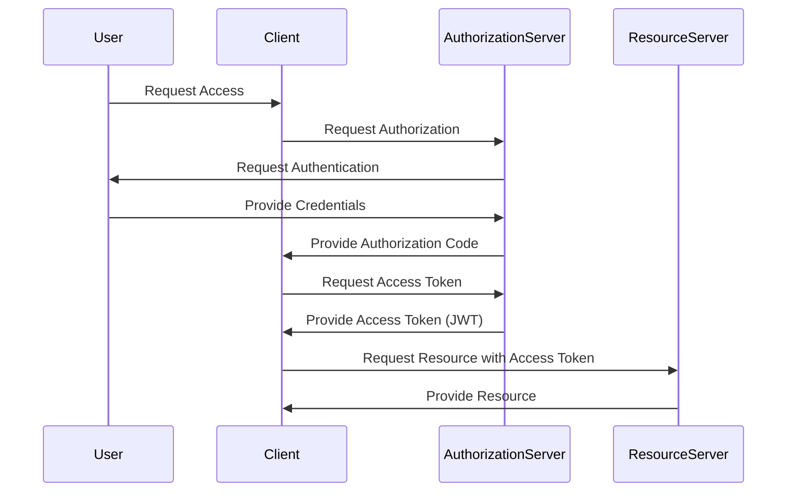

## 15.2 Using OAuth2 and JWT

In today's digital landscape, securing applications is paramount. OAuth2 and JWT (JSON Web Tokens) are two pivotal technologies that help achieve secure authentication and authorization in modern software systems. In this section, we will explore how to implement OAuth2 and JWT in Kotlin applications, focusing on secure authentication, token validation, and refresh mechanisms.

### Understanding OAuth2 and JWT

#### What is OAuth2?

OAuth2 is an open standard for access delegation, commonly used as a way to grant websites or applications limited access to a user's information without exposing passwords. It is widely adopted for its flexibility and security features. OAuth2 provides a framework for authorization flows, allowing users to grant third-party applications access to their resources.

#### What is JWT?

JWT, or JSON Web Token, is a compact, URL-safe means of representing claims to be transferred between two parties. The claims in a JWT are encoded as a JSON object that is used as the payload of a JSON Web Signature (JWS) structure or as the plaintext of a JSON Web Encryption (JWE) structure, enabling the claims to be digitally signed or integrity protected with a Message Authentication Code (MAC) and/or encrypted.

### OAuth2 and JWT in Kotlin

Implementing OAuth2 and JWT in Kotlin involves several steps, including setting up an authorization server, creating JWTs, and managing token lifecycles. Let's dive into each of these components.

#### Setting Up an Authorization Server

To implement OAuth2, you need an authorization server that handles the authentication and authorization processes. In Kotlin, you can use frameworks like Spring Security OAuth2 or Ktor to set up an authorization server.

##### Using Spring Security OAuth2

Spring Security OAuth2 provides comprehensive support for OAuth2, making it a popular choice for Kotlin developers. Here's a basic setup:

```kotlin
import org.springframework.boot.autoconfigure.SpringBootApplication
import org.springframework.boot.runApplication
import org.springframework.security.config.annotation.web.builders.HttpSecurity
import org.springframework.security.config.annotation.web.configuration.EnableWebSecurity
import org.springframework.security.config.annotation.web.configuration.WebSecurityConfigurerAdapter

@SpringBootApplication
class OAuth2ServerApplication

fun main(args: Array<String>) {
    runApplication<OAuth2ServerApplication>(*args)
}

@EnableWebSecurity
class SecurityConfig : WebSecurityConfigurerAdapter() {
    override fun configure(http: HttpSecurity) {
        http
            .authorizeRequests()
            .antMatchers("/oauth/token").permitAll()
            .anyRequest().authenticated()
            .and()
            .oauth2Login()
    }
}
```

This code sets up a basic OAuth2 authorization server using Spring Boot and Spring Security. It configures the security settings to permit all requests to the `/oauth/token` endpoint, which is where token requests are handled.

##### Using Ktor

Ktor is a lightweight framework for building asynchronous servers and clients in Kotlin. It can also be used to implement OAuth2 authorization servers:

```kotlin
import io.ktor.application.*
import io.ktor.auth.*
import io.ktor.auth.oauth2.*
import io.ktor.features.*
import io.ktor.response.*
import io.ktor.routing.*
import io.ktor.server.engine.*
import io.ktor.server.netty.*

fun main() {
    embeddedServer(Netty, port = 8080) {
        install(Authentication) {
            oauth("auth-oauth-google") {
                client = HttpClient(Apache)
                providerLookup = { OAuthServerSettings.OAuth2ServerSettings(
                    name = "google",
                    authorizeUrl = "https://accounts.google.com/o/oauth2/auth",
                    accessTokenUrl = "https://accounts.google.com/o/oauth2/token",
                    clientId = "your-client-id",
                    clientSecret = "your-client-secret"
                ) }
                urlProvider = { "http://localhost:8080/callback" }
            }
        }
        routing {
            authenticate("auth-oauth-google") {
                get("/login") {
                    call.respondRedirect("/callback")
                }
                get("/callback") {
                    val principal: OAuthAccessTokenResponse.OAuth2? = call.authentication.principal()
                    call.respondText("Access Token: ${principal?.accessToken}")
                }
            }
        }
    }.start(wait = true)
}
```

This example demonstrates how to set up an OAuth2 authorization server using Ktor. It configures OAuth2 authentication with Google as the provider.

#### Creating and Validating JWTs

Once you have an authorization server, the next step is to create and validate JWTs. JWTs are used to securely transmit information between parties and are commonly used in OAuth2 for access tokens.

##### Creating JWTs

To create a JWT, you need to define the claims and sign the token. In Kotlin, you can use libraries like `java-jwt` to handle JWT creation and signing:

```kotlin
import com.auth0.jwt.JWT
import com.auth0.jwt.algorithms.Algorithm
import java.util.Date

fun createJWT(userId: String): String {
    val algorithm = Algorithm.HMAC256("secret")
    return JWT.create()
        .withIssuer("auth0")
        .withClaim("userId", userId)
        .withExpiresAt(Date(System.currentTimeMillis() + 3600 * 1000)) // 1 hour expiration
        .sign(algorithm)
}
```

This function creates a JWT with a user ID claim and an expiration time of one hour. The token is signed using the HMAC256 algorithm.

##### Validating JWTs

To validate a JWT, you need to verify its signature and check the claims. Here's how you can do it using `java-jwt`:

```kotlin
import com.auth0.jwt.JWT
import com.auth0.jwt.algorithms.Algorithm
import com.auth0.jwt.exceptions.JWTVerificationException

fun validateJWT(token: String): Boolean {
    return try {
        val algorithm = Algorithm.HMAC256("secret")
        val verifier = JWT.require(algorithm)
            .withIssuer("auth0")
            .build()
        val decodedJWT = verifier.verify(token)
        true
    } catch (exception: JWTVerificationException) {
        false
    }
}
```

This function verifies the JWT's signature and issuer. If the token is valid, it returns `true`; otherwise, it returns `false`.

#### Token Validation and Refresh

Token validation and refresh are crucial aspects of OAuth2 and JWT implementation. Tokens have a limited lifespan and need to be refreshed periodically.

##### Refresh Tokens

Refresh tokens are long-lived tokens used to obtain new access tokens without requiring the user to re-authenticate. Here's how you can implement refresh token functionality:

```kotlin
import io.ktor.application.*
import io.ktor.auth.*
import io.ktor.auth.jwt.*
import io.ktor.response.*
import io.ktor.routing.*
import io.ktor.server.engine.*
import io.ktor.server.netty.*

fun main() {
    embeddedServer(Netty, port = 8080) {
        install(Authentication) {
            jwt("auth-jwt") {
                verifier(JWT.require(Algorithm.HMAC256("secret")).build())
                validate { credential ->
                    if (credential.payload.getClaim("userId").asString() != null) JWTPrincipal(credential.payload) else null
                }
            }
        }
        routing {
            authenticate("auth-jwt") {
                get("/refresh") {
                    val principal = call.principal<JWTPrincipal>()
                    val userId = principal!!.payload.getClaim("userId").asString()
                    val newToken = createJWT(userId)
                    call.respondText("New Token: $newToken")
                }
            }
        }
    }.start(wait = true)
}
```

In this example, we use Ktor to handle JWT authentication and implement a `/refresh` endpoint that issues a new token.

### Visualizing OAuth2 and JWT Workflow

To better understand the workflow of OAuth2 and JWT, let's visualize the process using a sequence diagram.



This diagram illustrates the OAuth2 flow, where the user requests access, the client requests authorization, and the authorization server issues a JWT as an access token.

### Design Considerations

When implementing OAuth2 and JWT, consider the following:

- **Security**: Ensure that tokens are stored securely and transmitted over HTTPS to prevent interception.
- **Expiration**: Set appropriate expiration times for access tokens and refresh tokens to balance security and usability.
- **Revocation**: Implement token revocation mechanisms to invalidate tokens if necessary.
- **Scopes**: Use scopes to limit the access granted by tokens to specific resources or actions.

### Differences and Similarities

OAuth2 and JWT are often used together but serve different purposes. OAuth2 is a framework for authorization, while JWT is a token format. They complement each other by providing a secure and efficient way to manage access to resources.

### Try It Yourself

To get hands-on experience, try modifying the code examples to:

- Change the token expiration time and observe the effects.
- Implement additional claims in the JWT and validate them.
- Set up a complete OAuth2 flow with a third-party provider like Google or GitHub.

### Knowledge Check

- **What is the primary purpose of OAuth2?**
- **How does JWT ensure the integrity of the data it carries?**
- **What are the benefits of using refresh tokens?**

### Embrace the Journey

Remember, mastering OAuth2 and JWT is a journey. As you progress, you'll build more secure and robust applications. Keep experimenting, stay curious, and enjoy the journey!

## Quiz Time!



### What is the primary purpose of OAuth2?

- [x] To provide a framework for access delegation
- [ ] To encrypt data between two parties
- [ ] To store user credentials securely
- [ ] To manage user sessions

> **Explanation:** OAuth2 is primarily used for access delegation, allowing third-party applications limited access to user resources without exposing user credentials.

### How does JWT ensure the integrity of the data it carries?

- [x] By using a digital signature
- [ ] By encrypting the payload
- [ ] By using a checksum
- [ ] By storing data in a database

> **Explanation:** JWT uses a digital signature to ensure the integrity of the data, allowing the recipient to verify that the token has not been tampered with.

### What is a refresh token used for in OAuth2?

- [x] To obtain a new access token without re-authenticating the user
- [ ] To encrypt the access token
- [ ] To store user credentials
- [ ] To manage user sessions

> **Explanation:** A refresh token is used to obtain a new access token without requiring the user to re-authenticate, providing a seamless user experience.

### Which Kotlin framework is commonly used for setting up an OAuth2 authorization server?

- [x] Spring Security OAuth2
- [ ] Ktor
- [ ] JavaFX
- [ ] Android SDK

> **Explanation:** Spring Security OAuth2 is a popular framework for setting up OAuth2 authorization servers in Kotlin applications.

### What is the role of the authorization server in the OAuth2 flow?

- [x] To authenticate users and issue tokens
- [ ] To store user data
- [ ] To manage user sessions
- [ ] To encrypt data

> **Explanation:** The authorization server is responsible for authenticating users and issuing tokens in the OAuth2 flow.

### How can you validate a JWT in Kotlin?

- [x] By verifying its signature and claims
- [ ] By checking its expiration date only
- [ ] By decrypting its payload
- [ ] By querying a database

> **Explanation:** Validating a JWT involves verifying its signature and checking the claims to ensure the token is valid and has not been tampered with.

### What is the significance of token expiration in OAuth2?

- [x] It limits the lifespan of the token for security reasons
- [ ] It ensures the token is always valid
- [ ] It encrypts the token
- [ ] It stores user credentials

> **Explanation:** Token expiration limits the lifespan of the token, enhancing security by reducing the risk of token misuse.

### What is the difference between access tokens and refresh tokens?

- [x] Access tokens are short-lived, while refresh tokens are long-lived
- [ ] Access tokens are encrypted, while refresh tokens are not
- [ ] Access tokens store user credentials, while refresh tokens do not
- [ ] Access tokens are used for authentication, while refresh tokens are not

> **Explanation:** Access tokens are typically short-lived and used for accessing resources, while refresh tokens are long-lived and used to obtain new access tokens.

### Which of the following is a key consideration when implementing OAuth2 and JWT?

- [x] Security and token storage
- [ ] User interface design
- [ ] Database schema
- [ ] Logging and monitoring

> **Explanation:** Security and token storage are critical considerations when implementing OAuth2 and JWT to prevent unauthorized access and token misuse.

### True or False: JWTs can be used to store user credentials securely.

- [ ] True
- [x] False

> **Explanation:** JWTs should not be used to store user credentials as they are not encrypted by default and can be easily decoded if intercepted.


