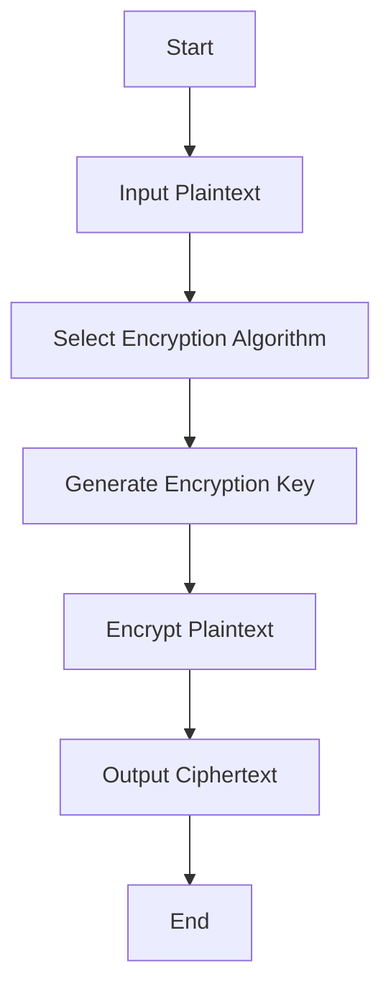

## 15.3 Data Encryption

In today's digital age, data security is paramount. As software engineers and architects, understanding how to encrypt sensitive data is crucial to protecting user information and maintaining trust. In this section, we'll delve into data encryption techniques using Kotlin, focusing on Kotlin Serialization with encryption. We'll explore concepts, provide code examples, and offer best practices for implementing secure data encryption in your Kotlin applications.

### Understanding Data Encryption

Data encryption is the process of converting plaintext into ciphertext, making it unreadable to unauthorized users. This process ensures that even if data is intercepted, it remains secure. Encryption can be applied to data at rest (stored data) and data in transit (data being transmitted over a network).

#### Key Concepts

- **Plaintext**: The original, readable data.
- **Ciphertext**: The encrypted, unreadable data.
- **Encryption Key**: A string of bits used by an encryption algorithm to transform plaintext into ciphertext.
- **Decryption**: The process of converting ciphertext back into plaintext using a decryption key.

### Types of Encryption

There are two primary types of encryption: symmetric and asymmetric.

#### Symmetric Encryption

In symmetric encryption, the same key is used for both encryption and decryption. This method is fast and efficient, making it suitable for encrypting large amounts of data. However, key management can be challenging since the same key must be securely shared between parties.

**Example Algorithms**: AES (Advanced Encryption Standard), DES (Data Encryption Standard).

#### Asymmetric Encryption

Asymmetric encryption uses a pair of keys: a public key for encryption and a private key for decryption. This method is more secure for key distribution but is slower than symmetric encryption.

**Example Algorithms**: RSA (Rivest-Shamir-Adleman), ECC (Elliptic Curve Cryptography).

### Implementing Encryption in Kotlin

Kotlin provides robust support for encryption through its interoperability with Java's security libraries. Let's explore how to implement both symmetric and asymmetric encryption in Kotlin.

#### Symmetric Encryption with AES

AES is a widely used symmetric encryption algorithm. Here's how you can implement AES encryption in Kotlin:

```kotlin
import javax.crypto.Cipher
import javax.crypto.KeyGenerator
import javax.crypto.SecretKey
import javax.crypto.spec.SecretKeySpec
import java.util.Base64

fun generateAESKey(): SecretKey {
    val keyGen = KeyGenerator.getInstance("AES")
    keyGen.init(256) // Key size: 128, 192, or 256 bits
    return keyGen.generateKey()
}

fun encryptAES(plainText: String, secretKey: SecretKey): String {
    val cipher = Cipher.getInstance("AES")
    cipher.init(Cipher.ENCRYPT_MODE, secretKey)
    val encryptedBytes = cipher.doFinal(plainText.toByteArray())
    return Base64.getEncoder().encodeToString(encryptedBytes)
}

fun decryptAES(cipherText: String, secretKey: SecretKey): String {
    val cipher = Cipher.getInstance("AES")
    cipher.init(Cipher.DECRYPT_MODE, secretKey)
    val decryptedBytes = cipher.doFinal(Base64.getDecoder().decode(cipherText))
    return String(decryptedBytes)
}

fun main() {
    val secretKey = generateAESKey()
    val originalText = "Sensitive Data"
    val encryptedText = encryptAES(originalText, secretKey)
    val decryptedText = decryptAES(encryptedText, secretKey)

    println("Original: $originalText")
    println("Encrypted: $encryptedText")
    println("Decrypted: $decryptedText")
}
```

**Key Points**:
- We use `KeyGenerator` to generate a secure AES key.
- The `Cipher` class is used to perform encryption and decryption.
- Base64 encoding is applied to the ciphertext for safe storage and transmission.

#### Asymmetric Encryption with RSA

RSA is a popular asymmetric encryption algorithm. Here's how you can implement RSA encryption in Kotlin:

```kotlin
import java.security.KeyPair
import java.security.KeyPairGenerator
import javax.crypto.Cipher
import java.util.Base64

fun generateRSAKeyPair(): KeyPair {
    val keyGen = KeyPairGenerator.getInstance("RSA")
    keyGen.initialize(2048) // Key size
    return keyGen.generateKeyPair()
}

fun encryptRSA(plainText: String, publicKey: java.security.PublicKey): String {
    val cipher = Cipher.getInstance("RSA")
    cipher.init(Cipher.ENCRYPT_MODE, publicKey)
    val encryptedBytes = cipher.doFinal(plainText.toByteArray())
    return Base64.getEncoder().encodeToString(encryptedBytes)
}

fun decryptRSA(cipherText: String, privateKey: java.security.PrivateKey): String {
    val cipher = Cipher.getInstance("RSA")
    cipher.init(Cipher.DECRYPT_MODE, privateKey)
    val decryptedBytes = cipher.doFinal(Base64.getDecoder().decode(cipherText))
    return String(decryptedBytes)
}

fun main() {
    val keyPair = generateRSAKeyPair()
    val originalText = "Sensitive Data"
    val encryptedText = encryptRSA(originalText, keyPair.public)
    val decryptedText = decryptRSA(encryptedText, keyPair.private)

    println("Original: $originalText")
    println("Encrypted: $encryptedText")
    println("Decrypted: $decryptedText")
}
```

**Key Points**:
- `KeyPairGenerator` is used to generate RSA key pairs.
- RSA keys are typically larger (2048 bits or more) to ensure security.
- The public key encrypts data, while the private key decrypts it.

### Using Kotlin Serialization with Encryption

Kotlin Serialization is a powerful library for converting Kotlin objects to and from various formats like JSON, ProtoBuf, etc. By integrating encryption, we can ensure that serialized data remains secure.

#### Setting Up Kotlin Serialization

First, add the Kotlin Serialization library to your project:

```kotlin
dependencies {
    implementation("org.jetbrains.kotlinx:kotlinx-serialization-json:1.3.0")
}
```

#### Encrypting Serialized Data

Let's encrypt serialized JSON data using AES:

```kotlin
import kotlinx.serialization.*
import kotlinx.serialization.json.Json
import javax.crypto.Cipher
import javax.crypto.KeyGenerator
import javax.crypto.SecretKey
import javax.crypto.spec.SecretKeySpec
import java.util.Base64

@Serializable
data class UserData(val username: String, val password: String)

fun encryptSerializedData(data: UserData, secretKey: SecretKey): String {
    val jsonData = Json.encodeToString(data)
    val cipher = Cipher.getInstance("AES")
    cipher.init(Cipher.ENCRYPT_MODE, secretKey)
    val encryptedBytes = cipher.doFinal(jsonData.toByteArray())
    return Base64.getEncoder().encodeToString(encryptedBytes)
}

fun decryptSerializedData(encryptedData: String, secretKey: SecretKey): UserData {
    val cipher = Cipher.getInstance("AES")
    cipher.init(Cipher.DECRYPT_MODE, secretKey)
    val decryptedBytes = cipher.doFinal(Base64.getDecoder().decode(encryptedData))
    val jsonData = String(decryptedBytes)
    return Json.decodeFromString(jsonData)
}

fun main() {
    val secretKey = generateAESKey()
    val userData = UserData("user123", "securePassword")
    val encryptedData = encryptSerializedData(userData, secretKey)
    val decryptedData = decryptSerializedData(encryptedData, secretKey)

    println("Original: $userData")
    println("Encrypted: $encryptedData")
    println("Decrypted: $decryptedData")
}
```

**Key Points**:
- We serialize the `UserData` object to JSON using Kotlin Serialization.
- The JSON string is then encrypted using AES.
- The encrypted data is Base64 encoded for safe storage or transmission.

### Best Practices for Data Encryption

When implementing data encryption, consider the following best practices:

1. **Use Strong Keys**: Ensure encryption keys are of sufficient length and complexity.
2. **Secure Key Management**: Store keys securely, using hardware security modules (HSMs) or key management services.
3. **Encrypt Sensitive Data Only**: Avoid encrypting non-sensitive data to minimize performance overhead.
4. **Regularly Rotate Keys**: Change encryption keys periodically to enhance security.
5. **Use Established Libraries**: Rely on well-tested libraries and avoid implementing encryption algorithms from scratch.
6. **Consider Performance**: Balance security with performance, especially in resource-constrained environments.

### Visualizing Encryption Process

Let's visualize the encryption process using a flowchart:



**Description**: This flowchart illustrates the basic steps of the encryption process, from inputting plaintext to outputting ciphertext.

### Try It Yourself

Experiment with the provided code examples by:

- Modifying the key size and observing the impact on encryption speed.
- Changing the encryption algorithm from AES to another symmetric algorithm like DES.
- Serializing and encrypting different data structures using Kotlin Serialization.

### Knowledge Check

- What are the differences between symmetric and asymmetric encryption?
- How does Kotlin Serialization enhance data encryption?
- Why is key management critical in encryption?

### Embrace the Journey

Remember, mastering data encryption is an ongoing journey. As you implement these techniques, you'll enhance your applications' security and protect user data. Keep exploring, stay curious, and enjoy the process of building secure software solutions.

## Quiz Time!



### What is the primary difference between symmetric and asymmetric encryption?

- [x] Symmetric encryption uses the same key for both encryption and decryption, while asymmetric encryption uses a pair of keys.
- [ ] Symmetric encryption is slower than asymmetric encryption.
- [ ] Asymmetric encryption uses the same key for both encryption and decryption, while symmetric encryption uses a pair of keys.
- [ ] Asymmetric encryption is less secure than symmetric encryption.

> **Explanation:** Symmetric encryption uses one key for both encryption and decryption, while asymmetric encryption uses a public and private key pair.

### Which Kotlin library is used for serialization?

- [x] kotlinx.serialization
- [ ] kotlin.json
- [ ] kotlinx.json
- [ ] kotlin.serialization

> **Explanation:** The `kotlinx.serialization` library is used for serialization in Kotlin.

### What is the purpose of Base64 encoding in encryption?

- [x] To safely store and transmit binary data as text.
- [ ] To increase the security of the encrypted data.
- [ ] To compress the encrypted data.
- [ ] To convert text data into binary format.

> **Explanation:** Base64 encoding is used to convert binary data into a text format that can be safely stored and transmitted.

### Why is key management important in encryption?

- [x] To ensure that encryption keys are stored securely and rotated regularly.
- [ ] To increase the speed of encryption and decryption.
- [ ] To make encryption algorithms more efficient.
- [ ] To reduce the size of encrypted data.

> **Explanation:** Key management is crucial for storing keys securely and rotating them regularly to maintain security.

### Which algorithm is commonly used for symmetric encryption?

- [x] AES
- [ ] RSA
- [ ] ECC
- [ ] DSA

> **Explanation:** AES (Advanced Encryption Standard) is a widely used symmetric encryption algorithm.

### What is the role of the `Cipher` class in encryption?

- [x] To perform encryption and decryption operations.
- [ ] To generate encryption keys.
- [ ] To encode data in Base64 format.
- [ ] To serialize data into JSON format.

> **Explanation:** The `Cipher` class is used to perform encryption and decryption operations.

### How can Kotlin Serialization be used with encryption?

- [x] By serializing data to JSON and then encrypting the JSON string.
- [ ] By encrypting data directly without serialization.
- [ ] By using a special encryption annotation in Kotlin Serialization.
- [ ] By converting data to Base64 before serialization.

> **Explanation:** Kotlin Serialization can serialize data to JSON, which can then be encrypted for secure storage or transmission.

### What is a common key size for RSA encryption?

- [x] 2048 bits
- [ ] 128 bits
- [ ] 256 bits
- [ ] 512 bits

> **Explanation:** A common key size for RSA encryption is 2048 bits, providing a good balance between security and performance.

### What is the benefit of using Kotlin Serialization with encryption?

- [x] It allows for secure serialization and deserialization of data.
- [ ] It increases the speed of encryption.
- [ ] It reduces the size of encrypted data.
- [ ] It simplifies key management.

> **Explanation:** Kotlin Serialization with encryption allows for secure serialization and deserialization of data, ensuring data integrity and confidentiality.

### True or False: Asymmetric encryption is faster than symmetric encryption.

- [ ] True
- [x] False

> **Explanation:** Asymmetric encryption is generally slower than symmetric encryption due to its complex mathematical operations.


