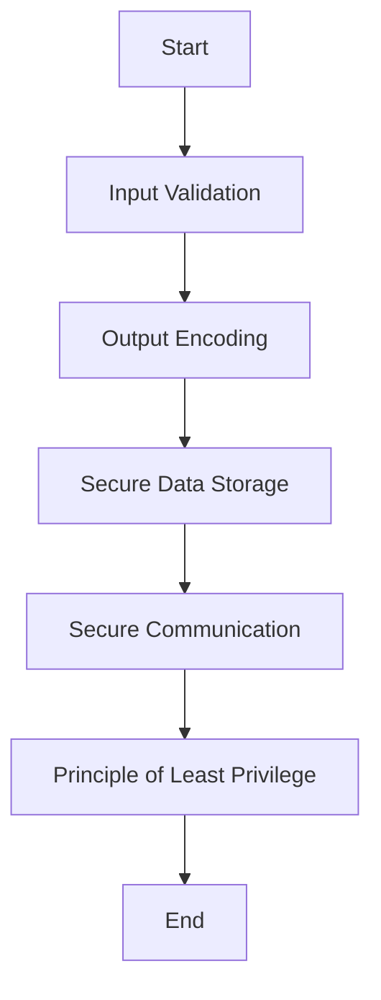

## 15.4 Secure Coding Practices

In today's digital landscape, security is a paramount concern for software engineers and architects. As Kotlin continues to gain popularity for its expressive syntax and seamless interoperability with Java, understanding secure coding practices is crucial for developing robust and resilient applications. This section delves into the core principles of secure coding in Kotlin, focusing on avoiding common vulnerabilities, input validation, and output encoding.

### Introduction to Secure Coding Practices

Secure coding practices are a set of guidelines and techniques aimed at minimizing security risks and vulnerabilities in software applications. These practices help developers write code that is resistant to attacks, ensuring the confidentiality, integrity, and availability of data and services. By adhering to secure coding principles, developers can mitigate the risk of security breaches and protect sensitive information from unauthorized access.

### Understanding Common Vulnerabilities

Before diving into specific secure coding practices, it's essential to understand the common vulnerabilities that can affect Kotlin applications. These vulnerabilities can be broadly categorized into several types:

1. **Injection Attacks**: These occur when untrusted data is sent to an interpreter as part of a command or query. SQL injection is a well-known example.
2. **Cross-Site Scripting (XSS)**: This vulnerability allows attackers to inject malicious scripts into web pages viewed by other users.
3. **Cross-Site Request Forgery (CSRF)**: This attack tricks a user into performing actions they did not intend to perform.
4. **Insecure Deserialization**: This vulnerability arises when untrusted data is used to abuse the logic of an application.
5. **Security Misconfiguration**: This occurs when security settings are not defined, implemented, or maintained properly.

### Input Validation: The First Line of Defense

Input validation is a critical aspect of secure coding. It involves verifying that the data received by an application is both expected and safe to process. Proper input validation can prevent many types of attacks, including injection attacks and buffer overflows.

#### Principles of Input Validation

1. **Whitelisting vs. Blacklisting**: Prefer whitelisting (allowing only known good inputs) over blacklisting (blocking known bad inputs). Whitelisting is generally more secure as it defines what is acceptable rather than what is not.
2. **Validate All Inputs**: Ensure that all inputs, including those from users, APIs, and external systems, are validated.
3. **Use Strong Typing**: Leverage Kotlin's strong type system to enforce data types and constraints.
4. **Sanitize Inputs**: Remove or encode any potentially harmful characters from input data.

#### Implementing Input Validation in Kotlin

Let's explore how to implement input validation in Kotlin with a practical example:

```kotlin
fun validateEmail(email: String): Boolean {
    // Define a regex pattern for a valid email address
    val emailRegex = "^[A-Za-z0-9+_.-]+@[A-Za-z0-9.-]+$".toRegex()
    // Check if the email matches the pattern
    return email.matches(emailRegex)
}

fun main() {
    val email = "example@example.com"
    if (validateEmail(email)) {
        println("Valid email address")
    } else {
        println("Invalid email address")
    }
}
```

In this example, we define a regular expression to validate email addresses. The `validateEmail` function checks if the input email matches the pattern, ensuring only valid email formats are accepted.

### Output Encoding: Protecting Against Injection Attacks

Output encoding is the process of converting data into a safe format before displaying it to users. This practice helps prevent injection attacks, such as XSS, by ensuring that any potentially harmful characters are rendered harmless.

#### Key Concepts of Output Encoding

1. **Contextual Encoding**: Encode data based on the context in which it will be used (e.g., HTML, JavaScript, URL).
2. **Use Built-in Libraries**: Utilize existing libraries and frameworks that provide encoding functions.
3. **Encode All User-Generated Content**: Ensure that any content generated by users is encoded before being displayed.

#### Implementing Output Encoding in Kotlin

Here's an example of how to implement output encoding in Kotlin:

```kotlin
fun encodeForHtml(input: String): String {
    // Replace special characters with HTML entities
    return input.replace("&", "&amp;")
                .replace("<", "&lt;")
                .replace(">", "&gt;")
                .replace("\"", "&quot;")
                .replace("'", "&#x27;")
}

fun main() {
    val userInput = "<script>alert('XSS');</script>"
    val safeOutput = encodeForHtml(userInput)
    println("Encoded output: $safeOutput")
}
```

In this example, the `encodeForHtml` function replaces special characters with their corresponding HTML entities, ensuring that any potentially harmful scripts are not executed when displayed in a web page.

### Secure Coding Practices in Kotlin

Now that we've covered input validation and output encoding, let's explore additional secure coding practices that can enhance the security of Kotlin applications.

#### Principle of Least Privilege

The principle of least privilege involves granting only the minimum permissions necessary for a user or process to perform its tasks. This practice reduces the risk of unauthorized access and limits the potential impact of a security breach.

```kotlin
class User(val name: String, private val role: String) {
    fun performAction(action: String) {
        if (role == "admin" || (role == "user" && action == "read")) {
            println("$name is performing $action")
        } else {
            println("Insufficient permissions for $name to perform $action")
        }
    }
}

fun main() {
    val admin = User("Alice", "admin")
    val user = User("Bob", "user")
    
    admin.performAction("write")
    user.performAction("write")
}
```

In this example, the `User` class restricts actions based on the user's role, ensuring that only users with the appropriate permissions can perform certain actions.

#### Secure Data Storage

Secure data storage involves protecting sensitive information, such as passwords and personal data, from unauthorized access. This can be achieved through encryption and secure storage mechanisms.

```kotlin
import java.security.MessageDigest

fun hashPassword(password: String): String {
    val digest = MessageDigest.getInstance("SHA-256")
    val hashBytes = digest.digest(password.toByteArray())
    return hashBytes.joinToString("") { "%02x".format(it) }
}

fun main() {
    val password = "securePassword123"
    val hashedPassword = hashPassword(password)
    println("Hashed password: $hashedPassword")
}
```

In this example, we use the SHA-256 hashing algorithm to securely hash a password before storing it. This ensures that even if the storage is compromised, the original password remains protected.

#### Secure Communication

Secure communication involves encrypting data transmitted between clients and servers to prevent eavesdropping and tampering. This can be achieved using protocols such as HTTPS and TLS.

```kotlin
import okhttp3.OkHttpClient
import okhttp3.Request

fun makeSecureRequest(url: String) {
    val client = OkHttpClient.Builder()
        .build()

    val request = Request.Builder()
        .url(url)
        .build()

    client.newCall(request).execute().use { response ->
        if (!response.isSuccessful) throw IOException("Unexpected code $response")
        println(response.body?.string())
    }
}

fun main() {
    val secureUrl = "https://example.com"
    makeSecureRequest(secureUrl)
}
```

In this example, we use the OkHttp library to make a secure HTTPS request, ensuring that data transmitted between the client and server is encrypted.

### Visualizing Secure Coding Practices

To better understand the flow of secure coding practices, let's visualize the process using a flowchart.



**Figure 1: Secure Coding Practices Flowchart**

This flowchart illustrates the sequence of secure coding practices, starting from input validation and ending with the principle of least privilege. Each step builds upon the previous one, creating a comprehensive security strategy.

### Knowledge Check

Let's test your understanding of secure coding practices with a few questions:

1. What is the primary goal of input validation?
2. How does output encoding help prevent injection attacks?
3. Why is the principle of least privilege important in secure coding?
4. What is the purpose of secure data storage?
5. How can secure communication be achieved in Kotlin applications?

### Try It Yourself

To reinforce your understanding of secure coding practices, try modifying the code examples provided in this section. Experiment with different input validation patterns, encoding techniques, and security mechanisms. Consider the following challenges:

- Implement input validation for a phone number using a regular expression.
- Create a function to encode data for a URL context.
- Enhance the secure communication example to handle different HTTP methods.

### Conclusion

Secure coding practices are essential for developing robust and resilient Kotlin applications. By understanding common vulnerabilities and implementing techniques such as input validation, output encoding, and secure data storage, developers can protect their applications from security threats. Remember, security is an ongoing process, and staying informed about the latest threats and best practices is crucial for maintaining a secure codebase.

## Quiz Time!



### What is the primary goal of input validation?

- [x] To ensure that the data received by an application is both expected and safe to process.
- [ ] To encode data before displaying it to users.
- [ ] To encrypt data transmitted between clients and servers.
- [ ] To grant only the minimum permissions necessary for a user or process.

> **Explanation:** Input validation ensures that the data received by an application is both expected and safe to process, preventing many types of attacks.

### How does output encoding help prevent injection attacks?

- [x] By converting data into a safe format before displaying it to users.
- [ ] By validating all inputs, including those from users, APIs, and external systems.
- [ ] By using strong typing to enforce data types and constraints.
- [ ] By hashing passwords before storing them.

> **Explanation:** Output encoding converts data into a safe format before displaying it to users, preventing injection attacks such as XSS.

### Why is the principle of least privilege important in secure coding?

- [x] It reduces the risk of unauthorized access and limits the potential impact of a security breach.
- [ ] It ensures that all inputs are validated.
- [ ] It encodes data based on the context in which it will be used.
- [ ] It uses existing libraries and frameworks that provide encoding functions.

> **Explanation:** The principle of least privilege reduces the risk of unauthorized access and limits the potential impact of a security breach by granting only the minimum permissions necessary.

### What is the purpose of secure data storage?

- [x] To protect sensitive information, such as passwords and personal data, from unauthorized access.
- [ ] To encrypt data transmitted between clients and servers.
- [ ] To replace special characters with HTML entities.
- [ ] To ensure that any content generated by users is encoded before being displayed.

> **Explanation:** Secure data storage protects sensitive information, such as passwords and personal data, from unauthorized access.

### How can secure communication be achieved in Kotlin applications?

- [x] By encrypting data transmitted between clients and servers using protocols such as HTTPS and TLS.
- [ ] By using the SHA-256 hashing algorithm to securely hash a password.
- [ ] By using the OkHttp library to make a secure HTTPS request.
- [ ] By replacing special characters with their corresponding HTML entities.

> **Explanation:** Secure communication is achieved by encrypting data transmitted between clients and servers using protocols such as HTTPS and TLS.

### What is a common vulnerability that input validation can prevent?

- [x] Injection attacks
- [ ] Cross-Site Scripting (XSS)
- [ ] Cross-Site Request Forgery (CSRF)
- [ ] Insecure Deserialization

> **Explanation:** Input validation can prevent injection attacks by ensuring that only valid and expected data is processed.

### What is the difference between whitelisting and blacklisting in input validation?

- [x] Whitelisting allows only known good inputs, while blacklisting blocks known bad inputs.
- [ ] Whitelisting blocks known bad inputs, while blacklisting allows only known good inputs.
- [ ] Whitelisting is generally less secure than blacklisting.
- [ ] Whitelisting is used for output encoding, while blacklisting is used for input validation.

> **Explanation:** Whitelisting allows only known good inputs, making it generally more secure than blacklisting, which blocks known bad inputs.

### What is the benefit of using Kotlin's strong type system in secure coding?

- [x] It enforces data types and constraints, reducing the risk of processing invalid data.
- [ ] It replaces special characters with HTML entities.
- [ ] It encrypts data transmitted between clients and servers.
- [ ] It grants only the minimum permissions necessary for a user or process.

> **Explanation:** Kotlin's strong type system enforces data types and constraints, reducing the risk of processing invalid data.

### How does the `encodeForHtml` function prevent XSS attacks?

- [x] By replacing special characters with their corresponding HTML entities.
- [ ] By validating email addresses using a regular expression.
- [ ] By hashing passwords before storing them.
- [ ] By making secure HTTPS requests using the OkHttp library.

> **Explanation:** The `encodeForHtml` function prevents XSS attacks by replacing special characters with their corresponding HTML entities, ensuring that any potentially harmful scripts are not executed.

### True or False: Secure coding practices are only necessary for web applications.

- [ ] True
- [x] False

> **Explanation:** Secure coding practices are necessary for all types of applications, not just web applications, to ensure the confidentiality, integrity, and availability of data and services.


