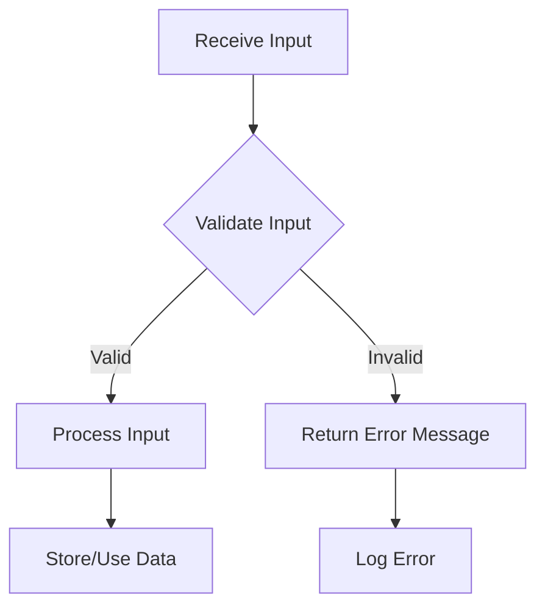

## 15.5 Input Validation in Kotlin

In the realm of software development, input validation is a critical component that ensures the security, reliability, and integrity of applications. In this section, we will delve into the intricacies of input validation in Kotlin, focusing on preventing injection attacks and utilizing validation frameworks effectively. We'll explore best practices, provide code examples, and encourage experimentation to solidify your understanding.

### Introduction to Input Validation

Input validation is the process of verifying that the data provided by users or external systems meets the expected format, type, and constraints before it is processed by the application. Proper input validation helps prevent a wide array of security vulnerabilities, including injection attacks, buffer overflows, and data corruption.

#### Why Input Validation Matters

- **Security**: Prevents malicious data from compromising the application.
- **Data Integrity**: Ensures that only valid data is processed, maintaining the application's integrity.
- **User Experience**: Provides immediate feedback to users, improving the overall experience.
- **Compliance**: Meets regulatory requirements for data handling and security.

### Common Injection Attacks

Injection attacks occur when untrusted data is sent to an interpreter as part of a command or query. The attacker's hostile data can trick the interpreter into executing unintended commands or accessing unauthorized data.

#### Types of Injection Attacks

1. **SQL Injection**: Manipulating SQL queries to execute arbitrary commands.
2. **Command Injection**: Executing arbitrary commands on the host operating system.
3. **Cross-Site Scripting (XSS)**: Injecting malicious scripts into web pages viewed by other users.
4. **LDAP Injection**: Manipulating LDAP queries to access unauthorized data.

### Preventing Injection Attacks in Kotlin

To prevent injection attacks, it is crucial to validate and sanitize all input data. Here are some strategies to mitigate these risks:

#### 1. Use Parameterized Queries

For SQL databases, always use parameterized queries or prepared statements to separate SQL logic from data.

```kotlin
val query = "SELECT * FROM users WHERE username = ?"
val preparedStatement = connection.prepareStatement(query)
preparedStatement.setString(1, userInput)
val resultSet = preparedStatement.executeQuery()
```

#### 2. Validate Input Length and Format

Ensure that input data conforms to expected length and format constraints.

```kotlin
fun validateUsername(username: String): Boolean {
    return username.matches(Regex("^[a-zA-Z0-9_]{3,15}$"))
}
```

#### 3. Escape Special Characters

For contexts where parameterized queries are not applicable, ensure that special characters are properly escaped.

```kotlin
fun escapeHtml(input: String): String {
    return input.replace("&", "&amp;")
                .replace("<", "&lt;")
                .replace(">", "&gt;")
                .replace("\"", "&quot;")
                .replace("'", "&#x27;")
}
```

### Using Validation Frameworks in Kotlin

Kotlin offers several libraries and frameworks to streamline the input validation process. These tools provide robust mechanisms to define and enforce validation rules.

#### 1. Kotlin Validation Library

The Kotlin Validation Library is a lightweight library that provides a fluent API for defining validation rules.

```kotlin
import com.willowtreeapps.kotlintest.KotlinValidation

fun validateUserInput(input: String): Boolean {
    return KotlinValidation {
        input {
            length(5..20)
            pattern("^[a-zA-Z0-9_]+$")
        }
    }.validate(input).isValid
}
```

#### 2. Hibernate Validator

Hibernate Validator is a popular choice for Java and Kotlin applications, leveraging JSR 380 (Bean Validation 2.0).

```kotlin
import javax.validation.constraints.NotNull
import javax.validation.constraints.Size

data class User(
    @field:NotNull
    @field:Size(min = 3, max = 15)
    val username: String
)
```

#### 3. Spring Boot Validation

Spring Boot provides built-in support for validation using annotations and the `@Valid` annotation.

```kotlin
import org.springframework.validation.annotation.Validated
import javax.validation.Valid

@Validated
fun createUser(@Valid user: User) {
    // Business logic
}
```

### Best Practices for Input Validation

To ensure robust input validation, adhere to the following best practices:

1. **Validate All Inputs**: Treat all input as untrusted, regardless of the source.
2. **Whitelist Validation**: Prefer whitelisting valid input patterns over blacklisting known bad patterns.
3. **Centralize Validation Logic**: Consolidate validation logic to reduce redundancy and improve maintainability.
4. **Provide Clear Error Messages**: Offer users clear and actionable feedback when validation fails.
5. **Use Built-in Libraries**: Leverage existing libraries and frameworks to avoid reinventing the wheel.

### Visualizing Input Validation Workflow

Let's visualize the input validation workflow using a flowchart to better understand the process.



**Figure 1**: Input Validation Workflow

### Try It Yourself

Experiment with the provided code examples by modifying the validation rules or input data. Consider the following exercises:

- Modify the regex pattern in the `validateUsername` function to allow special characters.
- Implement a custom validation rule using the Kotlin Validation Library.
- Create a simple Spring Boot application that validates user input using Hibernate Validator.

### Knowledge Check

Before we conclude, let's reinforce our understanding with a few questions:

- What are the key differences between whitelisting and blacklisting input validation?
- How does parameterized querying help prevent SQL injection attacks?
- Why is it important to centralize validation logic in an application?

### Conclusion

Input validation is a cornerstone of application security and data integrity. By understanding the risks associated with unvalidated input and employing robust validation techniques, we can build secure and reliable applications. Remember, this is just the beginning. As you progress, continue to explore and refine your validation strategies to meet the evolving needs of your applications.

## Quiz Time!



### What is the primary goal of input validation?

- [x] To ensure that input data meets expected format and constraints
- [ ] To enhance the application's user interface
- [ ] To improve application performance
- [ ] To increase the application's feature set

> **Explanation:** Input validation ensures that data conforms to expected formats and constraints, preventing security vulnerabilities and data corruption.

### Which of the following is a common injection attack?

- [x] SQL Injection
- [ ] Buffer Overflow
- [ ] Man-in-the-Middle
- [ ] Denial of Service

> **Explanation:** SQL Injection is a common type of injection attack where malicious SQL code is inserted into queries.

### What is the advantage of using parameterized queries?

- [x] They separate SQL logic from data, preventing SQL injection
- [ ] They improve application performance
- [ ] They simplify database schema design
- [ ] They enhance user interface design

> **Explanation:** Parameterized queries separate SQL logic from data, preventing SQL injection by treating input as data rather than executable code.

### Which Kotlin library provides a fluent API for defining validation rules?

- [x] Kotlin Validation Library
- [ ] Hibernate Validator
- [ ] Spring Boot
- [ ] Apache Commons Validator

> **Explanation:** The Kotlin Validation Library provides a fluent API for defining and enforcing validation rules in Kotlin applications.

### What is the purpose of the `@Valid` annotation in Spring Boot?

- [x] To trigger validation of method parameters or fields
- [ ] To enhance application performance
- [ ] To improve user interface design
- [ ] To manage application configurations

> **Explanation:** The `@Valid` annotation in Spring Boot triggers validation of method parameters or fields, ensuring they meet defined constraints.

### Why is whitelisting preferred over blacklisting in input validation?

- [x] It defines what is allowed, reducing the risk of missing malicious patterns
- [ ] It is easier to implement
- [ ] It improves application performance
- [ ] It enhances user interface design

> **Explanation:** Whitelisting defines allowed patterns, reducing the risk of missing malicious patterns that could bypass blacklists.

### Which of the following is a best practice for input validation?

- [x] Centralize validation logic
- [ ] Validate inputs only from external sources
- [ ] Use blacklisting for known bad patterns
- [ ] Provide vague error messages

> **Explanation:** Centralizing validation logic reduces redundancy and improves maintainability, ensuring consistent validation across the application.

### What is the role of the `@field:Size` annotation in Kotlin?

- [x] To enforce size constraints on a field
- [ ] To improve application performance
- [ ] To enhance user interface design
- [ ] To manage application configurations

> **Explanation:** The `@field:Size` annotation enforces size constraints on a field, ensuring it meets specified minimum and maximum lengths.

### How can you prevent command injection attacks?

- [x] By validating and sanitizing all input data
- [ ] By improving application performance
- [ ] By enhancing user interface design
- [ ] By managing application configurations

> **Explanation:** Validating and sanitizing all input data prevents command injection attacks by ensuring only safe data is processed.

### True or False: Input validation is only necessary for user-provided data.

- [ ] True
- [x] False

> **Explanation:** Input validation is necessary for all input, regardless of the source, as all input should be treated as untrusted.


