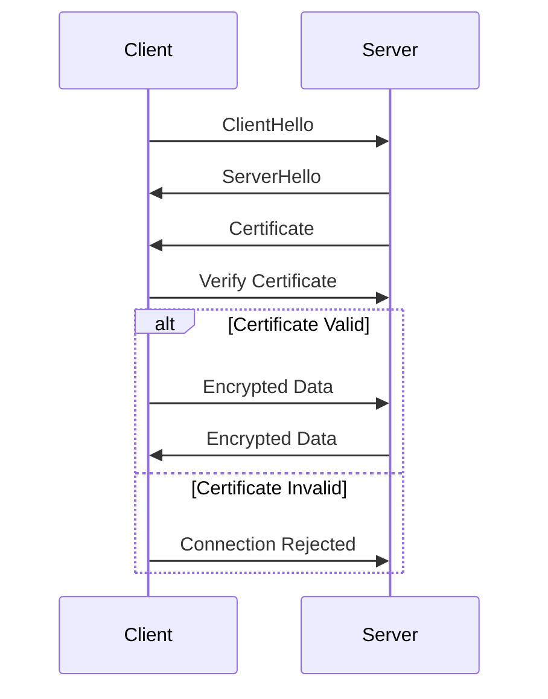

## 15.6 Network Security

In today's interconnected world, securing network communication is paramount for protecting sensitive data and maintaining user trust. This section delves into the intricacies of network security, focusing on securing API communication using SSL/TLS protocols and certificate pinning. We'll explore how these techniques can be effectively implemented in Kotlin applications, providing a robust defense against potential threats.

### Understanding Network Security

Network security involves a set of practices and technologies designed to protect data during transmission across networks. It ensures confidentiality, integrity, and availability of data, preventing unauthorized access and data breaches. In the context of API communication, network security is crucial for safeguarding sensitive information exchanged between clients and servers.

#### Key Concepts in Network Security

- **Confidentiality**: Ensures that data is accessible only to authorized users.
- **Integrity**: Guarantees that data is not altered during transmission.
- **Availability**: Ensures that data and services are available to authorized users when needed.
- **Authentication**: Verifies the identity of users and systems.
- **Authorization**: Determines user permissions and access levels.

### Securing API Communication

APIs are the backbone of modern applications, enabling communication between different software components. Securing API communication is essential to protect data from interception and unauthorized access. Two fundamental techniques for securing API communication are SSL/TLS and certificate pinning.

#### SSL/TLS Protocols

Secure Sockets Layer (SSL) and Transport Layer Security (TLS) are cryptographic protocols designed to secure data transmission over networks. They provide encryption, authentication, and integrity, ensuring that data remains confidential and unaltered during transmission.

##### How SSL/TLS Works

1. **Handshake Process**: Establishes a secure connection between the client and server.
2. **Encryption**: Encrypts data using symmetric encryption algorithms.
3. **Authentication**: Verifies the server's identity using digital certificates.
4. **Integrity**: Ensures data integrity using message authentication codes (MACs).

##### Implementing SSL/TLS in Kotlin

To implement SSL/TLS in Kotlin, you can use libraries like OkHttp or Retrofit, which provide built-in support for secure communication.

```kotlin
import okhttp3.OkHttpClient
import okhttp3.Request

fun createSecureClient(): OkHttpClient {
    return OkHttpClient.Builder()
        .sslSocketFactory(SSLSocketFactory.getDefault() as SSLSocketFactory)
        .hostnameVerifier { hostname, session -> true }
        .build()
}

fun main() {
    val client = createSecureClient()
    val request = Request.Builder()
        .url("https://secureapi.example.com/data")
        .build()

    client.newCall(request).execute().use { response ->
        if (!response.isSuccessful) throw IOException("Unexpected code $response")
        println(response.body?.string())
    }
}
```

In this example, we create an `OkHttpClient` with SSL/TLS support, allowing secure communication with the specified API.

#### Certificate Pinning

Certificate pinning is a technique used to enhance security by associating a specific server certificate with an application. It prevents man-in-the-middle attacks by ensuring that the application only accepts certificates from trusted sources.

##### How Certificate Pinning Works

1. **Pinning**: The application is configured to accept only specific certificates or public keys.
2. **Verification**: During the SSL/TLS handshake, the application verifies the server's certificate against the pinned certificate.
3. **Rejection**: If the server's certificate does not match the pinned certificate, the connection is rejected.

##### Implementing Certificate Pinning in Kotlin

To implement certificate pinning in Kotlin, you can use OkHttp, which provides support for certificate pinning.

```kotlin
import okhttp3.CertificatePinner
import okhttp3.OkHttpClient
import okhttp3.Request

fun createPinnedClient(): OkHttpClient {
    val certificatePinner = CertificatePinner.Builder()
        .add("secureapi.example.com", "sha256/AAAAAAAAAAAAAAAAAAAAAAAAAAAAAAAAAAAAAAAAAAA=")
        .build()

    return OkHttpClient.Builder()
        .certificatePinner(certificatePinner)
        .build()
}

fun main() {
    val client = createPinnedClient()
    val request = Request.Builder()
        .url("https://secureapi.example.com/data")
        .build()

    client.newCall(request).execute().use { response ->
        if (!response.isSuccessful) throw IOException("Unexpected code $response")
        println(response.body?.string())
    }
}
```

In this example, we configure an `OkHttpClient` with certificate pinning, ensuring that only the specified certificate is accepted during communication.

### Visualizing SSL/TLS and Certificate Pinning

To better understand the process of SSL/TLS and certificate pinning, let's visualize the workflow using a sequence diagram.



**Diagram Description**: This sequence diagram illustrates the SSL/TLS handshake process, including certificate verification and data encryption. If the certificate is valid, encrypted data is exchanged; otherwise, the connection is rejected.

### Best Practices for Network Security

Implementing SSL/TLS and certificate pinning is just the beginning. To ensure comprehensive network security, consider the following best practices:

1. **Regularly Update Certificates**: Ensure that certificates are up-to-date and renew them before expiration.
2. **Use Strong Encryption Algorithms**: Opt for strong encryption algorithms to protect data.
3. **Implement Rate Limiting**: Prevent abuse by limiting the number of requests from a single source.
4. **Monitor Network Traffic**: Use tools to monitor network traffic and detect anomalies.
5. **Educate Users**: Raise awareness about security practices and encourage users to report suspicious activities.

### Challenges and Considerations

While SSL/TLS and certificate pinning provide robust security, they come with challenges and considerations:

- **Performance Overhead**: Encryption and decryption can introduce latency. Optimize performance by using efficient algorithms and minimizing unnecessary data transmission.
- **Certificate Management**: Managing certificates, especially in large-scale applications, can be complex. Automate certificate management using tools like Let's Encrypt.
- **Backward Compatibility**: Ensure that your application supports older devices and browsers that may not support the latest security protocols.

### Try It Yourself

To deepen your understanding of network security, try modifying the code examples provided. Experiment with different encryption algorithms, certificate pinning configurations, and network monitoring tools. Observe how these changes impact the security and performance of your application.

### References and Further Reading

- [OkHttp Documentation](https://square.github.io/okhttp/)
- [SSL/TLS on MDN Web Docs](https://developer.mozilla.org/en-US/docs/Web/Security/Transport_Layer_Security)
- [Certificate Pinning on OWASP](https://owasp.org/www-community/controls/Certificate_and_Public_Key_Pinning)

### Knowledge Check

- What is the primary purpose of SSL/TLS protocols?
- How does certificate pinning enhance security?
- What are some challenges associated with implementing SSL/TLS?

### Embrace the Journey

Securing network communication is a critical aspect of modern software development. As you continue your journey, remember that security is an ongoing process. Stay informed about the latest security trends, regularly update your security practices, and never hesitate to seek help from the community. Keep experimenting, stay curious, and enjoy the journey!

## Quiz Time!



### What is the primary purpose of SSL/TLS protocols?

- [x] To secure data transmission over networks
- [ ] To compress data for faster transmission
- [ ] To authenticate users
- [ ] To manage network traffic

> **Explanation:** SSL/TLS protocols are designed to secure data transmission over networks by providing encryption, authentication, and integrity.

### How does certificate pinning enhance security?

- [x] By associating a specific server certificate with an application
- [ ] By compressing data for faster transmission
- [ ] By encrypting data using symmetric encryption
- [ ] By authenticating users

> **Explanation:** Certificate pinning enhances security by ensuring that the application only accepts certificates from trusted sources, preventing man-in-the-middle attacks.

### What is a potential challenge of implementing SSL/TLS?

- [x] Performance overhead
- [ ] Lack of encryption
- [ ] Inability to authenticate users
- [ ] Data compression issues

> **Explanation:** Implementing SSL/TLS can introduce performance overhead due to the encryption and decryption processes.

### Which library can be used in Kotlin to implement SSL/TLS?

- [x] OkHttp
- [ ] Retrofit
- [ ] Gson
- [ ] Dagger

> **Explanation:** OkHttp is a library that provides built-in support for implementing SSL/TLS in Kotlin applications.

### What is the role of the handshake process in SSL/TLS?

- [x] To establish a secure connection between the client and server
- [ ] To compress data for faster transmission
- [ ] To authenticate users
- [ ] To manage network traffic

> **Explanation:** The handshake process in SSL/TLS establishes a secure connection between the client and server by negotiating encryption algorithms and exchanging certificates.

### What is a common tool for automating certificate management?

- [x] Let's Encrypt
- [ ] Retrofit
- [ ] Gson
- [ ] Dagger

> **Explanation:** Let's Encrypt is a tool that automates certificate management, making it easier to renew and update certificates.

### What is a potential drawback of certificate pinning?

- [x] Complexity in managing certificates
- [ ] Lack of encryption
- [ ] Inability to authenticate users
- [ ] Data compression issues

> **Explanation:** Certificate pinning can introduce complexity in managing certificates, especially in large-scale applications.

### What is a best practice for ensuring comprehensive network security?

- [x] Regularly update certificates
- [ ] Use weak encryption algorithms
- [ ] Ignore network traffic monitoring
- [ ] Avoid educating users

> **Explanation:** Regularly updating certificates is a best practice for ensuring comprehensive network security, as it helps prevent unauthorized access.

### What is the role of encryption in SSL/TLS?

- [x] To protect data by making it unreadable to unauthorized users
- [ ] To compress data for faster transmission
- [ ] To authenticate users
- [ ] To manage network traffic

> **Explanation:** Encryption in SSL/TLS protects data by making it unreadable to unauthorized users, ensuring confidentiality.

### True or False: Certificate pinning can prevent man-in-the-middle attacks.

- [x] True
- [ ] False

> **Explanation:** True. Certificate pinning can prevent man-in-the-middle attacks by ensuring that the application only accepts certificates from trusted sources.


