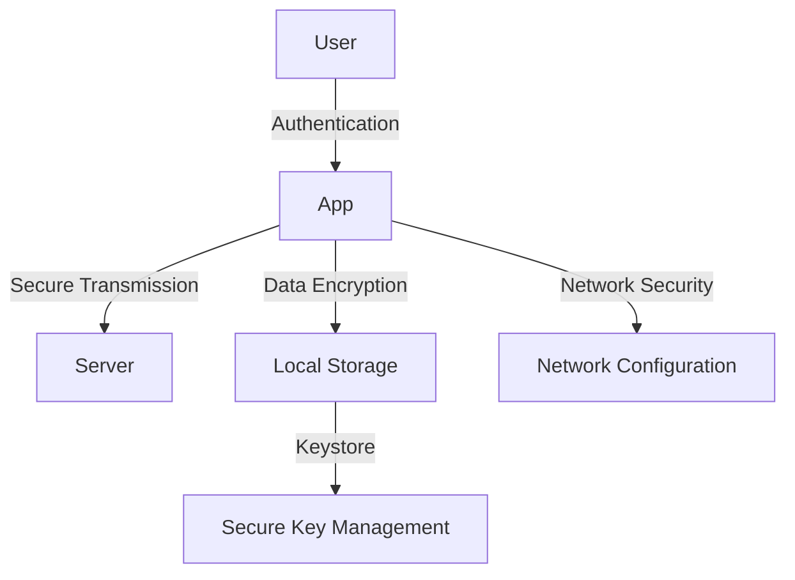

## 15.7 Android Security

In the rapidly evolving landscape of mobile applications, ensuring the security of Android apps is paramount. As developers and architects, we must be vigilant in protecting user data, maintaining privacy, and securing our applications against potential threats. This section delves into best practices for Android app security, with a particular focus on securely storing secrets using Kotlin.

### Introduction to Android Security

Android security encompasses a wide range of practices and technologies designed to protect applications from unauthorized access, data breaches, and other security threats. As Kotlin becomes a popular choice for Android development, understanding how to leverage its features for security purposes is crucial.

#### Key Concepts in Android Security

1. **Authentication and Authorization**: Ensuring that users are who they claim to be and have permission to access specific resources.
2. **Data Encryption**: Protecting data both at rest and in transit to prevent unauthorized access.
3. **Secure Storage**: Safeguarding sensitive information such as API keys, tokens, and passwords.
4. **Network Security**: Implementing secure communication protocols to protect data exchanged over networks.
5. **Code Obfuscation**: Making the application code difficult to reverse-engineer.

### Best Practices for Android App Security

Implementing robust security measures in Android apps involves a combination of strategies and technologies. Below are some best practices to consider:

#### 1. Use Strong Authentication

- **Implement Multi-Factor Authentication (MFA)**: Enhance security by requiring multiple forms of verification.
- **Leverage Biometrics**: Use fingerprint or facial recognition for secure and convenient authentication.

#### 2. Secure Data Transmission

- **Use HTTPS**: Ensure all data transmitted over the network is encrypted using HTTPS.
- **Certificate Pinning**: Protect against man-in-the-middle attacks by pinning trusted certificates.

#### 3. Protect Sensitive Data

- **Encrypt Data at Rest**: Use encryption libraries to protect sensitive data stored on the device.
- **Use Android Keystore**: Store cryptographic keys securely using the Android Keystore system.

#### 4. Implement Secure Coding Practices

- **Validate Input**: Prevent injection attacks by validating and sanitizing user input.
- **Avoid Hardcoding Secrets**: Never store sensitive information like API keys in the source code.

#### 5. Regularly Update and Patch

- **Keep Dependencies Updated**: Regularly update libraries and frameworks to patch known vulnerabilities.
- **Monitor Security Bulletins**: Stay informed about security updates and patches from Android and third-party vendors.

### Storing Secrets Securely

One of the most critical aspects of Android security is the secure storage of secrets such as API keys, tokens, and passwords. Improper handling of secrets can lead to unauthorized access and data breaches.

#### Using Android Keystore

The Android Keystore system provides a secure mechanism for storing cryptographic keys. It ensures that keys are stored in a hardware-backed keystore, making them inaccessible to unauthorized applications.

```kotlin
// Example of generating and storing a key in Android Keystore
val keyGenerator = KeyGenerator.getInstance(
    KeyProperties.KEY_ALGORITHM_AES, "AndroidKeyStore"
)
val keyGenParameterSpec = KeyGenParameterSpec.Builder(
    "MyKeyAlias",
    KeyProperties.PURPOSE_ENCRYPT or KeyProperties.PURPOSE_DECRYPT
)
    .setBlockModes(KeyProperties.BLOCK_MODE_GCM)
    .setEncryptionPaddings(KeyProperties.ENCRYPTION_PADDING_NONE)
    .build()
keyGenerator.init(keyGenParameterSpec)
val secretKey = keyGenerator.generateKey()
```

#### Encrypting Data with Keystore

Once a key is stored in the Keystore, it can be used to encrypt and decrypt sensitive data.

```kotlin
// Encrypting data using the key from Keystore
fun encryptData(data: ByteArray, keyAlias: String): ByteArray {
    val keyStore = KeyStore.getInstance("AndroidKeyStore")
    keyStore.load(null)
    val secretKey = keyStore.getKey(keyAlias, null) as SecretKey
    val cipher = Cipher.getInstance("AES/GCM/NoPadding")
    cipher.init(Cipher.ENCRYPT_MODE, secretKey)
    return cipher.doFinal(data)
}
```

#### Using EncryptedSharedPreferences

For storing small amounts of sensitive data, `EncryptedSharedPreferences` provides a convenient and secure option.

```kotlin
// Using EncryptedSharedPreferences to store sensitive data
val masterKey = MasterKey.Builder(context)
    .setKeyScheme(MasterKey.KeyScheme.AES256_GCM)
    .build()

val sharedPreferences = EncryptedSharedPreferences.create(
    context,
    "secure_prefs",
    masterKey,
    EncryptedSharedPreferences.PrefKeyEncryptionScheme.AES256_SIV,
    EncryptedSharedPreferences.PrefValueEncryptionScheme.AES256_GCM
)

val editor = sharedPreferences.edit()
editor.putString("api_key", "your_api_key_here")
editor.apply()
```

### Code Obfuscation

Code obfuscation is a technique used to make the source code difficult to understand and reverse-engineer. Tools like ProGuard and R8 can be used to obfuscate Android applications.

#### Configuring ProGuard

ProGuard is a tool that shrinks, optimizes, and obfuscates your code by removing unused code and renaming classes, fields, and methods with obscure names.

```plaintext
-keep class com.example.myapp.** { *; }
-dontwarn com.example.myapp.**
```

### Network Security Configuration

Android provides a Network Security Configuration feature that allows you to customize network security settings for your app.

```xml
<!-- Example Network Security Configuration -->
<network-security-config>
    <domain-config cleartextTrafficPermitted="false">
        <domain includeSubdomains="true">example.com</domain>
        <pin-set expiration="2024-01-01">
            <pin digest="SHA-256">base64==</pin>
        </pin-set>
    </domain-config>
</network-security-config>
```

### Visualizing Android Security Architecture

To better understand the security architecture of an Android application, let's visualize the flow of data and security mechanisms using a diagram.



### Knowledge Check

- **What is the purpose of the Android Keystore?**
- **How does EncryptedSharedPreferences enhance security?**
- **Why is code obfuscation important in Android development?**

### Try It Yourself

Experiment with the code examples provided. Try modifying the key alias in the Keystore example or change the encryption scheme in the `EncryptedSharedPreferences` example to see how it affects the security of your application.

### Conclusion

Securing Android applications is a multifaceted challenge that requires a comprehensive approach. By implementing the best practices outlined in this guide, you can significantly enhance the security of your applications and protect sensitive user data. Remember, security is an ongoing process, and staying informed about the latest threats and mitigation strategies is crucial.

## Quiz Time!



### What is the primary purpose of the Android Keystore?

- [x] To securely store cryptographic keys
- [ ] To manage network configurations
- [ ] To encrypt data in transit
- [ ] To obfuscate code

> **Explanation:** The Android Keystore is used to securely store cryptographic keys, ensuring they are protected from unauthorized access.

### Which of the following enhances data security at rest?

- [x] Encrypting data
- [ ] Using plain text storage
- [ ] Disabling encryption
- [ ] Storing data in cache

> **Explanation:** Encrypting data at rest ensures that it is protected from unauthorized access, even if the storage medium is compromised.

### What is the benefit of using EncryptedSharedPreferences?

- [x] It provides a secure way to store sensitive data
- [ ] It increases app performance
- [ ] It simplifies UI development
- [ ] It enhances network speed

> **Explanation:** EncryptedSharedPreferences provides a secure way to store sensitive data by encrypting it before saving it to disk.

### Why is code obfuscation important?

- [x] To make the code difficult to reverse-engineer
- [ ] To improve code readability
- [ ] To enhance user interface design
- [ ] To increase network speed

> **Explanation:** Code obfuscation makes the source code difficult to understand and reverse-engineer, protecting it from unauthorized access.

### What is the purpose of certificate pinning?

- [x] To protect against man-in-the-middle attacks
- [ ] To increase app performance
- [ ] To simplify UI development
- [ ] To enhance network speed

> **Explanation:** Certificate pinning helps protect against man-in-the-middle attacks by ensuring that the app only trusts specific certificates.

### Which tool is used for code obfuscation in Android?

- [x] ProGuard
- [ ] Retrofit
- [ ] Glide
- [ ] Room

> **Explanation:** ProGuard is a tool used for code obfuscation, shrinking, and optimization in Android applications.

### How can you securely store API keys in an Android app?

- [x] Use the Android Keystore
- [ ] Hardcode them in the source code
- [ ] Store them in plain text files
- [ ] Use external storage

> **Explanation:** The Android Keystore provides a secure way to store API keys and other sensitive information.

### What is a common practice to secure data transmission?

- [x] Use HTTPS
- [ ] Use HTTP
- [ ] Use FTP
- [ ] Use Telnet

> **Explanation:** Using HTTPS ensures that data transmitted over the network is encrypted and secure.

### Which of the following is a secure coding practice?

- [x] Validate and sanitize user input
- [ ] Hardcode sensitive information
- [ ] Use weak passwords
- [ ] Ignore security updates

> **Explanation:** Validating and sanitizing user input helps prevent injection attacks and ensures secure coding practices.

### True or False: Regularly updating dependencies is a part of maintaining app security.

- [x] True
- [ ] False

> **Explanation:** Regularly updating dependencies helps patch known vulnerabilities and maintain app security.



Remember, this is just the beginning. As you progress, you'll build more secure and resilient Android applications. Keep experimenting, stay curious, and enjoy the journey!
