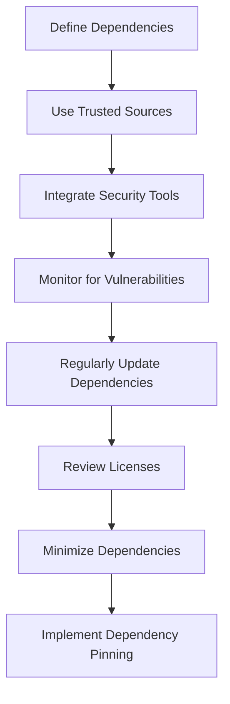

## 15.8 Dependency Security

In the modern software development landscape, leveraging third-party libraries is a common practice that accelerates development and adds robust functionality to applications. However, this convenience comes with its own set of challenges, particularly in the realm of security. Dependency security involves managing the risks associated with using third-party libraries, ensuring that they do not introduce vulnerabilities into your Kotlin applications. This section will guide you through the best practices, tools, and strategies for managing third-party libraries securely.

### Understanding Dependency Security

Dependency security refers to the practice of managing and securing third-party libraries that are integrated into your application. These libraries can be a source of vulnerabilities if not properly managed, as they may contain outdated code, unpatched security flaws, or malicious components. As a Kotlin developer, it is crucial to understand the potential risks associated with dependencies and implement strategies to mitigate them.

#### Key Concepts

- **Dependency Management**: The process of handling and maintaining third-party libraries in your project, ensuring they are up-to-date and secure.
- **Vulnerability Detection**: Identifying and addressing security flaws in third-party libraries.
- **Version Control**: Keeping track of library versions to ensure compatibility and security.
- **Licensing Compliance**: Ensuring that the use of third-party libraries complies with licensing agreements.

### The Risks of Using Third-Party Libraries

While third-party libraries can significantly enhance your application's functionality, they also pose several risks:

1. **Security Vulnerabilities**: Libraries may contain known vulnerabilities that can be exploited by attackers.
2. **Compatibility Issues**: Updates to libraries can introduce breaking changes that affect your application.
3. **Licensing Issues**: Non-compliance with licensing terms can lead to legal issues.
4. **Malicious Code**: Some libraries may contain intentionally harmful code.

### Best Practices for Managing Dependencies

To mitigate the risks associated with third-party libraries, follow these best practices:

#### 1. Use Trusted Sources

Always source libraries from reputable repositories such as Maven Central or JCenter. Avoid using libraries from unverified sources, as they may contain malicious code.

#### 2. Regularly Update Dependencies

Keep your dependencies up-to-date to ensure you are using the latest, most secure versions. Regular updates help mitigate known vulnerabilities and improve compatibility.

#### 3. Monitor for Vulnerabilities

Use tools to continuously monitor your dependencies for known vulnerabilities. This proactive approach helps you address security issues before they can be exploited.

#### 4. Review Licenses

Ensure that all third-party libraries comply with your project's licensing requirements. This involves reviewing the licenses of each library and understanding their implications.

#### 5. Minimize Dependencies

Only include libraries that are essential to your project. Reducing the number of dependencies minimizes the attack surface and simplifies maintenance.

#### 6. Implement Dependency Pinning

Pin dependencies to specific versions to prevent unintentional updates that could introduce vulnerabilities or compatibility issues.

### Tools for Dependency Security

Several tools can assist in managing and securing dependencies in your Kotlin projects:

#### 1. OWASP Dependency-Check

OWASP Dependency-Check is a tool that identifies project dependencies and checks if there are any known, publicly disclosed vulnerabilities. It supports multiple languages, including Kotlin, and integrates with build tools like Gradle and Maven.

```bash
dependency-check --project MyKotlinApp --scan /path/to/project
```

#### 2. Snyk

Snyk is a developer-first security platform that helps you find and fix vulnerabilities in your dependencies. It integrates with your development workflow, providing real-time alerts and fixes.

```bash
snyk test
```

#### 3. Gradle Dependency Updates Plugin

The Gradle Dependency Updates Plugin helps you identify outdated dependencies in your project. It provides a report of available updates, allowing you to keep your libraries current.

```groovy
// Add the plugin to your build.gradle file
plugins {
    id "com.github.ben-manes.versions" version "0.39.0"
}

// Run the plugin to check for updates
./gradlew dependencyUpdates
```

#### 4. WhiteSource Bolt

WhiteSource Bolt is a free tool that scans your projects for open-source vulnerabilities and provides detailed reports. It integrates with popular CI/CD tools, ensuring continuous security monitoring.

### Implementing Secure Dependency Management in Kotlin

Let's explore how to implement secure dependency management in a Kotlin project using Gradle, one of the most popular build tools for Kotlin.

#### Step 1: Define Dependencies

In your `build.gradle.kts` file, define your dependencies clearly. Use specific versions to avoid unexpected updates:

```kotlin
dependencies {
    implementation("org.jetbrains.kotlin:kotlin-stdlib:1.5.31")
    implementation("com.squareup.retrofit2:retrofit:2.9.0")
    // Add other dependencies here
}
```

#### Step 2: Use Dependency Management Tools

Integrate tools like OWASP Dependency-Check and Snyk into your build process to automatically scan for vulnerabilities. Here's how you can configure OWASP Dependency-Check in your Gradle build:

```kotlin
plugins {
    id("org.owasp.dependencycheck") version "6.1.5"
}

dependencyCheck {
    failBuildOnCVSS = 7.0
    suppressionFile = "dependency-check-suppressions.xml"
}
```

#### Step 3: Monitor and Update Regularly

Set up a schedule to regularly check for dependency updates and vulnerabilities. Use the Gradle Dependency Updates Plugin to generate reports and plan updates accordingly.

### Visualizing Dependency Security

To better understand the process of managing dependencies securely, let's visualize the workflow using a Mermaid.js diagram.



**Diagram Description**: This flowchart illustrates the steps involved in managing dependencies securely, from defining dependencies to implementing dependency pinning.

### Knowledge Check

Before we proceed, let's test your understanding of dependency security. Consider the following questions:

1. Why is it important to source libraries from trusted repositories?
2. What are the benefits of regularly updating dependencies?
3. How can tools like OWASP Dependency-Check help in managing dependencies?
4. What is the purpose of dependency pinning?

### Advanced Topics in Dependency Security

#### Dependency Scanning in CI/CD Pipelines

Integrating dependency scanning into your CI/CD pipeline ensures that vulnerabilities are detected early in the development process. Tools like Jenkins, GitHub Actions, and GitLab CI/CD can be configured to run security checks as part of the build process.

#### Example: Integrating OWASP Dependency-Check in Jenkins

```groovy
pipeline {
    agent any
    stages {
        stage('Build') {
            steps {
                script {
                    sh './gradlew build'
                }
            }
        }
        stage('Dependency Check') {
            steps {
                script {
                    sh './gradlew dependencyCheckAnalyze'
                }
            }
        }
    }
}
```

#### Handling Vulnerabilities

When a vulnerability is detected, it's crucial to assess its impact and take appropriate action. This may involve updating the library, applying a patch, or finding an alternative solution.

#### Licensing Compliance

Understanding and complying with the licenses of third-party libraries is essential to avoid legal issues. Tools like FOSSA and Black Duck can help automate license compliance checks.

### Real-World Case Study: Securing Dependencies in a Kotlin Project

Let's consider a real-world scenario where a Kotlin development team needs to secure their dependencies for a mobile application. The team follows these steps:

1. **Audit Existing Dependencies**: The team uses OWASP Dependency-Check to audit their existing dependencies and identify vulnerabilities.

2. **Implement Continuous Monitoring**: They integrate Snyk into their CI/CD pipeline to continuously monitor for new vulnerabilities.

3. **Regular Updates**: The team schedules regular updates for their dependencies, using the Gradle Dependency Updates Plugin to identify outdated libraries.

4. **License Compliance**: They use FOSSA to ensure all dependencies comply with their project's licensing requirements.

5. **Minimize Dependencies**: The team reviews their dependencies and removes any that are not essential to the project.

By following these steps, the team successfully secures their dependencies, reducing the risk of vulnerabilities and ensuring compliance with licensing terms.

### Conclusion

Dependency security is a critical aspect of software development that requires careful management and continuous monitoring. By following best practices, using the right tools, and staying informed about the latest security trends, you can effectively manage third-party libraries in your Kotlin projects. Remember, securing dependencies is not a one-time task but an ongoing process that evolves with your project.

### Embrace the Journey

As you continue to develop and refine your Kotlin applications, keep dependency security at the forefront of your development practices. Stay curious, explore new tools and techniques, and collaborate with your peers to build secure, robust applications. Remember, this is just the beginning of your journey in mastering dependency security.

## Quiz Time!



### Why is it important to source libraries from trusted repositories?

- [x] To avoid malicious code
- [ ] To reduce application size
- [ ] To improve application performance
- [ ] To increase development speed

> **Explanation:** Trusted repositories ensure that the libraries are free from malicious code and have been vetted for security.


### What is the primary benefit of regularly updating dependencies?

- [x] Mitigating known vulnerabilities
- [ ] Reducing application size
- [ ] Enhancing user interface
- [ ] Increasing code readability

> **Explanation:** Regular updates help mitigate known vulnerabilities by ensuring you are using the latest secure versions.


### Which tool is used to identify project dependencies and check for known vulnerabilities?

- [x] OWASP Dependency-Check
- [ ] Gradle
- [ ] Kotlin Compiler
- [ ] Android Studio

> **Explanation:** OWASP Dependency-Check is a tool specifically designed to identify dependencies and check for known vulnerabilities.


### What is the purpose of dependency pinning?

- [x] To prevent unintentional updates
- [ ] To increase application speed
- [ ] To enhance user experience
- [ ] To reduce code complexity

> **Explanation:** Dependency pinning prevents unintentional updates that could introduce vulnerabilities or compatibility issues.


### Which tool integrates with CI/CD pipelines for continuous security monitoring?

- [x] Snyk
- [ ] Kotlin Compiler
- [ ] Android Studio
- [ ] IntelliJ IDEA

> **Explanation:** Snyk integrates with CI/CD pipelines to provide continuous security monitoring and alerts.


### What is a key advantage of minimizing dependencies in a project?

- [x] Reducing the attack surface
- [ ] Increasing application size
- [ ] Enhancing graphical user interface
- [ ] Improving code readability

> **Explanation:** Minimizing dependencies reduces the attack surface and simplifies maintenance.


### How can licensing compliance be automated?

- [x] Using tools like FOSSA
- [ ] By manually reviewing each license
- [ ] By ignoring license terms
- [ ] By using any text editor

> **Explanation:** Tools like FOSSA automate the process of checking for licensing compliance.


### What is the role of the Gradle Dependency Updates Plugin?

- [x] To identify outdated dependencies
- [ ] To compile Kotlin code
- [ ] To design user interfaces
- [ ] To manage application state

> **Explanation:** The Gradle Dependency Updates Plugin helps identify outdated dependencies, allowing developers to keep libraries current.


### Which of the following is a risk associated with third-party libraries?

- [x] Security vulnerabilities
- [ ] Improved performance
- [ ] Reduced development time
- [ ] Enhanced user interface

> **Explanation:** Third-party libraries can introduce security vulnerabilities if not properly managed.


### True or False: Dependency security is a one-time task.

- [ ] True
- [x] False

> **Explanation:** Dependency security is an ongoing process that requires continuous monitoring and management.


